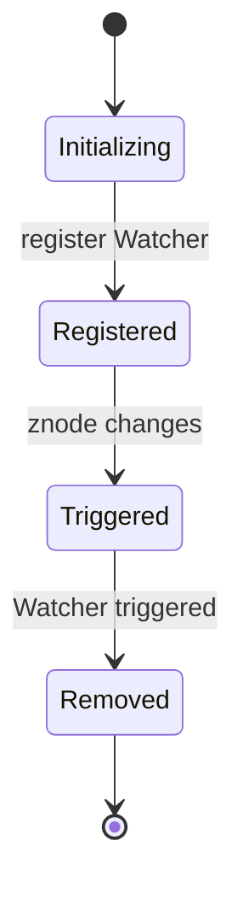

## 1. 背景介绍

### 1.1 分布式系统中的数据一致性问题

在现代的软件开发中，分布式系统已经成为了主流。然而，构建分布式系统并非易事，其中一个重要的挑战就是如何保证数据的一致性。ZooKeeper作为一款优秀的分布式协调服务，其Watcher机制为解决分布式系统中数据一致性问题提供了强有力的支持。

### 1.2 ZooKeeper的应用场景

ZooKeeper被广泛应用于各种分布式系统中，例如：

* **配置管理：**  将配置信息存储在ZooKeeper上，实现动态配置更新。
* **命名服务：**  为分布式系统中的服务提供统一的命名空间。
* **分布式锁：**  利用ZooKeeper的节点特性实现分布式锁。
* **集群管理：**  监控集群节点的状态，实现动态扩容和容错。

### 1.3 Watcher机制的重要性

Watcher机制是ZooKeeper的核心功能之一，它允许客户端注册监听特定znode节点的变化，并在节点发生变化时收到通知。这种机制使得客户端可以实时感知ZooKeeper上的数据变化，从而及时做出相应的处理。

## 2. 核心概念与联系

### 2.1 Znode

ZooKeeper中的数据以层次化的树形结构存储，每个节点称为znode。znode可以存储数据，也可以作为其他znode的父节点。

### 2.2 Watcher

Watcher是一个接口，客户端可以通过实现该接口来监听znode的变化。当znode发生变化时，ZooKeeper会通知所有注册了Watcher的客户端。

### 2.3 Watcher事件类型

ZooKeeper支持多种Watcher事件类型，包括：

* **NodeCreated：**  znode被创建时触发。
* **NodeDeleted：**  znode被删除时触发。
* **NodeDataChanged：**  znode的数据发生变化时触发。
* **NodeChildrenChanged：**  znode的子节点列表发生变化时触发。

### 2.4 Watcher注册与触发流程

1. 客户端调用ZooKeeper API注册Watcher，指定要监听的znode和事件类型。
2. ZooKeeper将Watcher信息存储在服务器端。
3. 当znode发生变化时，ZooKeeper触发相应的Watcher事件。
4. ZooKeeper将Watcher事件通知给注册了该Watcher的客户端。
5. 客户端收到通知后，根据事件类型进行相应的处理。

## 3. 核心算法原理具体操作步骤

### 3.1 Watcher注册

客户端通过调用ZooKeeper API的`exists`、`getData`、`getChildren`等方法注册Watcher。例如，以下代码演示了如何注册一个监听`/my_znode`节点数据变化的Watcher：

```java
ZooKeeper zk = new ZooKeeper("localhost:2181", 3000, null);
Stat stat = zk.exists("/my_znode", new Watcher() {
  @Override
  public void process(WatchedEvent event) {
    if (event.getType() == Event.EventType.NodeDataChanged) {
      System.out.println("/my_znode data changed!");
    }
  }
});
```

### 3.2 Watcher触发

当`/my_znode`节点的数据发生变化时，ZooKeeper会触发`NodeDataChanged`事件，并将该事件通知给注册了Watcher的客户端。

### 3.3 Watcher一次性

ZooKeeper的Watcher是一次性的，即Watcher被触发一次后就会被移除。如果需要继续监听znode的变化，需要重新注册Watcher。

## 4. 数学模型和公式详细讲解举例说明

Watcher机制的数学模型可以用一个简单的状态机来表示：



## 5. 项目实践：代码实例和详细解释说明

### 5.1 创建Maven项目

使用Maven创建一个新的Java项目，并添加ZooKeeper依赖：

```xml
<dependency>
  <groupId>org.apache.zookeeper</groupId>
  <artifactId>zookeeper</artifactId>
  <version>3.6.3</version>
</dependency>
```

### 5.2 创建ZooKeeper连接

```java
ZooKeeper zk = new ZooKeeper("localhost:2181", 3000, null);
```

### 5.3 注册Watcher

```java
Stat stat = zk.exists("/my_znode", new Watcher() {
  @Override
  public void process(WatchedEvent event) {
    if (event.getType() == Event.EventType.NodeDataChanged) {
      System.out.println("/my_znode data changed!");
    }
  }
});
```

### 5.4 触发Watcher

修改`/my_znode`节点的数据：

```java
zk.setData("/my_znode", "new data".getBytes(), -1);
```

### 5.5 观察结果

控制台会输出`/my_znode data changed!`，表明Watcher被成功触发。

## 6. 实际应用场景

### 6.1 配置中心

将配置信息存储在ZooKeeper上，客户端通过Watcher机制监听配置的变化，实现动态配置更新。

### 6.2 服务发现

服务提供者将服务信息注册到ZooKeeper上，服务消费者通过Watcher机制监听服务列表的变化，实现动态服务发现。

### 6.3 分布式锁

利用ZooKeeper的节点特性实现分布式锁，客户端通过Watcher机制监听锁节点的变化，实现锁的获取和释放。

## 7. 工具和资源推荐

* **ZooKeeper官方文档：**  https://zookeeper.apache.org/
* **Curator：**  ZooKeeper的Java客户端框架，提供了更易用的API和功能。

## 8. 总结：未来发展趋势与挑战

### 8.1 趋势

* **云原生支持：**  ZooKeeper将更好地支持云原生环境，例如Kubernetes。
* **性能优化：**  ZooKeeper将继续提升性能，以满足更大规模的应用需求。
* **安全性增强：**  ZooKeeper将加强安全机制，以应对日益严峻的安全挑战。

### 8.2 挑战

* **复杂性：**  ZooKeeper的Watcher机制较为复杂，需要深入理解才能正确使用。
* **性能瓶颈：**  在大规模应用场景下，Watcher机制可能会成为性能瓶颈。
* **一致性问题：**  Watcher机制并不能完全保证数据的一致性，需要结合其他机制来解决。

## 9. 附录：常见问题与解答

### 9.1 Watcher为什么是一次性的？

为了避免Watcher泄露和性能问题，ZooKeeper的Watcher被设计成一次性的。

### 9.2 如何实现持久化Watcher？

可以使用Curator框架提供的`Watcher`接口来实现持久化Watcher。

### 9.3 Watcher触发顺序是什么？

ZooKeeper的Watcher触发顺序是不确定的，取决于网络延迟和服务器负载等因素。
