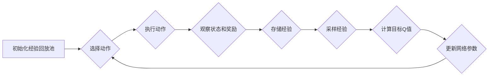

## 1. 深入理解强化学习：从Q-Learning到Deep Q-Learning

### 1.1 强化学习：智能体与环境的互动

强化学习（Reinforcement Learning，RL）是一种机器学习范式，其核心在于智能体（Agent）通过与环境的交互来学习最佳的行为策略。智能体在环境中执行动作，并根据环境的反馈（奖励或惩罚）来调整其行为，最终目标是最大化累积奖励。

### 1.2 Q-Learning：基于表格的价值迭代

Q-Learning是一种经典的强化学习算法，其核心思想是学习一个状态-动作值函数（Q-function），该函数用于评估在特定状态下采取特定动作的价值。Q-Learning采用表格形式存储Q值，并通过迭代更新来逼近最优Q函数。

### 1.3 Deep Q-Learning：深度神经网络的引入

Deep Q-Learning (DQN) 将深度神经网络引入Q-Learning框架，利用神经网络强大的函数逼近能力来表示Q函数，从而解决传统Q-Learning在处理高维状态空间和复杂动作空间时的局限性。

## 2. Deep Q-Learning核心概念与联系

### 2.1 状态（State）

状态是描述环境当前状况的信息，例如在游戏环境中，状态可以是游戏画面、玩家位置、敌人位置等。

### 2.2 动作（Action）

动作是智能体可以执行的操作，例如在游戏环境中，动作可以是移动、攻击、跳跃等。

### 2.3 奖励（Reward）

奖励是环境对智能体动作的反馈，用于指示动作的好坏。例如在游戏环境中，奖励可以是得分、通关、避免死亡等。

### 2.4 Q函数（Q-function）

Q函数用于评估在特定状态下采取特定动作的价值，即预期累积奖励。

### 2.5 深度神经网络（Deep Neural Network）

深度神经网络用于逼近Q函数，其输入是状态，输出是对应于每个动作的Q值。

## 3. Deep Q-Learning算法原理与操作步骤

### 3.1 算法流程图



### 3.2 算法步骤

1. 初始化经验回放池（Replay Buffer）：用于存储智能体与环境交互的经验，包括状态、动作、奖励、下一状态等信息。
2. 选择动作：根据当前状态，使用 ε-greedy策略选择动作，即以 ε 的概率随机选择动作，以 1-ε 的概率选择Q值最高的动作。
3. 执行动作：智能体在环境中执行选择的动作。
4. 观察状态和奖励：观察执行动作后环境的下一状态和获得的奖励。
5. 存储经验：将当前状态、动作、奖励、下一状态存储到经验回放池中。
6. 采样经验：从经验回放池中随机采样一批经验。
7. 计算目标Q值：根据采样的经验，计算目标Q值，用于更新神经网络参数。目标Q值的计算方法如下：

 $$
 y_i = r + \gamma \max_{a'} Q(s', a'; \theta^-)
 $$

其中，$y_i$ 是目标Q值，$r$ 是奖励，$\gamma$ 是折扣因子，$s'$ 是下一状态，$a'$ 是下一状态下可选择的动作，$\theta^-$ 是目标网络的参数。

8. 更新网络参数：使用目标Q值和当前Q值之间的差异来更新神经网络参数，常用的损失函数是均方误差（MSE）。

### 3.3 关键技术

* 经验回放（Experience Replay）：将经验存储起来，并从中随机采样，可以打破数据之间的关联性，提高训练效率。
* 目标网络（Target Network）：使用一个独立的网络来计算目标Q值，可以提高算法的稳定性。
* ε-greedy策略：平衡探索与利用，在训练初期，ε 较大，鼓励探索；随着训练的进行，ε 逐渐减小，倾向于利用已学习到的知识。

## 4. Deep Q-Learning数学模型和公式详细讲解举例说明

### 4.1 Bellman方程

Q-Learning 的核心是 Bellman 方程，它描述了当前状态-动作值函数与未来状态-动作值函数之间的关系：

$$
Q(s, a) = E[r + \gamma \max_{a'} Q(s', a') | s, a]
$$

其中，$Q(s, a)$ 是在状态 $s$ 下采取动作 $a$ 的期望累积奖励，$r$ 是立即奖励，$\gamma$ 是折扣因子，$s'$ 是下一状态，$a'$ 是下一状态下可选择的动作。

### 4.2 Q-Learning更新规则

Q-Learning 采用迭代的方式更新 Q 函数，其更新规则如下：

$$
Q(s, a) \leftarrow Q(s, a) + \alpha [r + \gamma \max_{a'} Q(s', a') - Q(s, a)]
$$

其中，$\alpha$ 是学习率，控制更新的幅度。

### 4.3 Deep Q-Learning损失函数

Deep Q-Learning 使用深度神经网络来逼近 Q 函数，其损失函数通常为均方误差（MSE）：

$$
L(\theta) = \frac{1}{N} \sum_{i=1}^N (y_i - Q(s_i, a_i; \theta))^2
$$

其中，$N$ 是采样经验的数量，$y_i$ 是目标 Q 值，$Q(s_i, a_i; \theta)$ 是神经网络预测的 Q 值，$\theta$ 是神经网络的参数。

### 4.4 举例说明

假设有一个简单的游戏环境，智能体可以向左或向右移动，目标是到达目标位置。奖励函数定义为：到达目标位置获得 +1 的奖励，其他情况获得 0 的奖励。

智能体初始状态位于左侧，目标位置位于右侧。智能体可以选择的动作是向左或向右移动。

使用 Deep Q-Learning 算法学习该游戏环境的最佳策略，神经网络的输入是智能体的位置，输出是对应于向左或向右移动的 Q 值。

通过训练，神经网络可以学习到在不同位置选择最佳动作的策略，例如，当智能体位于左侧时，选择向右移动可以获得更高的累积奖励。

## 5. 项目实践：Deep Q-Learning代码实例和详细解释说明

### 5.1 CartPole环境

CartPole 是 OpenAI Gym 中的一个经典控制问题，目标是控制一根杆子使其保持平衡。

### 5.2 代码实现

```python
import gym
import numpy as np
import tensorflow as tf

# 定义神经网络模型
class QNetwork(tf.keras.Model):
    def __init__(self, state_dim, action_dim):
        super(QNetwork, self).__init__()
        self.dense1 = tf.keras.layers.Dense(64, activation='relu')
        self.dense2 = tf.keras.layers.Dense(64, activation='relu')
        self.dense3 = tf.keras.layers.Dense(action_dim)

    def call(self, state):
        x = self.dense1(state)
        x = self.dense2(x)
        return self.dense3(x)

# 定义 Deep Q-Learning 智能体
class DQNAgent:
    def __init__(self, state_dim, action_dim, learning_rate=0.001, gamma=0.99, epsilon=1.0, epsilon_decay=0.995, epsilon_min=0.01, buffer_size=10000, batch_size=32):
        self.state_dim = state_dim
        self.action_dim = action_dim
        self.learning_rate = learning_rate
        self.gamma = gamma
        self.epsilon = epsilon
        self.epsilon_decay = epsilon_decay
        self.epsilon_min = epsilon_min
        self.buffer_size = buffer_size
        self.batch_size = batch_size

        self.q_network = QNetwork(state_dim, action_dim)
        self.target_network = QNetwork(state_dim, action_dim)
        self.optimizer = tf.keras.optimizers.Adam(learning_rate=self.learning_rate)
        self.buffer = []

    def act(self, state):
        if np.random.rand() <= self.epsilon:
            return np.random.randint(self.action_dim)
        else:
            q_values = self.q_network(np.expand_dims(state, axis=0))
            return np.argmax(q_values.numpy()[0])

    def remember(self, state, action, reward, next_state, done):
        self.buffer.append((state, action, reward, next_state, done))
        if len(self.buffer) > self.buffer_size:
            self.buffer.pop(0)

    def train(self):
        if len(self.buffer) < self.batch_size:
            return

        batch = random.sample(self.buffer, self.batch_size)
        states, actions, rewards, next_states, dones = zip(*batch)

        states = np.array(states)
        actions = np.array(actions)
        rewards = np.array(rewards)
        next_states = np.array(next_states)
        dones = np.array(dones)

        with tf.GradientTape() as tape:
            q_values = self.q_network(states)
            next_q_values = self.target_network(next_states)
            target_q_values = rewards + self.gamma * np.max(next_q_values, axis=1) * (1 - dones)
            loss = tf.keras.losses.mse(target_q_values, tf.gather_nd(q_values, tf.stack([tf.range(self.batch_size), actions], axis=1)))

        gradients = tape.gradient(loss, self.q_network.trainable_variables)
        self.optimizer.apply_gradients(zip(gradients, self.q_network.trainable_variables))

        # 更新目标网络参数
        self.update_target_network()

    def update_target_network(self):
        self.target_network.set_weights(self.q_network.get_weights())

# 创建 CartPole 环境
env = gym.make('CartPole-v1')
state_dim = env.observation_space.shape[0]
action_dim = env.action_space.n

# 创建 Deep Q-Learning 智能体
agent = DQNAgent(state_dim, action_dim)

# 训练智能体
episodes = 1000
for episode in range(episodes):
    state = env.reset()
    done = False
    total_reward = 0

    while not done:
        action = agent.act(state)
        next_state, reward, done, _ = env.step(action)
        agent.remember(state, action, reward, next_state, done)
        agent.train()
        total_reward += reward
        state = next_state

    print(f'Episode: {episode+1}, Total Reward: {total_reward}')

# 测试智能体
state = env.reset()
done = False
total_reward = 0

while not done:
    env.render()
    action = agent.act(state)
    next_state, reward, done, _ = env.step(action)
    total_reward += reward
    state = next_state

print(f'Total Reward: {total_reward}')
env.close()
```

### 5.3 代码解释

* **QNetwork类**：定义了神经网络模型，包括三个全连接层。
* **DQNAgent类**：定义了 Deep Q-Learning 智能体，包括动作选择、经验存储、训练等方法。
* **act方法**：根据 ε-greedy 策略选择动作。
* **remember方法**：将经验存储到经验回放池中。
* **train方法**：从经验回放池中采样经验，计算目标 Q 值，更新神经网络参数。
* **update_target_network方法**：更新目标网络参数。

## 6. Deep Q-Learning实际应用场景

Deep Q-Learning 在游戏、机器人控制、推荐系统等领域具有广泛的应用。

### 6.1 游戏

* Atari 游戏：DeepMind 使用 Deep Q-Learning 算法在 Atari 游戏中取得了超越人类水平的成绩。
* AlphaGo：DeepMind 使用 Deep Q-Learning 算法作为 AlphaGo 的核心组件之一，用于学习围棋的最佳策略。

### 6.2 机器人控制

* 机械臂控制：Deep Q-Learning 可以用于学习机械臂的最佳控制策略，例如抓取物体、移动到指定位置等。
* 自动驾驶：Deep Q-Learning 可以用于学习自动驾驶汽车的最佳驾驶策略，例如避障、路径规划等。

### 6.3 推荐系统

* 商品推荐：Deep Q-Learning 可以用于学习用户的偏好，并推荐用户可能感兴趣的商品。
* 新闻推荐：Deep Q-Learning 可以用于学习用户的阅读习惯，并推荐用户可能感兴趣的新闻。

## 7. Deep Q-Learning工具和资源推荐

### 7.1 OpenAI Gym

OpenAI Gym 是一个用于开发和比较强化学习算法的工具包，提供了各种各样的环境，例如 CartPole、MountainCar、Atari 游戏等。

### 7.2 TensorFlow

TensorFlow 是一个开源的机器学习平台，提供了丰富的工具和库，用于构建和训练深度神经网络。

### 7.3 Keras

Keras 是一个高级神经网络 API，运行在 TensorFlow 之上，提供了简洁易用的接口，用于构建和训练神经网络。

### 7.4 DeepMind

DeepMind 是一家领先的人工智能公司，开发了 AlphaGo、AlphaZero 等突破性的人工智能算法。

## 8. 总结：Deep Q-Learning未来发展趋势与挑战

### 8.1 未来发展趋势

* **更强大的函数逼近器**：探索更强大的函数逼近器，例如 Transformer、图神经网络等，以提高 Deep Q-Learning 的性能。
* **更有效的探索策略**：开发更有效的探索策略，以加速 Deep Q-Learning 的学习过程。
* **更鲁棒的算法**：提高 Deep Q-Learning 算法的鲁棒性，使其能够应对更复杂的环境和任务。

### 8.2 挑战

* **样本效率**：Deep Q-Learning 通常需要大量的训练数据才能达到良好的性能。
* **泛化能力**：Deep Q-Learning 算法在新的环境或任务中的泛化能力可能有限。
* **可解释性**：Deep Q-Learning 算法的决策过程通常难以解释。

## 9. 附录：Deep Q-Learning常见问题与解答

### 9.1 什么是经验回放？

经验回放是一种将经验存储起来，并从中随机采样的技术，可以打破数据之间的关联性，提高训练效率。

### 9.2 什么是目标网络？

目标网络是一个独立的网络，用于计算目标 Q 值，可以提高算法的稳定性。

### 9.3 什么是 ε-greedy策略？

ε-greedy 策略是一种平衡探索与利用的策略，在训练初期，ε 较大，鼓励探索；随着训练的进行，ε 逐渐减小，倾向于利用已学习到的知识。

### 9.4 Deep Q-Learning 的优缺点是什么？

**优点**：

* 能够处理高维状态空间和复杂动作空间。
* 能够学习复杂的策略。

**缺点**：

* 样本效率低。
* 泛化能力有限。
* 可解释性差。
