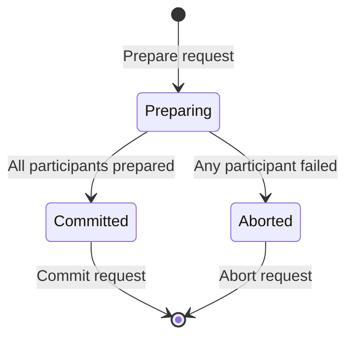

# exactly-once 语义的成本和收益如何权衡？

作者：禅与计算机程序设计艺术

## 1. 背景介绍

### 1.1 分布式系统中的数据一致性问题

在分布式系统中，数据一致性是一个至关重要的问题。由于网络延迟、节点故障等因素，确保数据在不同节点之间保持一致性是一项极具挑战性的任务。

### 1.2  exactly-once 语义的必要性

exactly-once 语义是指在分布式系统中，每个操作都保证只被执行一次，即使发生故障也不会导致数据重复或丢失。这对于维护数据完整性和正确性至关重要。

### 1.3 成本和收益的权衡

实现 exactly-once 语义通常需要额外的系统开销，例如增加消息传递次数、维护状态信息等。因此，在实际应用中，需要权衡实现 exactly-once 语义的成本和收益。

## 2. 核心概念与联系

### 2.1  at-most-once 语义

at-most-once 语义是指每个操作最多被执行一次，但不能保证一定被执行。

### 2.2  at-least-once 语义

at-least-once 语义是指每个操作至少被执行一次，但可能被执行多次。

### 2.3  exactly-once 语义

exactly-once 语义是 at-most-once 和 at-least-once 的结合，保证每个操作都只被执行一次。

### 2.4 幂等性

幂等性是指一个操作可以被执行多次，但每次执行的结果都相同。

## 3. 核心算法原理具体操作步骤

### 3.1 两阶段提交协议 (2PC)

两阶段提交协议是一种经典的实现 exactly-once 语义的算法。它包含两个阶段：

- 准备阶段：协调者向所有参与者发送准备请求，参与者准备执行操作并返回准备结果。
- 提交阶段：如果所有参与者都返回准备成功，协调者发送提交请求，参与者执行操作并返回提交结果。

### 3.2  Kafka 的 exactly-once 语义

Kafka 通过以下机制实现 exactly-once 语义：

- 幂等性生产者：生产者为每条消息分配一个唯一的 ID，Kafka broker 仅接受每个 ID 的消息一次。
- 事务性生产者：生产者可以将多条消息打包成一个事务，Kafka broker 保证事务中的所有消息要么全部提交成功，要么全部回滚。

## 4. 数学模型和公式详细讲解举例说明

### 4.1  2PC 的状态转移图



### 4.2 Kafka 事务的原子性

Kafka 事务保证原子性，即事务中的所有操作要么全部成功，要么全部失败。

## 5. 项目实践：代码实例和详细解释说明

### 5.1  Java 中使用 2PC 实现 exactly-once 语义

```java
// 协调者
public class Coordinator {
    public void executeTransaction(List<Participant> participants) {
        // 准备阶段
        for (Participant participant : participants) {
            if (!participant.prepare()) {
                abortTransaction(participants);
                return;
            }
        }

        // 提交阶段
        for (Participant participant : participants) {
            participant.commit();
        }
    }

    private void abortTransaction(List<Participant> participants) {
        for (Participant participant : participants) {
            participant.abort();
        }
    }
}

// 参与者
public interface Participant {
    boolean prepare();
    void commit();
    void abort();
}
```

### 5.2  Kafka 中使用事务性生产者实现 exactly-once 语义

```java
// 创建事务性生产者
Properties props = new Properties();
props.put("transactional.id", "my-transactional-id");
KafkaProducer<String, String> producer = new KafkaProducer<>(props);

// 开始事务
producer.initTransactions();

try {
    // 发送消息
    producer.beginTransaction();
    producer.send(new ProducerRecord<>("my-topic", "key1", "value1"));
    producer.send(new ProducerRecord<>("my-topic", "key2", "value2"));
    producer.commitTransaction();
} catch (ProducerFencedException | OutOfOrderSequenceException e) {
    // 处理异常
    producer.abortTransaction();
}
```

## 6. 实际应用场景

### 6.1  金融交易系统

在金融交易系统中，exactly-once 语义对于保证交易的正确性和一致性至关重要。

### 6.2  电商平台

在电商平台中，exactly-once 语义可以防止订单重复支付或商品重复发货。

### 6.3  数据流处理

在数据流处理中，exactly-once 语义可以确保数据被精确处理一次，避免数据丢失或重复计算。

## 7. 工具和资源推荐

### 7.1  Apache Kafka

Apache Kafka 是一款高吞吐量、低延迟的分布式消息队列系统，支持 exactly-once 语义。

### 7.2  Apache Flink

Apache Flink 是一款分布式流处理框架，支持 exactly-once 语义。

### 7.3  Apache Spark

Apache Spark 是一款分布式计算框架，支持 exactly-once 语义。

## 8. 总结：未来发展趋势与挑战

### 8.1  更轻量级的 exactly-once 语义实现

未来，研究人员将致力于探索更轻量级的 exactly-once 语义实现方案，以降低系统开销。

### 8.2  更广泛的应用场景

随着分布式系统的普及，exactly-once 语义将在更多应用场景中发挥重要作用。

### 8.3  更高的性能和可靠性

未来，exactly-once 语义的实现将更加注重性能和可靠性，以满足日益增长的数据处理需求。

## 9. 附录：常见问题与解答

### 9.1  如何选择合适的 exactly-once 语义实现方案？

选择 exactly-once 语义实现方案需要考虑以下因素：

- 系统规模和数据量
- 性能要求
- 可靠性要求
- 成本预算

### 9.2  exactly-once 语义的局限性有哪些？

exactly-once 语义并非万能的，它存在以下局限性：

- 无法解决所有数据一致性问题
- 可能导致系统复杂性和成本增加
- 某些情况下难以实现

### 9.3  如何测试 exactly-once 语义的正确性？

可以通过以下方式测试 exactly-once 语义的正确性：

- 单元测试
- 集成测试
- 端到端测试
