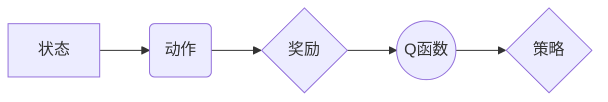

# 一切皆是映射：AI Q-learning价值迭代优化

作者：禅与计算机程序设计艺术

## 1. 背景介绍

### 1.1 强化学习：人工智能的未来之路

强化学习，作为机器学习的一个重要分支，近年来取得了令人瞩目的成就。从 AlphaGo 战胜围棋世界冠军，到 OpenAI Five 击败 Dota2 职业战队，强化学习的强大能力不断刷新着人们对人工智能的认知。

### 1.2 Q-learning：强化学习的基石

Q-learning 作为强化学习中最经典的算法之一，以其简洁优雅的思想和强大的学习能力，在诸多领域得到了广泛应用。其核心思想是通过不断试错，学习状态-动作值函数（Q 函数），从而找到最优策略。

### 1.3 价值迭代：优化 Q-learning 的利器

价值迭代是一种优化 Q-learning 算法效率的关键技术。它通过迭代更新 Q 函数，使其逐渐收敛到最优值，从而加速学习过程，提升策略性能。

## 2. 核心概念与联系

### 2.1 状态、动作、奖励：强化学习的三要素

* **状态（State）：** 描述智能体所处环境的信息。
* **动作（Action）：** 智能体在特定状态下可以采取的操作。
* **奖励（Reward）：** 智能体在执行动作后获得的反馈信号，用于评估动作的优劣。

### 2.2 Q 函数：连接状态、动作与价值的桥梁

Q 函数（Q-value function）是一个映射，将状态-动作对映射到预期未来奖励。它表示在特定状态下采取特定动作的价值，即长期累积奖励的期望值。

### 2.3 价值迭代：不断逼近最优 Q 函数的迭代过程

价值迭代通过反复更新 Q 函数，使其逐步逼近最优值，从而找到最优策略。

## 3. 核心算法原理具体操作步骤

### 3.1 初始化 Q 函数

首先，我们需要为所有状态-动作对初始化 Q 函数。可以选择将所有 Q 值初始化为 0，或者根据先验知识进行初始化。

### 3.2 迭代更新 Q 函数

在每次迭代中，我们遍历所有状态-动作对，并根据以下公式更新 Q 函数：

$$ Q(s, a) = R(s, a) + \gamma \max_{a'} Q(s', a') $$

其中：

* $Q(s, a)$ 表示在状态 $s$ 下采取动作 $a$ 的 Q 值。
* $R(s, a)$ 表示在状态 $s$ 下采取动作 $a$ 获得的即时奖励。
* $\gamma$ 是折扣因子，用于平衡当前奖励和未来奖励的重要性。
* $s'$ 表示执行动作 $a$ 后到达的新状态。
* $\max_{a'} Q(s', a')$ 表示在状态 $s'$ 下所有可能动作中 Q 值最大的动作。

### 3.3 终止条件

当 Q 函数收敛到一定程度，或者达到预设的迭代次数时，终止迭代过程。

## 4. 数学模型和公式详细讲解举例说明

### 4.1 Bellman 方程：Q 函数的理论基础

Bellman 方程是 Q-learning 算法的理论基础，它描述了 Q 函数满足的迭代关系：

$$ Q^*(s, a) = R(s, a) + \gamma \sum_{s'} P(s'|s, a) \max_{a'} Q^*(s', a') $$

其中：

* $Q^*(s, a)$ 表示最优 Q 函数。
* $P(s'|s, a)$ 表示在状态 $s$ 下采取动作 $a$ 后转移到状态 $s'$ 的概率。

### 4.2 价值迭代的数学推导

价值迭代算法的公式可以从 Bellman 方程推导出来。通过将 Bellman 方程中的求和替换为最大值，并将最优 Q 函数替换为当前 Q 函数，即可得到价值迭代的更新公式。

### 4.3 举例说明

假设有一个迷宫环境，智能体需要学习如何走出迷宫。我们可以使用 Q-learning 算法来解决这个问题。

* **状态：** 迷宫中的每个格子代表一个状态。
* **动作：** 智能体可以向上、向下、向左、向右移动。
* **奖励：** 走到出口获得正奖励，撞墙或走回头路获得负奖励。

我们可以使用价值迭代算法来学习最优 Q 函数。首先将所有 Q 值初始化为 0。然后，在每次迭代中，遍历所有状态-动作对，并根据价值迭代的更新公式更新 Q 函数。

## 5. 项目实践：代码实例和详细解释说明

### 5.1 Python 实现 Q-learning 算法

```python
import numpy as np

# 定义迷宫环境
maze = np.array([
    [0, 0, 0, 1],
    [0, 1, 0, 0],
    [0, 0, 1, 0],
    [0, 0, 0, 0]
])

# 定义状态-动作对
states = [(i, j) for i in range(maze.shape[0]) for j in range(maze.shape[1])]
actions = ['up', 'down', 'left', 'right']

# 初始化 Q 函数
Q = {(s, a): 0 for s in states for a in actions}

# 定义奖励函数
def get_reward(state, action):
    i, j = state
    if action == 'up':
        i -= 1
    elif action == 'down':
        i += 1
    elif action == 'left':
        j -= 1
    elif action == 'right':
        j += 1
    if i < 0 or i >= maze.shape[0] or j < 0 or j >= maze.shape[1] or maze[i, j] == 1:
        return -1
    elif i == maze.shape[0] - 1 and j == maze.shape[1] - 1:
        return 10
    else:
        return 0

# 定义折扣因子
gamma = 0.9

# 价值迭代
for _ in range(100):
    for s in states:
        for a in actions:
            # 计算新状态
            i, j = s
            if a == 'up':
                i -= 1
            elif a == 'down':
                i += 1
            elif a == 'left':
                j -= 1
            elif a == 'right':
                j += 1
            if i < 0 or i >= maze.shape[0] or j < 0 or j >= maze.shape[1]:
                continue
            s_prime = (i, j)
            # 更新 Q 函数
            Q[(s, a)] = get_reward(s, a) + gamma * max([Q[(s_prime, a_prime)] for a_prime in actions])

# 打印最优策略
for i in range(maze.shape[0]):
    for j in range(maze.shape[1]):
        s = (i, j)
        best_action = max(actions, key=lambda a: Q[(s, a)])
        print(best_action, end=' ')
    print()
```

### 5.2 代码解释

* 首先，我们定义了迷宫环境，以及状态、动作和奖励函数。
* 然后，我们初始化了 Q 函数，并将折扣因子设置为 0.9。
* 接下来，我们使用价值迭代算法迭代更新 Q 函数 100 次。
* 最后，我们打印了最优策略，即在每个状态下 Q 值最大的动作。

## 6. 实际应用场景

### 6.1 游戏 AI

Q-learning 算法在游戏 AI 中有着广泛的应用。例如，可以使用 Q-learning 训练 AI 玩 Atari 游戏、围棋、象棋等。

### 6.2 机器人控制

Q-learning 算法可以用于机器人控制，例如训练机器人抓取物体、导航、避障等。

### 6.3 资源优化

Q-learning 算法可以用于资源优化，例如优化网络路由、服务器负载均衡等。

## 7. 工具和资源推荐

### 7.1 OpenAI Gym

OpenAI Gym 是一个用于开发和比较强化学习算法的工具包，提供了丰富的环境和算法实现。

### 7.2 TensorFlow

TensorFlow 是一个开源的机器学习框架，可以用于实现 Q-learning 算法。

### 7.3 PyTorch

PyTorch 是另一个开源的机器学习框架，也支持 Q-learning 算法的实现。

## 8. 总结：未来发展趋势与挑战

### 8.1 深度 Q-learning：深度学习与强化学习的融合

深度 Q-learning 将深度神经网络引入 Q-learning 算法，可以处理高维状态空间和复杂策略。

### 8.2 多智能体强化学习：多个智能体协同学习

多智能体强化学习研究多个智能体在同一环境中协同学习，可以解决更复杂的问题。

### 8.3 强化学习的安全性：确保智能体行为的安全性

随着强化学习技术的不断发展，确保智能体行为的安全性也变得越来越重要。

## 9. 附录：常见问题与解答

### 9.1 Q-learning 算法的收敛性问题

Q-learning 算法的收敛性取决于折扣因子、学习率和环境的复杂度。

### 9.2 如何选择合适的折扣因子

折扣因子决定了未来奖励的重要性，通常设置为 0.9 到 0.99 之间。

### 9.3 如何避免局部最优解

可以使用探索策略，例如 epsilon-greedy 策略，来避免陷入局部最优解。


## 10.  核心概念原理和架构的 Mermaid流程图


