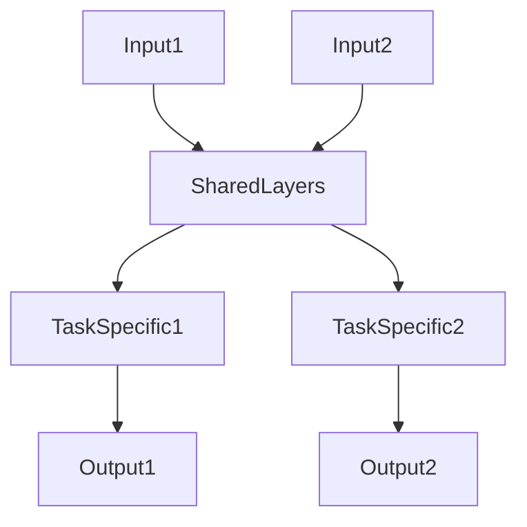
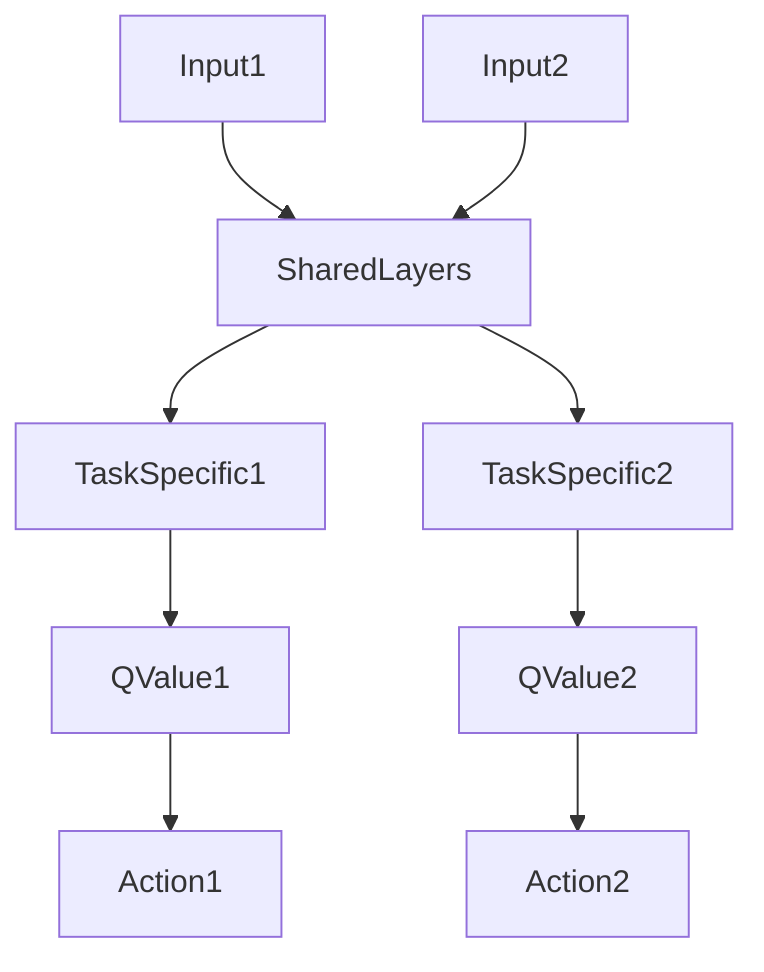
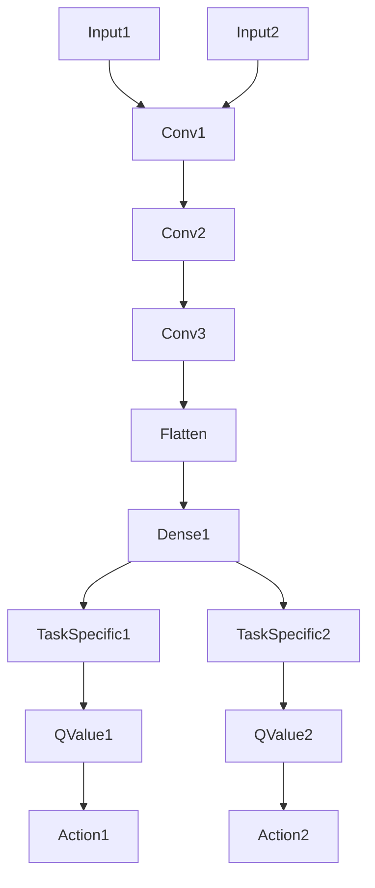

# 一切皆是映射：DQN与多任务学习：共享网络结构的效果分析

## 1.背景介绍

### 1.1 强化学习和深度强化学习简介

强化学习是机器学习的一个重要分支,它关注智能体与环境的交互,以获取最大化的累积奖励。在强化学习中,智能体通过试错来学习,并根据获得的奖励或惩罚调整其行为策略。传统的强化学习算法往往依赖于手工设计的特征,难以处理高维、复杂的状态空间。

深度强化学习(Deep Reinforcement Learning, DRL)的出现解决了这一难题。DRL将深度神经网络引入强化学习,使智能体能够直接从原始的高维输入(如图像、视频等)中自动提取特征,极大地提高了强化学习在复杂环境下的性能。深度 Q 网络(Deep Q-Network, DQN)是 DRL 的代表性算法之一,它使用深度神经网络来近似 Q 函数,从而解决了传统 Q-Learning 在高维状态空间下的失效问题。

### 1.2 多任务学习概述

多任务学习(Multi-Task Learning, MTL)是机器学习中的一种范式,旨在同时解决多个相关任务,以提高每个任务的泛化性能。在传统的单任务学习中,模型专注于解决单一任务,但在实际应用中,智能系统往往需要处理多种不同但相关的任务。多任务学习通过在不同任务之间共享知识,利用任务之间的相关性,从而提高了模型的泛化能力和数据利用率。

在深度学习领域,多任务学习通常通过在不同任务之间共享部分网络层或参数来实现。这种共享结构不仅有助于减少参数数量,还可以促进知识在相关任务之间的传递,从而提高模型的性能。

### 1.3 DQN 与多任务学习的结合

将 DQN 与多任务学习结合,可以实现在多个相关强化学习任务之间共享知识和网络结构,从而提高每个任务的学习效率和性能。具体来说,可以构建一个共享网络结构,其中包含一些共享层和一些特定于每个任务的层。共享层被用于提取共同的特征,而任务特定层则用于解决每个任务的特殊需求。

通过这种方式,不同任务之间的知识可以在共享层中传递,从而提高了模型的泛化能力。同时,任务特定层也确保了模型可以专注于每个任务的独特性,从而保持了高水平的性能。这种共享网络结构的设计平衡了知识共享和任务专注之间的权衡,有望在多任务强化学习中取得更好的效果。

## 2.核心概念与联系  

### 2.1 深度 Q 网络(DQN)

深度 Q 网络(Deep Q-Network, DQN)是深度强化学习中的一种基础算法,它将深度神经网络应用于 Q-Learning,从而解决了传统 Q-Learning 在高维状态空间下的失效问题。DQN 的核心思想是使用深度神经网络来近似 Q 函数,即 Q(s, a) ≈ Q(s, a; θ),其中 θ 表示网络的参数。

在 DQN 算法中,智能体与环境交互并获取 (s, a, r, s') 的转移样本,将其存储在经验回放池(Experience Replay)中。然后,从经验回放池中随机采样一批数据,并使用下式计算目标 Q 值:

$$
y = r + \gamma \max_{a'} Q(s', a'; \theta^-)
$$

其中 $\theta^-$ 表示目标网络的参数,用于估计下一状态的最大 Q 值。接着,使用损失函数 $L = \mathbb{E}_{(s, a, r, s') \sim D}\left[(y - Q(s, a; \theta))^2\right]$ 来更新在线网络的参数 $\theta$,从而使 Q(s, a; θ) 逼近目标 Q 值 y。

为了提高训练的稳定性,DQN 还引入了以下技巧:

1. **经验回放(Experience Replay)**: 将智能体与环境的交互存储在回放池中,并从中随机采样数据进行训练,打破数据的相关性,提高数据利用率。
2. **目标网络(Target Network)**: 使用一个独立的目标网络 $\theta^-$ 来估计目标 Q 值,并定期将在线网络的参数复制到目标网络,增加了目标值的稳定性。
3. **ε-贪婪策略(ε-Greedy Policy)**: 在选择动作时,以一定概率 $\epsilon$ 随机选择动作,以保持一定的探索性。

DQN 算法的伪代码如下:

```python
初始化在线网络 Q(s, a; θ) 和目标网络 Q(s, a; θ^-)
初始化经验回放池 D
for episode in range(num_episodes):
    初始化环境状态 s
    while not done:
        使用 ε-贪婪策略选择动作 a
        执行动作 a,获取下一状态 s'、奖励 r 和 done 标志
        将 (s, a, r, s', done) 存入经验回放池 D
        从 D 中随机采样一批数据
        计算目标 Q 值 y = r + γ * max_a' Q(s', a'; θ^-)
        计算损失函数 L = (y - Q(s, a; θ))^2
        使用梯度下降更新在线网络参数 θ
        每隔一定步数将 θ 复制到 θ^-
        s = s'
    end while
end for
```

通过上述算法,DQN 可以在复杂的状态空间中学习出优秀的策略,取得了令人瞩目的成就,如在 Atari 游戏中超过人类水平的表现。

### 2.2 多任务学习中的网络共享

在多任务学习中,共享网络结构是一种常见的方法,旨在利用不同任务之间的相关性来提高模型的泛化能力和数据利用率。共享网络结构通常包含以下几个部分:

1. **共享层(Shared Layers)**: 这些层被所有任务共享,用于提取共同的特征。共享层可以是卷积层、全连接层或其他类型的层。
2. **任务特定层(Task-Specific Layers)**: 每个任务都有自己的特定层,用于解决该任务的特殊需求。这些层可以是全连接层或其他类型的层。
3. **输出层(Output Layers)**: 每个任务都有自己的输出层,用于产生该任务的预测结果。

在训练过程中,共享层会学习到所有任务共同的特征表示,而任务特定层则会学习到每个任务的特殊知识。通过这种方式,不同任务之间的知识可以在共享层中传递,从而提高了模型的泛化能力。同时,任务特定层也确保了模型可以专注于每个任务的独特性,从而保持了高水平的性能。

共享网络结构的一个典型示例如下所示:



在上图中,Input1 和 Input2 分别表示两个任务的输入,SharedLayers 表示共享层,TaskSpecific1 和 TaskSpecific2 表示每个任务的特定层,Output1 和 Output2 表示每个任务的输出。

共享网络结构在多任务学习中具有以下优点:

1. **参数共享**: 通过共享层,不同任务之间可以共享部分参数,从而减少了模型的总参数数量,提高了参数利用率。
2. **知识传递**: 共享层可以促进不同任务之间的知识传递,利用了任务之间的相关性,提高了模型的泛化能力。
3. **数据增强**: 由于不同任务共享部分网络结构,相当于为每个任务增加了额外的训练数据,提高了数据利用率。
4. **正则化效果**: 共享层可以起到一定的正则化作用,缓解过拟合问题。

然而,共享网络结构也存在一些挑战,例如如何确定共享层和任务特定层的结构、如何平衡不同任务之间的权重等。这些问题需要根据具体的任务和数据进行调整和探索。

### 2.3 DQN 与多任务学习的结合

将 DQN 与多任务学习结合,可以实现在多个相关强化学习任务之间共享知识和网络结构。具体来说,可以构建一个共享网络结构,其中包含一些共享层和一些特定于每个任务的层。

共享层被用于提取共同的状态特征,而任务特定层则用于解决每个任务的特殊需求,如估计 Q 值、选择动作等。通过这种方式,不同任务之间的知识可以在共享层中传递,从而提高了模型的泛化能力。同时,任务特定层也确保了模型可以专注于每个任务的独特性,从而保持了高水平的性能。

一个典型的 DQN 多任务学习网络结构如下所示:



在上图中,Input1 和 Input2 分别表示两个强化学习任务的状态输入,SharedLayers 表示共享层,用于提取共同的状态特征。TaskSpecific1 和 TaskSpecific2 表示每个任务的特定层,用于估计 Q 值。QValue1 和 QValue2 表示每个任务的 Q 值输出,Action1 和 Action2 表示根据 Q 值选择的动作。

在训练过程中,每个任务都会根据自己的经验回放池进行 DQN 训练,同时共享层会根据所有任务的梯度进行更新,实现了知识的共享和传递。通过这种方式,不同任务之间的相关性可以被充分利用,提高了每个任务的学习效率和性能。

需要注意的是,在实际应用中,共享网络结构的设计需要根据具体的任务和数据进行调整和探索,以获得最佳的效果。例如,可以尝试不同的共享层和任务特定层的组合,或者引入注意力机制等技术来增强模型的表现力。

## 3.核心算法原理具体操作步骤

在本节中,我们将详细介绍将 DQN 与多任务学习相结合的核心算法原理和具体操作步骤。

### 3.1 算法框架

DQN 多任务学习算法的整体框架如下:

1. 初始化共享网络结构,包括共享层和每个任务的特定层。
2. 对于每个强化学习任务:
   a. 初始化经验回放池和目标网络。
   b. 与环境交互,获取 (s, a, r, s') 的转移样本,存入经验回放池。
   c. 从经验回放池中随机采样一批数据。
   d. 计算目标 Q 值和损失函数。
   e. 使用梯度下降更新该任务的特定层参数。
   f. 定期将在线网络参数复制到目标网络。
3. 使用所有任务的梯度更新共享层参数。
4. 重复步骤 2 和 3,直到算法收敛。

### 3.2 共享网络结构设计

共享网络结构的设计对算法的性能有着重要影响。一般来说,共享层应该用于提取通用的状态特征,而任务特定层则应该用于解决每个任务的特殊需求。

一种常见的设计是使用卷积神经网络作为共享层,用于提取图像或其他高维状态的特征,然后使用全连接层作为任务特定层,用于估计 Q 值或进行其他操作。

例如,对于两个 Atari 游戏任务,共享网络结构可以设计如下:



在上图中,Conv1、Conv2 和 Conv3 是共享的卷