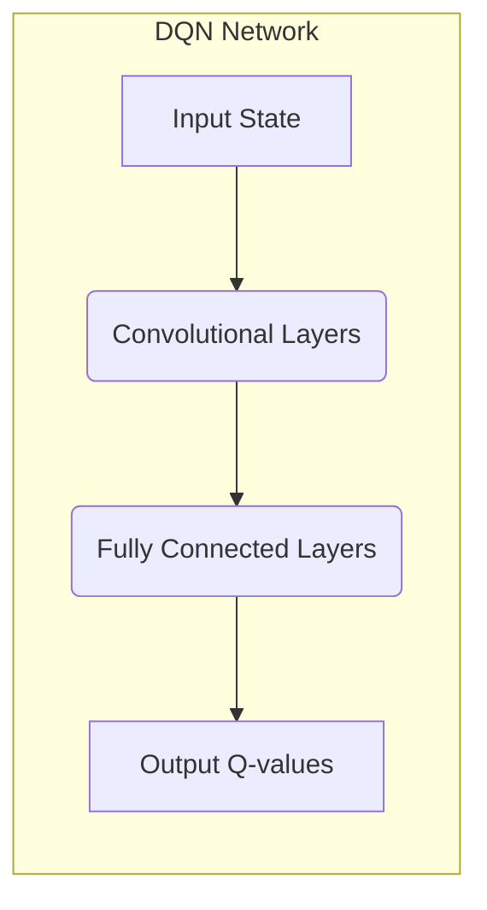

## 一切皆是映射：DQN训练策略：平衡探索与利用

作者：禅与计算机程序设计艺术

## 1. 背景介绍

### 1.1 强化学习与DQN

强化学习是机器学习的一个重要分支，其目标是让智能体（agent）通过与环境交互，学习到最优的行动策略，以最大化累积奖励。Deep Q-Network (DQN) 作为一种基于深度学习的强化学习算法，在近年来取得了瞩目的成就，其成功应用于 Atari 游戏、机器人控制等领域。

DQN 的核心思想是利用深度神经网络来近似 Q 函数，即在给定状态下采取某个动作的预期累积奖励。通过不断与环境交互，DQN 可以学习到一个最优的 Q 函数，从而指导智能体做出最优决策。

### 1.2 探索与利用困境

在强化学习中，智能体面临着一个重要的挑战：探索与利用困境。 

* **探索（Exploration）：** 指的是尝试新的行动，以期发现环境中潜在的更高奖励。
* **利用（Exploitation）：** 指的是根据已有的知识，选择当前认为最优的行动，以最大化眼前的奖励。

如何在探索和利用之间取得平衡，是强化学习算法设计中的关键问题。过度探索会导致学习效率低下，而过度利用则可能陷入局部最优解。

### 1.3 本文目标

本文旨在深入探讨 DQN 训练策略中探索与利用的平衡问题，介绍几种常用的探索策略，并结合实际案例分析其优缺点，为读者提供 DQN 训练的实用指南。

## 2. 核心概念与联系

### 2.1 Q-learning 算法

DQN 是基于 Q-learning 算法的，因此我们首先回顾一下 Q-learning 的基本原理。

Q-learning 算法的核心是 Q 函数，它表示在给定状态 $s$ 下采取动作 $a$ 的预期累积奖励：

$$Q(s, a) = \mathbb{E}[R_{t+1} + \gamma R_{t+2} + \gamma^2 R_{t+3} + ... | S_t = s, A_t = a]$$

其中，$R_t$ 表示在时间步 $t$ 获得的奖励，$\gamma$ 是折扣因子，用于衡量未来奖励的价值。

Q-learning 算法通过不断更新 Q 函数来学习最优策略。其更新规则如下：

$$Q(s, a) \leftarrow Q(s, a) + \alpha [r + \gamma \max_{a'} Q(s', a') - Q(s, a)]$$

其中，$\alpha$ 是学习率，$r$ 是在状态 $s$ 下采取动作 $a$ 后获得的奖励，$s'$ 是下一个状态，$a'$ 是下一个动作。

### 2.2 DQN 架构

DQN 利用深度神经网络来近似 Q 函数。其网络架构通常由多个卷积层和全连接层组成，输入是状态 $s$，输出是每个动作 $a$ 的 Q 值。



### 2.3 探索与利用策略

DQN 训练过程中常用的探索策略包括：

* **ε-greedy 策略：** 以一定的概率 $\epsilon$ 随机选择动作，以 $1-\epsilon$ 的概率选择当前 Q 值最高的动作。
* **Boltzmann 探索：** 根据 Q 值的分布，以一定的概率选择各个动作。
* **UCB 算法：** 选择具有最高 "置信上限" 的动作，即 Q 值加上一个探索奖励项。

## 3. 核心算法原理具体操作步骤

### 3.1 ε-greedy 策略

ε-greedy 策略是最简单的探索策略之一，其操作步骤如下：

1. 设置探索概率 $\epsilon$。
2. 在每个时间步，以 $\epsilon$ 的概率随机选择一个动作。
3. 以 $1-\epsilon$ 的概率选择当前 Q 值最高的动作。

ε-greedy 策略的优点是简单易实现，缺点是探索效率不高，容易陷入局部最优解。

### 3.2 Boltzmann 探索

Boltzmann 探索策略根据 Q 值的分布，以一定的概率选择各个动作。其操作步骤如下：

1. 计算每个动作 $a$ 的概率：

$$p(a|s) = \frac{e^{Q(s, a)/T}}{\sum_{a'} e^{Q(s, a')/T}}$$

其中，$T$ 是温度参数，用于控制探索程度。

2. 根据概率分布选择动作。

Boltzmann 探索策略的优点是可以根据 Q 值的分布进行探索，缺点是需要调整温度参数。

### 3.3 UCB 算法

UCB 算法选择具有最高 "置信上限" 的动作，即 Q 值加上一个探索奖励项。其操作步骤如下：

1. 计算每个动作 $a$ 的置信上限：

$$UCB(s, a) = Q(s, a) + c \sqrt{\frac{\ln t}{N(s, a)}}$$

其中，$c$ 是探索系数，$t$ 是当前时间步，$N(s, a)$ 是状态 $s$ 下采取动作 $a$ 的次数。

2. 选择置信上限最高的动作。

UCB 算法的优点是可以平衡探索和利用，缺点是需要调整探索系数。

## 4. 数学模型和公式详细讲解举例说明

### 4.1 ε-greedy 策略数学模型

ε-greedy 策略的数学模型可以表示为：

$$
\pi(a|s) = 
\begin{cases}
\epsilon/|A| + (1-\epsilon) & \text{if } a = \arg\max_{a'} Q(s, a') \\
\epsilon/|A| & \text{otherwise}
\end{cases}
$$

其中，$\pi(a|s)$ 表示在状态 $s$ 下选择动作 $a$ 的概率，$|A|$ 表示动作空间的大小。

**举例说明：**

假设动作空间包含两个动作：左和右，当前 Q 值为：

* $Q(s, \text{左}) = 1$
* $Q(s, \text{右}) = 2$

如果探索概率 $\epsilon = 0.1$，则根据 ε-greedy 策略，选择左动作的概率为：

$$
\pi(\text{左}|s) = 0.1/2 + (1-0.1) = 0.95
$$

选择右动作的概率为：

$$
\pi(\text{右}|s) = 0.1/2 = 0.05
$$

### 4.2 Boltzmann 探索数学模型

Boltzmann 探索策略的数学模型可以表示为：

$$
p(a|s) = \frac{e^{Q(s, a)/T}}{\sum_{a'} e^{Q(s, a')/T}}
$$

其中，$T$ 是温度参数。

**举例说明：**

假设动作空间包含两个动作：左和右，当前 Q 值为：

* $Q(s, \text{左}) = 1$
* $Q(s, \text{右}) = 2$

如果温度参数 $T = 1$，则根据 Boltzmann 探索策略，选择左动作的概率为：

$$
p(\text{左}|s) = \frac{e^{1/1}}{e^{1/1} + e^{2/1}} \approx 0.27
$$

选择右动作的概率为：

$$
p(\text{右}|s) = \frac{e^{2/1}}{e^{1/1} + e^{2/1}} \approx 0.73
$$

### 4.3 UCB 算法数学模型

UCB 算法的数学模型可以表示为：

$$
UCB(s, a) = Q(s, a) + c \sqrt{\frac{\ln t}{N(s, a)}}
$$

其中，$c$ 是探索系数，$t$ 是当前时间步，$N(s, a)$ 是状态 $s$ 下采取动作 $a$ 的次数。

**举例说明：**

假设动作空间包含两个动作：左和右，当前 Q 值为：

* $Q(s, \text{左}) = 1$
* $Q(s, \text{右}) = 2$

当前时间步 $t = 10$，状态 $s$ 下采取左动作的次数 $N(s, \text{左}) = 5$，采取右动作的次数 $N(s, \text{右}) = 5$。如果探索系数 $c = 1$，则根据 UCB 算法，左动作的置信上限为：

$$
UCB(s, \text{左}) = 1 + 1 \sqrt{\frac{\ln 10}{5}} \approx 1.82
$$

右动作的置信上限为：

$$
UCB(s, \text{右}) = 2 + 1 \sqrt{\frac{\ln 10}{5}} \approx 2.82
$$

因此，UCB 算法会选择右动作。

## 5. 项目实践：代码实例和详细解释说明

### 5.1 ε-greedy 策略代码实例

```python
import random

class EpsilonGreedy:
    def __init__(self, epsilon, actions):
        self.epsilon = epsilon
        self.actions = actions

    def select_action(self, q_values):
        if random.random() < self.epsilon:
            return random.choice(self.actions)
        else:
            return max(self.actions, key=lambda a: q_values[a])
```

**代码解释：**

* `epsilon`：探索概率。
* `actions`：动作空间。
* `select_action(self, q_values)`：根据 Q 值选择动作。

### 5.2 Boltzmann 探索代码实例

```python
import numpy as np

class BoltzmannExploration:
    def __init__(self, temperature, actions):
        self.temperature = temperature
        self.actions = actions

    def select_action(self, q_values):
        probs = np.exp(np.array(q_values) / self.temperature)
        probs /= np.sum(probs)
        return np.random.choice(self.actions, p=probs)
```

**代码解释：**

* `temperature`：温度参数。
* `actions`：动作空间。
* `select_action(self, q_values)`：根据 Q 值选择动作。

### 5.3 UCB 算法代码实例

```python
import math

class UCB:
    def __init__(self, c, actions):
        self.c = c
        self.actions = actions
        self.n = {a: 0 for a in actions}

    def select_action(self, q_values, t):
        ucb_values = {}
        for a in self.actions:
            if self.n[a] == 0:
                ucb_values[a] = float('inf')
            else:
                ucb_values[a] = q_values[a] + self.c * math.sqrt(math.log(t) / self.n[a])
        return max(self.actions, key=lambda a: ucb_values[a])

    def update_n(self, action):
        self.n[action] += 1
```

**代码解释：**

* `c`：探索系数。
* `actions`：动作空间。
* `n`：记录每个动作被选择的次数。
* `select_action(self, q_values, t)`：根据 Q 值和时间步选择动作。
* `update_n(self, action)`：更新动作选择次数。

## 6. 实际应用场景

### 6.1 游戏 AI

DQN 算法被广泛应用于游戏 AI，例如 Atari 游戏、围棋、星际争霸等。在游戏 AI 中，探索与利用的平衡至关重要，因为游戏环境通常是复杂且充满未知的。

### 6.2 机器人控制

DQN 算法也可以用于机器人控制，例如机械臂操作、无人机导航等。在机器人控制中，探索可以帮助机器人学习新的技能，而利用可以帮助机器人完成特定任务。

### 6.3 推荐系统

DQN 算法也可以用于推荐系统，例如商品推荐、新闻推荐等。在推荐系统中，探索可以帮助系统发现用户的潜在兴趣，而利用可以帮助系统推荐用户最可能喜欢的商品或新闻。

## 7. 总结：未来发展趋势与挑战

### 7.1 未来发展趋势

* **更有效的探索策略：** 研究人员正在探索更有效的探索策略，以提高 DQN 算法的学习效率。
* **更复杂的网络架构：** 深度学习技术的快速发展为 DQN 算法提供了更强大的网络架构，例如循环神经网络、Transformer 等。
* **与其他强化学习算法的结合：** DQN 算法可以与其他强化学习算法结合，例如策略梯度算法、Actor-Critic 算法等，以提高算法的性能。

### 7.2 挑战

* **样本效率：** DQN 算法需要大量的训练数据，这在实际应用中可能是一个挑战。
* **泛化能力：** DQN 算法的泛化能力有限，需要针对不同的任务进行调整。
* **可解释性：** DQN 算法的可解释性较差，难以理解算法的决策过程。

## 8. 附录：常见问题与解答

### 8.1 ε-greedy 策略如何选择探索概率？

ε-greedy 策略的探索概率 $\epsilon$ 通常设置为一个较小的值，例如 0.1 或 0.01。较大的 $\epsilon$ 值会导致更多的探索，但可能会降低学习效率。

### 8.2 Boltzmann 探索如何选择温度参数？

Boltzmann 探索的温度参数 $T$ 控制着探索程度。较大的 $T$ 值会导致更多的探索，但可能会降低学习效率。

### 8.3 UCB 算法如何选择探索系数？

UCB 算法的探索系数 $c$ 控制着探索奖励项的权重。较大的 $c$ 值会导致更多的探索，但可能会降低学习效率。

### 8.4 如何评估 DQN 算法的性能？

DQN 算法的性能通常通过累积奖励来评估。可以使用测试集来评估算法的泛化能力。
