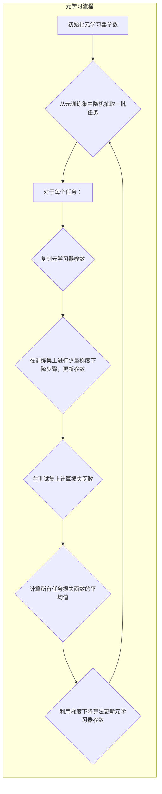

## 一切皆是映射：基于元学习的自然语言处理模型预训练

作者：禅与计算机程序设计艺术

## 1. 背景介绍

### 1.1 自然语言处理的现状与挑战

自然语言处理（NLP）是人工智能领域的一个重要分支，旨在让计算机理解、解释和生成人类语言。近年来，深度学习技术的快速发展推动了 NLP 的巨大进步，特别是在文本分类、机器翻译、问答系统等任务上取得了显著成果。然而，当前的 NLP 模型仍然面临着一些挑战：

* **数据依赖性：** 深度学习模型通常需要大量的标注数据才能达到良好的性能，而标注数据的获取成本高昂且耗时。
* **泛化能力不足：** 在一个特定领域训练的模型往往难以泛化到其他领域或任务。
* **可解释性差：** 深度学习模型的内部机制复杂，难以解释其预测结果，这限制了其在实际应用中的可信度和可靠性。

### 1.2 元学习：学习如何学习

元学习（Meta-Learning），也称为“学习如何学习”，是一种旨在提高模型学习能力的新兴机器学习范式。元学习的目标是训练一个能够快速适应新任务的模型，而无需大量的标注数据。元学习算法通常包含两个层次的学习：

* **内层学习：** 针对特定任务进行模型训练。
* **外层学习：** 学习一个通用的模型初始化参数或学习策略，以便在面对新任务时能够快速适应。

### 1.3 元学习与自然语言处理

近年来，元学习在 NLP 领域的应用越来越广泛，例如：

* **少样本学习：** 利用少量标注数据训练 NLP 模型。
* **跨领域迁移学习：** 将在一个领域训练的模型迁移到其他领域。
* **多任务学习：** 同时训练多个 NLP 任务，并利用任务间的共性提升整体性能。

## 2. 核心概念与联系

### 2.1 元学习的核心概念

* **任务（Task）：**  元学习中的基本单元，通常包含一个数据集和一个学习目标。
* **元学习器（Meta-Learner）：**  负责学习一个通用的模型初始化参数或学习策略。
* **基础学习器（Base-Learner）：**  针对特定任务进行模型训练。
* **元训练集（Meta-Training Set）：**  包含多个任务的数据集，用于训练元学习器。
* **元测试集（Meta-Testing Set）：**  包含新的任务的数据集，用于评估元学习器的泛化能力。

### 2.2 元学习与预训练的关系

预训练（Pre-Training）是指在大规模无标注数据上训练一个模型，然后将其作为其他任务的初始模型。预训练可以有效地将知识从大规模数据迁移到下游任务，从而提升模型的性能。

元学习可以看作是预训练的一种泛化形式。预训练的目标是学习一个通用的特征表示，而元学习的目标是学习一个通用的学习策略。元学习可以利用预训练模型作为基础学习器，从而更有效地学习适应新任务的策略。

### 2.3 元学习在 NLP 中的应用场景

* **文本分类：**  例如，利用元学习训练一个能够快速适应不同主题分类任务的模型。
* **机器翻译：**  例如，利用元学习训练一个能够快速适应不同语言对翻译任务的模型。
* **问答系统：**  例如，利用元学习训练一个能够快速适应不同领域问答任务的模型。

## 3. 核心算法原理具体操作步骤

### 3.1 基于梯度的元学习算法（MAML）

MAML (Model-Agnostic Meta-Learning) 是一种经典的基于梯度的元学习算法。其核心思想是学习一个模型初始化参数，使得该模型在经过少量梯度下降步骤后，能够快速适应新的任务。

**具体操作步骤：**

1. **初始化元学习器参数** $\theta$。
2. **从元训练集中随机抽取一批任务** $T_i = \{D_{train}^i, D_{test}^i\}$。
3. **对于每个任务** $T_i$：
   *  **复制元学习器参数** $\theta_i' = \theta$。
   *  **在训练集** $D_{train}^i$ **上进行少量梯度下降步骤，更新参数** $\theta_i'$。
   *  **在测试集** $D_{test}^i$ **上计算损失函数** $L_i(\theta_i')$。
4. **计算所有任务损失函数的平均值** $L(\theta) = \frac{1}{N} \sum_{i=1}^{N} L_i(\theta_i')$。
5. **利用梯度下降算法更新元学习器参数** $\theta$。
6. **重复步骤2-5，直到元学习器收敛**。

### 3.2 基于度量的元学习算法

基于度量的元学习算法利用学习到的度量空间来比较不同样本之间的相似度，从而快速适应新的任务。

**具体操作步骤：**

1. **初始化元学习器参数，包括编码器** $f$ **和度量函数** $d$。
2. **从元训练集中随机抽取一批任务** $T_i = \{D_{train}^i, D_{test}^i\}$。
3. **对于每个任务** $T_i$：
   *  **利用编码器** $f$ **将训练集** $D_{train}^i$ **中的样本编码为特征向量**。
   *  **利用度量函数** $d$ **计算测试集** $D_{test}^i$ **中样本与训练集样本之间的相似度**。
   *  **根据相似度进行预测**。
4. **计算所有任务的损失函数**。
5. **利用梯度下降算法更新元学习器参数**。
6. **重复步骤2-5，直到元学习器收敛**。

## 4. 数学模型和公式详细讲解举例说明

### 4.1 MAML 数学模型

MAML 的目标是学习一个模型初始化参数 $\theta$，使得该模型在经过少量梯度下降步骤后，能够快速适应新的任务。

假设我们有一个模型 $f_\theta$，该模型的参数为 $\theta$。对于一个任务 $T_i$，我们可以利用训练集 $D_{train}^i$ 对模型参数进行更新：

$$
\theta_i' = \theta - \alpha \nabla_{\theta} L_{T_i}(f_\theta, D_{train}^i)
$$

其中，$\alpha$ 为学习率，$L_{T_i}$ 为任务 $T_i$ 的损失函数。

MAML 的目标是找到一个最优的初始化参数 $\theta$，使得所有任务的平均损失函数最小化：

$$
\min_{\theta} \frac{1}{N} \sum_{i=1}^{N} L_{T_i}(f_{\theta_i'}, D_{test}^i)
$$

### 4.2 MAML 举例说明

假设我们有一个图像分类任务，元训练集中包含 5 个任务，每个任务包含 10 张训练图片和 5 张测试图片。每个任务的类别不同，例如第一个任务是识别猫和狗，第二个任务是识别汽车和飞机。

我们可以利用 MAML 算法学习一个模型初始化参数，使得该模型在经过少量梯度下降步骤后，能够快速适应新的图像分类任务。

## 5. 项目实践：代码实例和详细解释说明

### 5.1 Python 代码实例

```python
import torch
import torch.nn as nn
import torch.optim as optim

class MAML(nn.Module):
    def __init__(self, model, alpha, inner_steps):
        super(MAML, self).__init__()
        self.model = model
        self.alpha = alpha
        self.inner_steps = inner_steps

    def forward(self, tasks):
        meta_loss = 0
        for task in tasks:
            # 获取任务数据
            support_x, support_y, query_x, query_y = task

            # 复制模型参数
            fast_weights = dict(self.model.named_parameters())

            # 内层循环：在支持集上进行少量梯度下降步骤
            for _ in range(self.inner_steps):
                # 计算损失函数
                loss = nn.CrossEntropyLoss()(self.model(support_x, params=fast_weights), support_y)

                # 计算梯度
                grads = torch.autograd.grad(loss, fast_weights.values(), create_graph=True)

                # 更新模型参数
                fast_weights = dict(zip(fast_weights.keys(), [w - self.alpha * g for w, g in zip(fast_weights.values(), grads)]))

            # 外层循环：在查询集上计算损失函数
            query_loss = nn.CrossEntropyLoss()(self.model(query_x, params=fast_weights), query_y)

            # 累加 meta loss
            meta_loss += query_loss

        return meta_loss / len(tasks)
```

### 5.2 代码解释说明

* `MAML` 类实现了 MAML 算法。
* `__init__` 方法初始化模型、学习率和内层循环步数。
* `forward` 方法计算元损失函数。
* 对于每个任务，`forward` 方法首先复制模型参数，然后在支持集上进行少量梯度下降步骤，更新模型参数。最后，在查询集上计算损失函数，并累加元损失函数。

## 6. 实际应用场景

### 6.1 少样本学习

在少样本学习场景下，每个类别只有少量标注样本可用。元学习可以利用少量样本训练一个模型，并使其能够快速适应新的类别。

**应用实例：**

* **图像分类：**  例如，利用元学习训练一个能够识别新物种的模型，每个新物种只有少量标注图片可用。
* **文本分类：**  例如，利用元学习训练一个能够识别新主题的模型，每个新主题只有少量标注文本可用。

### 6.2 跨领域迁移学习

在跨领域迁移学习场景下，我们需要将在一个领域训练的模型迁移到其他领域。元学习可以学习一个通用的模型初始化参数或学习策略，使得模型能够快速适应新的领域。

**应用实例：**

* **情感分析：**  例如，将在一个领域（例如电影评论）训练的情感分析模型迁移到其他领域（例如产品评论）。
* **机器翻译：**  例如，将在一个语言对（例如英语-法语）训练的机器翻译模型迁移到其他语言对（例如英语-德语）。

## 7. 工具和资源推荐

### 7.1 元学习框架

* **Learn2Learn:**  一个基于 PyTorch 的元学习框架，提供了多种元学习算法的实现。
* **Meta-Learning Benchmark:**  一个元学习基准测试平台，提供了多个元学习数据集和评估指标。

### 7.2 预训练模型

* **BERT:**  一个基于 Transformer 的预训练语言模型，在多个 NLP 任务上取得了 state-of-the-art 的性能。
* **GPT-3:**  一个基于 Transformer 的预训练语言模型，能够生成高质量的文本。

## 8. 总结：未来发展趋势与挑战

### 8.1 未来发展趋势

* **更强大的元学习算法：**  研究更高效、更鲁棒的元学习算法，以应对更复杂的 NLP 任务。
* **与其他技术的结合：**  将元学习与其他技术相结合，例如强化学习、迁移学习等，以进一步提升 NLP 模型的性能。
* **应用于更广泛的领域：**  将元学习应用于更广泛的 NLP 领域，例如对话系统、信息抽取等。

### 8.2 面临的挑战

* **计算成本高：**  元学习算法通常需要大量的计算资源，这限制了其在实际应用中的可行性。
* **理论基础不足：**  元学习的理论基础还不够完善，这限制了对其工作机制的理解和改进。
* **数据效率：**  元学习算法仍然需要大量的训练数据才能达到良好的性能，如何提高数据效率是一个重要的研究方向。

## 9. 附录：常见问题与解答

### 9.1 什么是元学习？

元学习是一种旨在提高模型学习能力的机器学习范式。元学习的目标是训练一个能够快速适应新任务的模型，而无需大量的标注数据。

### 9.2 元学习与预训练有什么区别？

预训练的目标是学习一个通用的特征表示，而元学习的目标是学习一个通用的学习策略。元学习可以利用预训练模型作为基础学习器，从而更有效地学习适应新任务的策略。

### 9.3 元学习在 NLP 中有哪些应用场景？

元学习在 NLP 中的应用场景包括：

* 少样本学习
* 跨领域迁移学习
* 多任务学习

### 9.4 元学习面临哪些挑战？

元学习面临的挑战包括：

* 计算成本高
* 理论基础不足
* 数据效率

## 10.  Mermaid流程图


