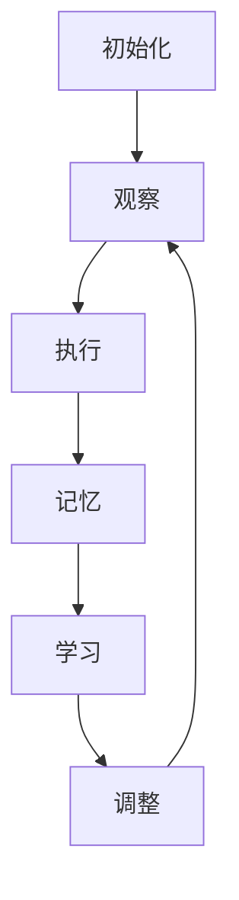

## 1.背景介绍

在深度强化学习领域，Deep Q-Network (DQN) 是一种典型的算法，它结合了Q-Learning和深度学习的优点，在很多任务中取得了显著的效果。然而，随着项目规模不断扩大，DQN代码的维护和优化变得越来越复杂。从软件工程的角度来看，这个问题可以被看作是一个“映射”问题，即如何将深度学习的理论与实际的代码实现进行有效的映射。本文将深入探讨这个问题，提供一种系统化的方法来维护和优化DQN代码。

## 2.核心概念与联系

在开始详细讨论之前，我们需要了解一些核心概念与它们之间的联系。首先，我们需要理解何为"映射"。在这里，映射指的是将一个问题空间中的元素转换成另一个问题空间中的元素。在我们的上下文中，原始问题空间是深度学习的理论，而目标问题空间是实际的代码实现。

接下来，我们需要理解DQN的基本原理。DQN是一种结合了深度学习的Q-Learning算法，它使用深度神经网络来近似Q函数，以此来学习最优策略。DQN的主要优点是可以处理高维度的状态空间，而传统的Q-Learning算法则无法处理这种情况。

最后，我们需要理解软件工程的基本原则。软件工程是一门研究和应用系统化、规范化、可量化的软件开发和维护方法，以及使用这些方法管理和改进软件开发过程的学科。在我们的上下文中，软件工程的原则和方法可以帮助我们更有效地维护和优化DQN代码。

## 3.核心算法原理具体操作步骤

DQN的核心算法原理可以分为以下几个步骤：

1. **初始化**：初始化神经网络参数和记忆回放池。
2. **观察**：观察环境的初始状态。
3. **执行**：基于当前的策略（例如$\epsilon$-贪婪策略）执行一个动作。
4. **记忆**：将观察到的状态、执行的动作、获得的奖励以及新的状态存入记忆回放池。
5. **学习**：从记忆回放池中随机采样一批经验，使用神经网络计算每个经验的Q值，并用这些Q值更新神经网络的参数。
6. **调整**：如果达到了预设的条件（例如环境结束或达到最大步数限制），则调整策略（例如减小$\epsilon$值）。
7. **重复**：重复上述步骤，直到达到预设的训练回合数。

这个流程可以用以下的 Mermaid流程图来表示：



## 4.数学模型和公式详细讲解举例说明

在DQN中，我们用一个深度神经网络$Q(s, a;\theta)$来近似Q函数。其中，$s$是状态，$a$是动作，$\theta$是神经网络的参数。

神经网络的训练目标是最小化以下的损失函数：

$$
L(\theta) = \mathbb{E}_{(s, a, r, s') \sim \mathcal{D}}\left[\left(r + \gamma \max_{a'} Q(s', a';\theta^-) - Q(s, a;\theta)\right)^2\right]
$$

其中，$(s, a, r, s')$是从记忆回放池$\mathcal{D}$中随机采样的经验，$r$是奖励，$\gamma$是折扣因子，$\theta^-$表示目标网络的参数。

神经网络的参数通过随机梯度下降（SGD）进行更新：

$$
\theta \leftarrow \theta - \alpha \nabla_\theta L(\theta)
$$

其中，$\alpha$是学习率，$\nabla_\theta L(\theta)$是损失函数关于参数的梯度。

## 5.项目实践：代码实例和详细解释说明

在实践中，我们可以使用Python和PyTorch来实现DQN。以下是一个简单的例子：

```python
import torch
import torch.nn as nn
import torch.optim as optim
import numpy as np

class DQN(nn.Module):
    def __init__(self, input_dim, output_dim):
        super(DQN, self).__init__()
        self.fc = nn.Linear(input_dim, output_dim)

    def forward(self, x):
        return self.fc(x)

class Agent:
    def __init__(self, input_dim, output_dim, gamma=0.99, alpha=0.01):
        self.dqn = DQN(input_dim, output_dim)
        self.target_dqn = DQN(input_dim, output_dim)
        self.target_dqn.load_state_dict(self.dqn.state_dict())
        self.optimizer = optim.Adam(self.dqn.parameters(), lr=alpha)
        self.loss_fn = nn.MSELoss()
        self.gamma = gamma

    def update(self, s, a, r, s_next):
        s = torch.tensor(s, dtype=torch.float32)
        a = torch.tensor(a, dtype=torch.int64)
        r = torch.tensor(r, dtype=torch.float32)
        s_next = torch.tensor(s_next, dtype=torch.float32)

        q = self.dqn(s)[a]
        q_next = self.target_dqn(s_next).max().detach()
        target = r + self.gamma * q_next

        loss = self.loss_fn(q, target)
        self.optimizer.zero_grad()
        loss.backward()
        self.optimizer.step()

    def synchronize(self):
        self.target_dqn.load_state_dict(self.dqn.state_dict())
```

在这个例子中，我们首先定义了一个DQN类，它是一个简单的全连接神经网络。然后，我们定义了一个Agent类，它包含了一个DQN和一个目标DQN，以及一个优化器和一个损失函数。在Agent的`update`方法中，我们计算了Q值和目标Q值，然后用它们来计算损失，最后用这个损失来更新神经网络的参数。在Agent的`synchronize`方法中，我们同步了DQN和目标DQN的参数。

## 6.实际应用场景

DQN在许多实际应用场景中都有广泛的应用，如：

- 游戏：DQN最初就是在Atari游戏中得到验证的。通过自我学习，DQN可以在许多Atari游戏中达到超越人类的表现。
- 自动驾驶：DQN可以用来训练自动驾驶系统，使其学习如何在各种环境和条件下驾驶汽车。
- 资源管理：在数据中心，DQN可以用来优化资源分配，以提高能效和减少延迟。
- 金融：在金融市场，DQN可以用来学习最优的交易策略，以最大化收益并控制风险。

## 7.工具和资源推荐

以下是一些可以帮助你更深入理解和实践DQN的工具和资源：

- **PyTorch**：一个易用且强大的深度学习框架，非常适合实现DQN。
- **OpenAI Gym**：一个提供许多预定义环境的强化学习库，可以用来测试和验证DQN的效果。
- **Ray/RLlib**：一个强化学习库，提供了DQN等多种算法的高效实现。
- **Spinning Up in Deep RL**：OpenAI提供的一份深度强化学习教程，包含了DQN等算法的详细解释和实现。

## 8.总结：未来发展趋势与挑战

DQN作为深度强化学习的一种基本算法，已经在许多应用中取得了显著的成功。然而，DQN仍然面临一些挑战，比如样本效率低、训练不稳定等。为了解决这些问题，研究者们提出了许多改进的算法，如Double DQN、Dueling DQN等。

除此之外，如何将软件工程的方法更好地应用到DQN代码的维护和优化中，也是一个重要的研究方向。我们期待在未来，有更多的研究和工具能够帮助我们在这方面取得进步。

## 9.附录：常见问题与解答

### Q: DQN的训练为什么需要一个目标网络？

A: 目标网络的引入是为了稳定训练。如果我们直接使用当前网络来计算目标Q值，那么在更新网络参数时，目标Q值也会发生变化，这会导致训练不稳定。而目标网络的参数是固定的，因此可以提供一个稳定的目标。

### Q: 如何选择DQN的超参数？

A: DQN的超参数包括学习率、回放池大小、折扣因子等，它们的选择主要依赖于实验。一般情况下，可以先使用一组通用的超参数，然后通过网格搜索或其它优化方法来寻找最优的超参数。

### Q: 如何处理连续的动作空间？

A: DQN默认处理的是离散的动作空间。对于连续的动作空间，一种常见的方法是使用离散化的动作，但这可能会导致精度问题。另一种方法是使用DQN的变种，如深度确定性策略梯度（DDPG）或软件执行者-评论者（SAC），它们可以直接处理连续的动作空间。