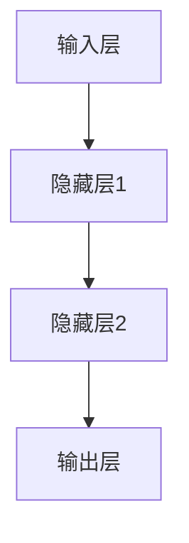
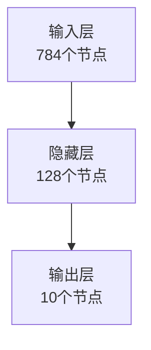

# 一切皆是映射：构建第一个深度学习模型

## 1. 背景介绍

### 1.1 人工智能的崛起

人工智能(AI)正在改变着我们的生活方式。从语音助手到自动驾驶汽车,AI系统已经无处不在。然而,这些系统的核心是由深度学习算法驱动的,这是一种强大的机器学习技术,能够从大量数据中自动学习模式和特征。

### 1.2 深度学习的重要性

深度学习已经在计算机视觉、自然语言处理、推荐系统等领域取得了巨大的成功。它的能力远远超过了传统的机器学习算法,可以处理复杂的高维数据,并发现其中的深层次模式。因此,深度学习已经成为人工智能的核心技术之一。

### 1.3 本文概述

本文将带领读者构建一个简单的深度学习模型,并深入探讨其核心概念和算法原理。我们将使用Python和流行的深度学习框架TensorFlow来实现这个模型,并通过实例和可视化来帮助读者更好地理解深度学习的本质。

## 2. 核心概念与联系

### 2.1 什么是深度学习?

深度学习是一种基于人工神经网络的机器学习技术。它的灵感来自于生物神经系统的结构和功能,试图模拟人类大脑的工作方式。深度学习算法通过组合多个非线性变换层来学习数据的层次表示,从而发现数据中的复杂模式和特征。

### 2.2 神经网络的基本结构

神经网络由多个互连的节点(神经元)组成,这些节点被组织成多个层次。每个节点接收来自前一层的输入,经过一个加权求和和非线性激活函数的转换,产生自己的输出,并传递给下一层。通过调整节点之间的连接权重,神经网络可以学习到输入和输出之间的映射关系。

### 2.3 前馈神经网络与反向传播

前馈神经网络是最基本的神经网络结构,信号只从输入层向输出层单向传播。为了训练这种网络,我们需要使用反向传播算法,根据输出误差反向调整每个连接的权重,使得网络输出逐渐逼近期望值。

### 2.4 深度学习的优势

与传统的机器学习算法相比,深度学习具有以下优势:

1. **自动特征提取**: 深度学习模型可以自动从原始数据中学习最优特征表示,而无需人工设计特征。
2. **处理复杂数据**: 深度网络可以处理高维、非线性和异构数据,如图像、视频、语音等。
3. **端到端学习**: 深度学习模型可以直接从原始输入到目标输出进行端到端的训练和预测。
4. **可迁移性**: 在一个领域训练好的深度模型可以迁移到其他相关领域,提高学习效率。

## 3. 核心算法原理具体操作步骤

在本节中,我们将逐步构建一个简单的前馈神经网络,并详细解释其核心算法原理和操作步骤。

### 3.1 定义网络结构

首先,我们需要定义神经网络的结构,包括输入层、隐藏层和输出层的节点数量。在这个示例中,我们将构建一个用于手写数字识别的神经网络,其结构如下:

输入层有784个节点,对应一个28x28像素的手写数字图像。隐藏层有128个节点,用于学习数据的内部表示。输出层有10个节点,对应0到9这10个数字类别。

### 3.2 初始化权重和偏置

接下来,我们需要初始化神经网络中所有连接的权重和偏置。权重决定了信号在节点之间传递的强度,而偏置则控制了节点的激活程度。通常,我们会使用一些随机初始化策略,如高斯分布或Xavier初始化。

### 3.3 前向传播

在训练过程中,我们将输入数据馈送到神经网络,并计算每一层的输出。这个过程被称为前向传播。对于每个节点,它的输出值是通过将上一层节点的加权输出求和,再应用一个非线性激活函数(如ReLU或Sigmoid)计算得到的。

$$
output_j = \phi\left(\sum_i w_{ij}x_i + b_j\right)
$$

其中,$\phi$是激活函数,$w_{ij}$是连接权重,$x_i$是上一层节点的输出,$b_j$是偏置项。

### 3.4 计算损失函数

在前向传播的最后一层,我们会得到神经网络对输入数据的预测结果。然后,我们需要计算这个预测结果与真实标签之间的差异,即损失函数。常用的损失函数包括均方误差、交叉熵等。

### 3.5 反向传播

为了减小损失函数的值,我们需要调整神经网络中所有连接的权重和偏置。这个过程被称为反向传播。我们首先计算输出层的误差梯度,然后依次向前传播到每一层,根据链式法则计算每个权重和偏置的梯度。

$$
\frac{\partial L}{\partial w_{ij}} = \frac{\partial L}{\partial output_j} \cdot \frac{\partial output_j}{\partial w_{ij}}
$$

其中,$L$是损失函数,$output_j$是当前层节点的输出。

### 3.6 权重更新

最后,我们使用优化算法(如梯度下降或Adam)根据计算出的梯度来更新每个权重和偏置,以减小损失函数的值。

$$
w_{ij}^{(t+1)} = w_{ij}^{(t)} - \eta \frac{\partial L}{\partial w_{ij}}
$$

其中,$\eta$是学习率,控制着每次更新的步长大小。

通过重复上述步骤,神经网络将不断调整其参数,逐渐学习到输入数据与目标输出之间的映射关系。

## 4. 数学模型和公式详细讲解举例说明

在上一节中,我们介绍了神经网络的核心算法原理。现在,让我们更深入地探讨其中涉及的数学模型和公式。

### 4.1 神经元模型

神经网络的基本单元是神经元(节点)。每个神经元接收来自上一层的加权输入,并通过激活函数产生自己的输出。这个过程可以用下面的公式表示:

$$
y = \phi\left(\sum_i w_ix_i + b\right)
$$

其中,$y$是神经元的输出,$x_i$是第$i$个输入,$w_i$是对应的权重,$b$是偏置项,$\phi$是激活函数。

常用的激活函数包括Sigmoid函数、Tanh函数和ReLU函数等。它们的作用是引入非线性,使神经网络能够学习复杂的映射关系。

#### 4.1.1 Sigmoid函数

Sigmoid函数的公式如下:

$$
\sigma(x) = \frac{1}{1 + e^{-x}}
$$

它将输入值映射到(0,1)范围内,常用于二分类问题的输出层。

#### 4.1.2 Tanh函数

Tanh函数的公式如下:

$$
\tanh(x) = \frac{e^x - e^{-x}}{e^x + e^{-x}}
$$

它将输入值映射到(-1,1)范围内,在某些场景下比Sigmoid函数收敛更快。

#### 4.1.3 ReLU函数

ReLU(整流线性单元)函数的公式如下:

$$
\text{ReLU}(x) = \max(0, x)
$$

它是一个简单的分段线性函数,在深度神经网络中表现出色,并且计算效率很高。

### 4.2 损失函数

为了训练神经网络,我们需要定义一个损失函数(也称为目标函数或代价函数),用于衡量预测输出与真实标签之间的差异。通过最小化这个损失函数,我们可以获得最优的模型参数。

#### 4.2.1 均方误差

对于回归问题,我们常用均方误差(Mean Squared Error, MSE)作为损失函数:

$$
\text{MSE} = \frac{1}{n}\sum_{i=1}^n (y_i - \hat{y}_i)^2
$$

其中,$n$是样本数量,$y_i$是真实标签,$\hat{y}_i$是预测输出。

#### 4.2.2 交叉熵

对于分类问题,我们通常使用交叉熵(Cross Entropy)作为损失函数:

$$
\text{CE} = -\frac{1}{n}\sum_{i=1}^n \sum_{j=1}^C y_{ij}\log(\hat{y}_{ij})
$$

其中,$C$是类别数量,$y_{ij}$是真实标签的一热编码,$\hat{y}_{ij}$是预测输出的概率分布。

### 4.3 反向传播算法

反向传播算法是训练神经网络的关键步骤,它使用链式法则计算每个权重和偏置的梯度,以便更新参数并最小化损失函数。

假设我们有一个单层神经网络,其中$w$是权重,$b$是偏置,$x$是输入,$y$是输出,$L$是损失函数。根据链式法则,我们可以计算权重梯度如下:

$$
\frac{\partial L}{\partial w} = \frac{\partial L}{\partial y} \cdot \frac{\partial y}{\partial w}
$$

其中,

$$
\frac{\partial y}{\partial w} = \phi'(z)x
$$

$$
z = wx + b
$$

同理,我们可以计算偏置梯度:

$$
\frac{\partial L}{\partial b} = \frac{\partial L}{\partial y} \cdot \frac{\partial y}{\partial b}
$$

$$
\frac{\partial y}{\partial b} = \phi'(z)
$$

对于多层神经网络,我们需要使用反向传播算法依次计算每一层的梯度,并根据这些梯度更新参数。

### 4.4 优化算法

在计算出梯度后,我们需要使用一种优化算法来更新神经网络的参数。最常见的优化算法是梯度下降(Gradient Descent),它根据梯度的方向调整参数,以最小化损失函数。

#### 4.4.1 批量梯度下降

批量梯度下降(Batch Gradient Descent)在每次迭代时使用整个训练数据集计算梯度:

$$
\theta^{(t+1)} = \theta^{(t)} - \eta \nabla_\theta J(\theta)
$$

其中,$\theta$是模型参数,$J(\theta)$是损失函数,$\eta$是学习率。

#### 4.4.2 小批量梯度下降

小批量梯度下降(Mini-batch Gradient Descent)在每次迭代时只使用一部分训练数据计算梯度,这种方法可以提高计算效率并引入一定的噪声,有助于避免陷入局部最优解。

#### 4.4.3 Adam优化算法

Adam是一种自适应学习率的优化算法,它可以根据梯度的一阶矩估计和二阶矩估计动态调整每个参数的学习率,从而加快收敛速度。

### 4.5 正则化技术

为了防止神经网络过拟合,我们可以采用一些正则化技术,如L1正则化、L2正则化和Dropout等。

#### 4.5.1 L1正则化

L1正则化在损失函数中加入了参数的绝对值之和作为惩罚项:

$$
J(\theta) = J_0(\theta) + \lambda \sum_i |\theta_i|
$$

其中,$J_0(\theta)$是原始损失函数,$\lambda$是正则化系数。L1正则化可以产生稀疏解,即一些参数会被精确地设置为0。

#### 4.5.2 L2正则化

L2正则化在损失函数中加入了参数的平方和作为惩罚项:

$$
J(\theta) = J_0(\theta) + \lambda \sum_i \theta_i^2
$$

L2正则化会使参数值变小,但不会精确地等于0。它通常比L1正则化表现更好。

#### 4.5.3 Dropout

Dropout是一种常用的正则化技术,它在训练时随机地将一些神经元的输出设置为0,从而避免了神经元之间的