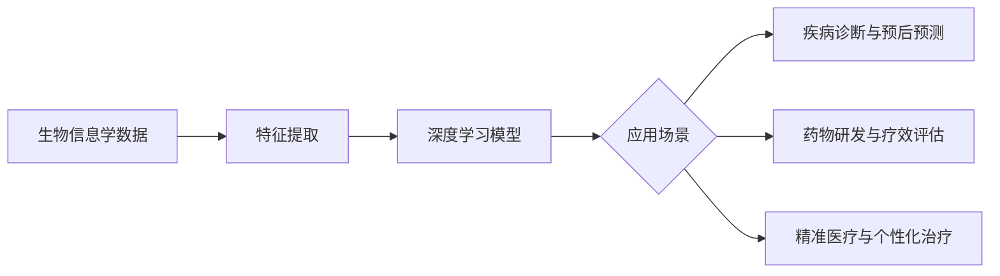

# 一切皆是映射：深度学习在生物信息学中的应用前景

作者：禅与计算机程序设计艺术

## 1. 背景介绍
### 1.1 生物信息学的发展历程
#### 1.1.1 生物信息学的起源与定义
#### 1.1.2 生物信息学的发展阶段
#### 1.1.3 生物信息学的研究内容与方向
### 1.2 深度学习的兴起
#### 1.2.1 人工神经网络的发展历史
#### 1.2.2 深度学习的概念与特点
#### 1.2.3 深度学习的应用领域
### 1.3 深度学习与生物信息学的结合
#### 1.3.1 生物信息学面临的挑战
#### 1.3.2 深度学习在生物信息学中的应用价值
#### 1.3.3 深度学习与生物信息学结合的研究现状

## 2. 核心概念与联系
### 2.1 生物信息学中的关键概念
#### 2.1.1 基因组学
#### 2.1.2 转录组学
#### 2.1.3 蛋白质组学
### 2.2 深度学习中的关键概念  
#### 2.2.1 人工神经网络
#### 2.2.2 卷积神经网络(CNN)
#### 2.2.3 循环神经网络(RNN)
### 2.3 深度学习与生物信息学的映射关系
#### 2.3.1 基因组数据与深度学习模型的对应
#### 2.3.2 转录组数据与深度学习模型的对应
#### 2.3.3 蛋白质组数据与深度学习模型的对应

## 3. 核心算法原理与具体操作步骤
### 3.1 卷积神经网络在基因组数据分析中的应用
#### 3.1.1 卷积神经网络的基本原理
#### 3.1.2 卷积神经网络在基因组数据分析中的优势
#### 3.1.3 基于卷积神经网络的基因组数据分析流程
### 3.2 循环神经网络在转录组数据分析中的应用  
#### 3.2.1 循环神经网络的基本原理
#### 3.2.2 循环神经网络在转录组数据分析中的优势
#### 3.2.3 基于循环神经网络的转录组数据分析流程
### 3.3 图神经网络在蛋白质相互作用网络分析中的应用
#### 3.3.1 图神经网络的基本原理
#### 3.3.2 图神经网络在蛋白质相互作用网络分析中的优势  
#### 3.3.3 基于图神经网络的蛋白质相互作用网络分析流程

## 4. 数学模型和公式详细讲解与举例说明
### 4.1 卷积神经网络的数学模型
#### 4.1.1 卷积层的数学表示
#### 4.1.2 池化层的数学表示
#### 4.1.3 全连接层的数学表示
### 4.2 循环神经网络的数学模型
#### 4.2.1 简单循环神经网络(SimpleRNN)的数学表示
#### 4.2.2 门控循环单元(GRU)的数学表示
#### 4.2.3 长短期记忆网络(LSTM)的数学表示
### 4.3 图神经网络的数学模型
#### 4.3.1 图卷积网络(GCN)的数学表示
#### 4.3.2 图注意力网络(GAT)的数学表示
#### 4.3.3 图自编码器(GAE)的数学表示

## 5. 项目实践：代码实例与详细解释说明 
### 5.1 基于卷积神经网络的基因组数据分类
#### 5.1.1 数据预处理与特征提取
#### 5.1.2 卷积神经网络模型构建
#### 5.1.3 模型训练与评估
### 5.2 基于循环神经网络的转录组数据序列标注
#### 5.2.1 数据预处理与特征提取
#### 5.2.2 循环神经网络模型构建
#### 5.2.3 模型训练与评估
### 5.3 基于图神经网络的蛋白质相互作用预测
#### 5.3.1 数据预处理与特征提取
#### 5.3.2 图神经网络模型构建  
#### 5.3.3 模型训练与评估

## 6. 实际应用场景
### 6.1 疾病诊断与预后预测
#### 6.1.1 基于基因组数据的肿瘤诊断
#### 6.1.2 基于转录组数据的疾病亚型划分
#### 6.1.3 基于蛋白质组数据的病情预后预测
### 6.2 药物研发与疗效评估
#### 6.2.1 基于基因组数据的药物靶点发现
#### 6.2.2 基于转录组数据的药物反应预测
#### 6.2.3 基于蛋白质组数据的药物副作用评估
### 6.3 精准医疗与个性化治疗
#### 6.3.1 基于基因组数据的个性化用药指导
#### 6.3.2 基于转录组数据的个性化治疗方案制定
#### 6.3.3 基于蛋白质组数据的个性化健康管理

## 7. 工具与资源推荐
### 7.1 深度学习框架与库
#### 7.1.1 TensorFlow
#### 7.1.2 PyTorch
#### 7.1.3 Keras
### 7.2 生物信息学数据库与工具
#### 7.2.1 NCBI(National Center for Biotechnology Information)
#### 7.2.2 UCSC Genome Browser
#### 7.2.3 Galaxy
### 7.3 学习资源与社区
#### 7.3.1 Coursera上的生物信息学与深度学习课程
#### 7.3.2 GitHub上的生物信息学项目
#### 7.3.3 生物信息学论坛与社区

## 8. 总结：未来发展趋势与挑战
### 8.1 深度学习在生物信息学中的发展趋势
#### 8.1.1 模型的解释性与可解释性
#### 8.1.2 多模态数据的整合分析
#### 8.1.3 深度学习模型的轻量化与移动化
### 8.2 深度学习在生物信息学中面临的挑战
#### 8.2.1 生物数据的异质性与噪声
#### 8.2.2 深度学习模型的泛化能力
#### 8.2.3 深度学习在生物学领域的伦理问题
### 8.3 展望未来 
#### 8.3.1 深度学习与生物信息学的融合发展
#### 8.3.2 人工智能助力生命科学研究
#### 8.3.3 跨学科人才的培养与合作

## 9. 附录：常见问题与解答
### 9.1 深度学习在生物信息学中应用的前提条件是什么？
### 9.2 如何选择适合的深度学习模型来解决生物信息学问题？
### 9.3 深度学习模型在生物信息学中的可解释性如何实现？
### 9.4 如何处理生物信息学中的不平衡数据问题？
### 9.5 深度学习在生物信息学中的伦理问题有哪些，如何规避？

生物信息学与深度学习的结合是一个充满机遇与挑战的研究方向。深度学习强大的特征提取与模式识别能力为生物信息学领域提供了新的分析方法和思路。通过将深度学习应用于基因组学、转录组学、蛋白质组学等生物信息学数据，我们可以更加深入地理解生命的奥秘，为疾病诊断、药物开发、精准医疗等领域提供有力的支持。

然而，深度学习在生物信息学中的应用也面临着诸多挑战。生物数据的复杂性、异质性、噪声等特点对深度学习模型的泛化能力提出了更高的要求。同时，深度学习模型的可解释性问题也限制了其在生物学领域的广泛应用。未来，我们需要在算法、数据、伦理等多个方面进行深入研究，不断推动深度学习与生物信息学的融合发展。

总之，深度学习为生物信息学领域注入了新的活力，开启了一扇通向生命奥秘的大门。让我们携手并进，用人工智能的力量去探索生命的奥秘，为人类健康和福祉做出贡献。一切皆是映射，让深度学习与生物信息学的映射，照亮生命科学的未来！

以上是深度学习在生物信息学中应用的整体流程图。生物信息学数据经过特征提取后，输入到深度学习模型中进行训练与预测。训练好的模型可以应用于疾病诊断与预后预测、药物研发与疗效评估、精准医疗与个性化治疗等场景，为生物医学研究和临床实践提供有力支持。

深度学习与生物信息学的结合是一场革命性的变革，它为我们认识生命、改善健康提供了全新的途径。让我们拥抱这场变革，用智能算法去洞察生命的奥秘，用创新科技去开创美好的未来。一切皆是映射，而深度学习与生物信息学的映射，正在重塑生命科学的版图。