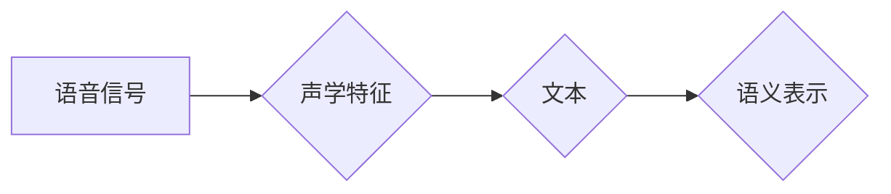

## 1. 背景介绍

### 1.1 语音识别技术的演进

从早期的模板匹配到统计模型，再到如今的深度学习，语音识别技术经历了漫长的发展历程。随着计算能力的提升和数据量的爆炸式增长，深度学习技术在语音识别领域取得了突破性进展，使得语音到文本的转换精度和效率得到了显著提升。

### 1.2 自然语言理解的挑战

然而，仅仅将语音转换为文本还远远不够。真正的挑战在于如何理解文本背后的含义，即自然语言理解 (NLU)。NLU 涉及到对语言的语法、语义、语用等方面的分析，其目的是让计算机能够像人类一样理解和使用语言。

### 1.3 语音到文本的 NLU 过程

语音到文本的 NLU 过程可以看作是一个将语音信号映射到语义表示的过程。在这个过程中，我们需要解决一系列挑战，包括：

* **声学建模:** 将语音信号转换为声学特征。
* **语音识别:** 将声学特征转换为文本。
* **文本预处理:** 对文本进行分词、词性标注、句法分析等操作。
* **语义理解:** 从文本中提取语义信息，例如实体、关系、事件等。
* **对话管理:** 在多轮对话中维护对话状态，并根据语义信息做出相应的回应。


## 2. 核心概念与联系

### 2.1 声学模型

声学模型是语音识别系统的基础，其作用是将语音信号转换为声学特征。常用的声学模型包括：

* **隐马尔可夫模型 (HMM):** HMM 是一种统计模型，它假设语音信号是一个由隐藏状态序列生成的观测序列。
* **深度神经网络 (DNN):** DNN 是一种多层神经网络，它可以学习从语音信号到声学特征的非线性映射关系。

### 2.2 语言模型

语言模型用于预测文本序列的概率分布。常用的语言模型包括：

* **N-gram 语言模型:** N-gram 语言模型基于统计方法，它假设一个词出现的概率只与其前面 n-1 个词相关。
* **循环神经网络 (RNN):** RNN 是一种能够处理序列数据的深度学习模型，它可以学习文本序列的长期依赖关系。

### 2.3 语义表示

语义表示是文本的含义的抽象表示。常用的语义表示方法包括：

* **词向量:** 词向量是将词映射到低维向量空间的一种表示方法，它可以捕捉词之间的语义相似性。
* **句向量:** 句向量是将句子映射到低维向量空间的一种表示方法，它可以捕捉句子的语义信息。

### 2.4 映射关系

语音到文本的 NLU 过程可以看作是一系列映射关系的组合：



## 3. 核心算法原理具体操作步骤

### 3.1 语音识别

语音识别是将声学特征转换为文本的过程。常用的语音识别算法包括：

* **基于 HMM 的语音识别:** HMM-based 语音识别系统通常使用 Viterbi 算法来找到最可能的隐藏状态序列，从而得到对应的文本序列。
* **基于 DNN 的语音识别:** DNN-based 语音识别系统通常使用连接时序分类 (CTC) 算法来进行训练和解码。

### 3.2 文本预处理

文本预处理是对文本进行分词、词性标注、句法分析等操作，以便于后续的语义理解。常用的文本预处理工具包括：

* **Stanford CoreNLP:** Stanford CoreNLP 是一个功能强大的自然语言处理工具包，它提供了分词、词性标注、命名实体识别、句法分析等功能。
* **NLTK:** NLTK 是一个 Python 自然语言处理工具包，它提供了丰富的文本处理功能。

### 3.3 语义理解

语义理解是从文本中提取语义信息的过程。常用的语义理解方法包括：

* **命名实体识别 (NER):** NER 用于识别文本中的命名实体，例如人名、地名、机构名等。
* **关系抽取:** 关系抽取用于识别文本中实体之间的关系，例如父子关系、雇佣关系等。
* **事件抽取:** 事件抽取用于识别文本中发生的事件，例如会议、选举、自然灾害等。

### 3.4 对话管理

对话管理是在多轮对话中维护对话状态，并根据语义信息做出相应的回应。常用的对话管理方法包括：

* **基于规则的对话管理:** 基于规则的对话管理系统使用预先定义的规则来控制对话流程。
* **基于统计的对话管理:** 基于统计的对话管理系统使用统计模型来学习对话策略。

## 4. 数学模型和公式详细讲解举例说明

### 4.1 隐马尔可夫模型 (HMM)

HMM 是一种统计模型，它假设语音信号是一个由隐藏状态序列生成的观测序列。HMM 模型由以下几个要素组成：

* **隐藏状态集合:** 表示语音信号可能处于的各种状态，例如音素、音节等。
* **观测符号集合:** 表示语音信号的声学特征，例如 MFCC 特征等。
* **状态转移概率矩阵:** 表示从一个隐藏状态转移到另一个隐藏状态的概率。
* **观测概率矩阵:** 表示在给定隐藏状态下，观测到某个观测符号的概率。
* **初始状态概率分布:** 表示初始时刻处于各个隐藏状态的概率。

HMM 的训练过程就是估计模型参数的过程，常用的训练算法是 Baum-Welch 算法。HMM 的解码过程就是找到最可能的隐藏状态序列的过程，常用的解码算法是 Viterbi 算法。

**例子:** 假设我们要识别一个包含三个音素的单词 "cat"，其对应的音素序列为 /k æ t/。我们可以使用 HMM 模型来建模这个过程。

* 隐藏状态集合: {/k/, /æ/, /t/}
* 观测符号集合: {MFCC 特征}
* 状态转移概率矩阵: 
```
     /k/  /æ/  /t/
/k/  0.8   0.2   0
/æ/  0     0.9   0.1
/t/  0     0     1
```
* 观测概率矩阵: 假设每个音素对应一个高斯分布，其均值和方差分别为 μ 和 σ。
* 初始状态概率分布: [1, 0, 0]

### 4.2 深度神经网络 (DNN)

DNN 是一种多层神经网络，它可以学习从语音信号到声学特征的非线性映射关系。DNN 模型通常由输入层、隐藏层和输出层组成。

* **输入层:** 接收语音信号的声学特征作为输入。
* **隐藏层:** 由多个神经元组成，每个神经元对输入进行加权求和，并应用激活函数进行非线性变换。
* **输出层:** 输出声学特征或音素概率。

DNN 的训练过程就是调整网络参数的过程，常用的训练算法是反向传播算法。DNN 的解码过程就是将声学特征转换为文本的过程，常用的解码算法是贪婪搜索算法或束搜索算法。

**例子:** 假设我们要识别一个包含三个音素的单词 "cat"，其对应的音素序列为 /k æ t/。我们可以使用 DNN 模型来建模这个过程。

* 输入层: 接收 MFCC 特征作为输入。
* 隐藏层: 由多个隐藏层组成，每个隐藏层包含多个神经元。
* 输出层: 输出三个音素的概率分布。

## 5. 项目实践：代码实例和详细解释说明

### 5.1 使用 Python 实现一个简单的语音识别系统

```python
import speech_recognition as sr

# 初始化识别器
r = sr.Recognizer()

# 使用麦克风录制音频
with sr.Microphone() as source:
    print("请说话...")
    audio_data = r.listen(source)

# 识别语音
try:
    text = r.recognize_google(audio_data, language='zh-CN')
    print("你说了: " + text)
except sr.UnknownValueError:
    print("无法识别语音")
except sr.RequestError as e:
    print("无法连接到 Google 语音识别服务; {0}".format(e))
```

**代码解释:**

* 首先，我们使用 `speech_recognition` 库来创建一个识别器对象 `r`。
* 然后，我们使用 `sr.Microphone()` 来创建一个麦克风对象 `source`，并使用 `r.listen(source)` 来录制音频数据。
* 最后，我们使用 `r.recognize_google(audio_data, language='zh-CN')` 来将音频数据转换为文本。

### 5.2 使用 TensorFlow 实现一个简单的 DNN 语音识别系统

```python
import tensorflow as tf

# 定义模型
model = tf.keras.models.Sequential([
  tf.keras.layers.Flatten(input_shape=(28, 28)),
  tf.keras.layers.Dense(128, activation='relu'),
  tf.keras.layers.Dropout(0.2),
  tf.keras.layers.Dense(10)
])

# 定义损失函数和优化器
loss_fn = tf.keras.losses.SparseCategoricalCrossentropy(from_logits=True)
optimizer = tf.keras.optimizers.Adam()

# 编译模型
model.compile(optimizer=optimizer,
              loss=loss_fn,
              metrics=['accuracy'])

# 加载训练数据
(x_train, y_train), (x_test, y_test) = tf.keras.datasets.mnist.load_data()

# 训练模型
model.fit(x_train, y_train, epochs=5)

# 评估模型
model.evaluate(x_test,  y_test, verbose=2)
```

**代码解释:**

* 首先，我们使用 `tf.keras.models.Sequential` 来定义一个 DNN 模型，该模型包含一个输入层、一个隐藏层和一个输出层。
* 然后，我们定义损失函数 `loss_fn` 和优化器 `optimizer`。
* 接着，我们使用 `model.compile` 来编译模型。
* 然后，我们加载 MNIST 数据集，并使用 `model.fit` 来训练模型。
* 最后，我们使用 `model.evaluate` 来评估模型。

## 6. 实际应用场景

### 6.1 智能语音助手

智能语音助手，如 Siri、Alexa 和 Google Assistant，是语音到文本 NLU 技术的典型应用。用户可以通过语音指令与助手交互，例如查询信息、播放音乐、控制智能家居设备等。

### 6.2 语音搜索

语音搜索允许用户使用语音输入进行搜索，而不是传统的文本输入。这使得搜索更加便捷，尤其是在移动设备上。

### 6.3 语音转录

语音转录可以将语音转换为文本，例如会议记录、采访记录、字幕生成等。

### 6.4 语音翻译

语音翻译可以将一种语言的语音转换为另一种语言的文本，这使得跨语言交流更加便捷。

## 7. 工具和资源推荐

### 7.1 语音识别工具

* **Google Cloud Speech-to-Text:** Google 提供的云端语音识别服务，支持多种语言和音频格式。
* **Amazon Transcribe:** Amazon 提供的云端语音识别服务，支持多种语言和音频格式。
* **Microsoft Azure Speech Service:** Microsoft 提供的云端语音识别服务，支持多种语言和音频格式。

### 7.2 自然语言处理工具

* **Stanford CoreNLP:** Stanford CoreNLP 是一个功能强大的自然语言处理工具包，它提供了分词、词性标注、命名实体识别、句法分析等功能。
* **NLTK:** NLTK 是一个 Python 自然语言处理工具包，它提供了丰富的文本处理功能。
* **SpaCy:** SpaCy 是一个 Python 自然语言处理工具包，它提供了快速高效的文本处理功能。

### 7.3 深度学习框架

* **TensorFlow:** TensorFlow 是一个开源的深度学习框架，它提供了丰富的模型构建和训练功能。
* **PyTorch:** PyTorch 是一个开源的深度学习框架，它提供了灵活的模型构建和训练功能。

## 8. 总结：未来发展趋势与挑战

### 8.1 未来发展趋势

* **更精准的语音识别:** 随着深度学习技术的不断发展，语音识别精度将会进一步提升。
* **更强大的自然语言理解能力:** 自然语言理解技术将会更加强大，能够理解更加复杂的语言现象。
* **更自然的人机交互:** 语音到文本 NLU 技术将会使得人机交互更加自然流畅。

### 8.2 挑战

* **噪声环境下的语音识别:** 在噪声环境下，语音识别精度会受到影响。
* **口音和方言的识别:** 不同口音和方言的语音识别仍然是一个挑战。
* **多语言语音识别:** 多语言语音识别需要克服语言差异带来的挑战。

## 9. 附录：常见问题与解答

### 9.1 如何提高语音识别精度？

* **使用高质量的音频数据:** 训练语音识别模型需要使用高质量的音频数据，例如清晰的录音、低噪声的环境等。
* **使用合适的声学模型:** 不同的声学模型适用于不同的场景，例如 HMM 模型适用于小词汇量语音识别，DNN 模型适用于大词汇量语音识别。
* **使用语言模型:** 语言模型可以提高语音识别精度，因为它可以预测文本序列的概率分布。
* **使用数据增强:** 数据增强可以增加训练数据的数量和多样性，从而提高模型的泛化能力。

### 9.2 如何进行自然语言理解？

* **使用文本预处理工具:** 文本预处理工具可以对文本进行分词、词性标注、句法分析等操作，以便于后续的语义理解。
* **使用语义理解方法:** 语义理解方法可以从文本中提取语义信息，例如命名实体识别、关系抽取、事件抽取等。
* **使用深度学习模型:** 深度学习模型可以学习文本的语义表示，例如词向量、句向量等。

### 9.3 如何进行对话管理？

* **使用基于规则的对话管理:** 基于规则的对话管理系统使用预先定义的规则来控制对话流程。
* **使用基于统计的对话管理:** 基于统计的对话管理系统使用统计模型来学习对话策略。
* **使用深度学习模型:** 深度学习模型可以学习对话状态和策略，例如循环神经网络 (RNN)。
