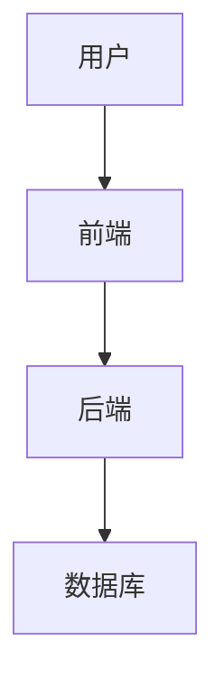

## 1. 背景介绍

### 1.1 博客系统概述

博客系统是一种网络应用程序，允许用户创建和发布个人文章、想法和经验。它通常包括一个内容管理系统（CMS），允许用户创建、编辑和管理他们的内容。博客系统已成为个人和企业分享信息、建立品牌和与受众互动的重要工具。

### 1.2 个人博客的意义

个人博客是展示个人才能、分享知识和经验、建立个人品牌以及与他人交流的绝佳平台。通过博客，个人可以：

* **分享专业知识和见解：**  展示您在特定领域的能力，并与他人分享您的知识和见解。
* **建立个人品牌：**  打造独特的在线形象，并吸引潜在的雇主、客户或合作伙伴。
* **提升写作和沟通能力：**  定期写作可以提高您的写作技巧，并帮助您更有效地表达您的想法。
* **与志趣相投的人建立联系：**  通过评论和社交媒体分享，与其他博主和读者建立联系。

### 1.3 本文目标

本文将详细介绍如何从零开始构建一个功能完善的个人博客系统。我们将涵盖以下方面：

* **系统架构设计：**  描述系统的整体结构和组件。
* **核心功能实现：**  详细解释博客系统的关键功能，例如文章发布、评论系统、用户管理等。
* **代码示例和解释：**  提供具体的代码示例和详细的解释，帮助读者理解系统的实现细节。
* **工具和资源推荐：**  介绍一些常用的博客系统构建工具和资源。

## 2. 核心概念与联系

### 2.1 前端技术

* **HTML：**  用于构建网页结构和内容。
* **CSS：**  用于定义网页的样式和布局。
* **JavaScript：**  用于实现网页的交互功能和动态效果。
* **前端框架：**  例如 React、Vue.js 和 Angular，可以帮助开发者更快速、高效地构建用户界面。

### 2.2 后端技术

* **服务器端语言：**  例如 Python、Java、PHP 和 Node.js，用于处理业务逻辑和数据存储。
* **数据库：**  例如 MySQL、PostgreSQL 和 MongoDB，用于存储博客文章、用户信息和评论等数据。
* **Web 服务器：**  例如 Apache 和 Nginx，用于接收用户请求并将其转发到后端应用程序。

### 2.3 系统架构



* **用户：**  通过浏览器访问博客网站。
* **前端：**  负责展示博客内容和用户界面，并与后端交互。
* **后端：**  处理用户请求、业务逻辑和数据存储。
* **数据库：**  存储博客系统的所有数据。

## 3. 核心算法原理具体操作步骤

### 3.1 文章发布流程

1. 用户在前端编辑器中创建新文章。
2. 前端将文章内容发送到后端服务器。
3. 后端服务器验证用户身份和文章内容。
4. 后端服务器将文章内容存储到数据库中。
5. 后端服务器返回成功响应给前端。
6. 前端更新页面，显示新发布的文章。

### 3.2 评论系统流程

1. 用户在文章页面提交评论。
2. 前端将评论内容发送到后端服务器。
3. 后端服务器验证用户身份和评论内容。
4. 后端服务器将评论内容存储到数据库中。
5. 后端服务器返回成功响应给前端。
6. 前端更新页面，显示新评论。

### 3.3 用户管理流程

1. 用户注册新账号。
2. 前端将用户信息发送到后端服务器。
3. 后端服务器验证用户信息并创建新用户。
4. 后端服务器将用户信息存储到数据库中。
5. 后端服务器返回成功响应给前端。
6. 前端跳转到登录页面。
7. 用户使用用户名和密码登录。
8. 前端将登录信息发送到后端服务器。
9. 后端服务器验证用户信息并生成用户令牌。
10. 后端服务器返回成功响应给前端。
11. 前端将用户令牌存储在本地浏览器中。
12. 用户访问需要身份验证的页面时，前端将用户令牌发送到后端服务器。
13. 后端服务器验证用户令牌并返回用户信息。
14. 前端根据用户信息展示页面内容。

## 4. 数学模型和公式详细讲解举例说明

本节不涉及数学模型和公式。

## 5. 项目实践：代码实例和详细解释说明

### 5.1 技术栈选择

* **前端：**  React
* **后端：**  Node.js
* **数据库：**  MongoDB

### 5.2 代码示例

#### 5.2.1 文章发布

```javascript
// 前端代码
import React, { useState } from 'react';
import axios from 'axios';

const NewPost = () => {
  const [title, setTitle] = useState('');
  const [content, setContent] = useState('');

  const handleSubmit = async (event) => {
    event.preventDefault();

    try {
      const response = await axios.post('/api/posts', {
        title,
        content,
      });

      console.log(response.data);
      // 重置表单
      setTitle('');
      setContent('');
    } catch (error) {
      console.error(error);
    }
  };

  return (
    <form onSubmit={handleSubmit}>
      <div>
        <label htmlFor="title">标题:</label>
        <input
          type="text"
          id="title"
          value={title}
          onChange={(e) => setTitle(e.target.value)}
        />
      </div>
      <div>
        <label htmlFor="content">内容:</label>
        <textarea
          id="content"
          value={content}
          onChange={(e) => setContent(e.target.value)}
        />
      </div>
      <button type="submit">发布</button>
    </form>
  );
};

export default NewPost;

// 后端代码
const express = require('express');
const router = express.Router();
const Post = require('../models/Post');

router.post('/', async (req, res) => {
  try {
    const { title, content } = req.body;

    const newPost = new Post({
      title,
      content,
    });

    await newPost.save();

    res.status(201).json({ message: '文章发布成功' });
  } catch (error) {
    res.status(500).json({ message: '文章发布失败' });
  }
});

module.exports = router;
```

#### 5.2.2 评论系统

```javascript
// 前端代码
import React, { useState } from 'react';
import axios from 'axios';

const Comments = ({ postId }) => {
  const [comment, setComment] = useState('');

  const handleSubmit = async (event) => {
    event.preventDefault();

    try {
      const response = await axios.post(`/api/posts/${postId}/comments`, {
        comment,
      });

      console.log(response.data);
      // 重置表单
      setComment('');
    } catch (error) {
      console.error(error);
    }
  };

  return (
    <div>
      <h3>评论</h3>
      <form onSubmit={handleSubmit}>
        <div>
          <textarea
            value={comment}
            onChange={(e) => setComment(e.target.value)}
          />
        </div>
        <button type="submit">提交评论</button>
      </form>
    </div>
  );
};

export default Comments;

// 后端代码
const express = require('express');
const router = express.Router();
const Post = require('../models/Post');

router.post('/:postId/comments', async (req, res) => {
  try {
    const { postId } = req.params;
    const { comment } = req.body;

    const post = await Post.findById(postId);

    post.comments.push({ comment });

    await post.save();

    res.status(201).json({ message: '评论提交成功' });
  } catch (error) {
    res.status(500).json({ message: '评论提交失败' });
  }
});

module.exports = router;
```

#### 5.2.3 用户管理

```javascript
// 前端代码
import React, { useState } from 'react';
import axios from 'axios';

const Signup = () => {
  const [username, setUsername] = useState('');
  const [password, setPassword] = useState('');

  const handleSubmit = async (event) => {
    event.preventDefault();

    try {
      const response = await axios.post('/api/users', {
        username,
        password,
      });

      console.log(response.data);
      // 重置表单
      setUsername('');
      setPassword('');
    } catch (error) {
      console.error(error);
    }
  };

  return (
    <form onSubmit={handleSubmit}>
      <div>
        <label htmlFor="username">用户名:</label>
        <input
          type="text"
          id="username"
          value={username}
          onChange={(e) => setUsername(e.target.value)}
        />
      </div>
      <div>
        <label htmlFor="password">密码:</label>
        <input
          type="password"
          id="password"
          value={password}
          onChange={(e) => setPassword(e.target.value)}
        />
      </div>
      <button type="submit">注册</button>
    </form>
  );
};

export default Signup;

// 后端代码
const express = require('express');
const router = express.Router();
const User = require('../models/User');

router.post('/', async (req, res) => {
  try {
    const { username, password } = req.body;

    const newUser = new User({
      username,
      password,
    });

    await newUser.save();

    res.status(201).json({ message: '用户注册成功' });
  } catch (error) {
    res.status(500).json({ message: '用户注册失败' });
  }
});

module.exports = router;
```

## 6. 实际应用场景

个人博客系统可以应用于各种场景，例如：

* **个人网站：**  展示您的个人作品集、简历和联系方式。
* **技术博客：**  分享您的技术知识、经验和见解。
* **旅行博客：**  记录您的旅行经历和照片。
* **美食博客：**  分享您的食谱和美食评论。
* **时尚博客：**  展示您的个人风格和时尚见解。

## 7. 工具和资源推荐

### 7.1 前端框架

* **React：**  https://reactjs.org/
* **Vue.js：**  https://vuejs.org/
* **Angular：**  https://angular.io/

### 7.2 后端框架

* **Express.js：**  https://expressjs.com/
* **Django：**  https://www.djangoproject.com/
* **Spring Boot：**  https://spring.io/projects/spring-boot

### 7.3 数据库

* **MongoDB：**  https://www.mongodb.com/
* **MySQL：**  https://www.mysql.com/
* **PostgreSQL：**  https://www.postgresql.org/

## 8. 总结：未来发展趋势与挑战

### 8.1 未来发展趋势

* **个性化推荐：**  根据用户的兴趣和行为，推荐相关内容。
* **人工智能写作助手：**  帮助用户生成高质量内容。
* **增强现实和虚拟现实：**  提供更沉浸式的博客体验。

### 8.2 挑战

* **内容质量：**  确保博客内容高质量且原创。
* **用户参与度：**  吸引用户并鼓励他们参与评论和分享。
* **数据安全和隐私：**  保护用户数据安全和隐私。

## 9. 附录：常见问题与解答

### 9.1 如何选择合适的技术栈？

选择技术栈取决于您的个人技能和项目需求。如果您熟悉 JavaScript，则可以选择 React 或 Vue.js 作为前端框架。如果您熟悉 Python，则可以选择 Django 作为后端框架。

### 9.2 如何提高博客的访问量？

* **SEO 优化：**  使用关键词、元描述和高质量内容来提高搜索引擎排名。
* **社交媒体推广：**  在社交媒体平台上分享您的博客文章。
* **内容营销：**  创建有价值的内容，吸引用户访问您的博客。

### 9.3 如何保护用户数据安全？

* **使用 HTTPS：**  加密用户数据传输。
* **使用强密码：**  并定期更改密码。
* **使用双重身份验证：**  增加账户安全级别。
