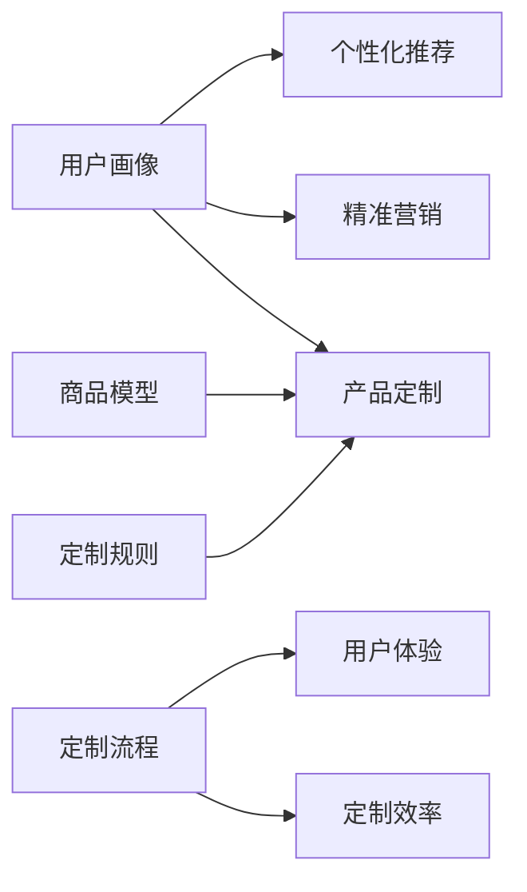

## 1. 背景介绍

### 1.1 电商平台的演进与用户需求变化

近年来，随着互联网技术的飞速发展以及人们消费水平的不断提高，电子商务平台经历了从传统电商到移动电商，再到社交电商、内容电商的快速迭代升级。在这个过程中，用户的消费需求也发生了深刻变化，从最初的追求低价、便捷，逐渐转变为追求个性化、品质化和体验化的消费。

### 1.2 个性化定制电商的兴起与发展

为了满足用户日益增长的个性化需求，个性化定制电商应运而生。个性化定制电商是指允许消费者根据自身需求定制商品或服务的电商模式。这种模式打破了传统电商的标准化产品模式，将用户置于产品设计的中心，赋予用户更大的自主权和选择权，从而实现商品与用户需求的精准匹配。

### 1.3 个性化定制电商的优势与挑战

个性化定制电商的优势在于：

* **满足用户个性化需求:**  用户可以根据自身需求定制产品，获得独一无二的购物体验。
* **提升产品价值:**  个性化定制产品具有更高的附加值和溢价空间。
* **增强用户粘性:**  个性化定制服务可以增强用户粘性，提高用户忠诚度。
* **促进品牌差异化:**  个性化定制可以帮助品牌打造差异化竞争优势。

然而，个性化定制电商也面临着一些挑战：

* **生产成本高:**  个性化定制产品的生产成本通常较高，需要投入更多的研发、设计和生产资源。
* **交付周期长:**  个性化定制产品的交付周期通常较长，需要等待产品设计、生产和物流等环节的完成。
* **库存管理难度大:**  个性化定制产品的库存管理难度较大，需要精确预测用户需求并做好库存规划。
* **技术实现复杂:**  个性化定制电商平台的搭建需要复杂的技术支持，包括产品设计工具、订单管理系统、生产制造系统等。

## 2. 核心概念与联系

### 2.1 用户画像

用户画像是指通过收集和分析用户的基本信息、行为数据、消费偏好等数据，构建一个标签化的用户模型。用户画像可以帮助电商平台了解用户的特征、需求和偏好，为个性化推荐、精准营销和产品定制提供数据支持。

### 2.2 商品模型

商品模型是指对商品属性、特征、规格参数等进行结构化描述的数据模型。商品模型可以帮助电商平台对商品进行分类、检索和推荐，并为个性化定制提供基础数据。

### 2.3 定制规则

定制规则是指定义用户如何定制产品的规则，例如用户可以选择产品的颜色、尺寸、材质、图案等。定制规则可以帮助电商平台规范用户的定制行为，并确保定制产品的可生产性。

### 2.4 定制流程

定制流程是指用户从选择产品到完成定制的整个流程，包括产品选择、参数配置、预览确认、下单支付、生产制造、物流配送等环节。定制流程的优化可以提升用户体验，提高定制效率。

### 2.5 概念联系图



## 3. 核心算法原理具体操作步骤

### 3.1 用户画像构建

#### 3.1.1 数据收集

* 用户基本信息：姓名、性别、年龄、地域等。
* 用户行为数据：浏览历史、搜索记录、收藏夹、购物车等。
* 用户消费偏好：购买记录、评价数据、问答数据等。

#### 3.1.2 数据清洗

* 数据去重：去除重复数据。
* 数据补全：补充缺失数据。
* 数据转换：将数据转换为统一格式。

#### 3.1.3 特征提取

* 用户属性特征：年龄、性别、地域等。
* 用户行为特征：浏览时长、点击次数、购买频率等。
* 用户兴趣特征：偏好的商品类别、品牌、价格区间等。

#### 3.1.4 用户画像生成

* 基于规则的画像生成：根据预先设定的规则对用户进行分类和打标签。
* 基于统计的画像生成：利用统计方法对用户进行聚类和分析。
* 基于机器学习的画像生成：利用机器学习算法对用户进行建模和预测。

### 3.2 个性化推荐

#### 3.2.1 协同过滤算法

协同过滤算法是一种基于用户历史行为数据的推荐算法，其基本思想是：

* 找到与目标用户兴趣相似的用户群体。
* 将该用户群体喜欢的商品推荐给目标用户。

#### 3.2.2 内容推荐算法

内容推荐算法是一种基于商品内容特征的推荐算法，其基本思想是：

* 分析目标用户喜欢的商品内容特征。
* 找到具有相似内容特征的商品推荐给目标用户。

#### 3.2.3 混合推荐算法

混合推荐算法是将多种推荐算法结合起来，以提高推荐效果。例如，可以将协同过滤算法和内容推荐算法结合起来，利用用户行为数据和商品内容特征进行推荐。

### 3.3 产品定制

#### 3.3.1 定制规则设计

* 定义可定制的参数：例如颜色、尺寸、材质、图案等。
* 设置参数的取值范围：例如颜色的可选范围、尺寸的可选范围等。
* 定义参数之间的依赖关系：例如选择某种颜色后，某些尺寸可能不可选。

#### 3.3.2 定制工具开发

* 提供用户友好的定制界面：例如可视化的参数选择界面、3D预览功能等。
* 实现参数校验和逻辑判断：例如防止用户选择冲突的参数、超出范围的参数等。
* 生成定制产品的预览图和参数清单：方便用户确认定制内容。

#### 3.3.3 生产制造对接

* 将定制参数传递给生产制造系统：例如通过API接口或数据文件的方式。
* 监控生产进度和质量：确保定制产品按时交付并符合质量标准。

## 4. 数学模型和公式详细讲解举例说明

### 4.1 协同过滤算法

#### 4.1.1 用户相似度计算

常用的用户相似度计算方法有：

* 余弦相似度：
  $$
  sim(u, v) = \frac{\sum_{i \in I} r_{ui} r_{vi}}{\sqrt{\sum_{i \in I} r_{ui}^2} \sqrt{\sum_{i \in I} r_{vi}^2}}
  $$
  其中，$u$ 和 $v$ 表示两个用户，$I$ 表示用户共同评分的商品集合，$r_{ui}$ 表示用户 $u$ 对商品 $i$ 的评分。

* 皮尔逊相关系数：
  $$
  sim(u, v) = \frac{\sum_{i \in I} (r_{ui} - \bar{r_u})(r_{vi} - \bar{r_v})}{\sqrt{\sum_{i \in I} (r_{ui} - \bar{r_u})^2} \sqrt{\sum_{i \in I} (r_{vi} - \bar{r_v})^2}}
  $$
  其中，$\bar{r_u}$ 表示用户 $u$ 的平均评分。

#### 4.1.2 商品推荐

计算出用户相似度后，可以根据相似用户的评分预测目标用户对未评分商品的评分：

$$
\hat{r_{uj}} = \bar{r_u} + \frac{\sum_{v \in N(u)} sim(u, v) (r_{vj} - \bar{r_v})}{\sum_{v \in N(u)} |sim(u, v)|}
$$

其中，$N(u)$ 表示与用户 $u$ 最相似的 $k$ 个用户集合。

### 4.2 举例说明

假设有两个用户 $A$ 和 $B$，他们对三件商品的评分如下：

| 用户 | 商品1 | 商品2 | 商品3 |
|---|---|---|---|
| A | 5 | 4 | 3 |
| B | 4 | 5 | 2 |

利用余弦相似度计算用户 $A$ 和 $B$ 的相似度：

$$
sim(A, B) = \frac{5 \times 4 + 4 \times 5 + 3 \times 2}{\sqrt{5^2 + 4^2 + 3^2} \sqrt{4^2 + 5^2 + 2^2}} = 0.94
$$

假设用户 $A$ 尚未对商品4进行评分，而用户 $B$ 对商品4的评分为4，则可以利用协同过滤算法预测用户 $A$ 对商品4的评分：

$$
\hat{r_{A4}} = \frac{5 + 4 + 3}{3} + \frac{0.94 \times (4 - \frac{4 + 5 + 2}{3})}{0.94} = 4.63
$$

## 5. 项目实践：代码实例和详细解释说明

### 5.1 用户画像构建

```python
import pandas as pd
from sklearn.preprocessing import StandardScaler
from sklearn.cluster import KMeans

# 加载用户数据
user_data = pd.read_csv('user_data.csv')

# 数据清洗
user_data.dropna(inplace=True)
user_data['age'] = user_data['age'].astype(int)

# 特征提取
features = ['age', 'gender', 'purchase_amount', 'click_count']
X = user_data[features]

# 数据标准化
scaler = StandardScaler()
X_scaled = scaler.fit_transform(X)

# KMeans聚类
kmeans = KMeans(n_clusters=5, random_state=0)
kmeans.fit(X_scaled)

# 将聚类结果添加到用户数据中
user_data['cluster'] = kmeans.labels_

# 保存用户画像数据
user_data.to_csv('user_profile.csv', index=False)
```

### 5.2 个性化推荐

```python
import pandas as pd
from sklearn.metrics.pairwise import cosine_similarity

# 加载用户画像数据
user_profile = pd.read_csv('user_profile.csv')

# 加载商品数据
item_data = pd.read_csv('item_data.csv')

# 计算用户相似度矩阵
user_similarity = cosine_similarity(user_profile.drop(['user_id'], axis=1))

def recommend_items(user_id, top_k=10):
  """
  根据用户ID推荐商品。

  Args:
    user_id: 用户ID。
    top_k: 推荐商品数量。

  Returns:
    推荐商品列表。
  """
  # 获取目标用户的索引
  user_index = user_profile[user_profile['user_id'] == user_id].index[0]

  # 获取与目标用户最相似的k个用户
  similar_users = np.argsort(user_similarity[user_index])[::-1][1:top_k+1]

  # 获取相似用户购买过的商品
  recommended_items = set()
  for user in similar_users:
    recommended_items.update(item_data[item_data['user_id'] == user_profile.iloc[user]['user_id']]['item_id'].values)

  return list(recommended_items)[:top_k]
```

## 6. 实际应用场景

### 6.1 服装定制

用户可以根据自身需求定制服装，例如选择服装的款式、颜色、尺寸、面料、图案等。

### 6.2 鞋履定制

用户可以根据自身需求定制鞋履，例如选择鞋子的款式、颜色、尺寸、材质、图案等。

### 6.3 家具定制

用户可以根据自身需求定制家具，例如选择家具的款式、颜色、尺寸、材质、功能等。

### 6.4 珠宝定制

用户可以根据自身需求定制珠宝，例如选择珠宝的款式、材质、宝石、刻字等。

## 7. 工具和资源推荐

### 7.1 用户画像构建工具

* Google Analytics
* Adobe Analytics
* Amazon Personalize

### 7.2 个性化推荐工具

* Amazon Personalize
* Google Recommendations AI
* Recombee

### 7.3 产品定制工具

* 3D Product Configurator
* Shopify Product Customizer
* Zakeke

## 8. 总结：未来发展趋势与挑战

### 8.1 发展趋势

* **人工智能技术将进一步推动个性化定制电商的发展:**  人工智能技术可以帮助电商平台更好地理解用户需求，提供更精准的个性化推荐和定制服务。
* **虚拟现实和增强现实技术将提升用户体验:**  虚拟现实和增强现实技术可以为用户提供更直观、更沉浸式的产品定制体验。
* **供应链协同将提高定制效率:**  电商平台需要与生产制造商、物流企业等合作伙伴紧密协作，以提高定制产品的生产效率和交付速度。

### 8.2 挑战

* **数据安全和隐私保护:**  个性化定制电商平台需要收集和处理大量的用户数据，如何保障数据安全和用户隐私是一个重要挑战。
* **成本控制和效率提升:**  个性化定制产品的生产成本较高，如何控制成本并提高生产效率是一个重要挑战。
* **用户体验和服务质量:**  个性化定制电商平台需要提供优质的用户体验和服务，以满足用户不断提高的期望。

## 9. 附录：常见问题与解答

### 9.1 如何提高用户参与度？

* 提供用户友好的定制界面和工具。
* 提供丰富的定制选项和个性化推荐。
* 开展互动活动，鼓励用户参与定制设计。

### 9.2 如何控制定制成本？

* 优化产品设计，减少定制参数的数量。
* 采用模块化设计，提高生产效率。
* 与生产制造商建立长期合作关系，降低采购成本。

### 9.3 如何保障数据安全和隐私？

* 采用数据加密技术，保护用户数据安全。
* 制定严格的数据使用规范，防止数据泄露。
* 遵守相关法律法规，保护用户隐私。 
