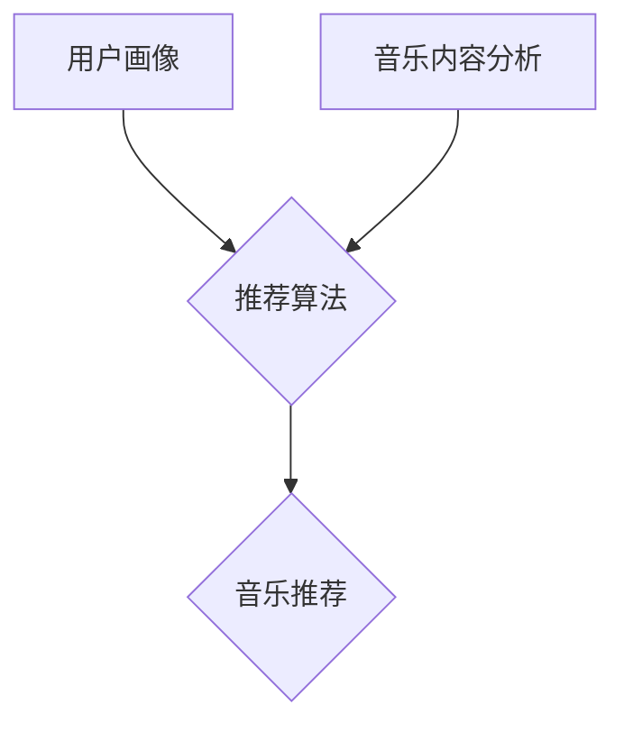

## 1. 背景介绍

### 1.1 音乐推荐系统的意义

随着数字音乐平台的兴起和用户对个性化体验需求的不断增长，音乐推荐系统已经成为音乐平台不可或缺的一部分。一个优秀的音乐推荐系统能够帮助用户发现新的音乐，提升用户体验，增强用户粘性，并为音乐平台带来更大的商业价值。

### 1.2 实时推荐的必要性

传统的音乐推荐系统通常基于用户的历史行为数据进行推荐，存在着推荐结果滞后、无法捕捉用户实时兴趣变化等问题。实时推荐系统则能够根据用户当前的行为和上下文信息，实时调整推荐结果，提供更加精准、及时的音乐推荐服务。

### 1.3 个性化推荐的挑战

个性化实时音乐推荐系统的设计与实现面临着诸多挑战，包括：

* **数据稀疏性:** 用户的音乐偏好数据通常较为稀疏，难以准确捕捉用户的兴趣。
* **冷启动问题:** 新用户或新歌曲缺乏历史数据，难以进行有效的推荐。
* **实时性要求:** 实时推荐需要在毫秒级别内完成推荐计算，对系统性能提出了很高的要求。
* **可解释性:** 推荐结果需要具有可解释性，让用户理解推荐的原因，提升用户对系统的信任度。

## 2. 核心概念与联系

### 2.1 用户画像

用户画像是指根据用户的历史行为数据、社交关系、个人资料等信息，构建的用户特征模型。用户画像是进行个性化推荐的基础，能够帮助系统了解用户的音乐偏好、兴趣爱好等信息。

#### 2.1.1 显式用户画像

显式用户画像是指通过用户主动提供的信息构建的用户特征，例如用户的年龄、性别、地域、音乐偏好等。

#### 2.1.2 隐式用户画像

隐式用户画像是指通过分析用户的行为数据推断出的用户特征，例如用户的音乐播放历史、收藏列表、搜索记录等。

### 2.2 音乐内容分析

音乐内容分析是指对音乐的音频、歌词、元数据等信息进行分析，提取音乐的特征，例如音乐的流派、情绪、节奏、乐器等。音乐内容分析能够帮助系统理解音乐的内涵，为音乐推荐提供更丰富的特征信息。

#### 2.2.1 音频特征提取

音频特征提取是指利用信号处理技术从音乐的音频信号中提取特征，例如MFCCs、频谱质心、节奏等。

#### 2.2.2 歌词语义分析

歌词语义分析是指利用自然语言处理技术分析歌词的语义，提取歌词的情感、主题等信息。

### 2.3 推荐算法

推荐算法是音乐推荐系统的核心，负责根据用户画像和音乐内容分析的结果，生成个性化的音乐推荐列表。常用的音乐推荐算法包括：

#### 2.3.1 协同过滤算法

协同过滤算法是一种基于用户行为数据进行推荐的算法，通过找到与目标用户兴趣相似的其他用户，推荐这些用户喜欢的音乐。

#### 2.3.2 内容过滤算法

内容过滤算法是一种基于音乐内容特征进行推荐的算法，通过找到与用户喜欢的音乐内容相似的其他音乐，推荐给用户。

#### 2.3.3 混合推荐算法

混合推荐算法是指结合多种推荐算法的优势，进行更加精准的音乐推荐。

### 2.4 核心概念联系

用户画像、音乐内容分析和推荐算法是构成个性化实时音乐推荐系统的三个核心概念，它们之间相互联系，共同作用，最终实现精准的音乐推荐。



## 3. 核心算法原理具体操作步骤

### 3.1 协同过滤算法

#### 3.1.1 基于用户的协同过滤算法

1. 计算用户之间的相似度，例如皮尔逊相关系数、余弦相似度等。
2. 找到与目标用户兴趣最相似的 K 个用户。
3. 统计这 K 个用户喜欢的音乐，并根据相似度进行加权排序。
4. 将排序靠前的音乐推荐给目标用户。

#### 3.1.2 基于物品的协同过滤算法

1. 计算音乐之间的相似度，例如余弦相似度等。
2. 找到与目标用户喜欢的音乐最相似的 K 首音乐。
3. 将这 K 首音乐推荐给目标用户。

### 3.2 内容过滤算法

1. 提取音乐的内容特征，例如流派、情绪、节奏、乐器等。
2. 计算音乐之间的内容相似度，例如余弦相似度等。
3. 找到与用户喜欢的音乐内容最相似的 K 首音乐。
4. 将这 K 首音乐推荐给目标用户。

### 3.3 混合推荐算法

混合推荐算法可以采用多种方式，例如：

* **加权混合:** 将不同推荐算法的结果进行加权平均，得到最终的推荐结果。
* **切换混合:** 根据不同的场景或用户状态，选择不同的推荐算法进行推荐。
* **级联混合:** 将不同的推荐算法按顺序进行组合，例如先使用协同过滤算法生成候选集，再使用内容过滤算法进行筛选。

## 4. 数学模型和公式详细讲解举例说明

### 4.1 余弦相似度

余弦相似度是一种常用的计算两个向量之间相似度的指标，其计算公式如下：

$$
cos(\theta) = \frac{\mathbf{a} \cdot \mathbf{b}}{\|\mathbf{a}\| \|\mathbf{b}\|}
$$

其中，$\mathbf{a}$ 和 $\mathbf{b}$ 分别表示两个向量，$\cdot$ 表示向量点积，$\|\mathbf{a}\|$ 和 $\|\mathbf{b}\|$ 分别表示两个向量的模长。

**举例说明：**

假设有两个用户 A 和 B，他们的音乐播放历史如下：

| 用户 | 音乐 | 播放次数 |
|---|---|---|
| A | 音乐 1 | 3 |
| A | 音乐 2 | 2 |
| A | 音乐 3 | 1 |
| B | 音乐 1 | 2 |
| B | 音乐 2 | 1 |
| B | 音乐 4 | 2 |

则用户 A 和 B 的音乐播放向量分别为：

$$
\mathbf{a} = (3, 2, 1, 0)
$$

$$
\mathbf{b} = (2, 1, 0, 2)
$$

用户 A 和 B 之间的余弦相似度为：

$$
cos(\theta) = \frac{(3, 2, 1, 0) \cdot (2, 1, 0, 2)}{\|(3, 2, 1, 0)\| \|(2, 1, 0, 2)\|} = \frac{8}{\sqrt{14} \sqrt{9}} \approx 0.71
$$

### 4.2 皮尔逊相关系数

皮尔逊相关系数是一种常用的计算两个变量之间线性关系强度的指标，其计算公式如下：

$$
r = \frac{\sum_{i=1}^{n}(x_i - \bar{x})(y_i - \bar{y})}{\sqrt{\sum_{i=1}^{n}(x_i - \bar{x})^2} \sqrt{\sum_{i=1}^{n}(y_i - \bar{y})^2}}
$$

其中，$x_i$ 和 $y_i$ 分别表示两个变量的第 $i$ 个观测值，$\bar{x}$ 和 $\bar{y}$ 分别表示两个变量的均值。

**举例说明：**

假设有两个用户 A 和 B，他们的音乐评分数据如下：

| 用户 | 音乐 | 评分 |
|---|---|---|
| A | 音乐 1 | 4 |
| A | 音乐 2 | 3 |
| A | 音乐 3 | 2 |
| B | 音乐 1 | 3 |
| B | 音乐 2 | 2 |
| B | 音乐 4 | 4 |

则用户 A 和 B 的音乐评分向量分别为：

$$
\mathbf{a} = (4, 3, 2, 0)
$$

$$
\mathbf{b} = (3, 2, 0, 4)
$$

用户 A 和 B 之间的皮尔逊相关系数为：

$$
r = \frac{(4-3)(3-2) + (3-3)(2-2) + (2-3)(0-2) + (0-3)(4-2)}{\sqrt{(4-3)^2 + (3-3)^2 + (2-3)^2 + (0-3)^2} \sqrt{(3-2)^2 + (2-2)^2 + (0-2)^2 + (4-2)^2}} \approx 0.45
$$

## 5. 项目实践：代码实例和详细解释说明

### 5.1 数据准备

#### 5.1.1 音乐数据集

可以使用公开的音乐数据集，例如 Million Song Dataset、Last.fm dataset 等。

#### 5.1.2 用户行为数据

可以通过模拟生成用户行为数据，或者收集真实的用户行为数据。

### 5.2 代码实例

```python
import pandas as pd
from sklearn.metrics.pairwise import cosine_similarity

# 加载音乐数据集
music_data = pd.read_csv('music_data.csv')

# 加载用户行为数据
user_data = pd.read_csv('user_data.csv')

# 构建用户-音乐评分矩阵
user_music_matrix = user_data.pivot_table(index='user_id', columns='music_id', values='rating').fillna(0)

# 计算音乐之间的余弦相似度
music_similarity = cosine_similarity(user_music_matrix.T)

# 定义推荐函数
def recommend_music(user_id, k=10):
    """
    根据用户的历史行为数据，推荐 K 首音乐。

    Args:
        user_id: 用户 ID。
        k: 推荐音乐的数量。

    Returns:
        推荐的音乐列表。
    """
    # 获取用户的音乐评分向量
    user_ratings = user_music_matrix.loc[user_id]

    # 计算用户评分向量与所有音乐的相似度
    similarity_scores = music_similarity.dot(user_ratings)

    # 排序并选择相似度最高的 K 首音乐
    recommended_music_ids = similarity_scores.argsort()[-k:][::-1]

    # 返回推荐的音乐列表
    return music_data.iloc[recommended_music_ids]

# 测试推荐函数
user_id = 1
recommended_music = recommend_music(user_id)
print(recommended_music)
```

### 5.3 代码解释

* `cosine_similarity` 函数用于计算音乐之间的余弦相似度。
* `recommend_music` 函数根据用户的历史行为数据，推荐 K 首音乐。
* 首先，获取用户的音乐评分向量。
* 然后，计算用户评分向量与所有音乐的相似度。
* 最后，排序并选择相似度最高的 K 首音乐。

## 6. 实际应用场景

个性化实时音乐推荐系统可以应用于各种音乐平台，例如：

* **在线音乐流媒体平台:** Spotify、Apple Music、QQ 音乐等。
* **音乐社交平台:** SoundCloud、豆瓣 FM 等。
* **短视频平台:** TikTok、快手等。

## 7. 工具和资源推荐

### 7.1 Python 库

* **pandas:** 用于数据处理和分析。
* **scikit-learn:** 用于机器学习算法实现。
* **librosa:** 用于音频特征提取。
* **nltk:** 用于自然语言处理。

### 7.2 数据集

* **Million Song Dataset:** 包含一百万首歌曲的元数据和音频特征。
* **Last.fm dataset:** 包含用户对音乐的评分和标签数据。

## 8. 总结：未来发展趋势与挑战

### 8.1 未来发展趋势

* **深度学习:** 将深度学习技术应用于音乐推荐系统，可以提升推荐的精度和效率。
* **强化学习:** 利用强化学习技术，可以实现更加智能的音乐推荐，例如根据用户的实时反馈动态调整推荐结果。
* **多模态推荐:** 结合音乐的音频、歌词、视频等多模态信息进行推荐，可以提供更加全面和个性化的推荐体验。

### 8.2 挑战

* **数据隐私:** 在收集和使用用户数据时，需要保护用户的隐私。
* **算法公平性:** 需要确保推荐算法的公平性，避免歧视某些用户或音乐。
* **可解释性:** 需要提高推荐结果的可解释性，让用户理解推荐的原因。

## 9. 附录：常见问题与解答

### 9.1 如何解决数据稀疏性问题？

可以使用矩阵分解、隐语义模型等技术对用户-音乐评分矩阵进行填充，缓解数据稀疏性问题。

### 9.2 如何解决冷启动问题？

可以使用基于内容的推荐算法，根据音乐的内容特征进行推荐，或者利用用户的社交关系、地理位置等信息进行推荐。

### 9.3 如何提高推荐结果的实时性？

可以使用流式计算框架，例如 Apache Kafka、Apache Flink 等，实时处理用户行为数据，并更新推荐结果。