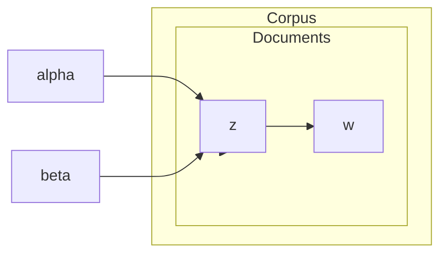

# 主题模型原理与代码实战案例讲解

## 1. 背景介绍

### 1.1 什么是主题模型

主题模型(Topic Model)是一种无监督机器学习技术,用于从大规模文本语料库中自动发现隐藏的主题信息。它可以通过统计文本中的词频分布,将文档聚类成若干个"主题"(Topic),每个主题由若干个与之相关的关键词表征。主题模型广泛应用于文本挖掘、信息检索、自然语言处理等领域。

### 1.2 主题模型的应用场景

- 文本聚类: 根据主题对海量文本进行无监督聚类分析
- 主题发现: 发现语料库中潜在的抽象"主题"
- 文档浏览: 主题模型可以为每个文档自动生成主题摘要
- 信息检索: 通过主题模型改善搜索引擎的查询理解和文档排序
- 推荐系统: 根据用户的主题兴趣进行个性化推荐

## 2. 核心概念与联系  

### 2.1 词袋模型(Bag of Words)

主题模型建立在词袋模型的基础之上。词袋模型将一个文档视为一个"袋子",其中装着文档中出现的所有单词,完全忽略了单词的位置和顺序信息。

形式化地,假设有一个语料库 $\mathcal{C}$ 包含 $M$ 个文档 $\{d_1, d_2, ..., d_M\}$,词汇表 $\mathcal{V}$ 包含 $V$ 个不同的词 $\{w_1, w_2, ..., w_V\}$。词袋模型将每个文档 $d_i$ 表示为一个 $V$ 维向量:

$$\boldsymbol{d}_i = (n_{i1}, n_{i2}, ..., n_{iV})$$

其中 $n_{ij}$ 表示词 $w_j$ 在文档 $d_i$ 中出现的次数。

### 2.2 生成式主题模型

生成式主题模型假设每个文档由一组隐藏的主题构成,每个主题又由一组与之相关的词语表征。具体来说,生成一个文档的过程可以概括为:

1. 确定文档的主题分布
2. 从主题分布中采样一个主题
3. 从该主题对应的词分布中采样一个词语
4. 重复步骤2-3直到生成完整文档

这是一个简化的生成过程,实际模型会更加复杂,包括引入超参数等。

### 2.3 常见主题模型

常见的主题模型有:

- 概率潜在语义分析(PLSA)
- 隐含狄利克雷分布(LDA)
- 相关主题模型(CTM)
- 层次主题模型(hLDA)

其中,LDA 是当前最广为人知和使用的主题模型。

## 3. 核心算法原理具体操作步骤

### 3.1 LDA模型

LDA(Latent Dirichlet Allocation)是一种无监督的生成式概率主题模型,由David Blei等人于2003年提出。LDA模型的基本思想是:

- 每个文档是由一系列主题混合而成的
- 每个主题又是由一组特征词混合而成的

LDA模型通过词分布和主题分布两个多项分布来生成文档中的每个词语。

#### 3.1.1 LDA模型生成过程

LDA模型的生成过程可以形式化描述如下:

1. 对每个文档 $d$:
   - 从狄利克雷分布 $\alpha$ 中采样一个主题分布 $\theta_d$
2. 对每个主题 $t$:
   - 从狄利克雷分布 $\beta$ 中采样一个词分布 $\phi_t$  
3. 对文档 $d$ 中的每个词位置 $n$:
   - 从文档 $d$ 的主题分布 $\theta_d$ 中采样一个主题 $z_{dn}$
   - 从主题 $z_{dn}$ 对应的词分布 $\phi_{z_{dn}}$ 中采样一个词 $w_{dn}$

其中:

- $\alpha$ 和 $\beta$ 是狄利克雷先验分布的超参数
- $\theta_d$ 是文档 $d$ 的主题分布,表示文档 $d$ 中每个主题的概率
- $\phi_t$ 是主题 $t$ 的词分布,表示主题 $t$ 中每个词的概率
- $z_{dn}$ 是词 $w_{dn}$ 的主题编号
- $w_{dn}$ 是文档 $d$ 中第 $n$ 个词语

生成过程可以用如下的板状图(Plate Notation)表示:

其中:
- 矩形节点表示重复采样的对象
- 阴影圆圈表示超参数
- 无阴影圆圈表示需要推断的隐含变量

#### 3.1.2 LDA模型推断

已知文档集合 $\mathcal{D}=\{w_{dn}\}$ 和词汇表 $\mathcal{V}$,LDA模型的推断目标是估计出:

- 每个文档的主题分布 $\theta_d$
- 每个主题的词分布 $\phi_t$

这是一个难以直接解决的后验估计问题,通常采用近似推断算法进行求解,常见的有:

- 变分贝叶斯(VB)近似
- 吉布斯采样(Gibbs Sampling)
- 期望最大化(EM)算法

其中,吉布斯采样是最为常用和有效的推断方法。

#### 3.1.3 吉布斯采样推断

吉布斯采样是一种基于马尔可夫链蒙特卡罗(MCMC)方法的算法,用于从复杂分布中采样。对于LDA模型,吉布斯采样的基本思路是:

1. 初始化每个词语的主题编号 $z_{dn}$
2. 对每个词语 $w_{dn}$:
   - 计算 $p(z_{dn}=t|\boldsymbol{z}_{-dn}, \boldsymbol{w}, \alpha, \beta)$,即当前词语 $w_{dn}$ 属于主题 $t$ 的条件概率
   - 从条件概率分布中采样一个新的主题编号 $z_{dn}^{new}$
   - 用 $z_{dn}^{new}$ 替换当前主题编号 $z_{dn}$
3. 重复步骤2直到收敛

其中 $\boldsymbol{z}_{-dn}$ 表示除去 $z_{dn}$ 之外的所有主题编号。

采样收敛后,可以根据采样结果估计每个文档的主题分布 $\theta_d$ 和每个主题的词分布 $\phi_t$。

### 3.2 LDA模型的改进与扩展

虽然LDA模型简单高效,但也存在一些缺陷和局限性,因此研究人员提出了许多改进和扩展模型,例如:

- 相关主题模型(CTM): 利用主题之间的相关性
- 层次主题模型(hLDA): 构建主题的层次结构
- 作者-主题模型(ATM): 结合作者信息
- 时间主题模型: 考虑时间动态因素
- 短文本主题模型: 适用于长度较短的文本
- 多模态主题模型: 结合文本、图像等不同模态数据

## 4. 数学模型和公式详细讲解举例说明  

### 4.1 LDA模型的概率表示

LDA模型的联合分布可以表示为:

$$
P(\boldsymbol{\theta}, \boldsymbol{z}, \boldsymbol{w} | \alpha, \beta) = \prod_{d=1}^M P(\theta_d | \alpha) \Big( \prod_{n=1}^{N_d} P(z_{dn} | \theta_d) P(w_{dn} | z_{dn}, \beta) \Big)
$$

其中:

- $M$ 是语料库中文档的总数
- $N_d$ 是文档 $d$ 中词语的总数
- $\alpha$ 和 $\beta$ 分别是主题-文档和词-主题的狄利克雷先验
- $\theta_d$ 是文档 $d$ 的主题分布
- $z_{dn}$ 是文档 $d$ 中第 $n$ 个词语的主题编号
- $w_{dn}$ 是文档 $d$ 中第 $n$ 个词语

根据模型假设:

- $P(\theta_d|\alpha) = \text{Dirichlet}(\theta_d|\alpha)$,即 $\theta_d$ 服从狄利克雷分布
- $P(z_{dn}|\theta_d) = \theta_{d,z_{dn}}$,即 $z_{dn}$ 由 $\theta_d$ 的多项分布生成
- $P(w_{dn}|z_{dn},\beta) = \phi_{z_{dn},w_{dn}}$,即 $w_{dn}$ 由主题 $z_{dn}$ 对应的 $\phi_{z_{dn}}$ 的多项分布生成

### 4.2 LDA模型参数估计

对于给定的语料库 $\mathcal{D} = \{\boldsymbol{w}_d\}_{d=1}^M$,LDA模型的目标是估计文档-主题分布 $\boldsymbol{\theta}$ 和主题-词分布 $\boldsymbol{\phi}$ 的参数。由于直接计算后验分布 $P(\boldsymbol{\theta}, \boldsymbol{\phi} | \mathcal{D}, \alpha, \beta)$ 非常困难,通常采用变分推断或吉布斯采样等近似方法。

#### 4.2.1 变分推断

变分推断将后验分布 $P(\boldsymbol{\theta}, \boldsymbol{\phi} | \mathcal{D}, \alpha, \beta)$ 近似为一个更简单的变分分布 $q(\boldsymbol{\theta}, \boldsymbol{\phi} | \gamma, \lambda)$,目标是最小化KL散度:

$$
\begin{aligned}
\mathcal{L}(q) &= \text{KL}(q(\boldsymbol{\theta}, \boldsymbol{\phi} | \gamma, \lambda) \,\|\, P(\boldsymbol{\theta}, \boldsymbol{\phi} | \mathcal{D}, \alpha, \beta)) \\
            &= \mathbb{E}_{q}\Big[\log\frac{q(\boldsymbol{\theta}, \boldsymbol{\phi} | \gamma, \lambda)}{P(\boldsymbol{\theta}, \boldsymbol{\phi}, \mathcal{D} | \alpha, \beta)}\Big] + \text{const}
\end{aligned}
$$

通过迭代优化 $\gamma$ 和 $\lambda$,可以得到变分分布 $q(\boldsymbol{\theta}, \boldsymbol{\phi} | \gamma^*, \lambda^*)$ 近似真实的后验分布。

#### 4.2.2 吉布斯采样

吉布斯采样通过构造马尔可夫链,从目标分布中进行采样。对于LDA模型,吉布斯采样的基本步骤是:

1. 初始化主题分配 $\boldsymbol{z}$
2. 对每个词语 $w_{dn}$:
   - 计算 $P(z_{dn} = t | \boldsymbol{z}_{-dn}, \boldsymbol{w}, \alpha, \beta)$
   - 从该分布中采样新的主题编号 $z_{dn}^{new}$
   - 用 $z_{dn}^{new}$ 替换 $z_{dn}$
3. 重复步骤2直到收敛

其中 $P(z_{dn} = t | \boldsymbol{z}_{-dn}, \boldsymbol{w}, \alpha, \beta)$ 可以通过积分消去 $\boldsymbol{\theta}$ 和 $\boldsymbol{\phi}$ 计算得到。

经过大量采样迭代后,可以根据采样结果估计出 $\boldsymbol{\theta}$ 和 $\boldsymbol{\phi}$ 的参数值。

### 4.3 主题模型评价指标

评价主题模型质量的常用指标包括:

- 困惑度(Perplexity): 衡量模型对语料库的概率预测能力,值越小越好
- 一致性(Coherence): 衡量同一个主题中的词语之间的相关程度,值越大越好
- 可解释性(Interpretability): 评估主题的语义意义是否清晰可解释

此外还可以通过人工评估、外部任务评测等方式评估主题模型的质量。

## 4. 项目实践: 代码实例和详细解释说明

以下是使用 Python 的 Gensim 库实现 LDA 模型