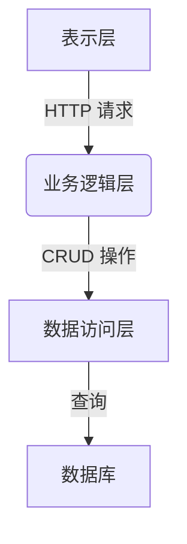

# 书店管理系统详细设计与具体代码实现

## 1. 背景介绍

### 1.1 项目概述

书店管理系统是一种用于管理书店日常运营的综合性软件应用程序。它旨在简化和自动化书店的各种业务流程,包括库存管理、订单处理、销售跟踪、客户关系管理等。随着数字时代的到来,书店面临着来自在线零售商的激烈竞争,因此需要一个高效的管理系统来提高运营效率,优化业务流程,从而保持竞争力。

### 1.2 系统需求

书店管理系统需要满足以下主要需求:

1. 库存管理:准确跟踪书籍库存水平,自动生成补货订单。
2. 订单处理:接收和处理来自各种渠道(线下、线上)的订单。
3. 销售跟踪:实时监控销售数据,生成报告。
4. 客户关系管理:维护客户信息,分析客户购买行为。
5. 财务管理:管理收支、发票等财务记录。
6. 报告和分析:生成各种报告,支持数据分析和可视化。

## 2. 核心概念与联系

### 2.1 系统架构

书店管理系统通常采用三层架构,包括表示层(用户界面)、业务逻辑层和数据访问层。



### 2.2 核心模块

1. **库存管理模块**:跟踪书籍库存,管理订购和补货流程。
2. **订单管理模块**:处理来自线下和线上渠道的订单。
3. **销售模块**:记录销售交易,生成销售报告。
4. **客户管理模块**:维护客户信息,分析客户行为。
5. **财务模块**:管理收支、发票等财务记录。
6. **报告和分析模块**:生成各种报告,支持数据分析和可视化。

### 2.3 关键技术

1. **面向对象编程(OOP)**:系统使用面向对象的方法进行设计和实现。
2. **数据库技术**:使用关系数据库(如MySQL)存储和管理系统数据。
3. **Web技术**:采用Web架构,使用HTML/CSS/JavaScript构建用户界面。
4. **安全性**:实现用户认证、授权和数据加密等安全措施。

## 3. 核心算法原理具体操作步骤  

### 3.1 库存管理算法

#### 3.1.1 库存补货算法

库存补货算法用于确定何时以及订购多少数量的书籍,以维持适当的库存水平。该算法考虑了多个因素,包括当前库存量、预期销售量、补货周期等。

算法步骤如下:

1. 设定每种书籍的最小库存量阈值 $min\_stock$ 和最大库存量阈值 $max\_stock$。
2. 定期检查每种书籍的当前库存量 $current\_stock$。
3. 如果 $current\_stock < min\_stock$,则需要补货。
4. 计算补货量 $order\_qty$:
   $$order\_qty = max\_stock - current\_stock$$
5. 向供应商下订单,订购数量为 $order\_qty$。
6. 更新库存记录。

该算法可确保库存量保持在合理范围内,避免过度库存或库存短缺。

#### 3.1.2 ABC分类算法

ABC分类算法用于根据书籍的重要性和贡献对其进行分类,从而优化库存管理。

算法步骤如下:

1. 计算每种书籍的年销售额。
2. 按年销售额从高到低排序。
3. 将前20%的书籍划分为A类,中间30%为B类,剩余50%为C类。
4. 对不同类别采取不同的库存策略:
   - A类:更高的库存量和更频繁的补货
   - B类:适度的库存量和补货频率
   - C类:较低的库存量和补货频率

通过ABC分类,可以集中资源管理重要的A类书籍,提高库存管理效率。

### 3.2 订单处理算法

#### 3.2.1 订单分配算法

订单分配算法用于将新订单分配给合适的书店员工进行处理。

算法步骤如下:

1. 维护一个员工队列 $employee\_queue$,按照员工的空闲时间排序。
2. 当新订单 $order$ 到达时:
   a. 从 $employee\_queue$ 中取出最前面的员工 $employee$。
   b. 将 $order$ 分配给 $employee$。
   c. 将 $employee$ 放回 $employee\_queue$ 的末尾。
3. 如果 $employee\_queue$ 为空,则将 $order$ 加入待处理队列。

该算法可以实现订单的公平分配,避免某些员工长期空闲或过度繁忙。

#### 3.2.2 订单优先级算法

订单优先级算法用于确定订单的处理优先级,以确保重要订单能够优先得到处理。

算法步骤如下:

1. 为每个订单 $order$ 计算优先级分数 $priority\_score$:
   $$priority\_score = \alpha * order\_value + \beta * customer\_importance + \gamma * time\_factor$$
   其中:
   - $order\_value$ 是订单金额
   - $customer\_importance$ 是客户重要性评分(如VIP等级)
   - $time\_factor$ 是订单等待时间的函数(等待时间越长,优先级越高)
   - $\alpha$、$\beta$、$\gamma$ 是可调整的权重系数
2. 按 $priority\_score$ 从高到低对待处理订单队列进行排序。
3. 员工始终从队列头部取出最高优先级的订单进行处理。

该算法可以确保高价值订单、重要客户订单以及长期等待的订单能够优先得到处理。

## 4. 数学模型和公式详细讲解举例说明

### 4.1 经济订货量(EOQ)模型

经济订货量(Economic Order Quantity, EOQ)模型是一种用于确定最佳订货量的数学模型,目标是最小化总成本(订购成本和库存持有成本)。

#### 4.1.1 模型假设

1. 需求量已知且恒定。
2. 缺货不允许发生。
3. 订购成本和库存持有成本已知且固定。
4. 订购量和交货时间固定。

#### 4.1.2 模型公式

设:
- $D$ 为年需求量
- $S$ 为每次订购的固定成本
- $H$ 为每单位产品的年库存持有成本
- $Q$ 为订购量

则:
- 年订购成本 $OC = \frac{D}{Q} \times S$
- 年库存持有成本 $HC = \frac{Q}{2} \times H$
- 总成本 $TC = OC + HC = \frac{D}{Q} \times S + \frac{Q}{2} \times H$

为了找到最小化总成本的订购量 $Q^*$,我们对 $TC$ 关于 $Q$ 求导并令其等于0:

$$\frac{dTC}{dQ} = -\frac{D}{Q^2} \times S + \frac{1}{2} \times H = 0$$
$$\Rightarrow Q^* = \sqrt{\frac{2DS}{H}}$$

这就是经济订货量(EOQ)公式。

#### 4.1.3 示例

假设一家书店每年需求量为10,000本书,每次订购的固定成本为100元,每本书的年库存持有成本为2元。求经济订货量。

解:
- $D = 10,000$
- $S = 100$
- $H = 2$

代入EOQ公式:

$$Q^* = \sqrt{\frac{2 \times 10,000 \times 100}{2}} = 1,000 (\text{本})$$

因此,书店的最佳订货量为1,000本。

EOQ模型可以帮助书店确定最佳订货量,从而最小化总成本。但是,该模型有一些限制,如需求量恒定的假设可能不太实际。在实际应用中,需要根据具体情况对模型进行调整和改进。

### 4.2 新产品引入模型

书店经常需要决定是否引入新的书籍。新产品引入模型可以帮助评估引入新书籍的利润潜力,从而做出明智决策。

#### 4.2.1 模型假设

1. 新书籍的需求量可以估计。
2. 新书籍的售价、成本和营销费用已知。
3. 考虑了新书籍的生命周期。

#### 4.2.2 模型公式

设:
- $R(t)$ 为第 $t$ 期的预期收入
- $C(t)$ 为第 $t$ 期的预期成本
- $M(t)$ 为第 $t$ 期的预期营销费用
- $r$ 为折现率
- $T$ 为新书籍的生命周期(期数)

则新书籍的净现值 $NPV$ 可表示为:

$$NPV = \sum_{t=1}^{T} \frac{R(t) - C(t) - M(t)}{(1+r)^t}$$

如果 $NPV > 0$,则引入新书籍是有利可图的。

#### 4.2.3 示例

假设一本新书籍的预期销售量在第一年为5,000本,第二年为3,000本,第三年为2,000本。售价为50元/本,成本为20元/本,第一年的营销费用为10,000元,后两年为5,000元。折现率为10%,求该新书籍的净现值。

解:
- $R(1) = 5,000 \times 50 = 250,000$
- $C(1) = 5,000 \times 20 = 100,000$
- $M(1) = 10,000$
- $R(2) = 3,000 \times 50 = 150,000$
- $C(2) = 3,000 \times 20 = 60,000$
- $M(2) = 5,000$
- $R(3) = 2,000 \times 50 = 100,000$
- $C(3) = 2,000 \times 20 = 40,000$
- $M(3) = 5,000$
- $r = 0.1$
- $T = 3$

代入NPV公式:

$$NPV = \frac{250,000 - 100,000 - 10,000}{1.1^1} + \frac{150,000 - 60,000 - 5,000}{1.1^2} + \frac{100,000 - 40,000 - 5,000}{1.1^3}$$
$$= 122,727 + 61,818 + 36,363 = 220,908$$

由于 $NPV > 0$,因此引入该新书籍是有利可图的。

新产品引入模型可以帮助书店评估新书籍的潜在利润,从而做出合理的决策。但是,模型依赖于对未来需求量、成本和营销费用的准确估计,因此在实际应用中需要谨慎。

## 5. 项目实践:代码实例和详细解释说明

在本节中,我们将介绍书店管理系统的实际代码实现,并详细解释每个模块的功能和实现细节。

### 5.1 系统架构

我们采用了三层架构,即表示层、业务逻辑层和数据访问层。表示层负责处理用户界面和交互,业务逻辑层包含系统的核心功能,而数据访问层负责与数据库进行交互。


### 5.2 技术栈

我们使用以下技术栈进行系统开发:

- **前端**: React.js、Redux、Material-UI
- **后端**: Node.js、Express.js
- **数据库**: MySQL
- **ORM**: Sequelize

### 5.3 核心模块实现

#### 5.3.1 库存管理模块

库存管理模块负责管理书籍库存,包括库存查询、补货订购等功能。

**BookInventory.js**

```javascript
import { Book, InventoryRecord } from '../models';

// 获取某本书的库存量
async function getBookInventory(bookId) {
  const book = await Book.findByPk(bookId);
  if (!book) {
    throw new Error('Book not found');
  }
  return book.inventory;
}

// 更新某本书的库存量
async function updateBookInventory(bookId, newInventory) {
  const book = await Book.findByPk(bookId);
  if (!book) {
    throw new Error('Book not found');
  }
  book.inventory = newInventory;
  await book.save();
  await InventoryRecord.create({
    bookId