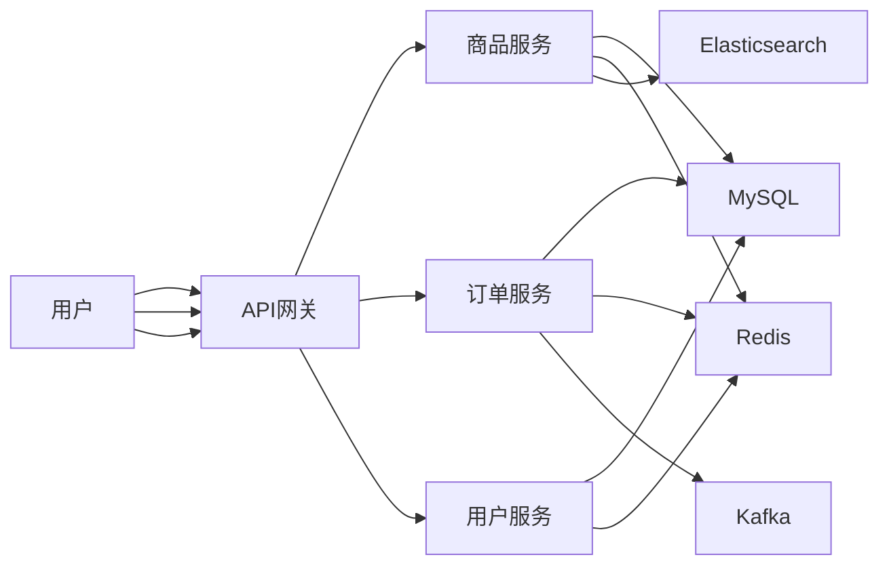

## 1. 背景介绍

### 1.1 二手交易市场的兴起

随着社会经济的发展和消费观念的转变，二手交易市场近年来蓬勃发展。越来越多的人选择购买二手商品，以更低的价格获得高质量的商品。同时，也有越来越多的人将闲置物品出售，实现资源的循环利用。

### 1.2 二手交易平台的现状

目前，市场上存在着各种类型的二手交易平台，例如：

* **综合性电商平台:** 淘宝、京东等电商平台也开设了二手交易专区。
* **垂直类二手交易平台:** 闲鱼、转转等专注于二手商品交易的平台。
* **社交平台:** 微信朋友圈、微博等社交平台也成为二手交易的重要渠道。

### 1.3 二手交易系统的设计目标

为了更好地满足用户需求，提升二手交易体验，一个优秀的二手交易系统需要具备以下特点：

* **高效的商品发布和搜索:** 用户可以方便快捷地发布和搜索商品信息。
* **安全的交易流程:** 保障买卖双方的交易安全和资金安全。
* **完善的信用体系:** 建立完善的信用评价体系，促进诚信交易。
* **便捷的物流服务:** 提供便捷的物流服务，降低交易成本。

## 2. 核心概念与联系

### 2.1 用户

* **买家:** 购买二手商品的用户。
* **卖家:** 出售二手商品的用户。

### 2.2 商品

* **商品信息:** 包括商品名称、描述、图片、价格、新旧程度等。
* **商品分类:** 将商品按照类别进行分类，方便用户浏览和搜索。

### 2.3 交易

* **订单:** 买家下单购买商品后生成的交易记录。
* **支付:** 买家通过平台支付货款。
* **物流:** 商品的运输和配送。
* **评价:** 买卖双方在交易完成后可以互相评价。

### 2.4 信用

* **信用评分:** 根据用户的交易记录和评价信息，为用户计算信用评分。
* **信用等级:** 根据信用评分将用户划分为不同的信用等级。

## 3. 核心算法原理具体操作步骤

### 3.1 商品推荐算法

* **基于内容的推荐:** 根据用户的浏览历史和收藏记录，推荐相似商品。
* **协同过滤推荐:** 根据其他用户的购买行为，推荐用户可能感兴趣的商品。

### 3.2 搜索算法

* **关键词匹配:** 根据用户输入的关键词，匹配商品信息中的相关内容。
* **语义分析:** 对用户输入的关键词进行语义分析，理解用户的搜索意图，提高搜索结果的准确性。

### 3.3 信用评分算法

* **交易行为:** 考虑用户的交易次数、交易金额、交易成功率等因素。
* **评价信息:** 考虑用户收到的评价数量和评价内容。

## 4. 数学模型和公式详细讲解举例说明

### 4.1 商品相似度计算

$$
\text{similarity}(i, j) = \frac{\sum_{k=1}^{n} w_k \cdot s_{ik} \cdot s_{jk}}{\sqrt{\sum_{k=1}^{n} w_k \cdot s_{ik}^2} \cdot \sqrt{\sum_{k=1}^{n} w_k \cdot s_{jk}^2}}
$$

其中：

* $i$ 和 $j$ 表示两个商品。
* $n$ 表示商品的特征数量。
* $w_k$ 表示第 $k$ 个特征的权重。
* $s_{ik}$ 表示商品 $i$ 在第 $k$ 个特征上的得分。

### 4.2 信用评分计算

$$
\text{credit score} = \alpha \cdot \text{transaction score} + \beta \cdot \text{evaluation score}
$$

其中：

* $\alpha$ 和 $\beta$ 是权重系数。
* $\text{transaction score}$ 是交易行为得分。
* $\text{evaluation score}$ 是评价信息得分。

## 5. 项目实践：代码实例和详细解释说明

### 5.1 技术选型

* **后端:** Spring Boot
* **数据库:** MySQL
* **缓存:** Redis
* **搜索引擎:** Elasticsearch
* **消息队列:** Kafka

### 5.2 系统架构



### 5.3 代码示例

**商品搜索接口:**

```java
@GetMapping("/search")
public List<Product> searchProducts(@RequestParam String keyword) {
    // 使用 Elasticsearch 搜索商品
    SearchRequest searchRequest = new SearchRequest("products");
    SearchSourceBuilder searchSourceBuilder = new SearchSourceBuilder();
    searchSourceBuilder.query(QueryBuilders.matchQuery("name", keyword));
    searchRequest.source(searchSourceBuilder);
    SearchResponse searchResponse = elasticsearchClient.search(searchRequest, RequestOptions.DEFAULT);
    // 解析搜索结果
    List<Product> products = new ArrayList<>();
    for (SearchHit hit : searchResponse.getHits().getHits()) {
        Product product = objectMapper.readValue(hit.getSourceAsString(), Product.class);
        products.add(product);
    }
    return products;
}
```

## 6. 实际应用场景

### 6.1 个人闲置物品交易

用户可以将闲置的衣服、书籍、电子产品等物品发布到平台上进行交易。

### 6.2 企业库存商品处理

企业可以将积压的库存商品发布到平台上进行销售，降低库存成本。

### 6.3 二手车交易

用户可以通过平台买卖二手车，方便快捷。

## 7. 总结：未来发展趋势与挑战

### 7.1 未来发展趋势

* **移动化:** 移动互联网的普及，二手交易平台将更加注重移动端的用户体验。
* **社交化:** 二手交易平台将更加注重社交属性，例如用户之间的互动、社区建设等。
* **智能化:** 人工智能技术将更加深入地应用于二手交易平台，例如商品推荐、信用评估等。

### 7.2 面临的挑战

* **假冒伪劣商品:** 如何有效地识别和打击假冒伪劣商品，保障用户权益。
* **交易安全:** 如何保障用户的资金安全和交易安全，防止欺诈行为。
* **信用体系建设:** 如何建立完善的信用体系，促进诚信交易。

## 8. 附录：常见问题与解答

### 8.1 如何发布商品？

用户注册登录后，点击“发布商品”按钮，填写商品信息并上传图片，即可发布商品。

### 8.2 如何搜索商品？

在平台首页的搜索框中输入关键词，即可搜索相关商品。

### 8.3 如何支付货款？

用户可以选择支付宝、微信支付等方式支付货款。

### 8.4 如何申请退款？

如果用户对购买的商品不满意，可以向卖家申请退款。如果卖家同意退款，平台将把货款退还给用户。
