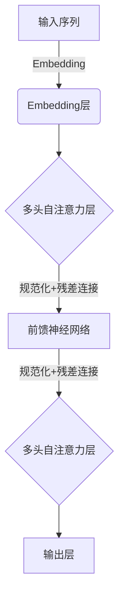

# 从AI伦理视角看ChatGPT的10大争议问题

## 1. 背景介绍

### 1.1 ChatGPT的崛起

ChatGPT是一种基于GPT-3.5架构的大型语言模型,由OpenAI公司于2022年11月推出。它能够进行自然语言对话、回答问题、写作、编程等多种任务。ChatGPT在推出后迅速引起了热潮,吸引了数百万用户体验。其出色的性能和多功能性,令人印象深刻。

### 1.2 AI伦理的重要性

随着人工智能系统的不断发展和广泛应用,AI伦理问题日益受到重视。AI系统可能带来一些潜在风险和挑战,如:

- 隐私和数据安全问题
- 算法偏差和不公平对待
- 人工智能系统缺乏透明度和可解释性 
- 人工智能对就业市场的影响
- 人工智能武器的滥用等

这些问题凸显了在开发和部署AI系统时,必须考虑伦理因素,以确保AI的负责任和可信使用。

### 1.3 本文框架

本文将从AI伦理的角度,探讨围绕ChatGPT存在的10大争议问题,包括:

- 知识产权和版权问题
- 信息安全和隐私风险
- 信息污染和虚假信息传播 
- 就业影响和自动化问题
- 人机交互的社会影响
- 缺乏透明度和可解释性
- 算法公平性和偏见问题
- 对教育系统的影响 
- 滥用和不当使用风险
- 长期的人工智能风险

对于每个问题,本文将阐述其背景、影响、现有的缓解措施,并提出可能的解决方案和建议。

## 2. 核心概念与联系  

### 2.1 人工智能伦理学

人工智能伦理学(AI Ethics)是一门新兴的跨学科领域,探讨了人工智能系统的设计、开发和使用过程中所涉及的道德原则和价值观问题。它关注确保人工智能系统的可信赖性、公平性、透明度和问责制。

人工智能伦理学包括以下几个核心概念:

1. **可信赖性(Trustworthiness)**: 人工智能系统应该是值得信赖的,在其设计和运行中遵守道德和法律规范。

2. **人类价值(Human Values)**: 人工智能系统应当体现人类的价值观和伦理标准,例如尊重人权、公平正义、隐私和自主权等。 

3. **透明度(Transparency)**: 人工智能系统应当具有透明度,其决策过程和结果应当可解释和可审计。

4. **问责制(Accountability)**: 对于人工智能系统造成的后果,应当有明确的责任归属和问责机制。

5. **算法公平性(Algorithmic Fairness)**: 人工智能算法应当公平对待不同群体,避免歧视和偏见。

6. **隐私保护(Privacy Protection)**: 人工智能系统应当尊重个人隐私,合理使用和保护个人数据。

### 2.2 ChatGPT与人工智能伦理

作为一种先进的大型语言模型,ChatGPT在提供强大功能的同时,也带来了一系列人工智能伦理挑战。它所面临的争议问题,反映了人工智能伦理学中的诸多核心概念和原则。

例如,ChatGPT可能会泄露隐私信息或生成有害内容,这与"可信赖性"和"人类价值"相悖。它缺乏透明度和解释能力,违背了"透明度"原则。ChatGPT训练数据和算法潜在的偏见,可能导致不公平对待,这违背了"算法公平性"。

通过分析ChatGPT面临的主要争议,我们可以深入探讨人工智能伦理学在实践中的应用,并为人工智能系统的负责任设计和使用提供指导。

## 3. 核心算法原理与操作步骤

### 3.1 ChatGPT的技术架构

ChatGPT是基于GPT (Generative Pre-trained Transformer) 语言模型架构的一种大型对话式AI系统。它的核心由以下几个主要组件构成:

1. **预训练语言模型**: ChatGPT使用自回归(Autoregressive)语言模型,在大量文本数据上进行预训练,学习文本的统计规律。

2. **注意力机制(Attention Mechanism)**: GPT模型采用Transformer的自注意力机制,能够有效捕获输入序列中不同位置之间的关系。

3. **上下文记忆(Context Memory)**: ChatGPT引入了上下文记忆机制,能够在对话过程中记住和利用之前的上下文信息。

4. **强化学习(Reinforcement Learning)**: OpenAI使用人工标注的对话数据,通过强化学习的方式来进一步优化ChatGPT的对话能力。

5. **安全性和审核(Security and Review)**: OpenAI采取了一系列安全措施,如内容过滤、输出审核等,以防止ChatGPT生成有害内容。

#### 3.1.1 GPT模型架构

GPT模型的核心是基于Transformer架构的自回归语言模型,如下图所示:

上图展示了GPT模型的基本架构,包括以下主要步骤:

1. 将输入序列通过Embedding层转换为向量表示
2. 经过多个编码器层,每层包含:
    - 多头自注意力子层: 捕获输入序列中不同位置之间的关系
    - 前馈神经网络子层: 对序列进行非线性变换
    - 残差连接和层归一化: 提高训练稳定性
3. 最后通过输出层生成预测结果

GPT模型通过自注意力机制和深层次的网络结构,能够很好地捕获输入序列的长程依赖关系,从而在语言建模任务上取得出色表现。

### 3.2 ChatGPT的训练过程

ChatGPT模型的训练过程包括两个主要阶段:

#### 3.2.1 预训练(Pre-training)

首先,GPT模型在大量文本数据(如网页、书籍等)上进行无监督预训练,目标是最大化语言模型的概率:

$$\mathcal{L}_1 = \sum_{t=1}^T \log P(x_t | x_{<t}; \theta)$$

其中$x_t$表示第t个token, $x_{<t}$表示前缀序列, $\theta$是模型参数。预训练的目标是最大化给定前缀序列的下一个token的概率。

通过预训练,模型可以学习到语言的一般性知识和规律,构建出强大的语言表示能力。

#### 3.2.2 监督微调(Supervised Fine-tuning)

在预训练的基础上,OpenAI使用人工标注的对话数据集,对ChatGPT进行了进一步的监督微调(Fine-tuning),目标是最小化对话回复与人类标注之间的损失:

$$\mathcal{L}_2 = \sum_{i=1}^N \ell(y_i, \hat{y}_i)$$

其中$y_i$是第i个对话样本的人类回复, $\hat{y}_i$是模型生成的回复, $\ell$是一个损失函数(如交叉熵损失)。

通过监督微调,ChatGPT可以进一步提高对话能力,生成更加自然、合理的回复。

### 3.3 ChatGPT的生成过程

在实际应用中,ChatGPT通过以下步骤生成对话回复:

1. **输入编码**:将用户的输入文本序列转换为向量表示。

2. **上下文记忆**:将当前对话的上下文与之前的对话历史结合,形成完整的上下文表示。

3. **自回归生成**:基于当前输入和上下文,通过自回归的方式生成token序列作为回复。
    - 在每个时间步,模型预测下一个最可能的token:
    $$P(x_t | x_{<t}, c) = \textrm{GPTModel}(x_{<t}, c)$$
    - 其中$c$表示当前的上下文表示。
    - 通过贪婪搜索或顶端采样等策略,生成完整的token序列。

4. **输出过滤**:OpenAI在输出端使用了多种安全过滤策略,如内容审核、不当言论检测等,以防止生成有害内容。

5. **上下文更新**:将当前的输入和生成的回复添加到上下文记忆中,为下一轮对话做好准备。

通过上述流程,ChatGPT可以根据当前输入和上下文,生成自然、连贯的对话回复。

## 4. 数学模型和公式详细讲解

在上一节中,我们介绍了ChatGPT的核心算法原理和操作步骤。现在让我们深入探讨其中涉及的一些数学模型和公式。

### 4.1 自注意力机制(Self-Attention Mechanism)

自注意力是Transformer模型的核心,它使用了一种全新的注意力机制,能够捕捉输入序列中任意两个位置之间的关系。下面我们来看看自注意力机制的数学原理。

给定一个输入序列$X = (x_1, x_2, \dots, x_n)$,我们首先通过线性投影将其映射到查询(Query)、键(Key)和值(Value)空间:

$$
\begin{aligned}
Q &= XW^Q\\
K &= XW^K\\
V &= XW^V
\end{aligned}
$$

其中$W^Q, W^K, W^V$是可学习的权重矩阵。

接下来,我们计算查询$Q$与所有键$K$之间的点积,得到注意力分数矩阵:

$$\textrm{Attention}(Q, K, V) = \textrm{softmax}\left(\frac{QK^T}{\sqrt{d_k}}\right)V$$

其中$d_k$是缩放因子,用于防止点积值过大导致梯度饱和。

注意力分数矩阵表示了输入序列中不同位置之间的关系强度。我们将其与值$V$相乘,得到加权后的值表示,即自注意力的输出:

$$\textrm{MultiHead}(Q, K, V) = \textrm{Concat}(head_1, \dots, head_h)W^O$$

其中$\textrm{head}_i = \textrm{Attention}(QW_i^Q, KW_i^K, VW_i^V)$表示第$i$个注意力头,共有$h$个并行的注意力头。$W^O$是可学习的线性变换矩阵。

通过多头自注意力机制,Transformer能够同时关注输入序列中的不同位置关系,提高了模型的表示能力。

### 4.2 掩码自回归语言模型(Masked Autoregressive Language Model)

ChatGPT采用的是自回归(Autoregressive)语言模型,它的目标是最大化给定前缀序列的下一个token的条件概率:

$$P(x_t | x_{<t}) = \frac{\exp(h_t^\top v_{x_t})}{\sum_{x' \in \mathcal{V}} \exp(h_t^\top v_{x'})}$$

其中$x_t$是第$t$个token, $x_{<t}$是前缀序列, $h_t$是Transformer编码器的隐状态, $v_x$是token $x$的词向量表示, $\mathcal{V}$是词汇表。

在训练过程中,我们最小化语言模型的负对数似然损失:

$$\mathcal{L}_{LM} = -\sum_{t=1}^T \log P(x_t | x_{<t})$$

通过最小化这个损失函数,模型可以学习到生成自然语言序列的能力。

### 4.3 生成式对抗网络(Generative Adversarial Networks)

在优化ChatGPT的对话能力时,OpenAI引入了生成式对抗网络(GAN)的思想。GAN包括一个生成器(Generator)和一个判别器(Discriminator),它们相互对抗地训练:

- 生成器的目标是生成逼真的对话回复,使判别器无法识别
- 判别器的目标是正确区分生成器生成的回复和真实的人类回复

生成器和判别器可以用以下损失函数来表示:

$$
\begin{aligned}
\min_G \max_D \mathbb{E}_{x \sim p_{data}}[\log D(x)] + \mathbb{E}_{