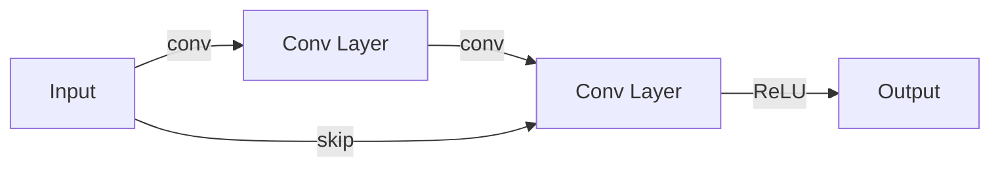

## 1.背景介绍

随着深度学习的广泛应用，深度神经网络的模型规模日益增大。在这个过程中，一个重要的问题就是如何有效地开发和微调这些大规模模型。本文的主角，ResNet(Residual Network，残差网络)模型，就是这样一种大规模神经网络模型。ResNet通过引入了残差结构，成功解决了深度神经网络在训练过程中普遍存在的梯度消失/爆炸问题，使得网络可以被有效地训练。

### 1.1 深度学习的挑战

深度学习的一个主要挑战是“深度”本身。在神经网络中，每一层的输出都是下一层的输入。因此，不同层之间的关联性非常强。当网络的深度增加时，这种关联性会导致反向传播过程中的梯度消失或爆炸，使得网络难以训练。这就是所谓的梯度消失/爆炸问题。

### 1.2 残差网络的诞生

为了解决这个问题，He Kaiming等人在2015年提出了残差网络(ResNet)。ResNet的主要思想是引入残差结构(shortcut或者skip connections)，使得前向传播的信息可以直接跨层传递，从而缓解了梯度消失/爆炸问题。ResNet的出现，使得我们可以训练深度达到上百甚至上千层的神经网络。

## 2.核心概念与联系

### 2.1 残差网络(ResNet)

残差网络的基本结构是残差块(residual block)。每个残差块包含两个或更多的卷积层，以及一个跨层的shortcut连接。这个shortcut连接可以使得前向传播的信息直接跨层传递，从而避免了梯度消失/爆炸问题。

### 2.2 残差块(residual block)

残差块的主要结构如下：

输入首先经过一系列的卷积层（Conv Layer），然后与原始输入（Input）相加，最后通过ReLU激活函数输出。这种结构可以保证前向传播的信息能够直接传递到输出，避免了梯度消失/爆炸问题。

## 3.核心算法原理具体操作步骤

接下来，我们将详细介绍如何实现一个基本的ResNet模型。这个模型包括一个初始的卷积层，然后是一系列的残差块，最后是全连接层。以下是具体的操作步骤：

1. **输入层**：输入图像首先经过一个卷积层和一个最大池化层，用于减小图像的尺寸，同时增加图像的深度。

2. **残差块**：然后是一系列的残差块。每个残差块包括两个卷积层和一个shortcut连接。卷积层的作用是提取图像的特征，shortcut连接的作用是避免梯度消失/爆炸问题。

3. **输出层**：最后是一个全连接层，用于将提取到的特征映射到目标类别上。

## 4.数学模型和公式详细讲解举例说明

在深度学习中，我们通常用数学符号来表示网络的结构和参数。在ResNet中，我们可以用以下的数学公式来表示一个残差块：

假设第$l$层的输入为$x^{[l]}$，那么两个卷积层的输出可以表示为：

$$
z^{[l+1]} = W^{[l+1]} * x^{[l]} + b^{[l+1]}
$$
$$
a^{[l+1]} = g(z^{[l+1]})
$$
$$
z^{[l+2]} = W^{[l+2]} * a^{[l+1]} + b^{[l+2]}
$$

其中，$W^{[l+1]}$和$W^{[l+2]}$是卷积层的权重，$b^{[l+1]}$和$b^{[l+2]}$是卷积层的偏置，$*$表示卷积操作，$g$表示ReLU激活函数。

然后，我们将这个输出与原始输入$x^{[l]}$相加，得到残差块的输出$a^{[l+2]}$：

$$
a^{[l+2]} = g(z^{[l+2]} + x^{[l]})
$$
