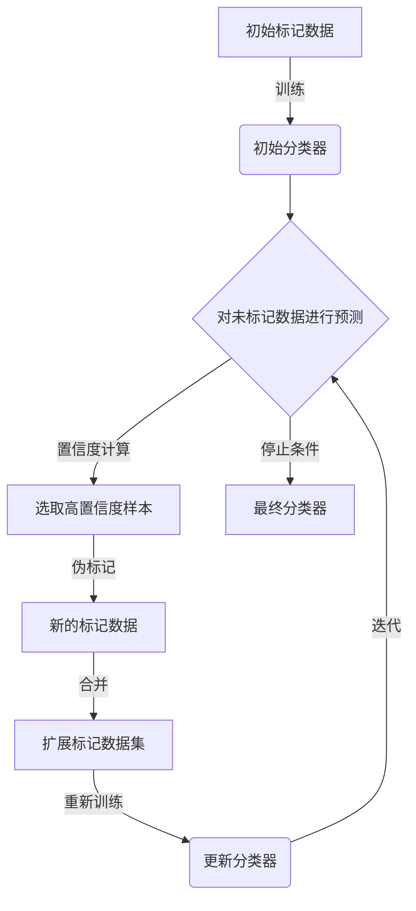

# 代码实战：基于Python的半监督分类案例

## 1. 背景介绍

### 1.1 监督学习与非监督学习

在机器学习领域中,常见的两种学习范式是监督学习(Supervised Learning)和非监督学习(Unsupervised Learning)。监督学习是指利用已标记的训练数据集,学习一个从输入到输出的映射函数。常见的监督学习任务包括分类(Classification)和回归(Regression)。非监督学习则是在没有标记数据的情况下,从数据中发现内在的模式和结构。典型的非监督学习任务有聚类(Clustering)和降维(Dimensionality Reduction)。

然而,在现实世界中,获取大量高质量的标记数据往往是一个巨大的挑战。标记数据的过程通常需要耗费大量的人力和时间成本。这就催生了半监督学习(Semi-Supervised Learning)这一范式的出现。

### 1.2 半监督学习的概念

半监督学习是介于监督学习和非监督学习之间的一种机器学习方法。它利用少量标记数据和大量未标记数据进行训练,旨在提高模型的泛化能力。半监督学习的核心思想是:未标记数据虽然没有明确的标签信息,但它们反映了底层数据分布,可以作为辅助信息来改善模型的性能。

相比于纯监督学习,半监督学习的优势在于:

1. 减少了获取大量标记数据的成本和工作量。
2. 利用未标记数据提供的额外信息,有助于更好地捕捉数据分布,从而提高模型的泛化能力。

半监督学习已经在多个领域取得了成功应用,如图像分类、自然语言处理、推荐系统等。

## 2. 核心概念与联系  

### 2.1 半监督分类的基本思路

半监督分类(Semi-Supervised Classification)是半监督学习在分类任务上的一种实现方式。它的基本思路是:首先利用少量标记数据训练一个初始分类器,然后利用这个初始分类器对大量未标记数据进行伪标记(Pseudo-Labeling),将伪标记数据与原始标记数据合并,重新训练分类器。这个过程可以循环进行多次迭代,直到模型收敛或满足预定的停止条件。

半监督分类的关键在于如何有效利用未标记数据,从而提高分类器的性能。常见的半监督分类算法包括:

1. 自训练(Self-Training)
2. 协同训练(Co-Training) 
3. 图割集半监督(Graph Cuts)
4. 生成模型(Generative Models)

这些算法各有特点,适用于不同的场景和数据类型。下面我们将重点介绍自训练算法在半监督分类中的应用。

### 2.2 自训练算法

自训练算法是半监督分类中最简单、最直观的一种方法。它的基本流程如下:

1. 利用少量标记数据训练一个初始分类器模型
2. 使用该分类器对未标记数据进行预测,获得伪标记
3. 从预测结果中选取置信度最高的一部分样本,将它们与原始标记数据合并
4. 利用扩展后的训练集重新训练分类器
5. 重复上述过程,直到满足停止条件

在每一轮迭代中,自训练算法会从未标记数据中选取预测置信度最高的样本,作为额外的训练数据,从而不断增强分类器的能力。这种方法简单直观,易于实现,但也存在一些潜在的缺陷和挑战,例如:

- 初始模型的质量对最终结果影响很大
- 在每轮迭代中,错误的伪标记会被纳入训练,从而导致模型性能下降
- 需要设计合理的置信度阈值和停止条件

为了缓解这些问题,研究者提出了多种改进的自训练变体算法,如:

- 利用多个不同初始模型进行集成(Ensemble)
- 引入噪声鲁棒性,减小错误标记的影响  
- 设计更加复杂的置信度度量方法

虽然自训练算法简单,但在一些特定场景下,它仍然可以取得非常好的半监督分类效果。下面我们将通过一个基于Python的实战案例,详细展示如何使用自训练算法进行半监督分类。

## 3. 核心算法原理与具体操作步骤

在本节中,我们将介绍自训练算法在半监督分类中的具体实现细节。为了方便理解,我们将使用一个具体的分类案例:基于20种新闻文本数据进行文本分类。

### 3.1 数据准备

我们使用经典的20种新闻数据集(20 Newsgroups Dataset),这是一个常用于文本分类的基准数据集。它包含约20,000篇不同主题的新闻文章,分为20个不同的类别。我们将这20个类别合并为4个更广泛的主题:

- 计算机(Computer): 5个类别
- 汽车(Autos): 3个类别 
- 科学(Science): 4个类别
- 运动(Sports): 8个类别

我们将随机选取20%的数据作为标记训练集,剩余80%作为未标记数据集。

```python
# 加载数据集
categories = ['comp', 'auto', 'sci', 'sport']
newsgroups_train = fetch_20newsgroups(subset='train', categories=categories)
newsgroups_test = fetch_20newsgroups(subset='test', categories=categories)

# 构建标记和未标记数据集 
X_train, y_train = newsgroups_train.data, newsgroups_train.target
X_test, y_test = newsgroups_test.data, newsgroups_test.target

# 划分标记和未标记训练集
random_state = 42
labeled_ratio = 0.2
num_labeled = int(labeled_ratio * len(X_train))

rng = np.random.RandomState(random_state)
random_indices = np.arange(len(X_train))
rng.shuffle(random_indices)

labeled_indices = random_indices[:num_labeled]
unlabeled_indices = random_indices[num_labeled:]

X_labeled = [X_train[i] for i in labeled_indices]
y_labeled = [y_train[i] for i in labeled_indices]

X_unlabeled = [X_train[i] for i in unlabeled_indices]
```

### 3.2 自训练算法实现

我们将使用scikit-learn中的朴素贝叶斯分类器作为基础模型,并实现一个自定义的自训练类SelfTrainingClassifier。

```python
from sklearn.naive_bayes import MultinomialNB
from sklearn.feature_extraction.text import TfidfVectorizer
from sklearn.pipeline import Pipeline

# 文本特征提取和分类器Pipeline
text_clf = Pipeline([
    ('vect', TfidfVectorizer()),
    ('clf', MultinomialNB())
])

class SelfTrainingClassifier:
    def __init__(self, base_clf, max_iter=10, thresh_ratio=0.9):
        self.base_clf = base_clf
        self.max_iter = max_iter
        self.thresh_ratio = thresh_ratio
        self.clf = None
        
    def fit(self, X_labeled, y_labeled, X_unlabeled):
        self.clf = clone(self.base_clf)
        self.clf.fit(X_labeled, y_labeled)
        
        for _ in range(self.max_iter):
            preds = self.clf.predict_proba(X_unlabeled)
            conf_scores = np.max(preds, axis=1)
            thresh = np.quantile(conf_scores, self.thresh_ratio)
            
            new_labeled_indices = np.argwhere(conf_scores >= thresh).ravel()
            new_X_labeled = [X_unlabeled[i] for i in new_labeled_indices]
            new_y_labeled = self.clf.classes_[np.argmax(preds[new_labeled_indices], axis=1)]
            
            X_labeled = np.concatenate((X_labeled, new_X_labeled))
            y_labeled = np.concatenate((y_labeled, new_y_labeled))
            
            self.clf.fit(X_labeled, y_labeled)
            
    def predict(self, X):
        return self.clf.predict(X)
        
    def predict_proba(self, X):
        return self.clf.predict_proba(X)
        
# 训练自训练分类器
self_train_clf = SelfTrainingClassifier(base_clf=text_clf)
self_train_clf.fit(X_labeled, y_labeled, X_unlabeled)
```

在每次迭代中,我们使用当前模型对未标记数据进行预测,并根据预测概率的置信度阈值(thresh_ratio)选取部分高置信度样本作为新的标记数据,与原始标记数据合并后重新训练模型。

### 3.3 算法流程图

下面是自训练算法在半监督分类中的工作流程图:



该流程图清晰地展示了自训练算法的核心步骤:

1. 使用初始标记数据训练一个基础分类器
2. 利用该分类器对未标记数据进行预测,并计算预测置信度
3. 根据置信度阈值选取部分高置信度样本,将其伪标记并合并到原始标记数据集
4. 使用扩展后的标记数据集重新训练分类器
5. 重复上述过程,直到满足预定的停止条件(如最大迭代次数)
6. 输出最终的训练好的分类器模型

## 4. 数学模型和公式详细讲解举例说明

在这一节中,我们将介绍自训练算法中使用的一些关键数学模型和公式,并通过具体的例子进行详细说明。

### 4.1 朴素贝叶斯分类器

在我们的案例中,我们使用了朴素贝叶斯分类器作为基础分类器。朴素贝叶斯分类器是一种基于贝叶斯定理与特征条件独立假设的简单概率分类器。

对于一个给定的样本 $x$,朴素贝叶斯分类器根据贝叶斯定理计算后验概率:

$$P(y|x) = \frac{P(x|y)P(y)}{P(x)}$$

其中:

- $P(y|x)$ 是在给定观测数据 $x$ 的条件下,类别 $y$ 的后验概率或条件概率
- $P(x|y)$ 是在给定类别 $y$ 的条件下,观测数据 $x$ 的条件概率或似然
- $P(y)$ 是类别 $y$ 的先验概率或类别概率
- $P(x)$ 是观测数据 $x$ 的先验概率或证据因子,是一个归一化常量

对于文本分类任务,我们通常使用多项式朴素贝叶斯模型(Multinomial Naive Bayes)。它假设文本中的单词是通过多项式分布生成的,即单词的出现次数服从多项式分布。

假设一个文本样本 $x$ 由 $n$ 个单词 $x_1, x_2, ..., x_n$ 组成,其中 $x_i$ 是词汇表中的一个单词。那么在给定类别 $y$ 的条件下,文本 $x$ 的条件概率可以写作:

$$P(x|y) = \frac{n!}{\prod_{i=1}^{V}x_i!}\prod_{i=1}^{V}P(w_i|y)^{x_i}$$

其中:

- $V$ 是词汇表的大小
- $x_i$ 是单词 $w_i$ 在文本 $x$ 中出现的次数
- $P(w_i|y)$ 是在给定类别 $y$ 的条件下,单词 $w_i$ 出现的概率

通过学习训练数据中每个单词在不同类别下的条件概率分布 $P(w_i|y)$,我们就可以计算出任意一个新文本样本属于每个类别的后验概率,从而进行分类预测。

### 4.2 预测置信度计算

在自训练算法中,我们需要根据模型对未标记数据的预测结果,计算每个样本的预测置信度。置信度的高低将决定该样本是否会被选择作为新的标记数据。

对于朴素贝叶斯分类器,我们可以直接使用模型预测的后验概率作为置信度分数。具体来说,对于一个未标记样本 $x$,我们计算它属于每个类别的后验概率 $P(y|x)$,然后取最大值作为置信度分数:

$$\