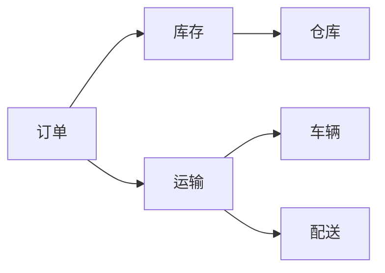

## 1. 背景介绍

### 1.1 物流管理的重要性

在现代商业环境中，物流管理扮演着至关重要的角色。高效的物流系统可以帮助企业降低成本、提高效率、提升客户满意度。随着电子商务的蓬勃发展和全球化的趋势，企业对物流管理系统的需求日益增长。

### 1.2 企业物流管理系统的挑战

企业物流管理系统面临着诸多挑战，例如：

* **复杂性:**  现代物流网络涉及多个环节，包括采购、仓储、运输、配送等，每个环节都需要高效协同才能保证整体效率。
* **实时性:**  物流信息需要实时更新，以便企业能够及时掌握货物状态、运输进度等信息。
* **可视化:**  企业需要清晰了解物流运作的各个环节，以便及时发现问题并进行优化。
* **成本控制:**  物流成本是企业运营的重要支出，如何降低物流成本是企业需要重点关注的问题。

### 1.3 本文目标

本文旨在介绍企业物流管理系统的详细设计与具体代码实现，帮助读者了解如何构建一个高效、可靠的物流管理系统。

## 2. 核心概念与联系

### 2.1 物流管理系统架构

企业物流管理系统通常采用多层架构，包括：

* **展示层:**  负责用户交互，提供用户界面，例如网页、移动应用等。
* **业务逻辑层:**  负责处理业务逻辑，例如订单管理、库存管理、运输管理等。
* **数据访问层:**  负责与数据库交互，进行数据存储和检索。

### 2.2 核心概念

* **订单:**  客户订购商品或服务的请求。
* **库存:**  企业存储的商品或原材料。
* **运输:**  将货物从一个地点运送到另一个地点的过程。
* **配送:**  将货物送达最终客户的过程。
* **仓库:**  用于存储货物的场所。
* **车辆:**  用于运输货物的交通工具。

### 2.3 核心概念之间的联系

* 订单与库存：订单会减少库存。
* 订单与运输：订单需要运输才能送达客户。
* 库存与仓库：库存存储在仓库中。
* 运输与车辆：运输需要使用车辆。
* 运输与配送：运输是配送的一部分。



## 3. 核心算法原理具体操作步骤

### 3.1 路径规划算法

路径规划算法用于确定货物运输的最优路线，以最小化运输成本和时间。常用的路径规划算法包括：

* **Dijkstra算法:**  用于寻找两个节点之间的最短路径。
* **A\*算法:**  一种启发式搜索算法，可以更快地找到最优路径。

#### 3.1.1 Dijkstra算法具体操作步骤

1. 将起始节点的距离设为 0，其他节点的距离设为无穷大。
2. 将起始节点加入到未访问节点集合中。
3. 从未访问节点集合中选择距离最小的节点，并将其标记为已访问。
4. 遍历当前节点的所有邻居节点，如果邻居节点的距离大于当前节点距离加上两节点之间的距离，则更新邻居节点的距离。
5. 重复步骤 3 和 4，直到目标节点被标记为已访问。

#### 3.1.2 A\*算法具体操作步骤

1. 将起始节点加入到开放列表中，并计算其启发式函数值。
2. 从开放列表中选择启发式函数值最小的节点，并将其从开放列表中移除，加入到关闭列表中。
3. 遍历当前节点的所有邻居节点，如果邻居节点不在关闭列表中，则计算其启发式函数值，并将其加入到开放列表中。
4. 重复步骤 2 和 3，直到目标节点被加入到关闭列表中。

### 3.2 库存管理算法

库存管理算法用于优化库存水平，以最小化库存成本和缺货风险。常用的库存管理算法包括：

* **经济订货批量（EOQ）模型:**  用于确定每次订购的最佳数量。
* **物料需求计划（MRP）:**  用于根据生产计划确定物料需求。

#### 3.2.1 EOQ模型具体操作步骤

1. 确定年需求量、订货成本、库存持有成本。
2. 使用 EOQ 公式计算最佳订货批量：

$$EOQ = \sqrt{\frac{2DS}{H}}$$

其中：

* D：年需求量
* S：订货成本
* H：库存持有成本

#### 3.2.2 MRP具体操作步骤

1. 确定生产计划。
2. 根据生产计划确定物料需求。
3. 生成采购订单。
4. 跟踪物料到货情况。

## 4. 数学模型和公式详细讲解举例说明

### 4.1 运输成本模型

运输成本通常与运输距离、货物重量、运输方式等因素相关。一个简单的运输成本模型可以表示为：

$$Cost = D \times W \times R$$

其中：

* D：运输距离
* W：货物重量
* R：每公里每公斤的运输费率

**举例说明:**

假设运输距离为 100 公里，货物重量为 10 公斤，每公里每公斤的运输费率为 0.5 元，则运输成本为：

$$Cost = 100 \times 10 \times 0.5 = 500 元$$

### 4.2 库存成本模型

库存成本包括订货成本、库存持有成本、缺货成本等。一个简单的库存成本模型可以表示为：

$$Cost = \frac{D}{Q} \times S + \frac{Q}{2} \times H + P \times L$$

其中：

* D：年需求量
* Q：每次订货批量
* S：订货成本
* H：库存持有成本
* P：缺货成本
* L：缺货数量

**举例说明:**

假设年需求量为 1000 件，每次订货批量为 100 件，订货成本为 50 元/次，库存持有成本为 1 元/件/年，缺货成本为 10 元/件，缺货数量为 0 件，则库存成本为：

$$Cost = \frac{1000}{100} \times 50 + \frac{100}{2} \times 1 + 10 \times 0 = 550 元$$

## 5. 项目实践：代码实例和详细解释说明

### 5.1 技术选型

* **编程语言:** Python
* **Web框架:** Django
* **数据库:** MySQL
* **路径规划库:** NetworkX
* **地图服务:** Google Maps API

### 5.2 代码实例

```python
# 订单模型
class Order(models.Model):
    customer = models.ForeignKey(Customer, on_delete=models.CASCADE)
    products = models.ManyToManyField(Product, through='OrderItem')
    status = models.CharField(max_length=50, choices=ORDER_STATUS_CHOICES, default='pending')
    created_at = models.DateTimeField(auto_now_add=True)
    updated_at = models.DateTimeField(auto_now=True)

# 库存模型
class Inventory(models.Model):
    product = models.ForeignKey(Product, on_delete=models.CASCADE)
    quantity = models.IntegerField(default=0)
    warehouse = models.ForeignKey(Warehouse, on_delete=models.CASCADE)

# 运输模型
class Shipment(models.Model):
    order = models.ForeignKey(Order, on_delete=models.CASCADE)
    vehicle = models.ForeignKey(Vehicle, on_delete=models.CASCADE)
    status = models.CharField(max_length=50, choices=SHIPMENT_STATUS_CHOICES, default='pending')
    created_at = models.DateTimeField(auto_now_add=True)
    updated_at = models.DateTimeField(auto_now=True)

# 路径规划函数
def plan_route(origin, destination):
    # 使用 NetworkX 构建地图网络
    graph = nx.Graph()
    # 添加节点和边
    # ...
    # 使用 Dijkstra 算法计算最短路径
    path = nx.dijkstra_path(graph, origin, destination)
    return path

# 库存管理函数
def manage_inventory(product, quantity):
    # 获取产品库存
    inventory = Inventory.objects.get(product=product)
    # 更新库存数量
    inventory.quantity += quantity
    inventory.save()
```

### 5.3 代码解释

* 订单模型包含客户、产品、状态、创建时间、更新时间等字段。
* 库存模型包含产品、数量、仓库等字段。
* 运输模型包含订单、车辆、状态、创建时间、更新时间等字段。
* `plan_route()` 函数使用 NetworkX 库构建地图网络，并使用 Dijkstra 算法计算最短路径。
* `manage_inventory()` 函数用于更新产品库存数量。

## 6. 实际应用场景

### 6.1 电商平台

电商平台可以使用物流管理系统来管理订单、库存、运输和配送等环节。系统可以帮助电商平台优化物流流程、降低成本、提高效率。

### 6.2 制造企业

制造企业可以使用物流管理系统来管理原材料采购、生产计划、成品库存和配送等环节。系统可以帮助制造企业提高生产效率、降低库存成本。

### 6.3 物流公司

物流公司可以使用物流管理系统来管理运输网络、车辆调度、货物跟踪等环节。系统可以帮助物流公司提高运输效率、降低成本。

## 7. 工具和资源推荐

### 7.1 路径规划工具

* Google Maps Platform
* Mapbox
* HERE Maps

### 7.2 库存管理工具

* Zoho Inventory
* Fishbowl Inventory
* inFlow Inventory

### 7.3 运输管理工具

* project44
* FourKites
* Transporeon

## 8. 总结：未来发展趋势与挑战

### 8.1 未来发展趋势

* **人工智能:**  人工智能技术可以用于优化路径规划、预测需求、自动化仓库管理等。
* **物联网:**  物联网技术可以用于实时跟踪货物状态、监控车辆位置等。
* **区块链:**  区块链技术可以用于提高物流信息的透明度和安全性。

### 8.2 挑战

* **数据安全:**  物流数据包含敏感信息，需要采取措施确保数据安全。
* **系统集成:**  物流管理系统需要与其他企业系统集成，例如 ERP、CRM 等。
* **成本控制:**  物流管理系统的开发和维护成本较高，需要控制成本。

## 9. 附录：常见问题与解答

### 9.1 如何选择合适的物流管理系统？

选择物流管理系统需要考虑企业规模、业务需求、预算等因素。可以参考行业最佳实践、咨询专家意见。

### 9.2 如何提高物流管理系统的效率？

提高物流管理系统效率可以采取以下措施：

* 优化业务流程
* 使用先进技术
* 培训员工

### 9.3 如何确保物流数据的安全？

确保物流数据安全可以采取以下措施：

* 加密敏感数据
* 访问控制
* 定期备份数据
