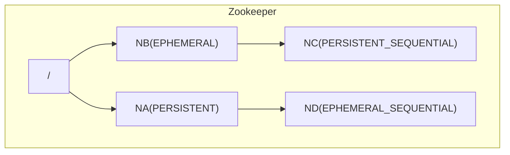
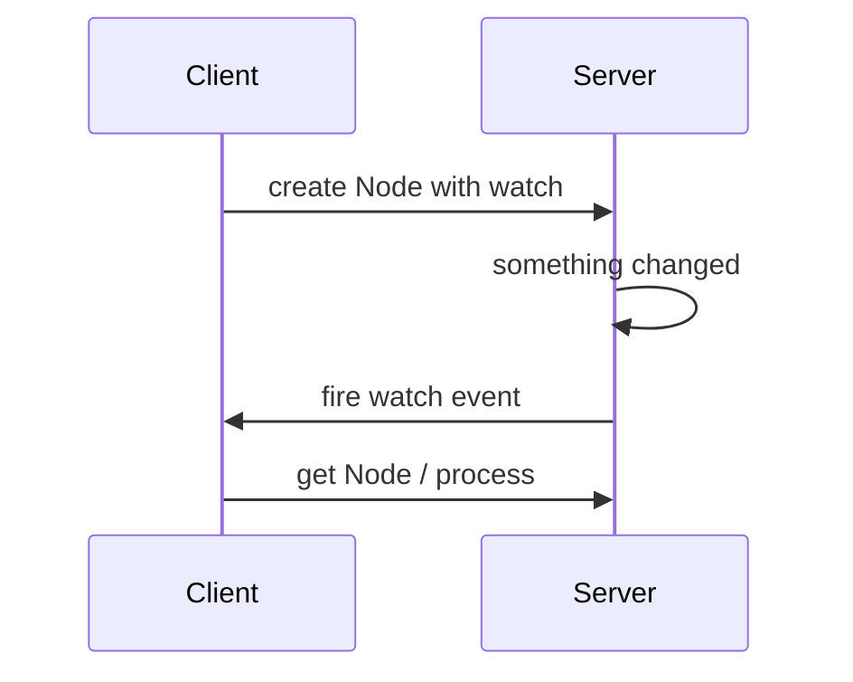
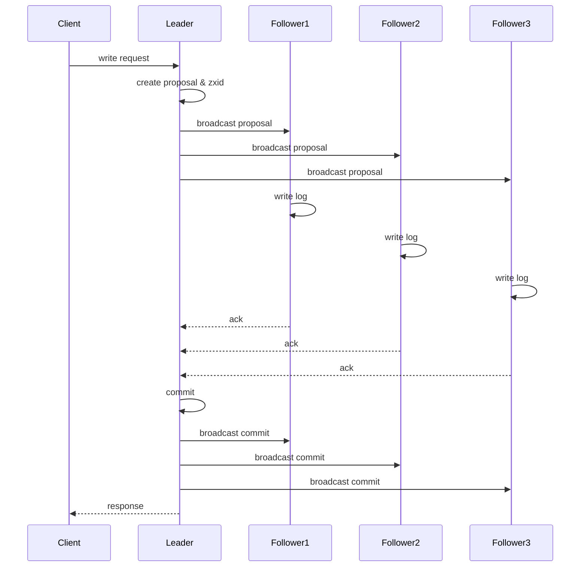

# 使用Zookeeper实现分布式协调服务

作者：禅与计算机程序设计艺术

## 1.背景介绍

在当今互联网时代,分布式系统已经成为主流架构。随着业务规模的不断扩大,单一节点已经无法满足性能、可用性和扩展性的要求。分布式系统的引入有效解决了这些问题,但同时也带来了新的挑战,其中一个重要的问题就是如何在分布式环境中进行协调。

Zookeeper 是 Apache 基金会的一个开源项目,旨在为分布式系统提供高可用、高性能的协调服务。它起源于 Yahoo!的研究项目,经过多年发展后成为了分布式领域事实上的标准解决方案。Zookeeper 的设计目标是将那些复杂且容易出错的分布式一致性服务封装起来,构成一个高效可靠的原语集,并以一系列简单易用的接口提供给用户使用。

### 1.1 分布式系统面临的挑战

分布式系统由一系列独立运行的计算机节点组成,节点之间通过网络进行通信。与单节点系统相比,分布式系统具有更好的性能、可用性、可伸缩性等优势,但同时也面临着一些独特的挑战:

1. 进程协调:在分布式环境中,不同节点上的进程需要进行协调和同步,以确保系统的一致性和正确性。例如主从切换、分布式锁、配置管理等。

2. 故障容错:由于节点数量众多,节点或网络故障在所难免。如何检测并恢复故障,保证系统的高可用性是一大难题。

3. 数据一致性:分布式系统中的数据通常会在不同节点上复制和共享。如何保证各节点数据的一致性,避免脏读脏写等问题也是一大挑战。

4. 伸缩性:分布式系统需要能够灵活地添加或删除节点,以适应不断变化的业务需求。这就要求系统具有良好的伸缩性。

### 1.2 Zookeeper的应运而生

针对上述分布式系统面临的种种挑战,Zookeeper应运而生。它的主要目标是封装良好的分布式协调机制,将复杂的分布式一致性服务抽象为一个高效可靠的基础服务,使得开发人员可以将精力聚焦在核心业务逻辑上。

Zookeeper在设计过程中借鉴了Google Chubby的思想,采用了一些优秀的分布式算法如Paxos、Raft等,并在工程实践中不断完善,最终成长为一个成熟稳定的分布式协调服务框架。目前在Hadoop、HBase、Kafka等众多知名分布式系统中都得到了广泛应用。

## 2.核心概念与联系

为了更好地理解Zookeeper的应用,我们首先需要了解一下Zookeeper的一些核心概念。Zookeeper是一个树型的目录结构,类似于一个分布式的文件系统。

### 2.1 数据模型

Zookeeper的数据模型是一棵树,由一系列节点(Node)组成。节点可以分为4种类型:

1. PERSISTENT持久节点
2. EPHEMERAL临时节点 
3. PERSISTENT_SEQUENTIAL持久顺序节点
4. EPHEMERAL_SEQUENTIAL临时顺序节点

每个节点都可以存储数据,数据大小不超过1MB。节点通过路径引用,路径必须是绝对的,不允许相对路径。节点的路径就像文件系统的目录树一样,以斜杠(/)进行分割。每个节点还有一个ACL访问控制权限,用于控制节点的读写等操作。



### 2.2 节点特性

不同类型的节点具有不同的生命周期特性:

1. 持久节点(PERSISTENT):默认的节点类型,创建后会一直存在,直到主动删除。
2. 临时节点(EPHEMERAL):临时节点的生命周期和客户端Session绑定,一旦客户端Session失效,节点自动清理。临时节点下面不能创建子节点。
3. 持久顺序节点(PERSISTENT_SEQUENTIAL):相当于持久节点,但在创建时会在节点路径末尾自动追加一个单调递增的序号作为后缀。
4. 临时顺序节点(EPHEMERAL_SEQUENTIAL):相当于临时节点,但同样会在末尾追加递增序号。

### 2.3 会话(Session)

所有的客户端在使用Zookeeper之前都需要建立一个Session。Session的创建需要通过一个安全的TCP连接,并完成一个握手过程。为了保持Session的有效性,客户端需要定期向服务器发送心跳。如果服务器长时间收不到客户端的心跳,则认为Session过期,会主动关闭连接。

### 2.4 Watcher机制

Zookeeper允许客户端注册Watcher监听器,用于监听某个节点上的事件,例如节点数据变更、节点删除、子节点状态变更等。当相应事件触发时,服务端会主动通知客户端。Watcher机制为分布式协调提供了有效的解决方案。



### 2.5 API接口

Zookeeper对外提供了一套简单易用的API接口,主要有:

1. create:创建节点
2. delete:删除节点
3. exists:判断节点是否存在
4. getData:获取节点数据
5. setData:设置节点数据
6. getChildren:获取子节点列表
7. sync:同步

通过这些API接口,可以方便地实现分布式锁、Leader选举、配置管理等协调服务。 

## 3.核心算法原理具体操作步骤

Zookeeper的核心是ZAB(Zookeeper Atomic Broadcast)算法,用于保证分布式事务的最终一致性。ZAB借鉴了Paxos算法的思路,是一种典型的分布式一致性算法。

### 3.1 系统模型

Zookeeper使用一种基于主备模型的架构,由一个Leader和多个Follower组成。所有的写操作必须经过Leader,由Leader发起Proposal提交,Follower只能接受Proposal并返回Ack。

### 3.2 消息广播

所有的写操作请求都由Leader广播到所有Follower。具体步骤如下:

1. Leader接收到客户端的写请求
2. Leader生成Proposal,为每个Proposal分配全局唯一的ID(ZXID)
3. Leader将Proposal广播给所有的Follower
4. Follower接收到Proposal后,将其以事务日志的形式写入磁盘
5. Follower写入成功后,返回Ack消息给Leader
6. Leader得到半数以上的Follower的Ack后,即认为Proposal达成一致,可以提交了
7. Leader向所有Follower广播Commit消息,同时将结果返回给客户端



### 3.3 崩溃恢复

为了保证一致性,Leader和Follower都会记录事务日志并持久化到磁盘。当服务器出现崩溃重启时,会从磁盘中恢复数据,确保已经达成一致的Proposal不会丢失。如果Leader崩溃,则Sultan进行选举,从剩下的节点中选出新的Leader。

### 3.4 数据同步

Zookeeper使用一种先进先出(FIFO)的队列来对Proposal进行排序。由于TCP协议的FIFO特性,消息虽然可能延迟,但是不会乱序。Leader和Follower之间采用long polling的通信方式进行数据同步,保证最终一致性。

## 4.数学模型和公式详细讲解举例说明

Zookeeper的核心是ZAB算法,而ZAB算法又是Paxos算法的一种变体。这里我们对Paxos算法的数学模型进行一些说明。

Paxos算法的目标是让若干节点在状态不一致的情况下,通过消息交换最终达到一致的状态。它是第一个被证明完备的分布式一致性算法。

### 4.1 基础定义

首先我们定义以下概念:

- Proposer:提出议案的人
- Acceptor:参与决策的人 
- Proposal:议案,包含编号(Ballot)和内容(Value)两部分
- Ballot:议案的编号,要求唯一、递增,但不一定连续 
- Value:议案的内容,由提议者提供
- Quorum:法定人数,一般大于总人数的一半

### 4.2 两阶段提交

Paxos算法分为两个阶段:

阶段1:

1. Proposer选择一个Ballot编号n,然后向Quorum数量的Acceptor发送Prepare(n)请求
2. Acceptor收到Prepare(n)请求后,如果n大于它已经接受的所有Proposal的编号,就回复Promise(n,last value,last ballot),表示不再接受Ballot小于n的提议。否则忽略该请求。

阶段2:

3. Proposer收到Quorum数量的Promise回复后,计算Value。如果有回复包含Value,则选择Ballot最大的Value,若所有回复都没有Value,则Proposer可以自己选择一个Value。然后Proposer发送Accept(n,value)请求给Acceptor。

4. Acceptor收到Accept(n,value)请求,如果n等于它上一个Promise的值,则接受该Proposal,返回Accepted(n,value)。

当Proposer收到Quorum数量的Acceptor的Accepted消息后,认为该Proposal被选定,则Value达成一致。

### 4.3 数学证明

下面我们用数学公式来证明Paxos算法的正确性。假设有N个Acceptor,Quorum数量为Q(一般大于N/2),则有:

当Value被选定时,至少有Q个Acceptor接受了该Value。即:

$Count(Accepted(n,value))>=Q$

如果有两个Value被选定,分别记为v1和v2,对应的Ballot分别为m和n,且m<n。则根据算法流程,Acceptor必然已经发送过Promise(n,v,m),其中v可能等于v1,也可能为空。而要达到Accept(n,v2),则Proposer必须收到超过半数的Promise(n,*,*),即:

$Count(Promise(n,*,*))>=Q$ 

又因为总的Acceptor个数为N,Quorum Q大于一半,即$Q>N/2$。所以:

$Count(Promise(n,*,*))+Count(Accepted(m,v1))>N$

上式表明,Proposer收到的Promise中,必然至少有一个的last value等于v1。而Paxos算法规定,
Proposer在发出Accept时,如果收到的Promise中有值,必须选择其中Ballot编号最大的作为提议的Value。
因为m<n,所以Proposer提议的必然是v1,而不可能是v2。

所以,两个Value v1和v2不可能同时被选定,因此Paxos算法能够保证一致性。

## 4.项目实践：代码实例和详细解释说明

下面我们用Java代码来演示如何使用Zookeeper实现一个简单的分布式锁。

### 4.1 依赖配置

首先需要引入Zookeeper的Java客户端依赖,以Maven为例:

```xml
<dependency>
    <groupId>org.apache.zookeeper</groupId>
    <artifactId>zookeeper</artifactId>
    <version>3.6.2</version>
</dependency>
```

### 4.2 获取锁

获取锁的基本思路是在Zookeeper中创建一个临时顺序节点,编号最小的获得锁。

```java
public class ZkLock implements Lock {
    
    private String lockPath = "/zklock";
    private String lockName = lockPath + "/lock_"; 
    private String ourLockPath;
    
    private ZooKeeper zooKeeper;
    
    // 连接