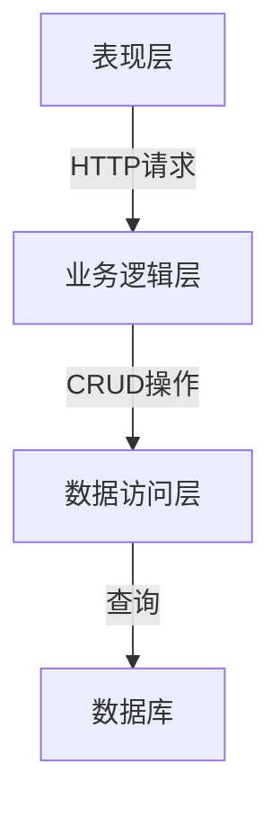

# 公司信息管理系统详细设计与具体代码实现

## 1. 背景介绍

在当今快节奏的商业环境中，高效的信息管理系统对于公司的顺利运营至关重要。随着数据量的不断增加和业务流程的日益复杂化,传统的纸质文件管理方式已经无法满足现代公司的需求。因此,开发一个健壮、可扩展、易于使用的公司信息管理系统(CIMS)成为了当务之急。

CIMS旨在集中管理公司的各种信息资源,包括员工记录、客户数据、财务报表、项目文档等。它可以提高信息的可访问性、安全性和一致性,从而优化业务流程,提高工作效率,并为管理层提供准确的决策支持。

### 1.1 现有系统的局限性

- 数据孤岛:信息分散存储在不同的系统和部门中,导致数据重复和不一致
- 低效的信息共享:缺乏有效的协作机制,信息传递滞后,沟通成本高
- 安全隐患:纸质文件易丢失或被盗,缺乏适当的访问控制措施
- 可维护性差:旧系统架构复杂,扩展和升级困难
- 用户体验欠佳:界面设计陈旧,操作繁琐,不利于用户采纳

### 1.2 CIMS的优势

- 集中式数据存储:所有信息存储在统一的数据库中,消除数据孤岛
- 高效协作:支持多人实时编辑,方便信息共享和团队协作
- 严格的访问控制:基于角色的权限管理,确保数据安全
- 可扩展性强:模块化设计,易于集成新功能和适应业务变化
- 优秀的用户体验:现代化界面,操作简单直观

## 2. 核心概念与联系  

### 2.1 CIMS的核心概念

1. **文档管理**
   - 文档是信息的载体,包括Word文件、Excel表格、PDF文件等
   - 支持在线创建、编辑、存储和版本控制文档

2. **数据管理**
   - 公司数据存储在关系型数据库中,包括员工、客户、财务等信息
   - 提供数据导入、导出、查询和分析功能

3. **流程管理**
   - 将公司的业务流程形式化,如审批流程、报销流程等
   - 支持在线发起、处理和跟踪工作流程

4. **权限管理**
   - 基于角色的访问控制(RBAC),将用户分配到不同的角色组
   - 每个角色组拥有特定的查看、编辑和操作权限

5. **通知机制**
   - 及时通知相关人员新的任务、文档更新或流程变化
   - 支持邮件、短信、应用内推送等通知方式

6. **搜索引擎**
   - 支持全文检索,快速定位所需信息
   - 支持模糊搜索、高级搜索和个性化搜索

7. **数据分析**
   - 提供可视化的报表和图表,展示关键业务指标
   - 支持自定义报表和数据挖掘

### 2.2 CIMS的系统架构

CIMS采用三层架构,包括表现层(前端)、业务逻辑层(后端)和数据访问层。



- **表现层**:提供基于Web的用户界面,负责数据展示和用户交互。
- **业务逻辑层**:处理用户请求,执行业务规则和流程控制,调用数据访问层执行数据操作。
- **数据访问层**:与数据库进行交互,执行增删改查等操作。

### 2.3 CIMS的设计模式

CIMS设计中应用了多种设计模式,以提高代码的可维护性、可扩展性和灵活性。

1. **MVC模式**
   - Model(模型层):封装业务数据和业务规则
   - View(视图层):渲染用户界面
   - Controller(控制器):处理用户请求,调用模型执行业务逻辑,选择合适的视图进行渲染

2. **工厂模式**
   - 通过工厂类创建对象实例,降低了对象之间的耦合度

3. **观察者模式**  
   - 当一个对象的状态发生改变时,会通知所有依赖它的对象

4. **策略模式**
   - 定义了一系列算法,并将每个算法封装起来,使它们可以相互替换

5. **单例模式**
   - 确保某个类只有一个实例,并提供全局访问点

6. **代理模式**
   - 为另一个对象提供代理,以控制对该对象的访问

## 3. 核心算法原理具体操作步骤

### 3.1 文档版本控制算法

文档版本控制是CIMS的一项关键功能,它允许用户跟踪文档的变更历史,查看和恢复到之前的版本。以下是实现该功能的核心算法步骤:

1. 当用户创建或修改一个文档时,CIMS会生成一个新的版本号。
2. CIMS将文档的内容和元数据(如作者、时间戳等)存储在版本库中。
3. 每次保存文档时,CIMS会计算文档内容与上一版本的差异(diff),并将差异数据存储在版本库中。
4. 用户可以查看文档的版本历史记录,选择任意版本进行查看或恢复。
5. 当用户选择恢复某个版本时,CIMS会根据该版本及其之前的所有差异数据,重建文档的完整内容。

这种基于差异的版本控制算法可以节省存储空间,并提高版本恢复的效率。

```python
class DocumentVersionControl:
    def __init__(self, document):
        self.document = document
        self.versions = []
        self.versions.append(document.content)

    def save_version(self, new_content):
        previous_content = self.versions[-1]
        diff = calculate_diff(previous_content, new_content)
        self.versions.append(diff)

    def restore_version(self, version_index):
        restored_content = self.versions[0]
        for i in range(1, version_index + 1):
            restored_content = apply_diff(restored_content, self.versions[i])
        self.document.content = restored_content

    # 辅助函数: 计算两个字符串之间的差异
    def calculate_diff(old_str, new_str):
        ...

    # 辅助函数: 将差异应用到原始字符串
    def apply_diff(original_str, diff):
        ...
```

### 3.2 文档全文搜索算法

为了提高信息检索的效率,CIMS采用了基于倒排索引的全文搜索算法。该算法的核心步骤如下:

1. **构建正排索引**:遍历所有文档,对每个文档中出现的单词建立正排索引,格式为`{文档ID: [单词1, 单词2, ...]}`。
2. **构建倒排索引**:遍历正排索引,对每个单词,记录其出现的文档ID,格式为`{单词: [文档ID1, 文档ID2, ...]}`。
3. **搜索**:当用户输入查询时,将查询解析为单词列表。对于每个单词,查找其对应的文档ID列表,将这些列表取交集,得到最终结果文档列表。
4. **相关性排序**:根据文档中单词出现的频率(TF)、文档长度、查询单词权重(IDF)等因素,计算文档与查询的相关性分数,并按分数排序。

```python
class FullTextSearch:
    def __init__(self, documents):
        self.forward_index = self.build_forward_index(documents)
        self.inverted_index = self.build_inverted_index(self.forward_index)

    def build_forward_index(self, documents):
        forward_index = {}
        for doc_id, doc_text in documents.items():
            words = self.tokenize(doc_text)
            forward_index[doc_id] = words
        return forward_index

    def build_inverted_index(self, forward_index):
        inverted_index = {}
        for doc_id, words in forward_index.items():
            for word in words:
                if word in inverted_index:
                    inverted_index[word].append(doc_id)
                else:
                    inverted_index[word] = [doc_id]
        return inverted_index

    def search(self, query):
        query_words = self.tokenize(query)
        relevant_docs = None
        for word in query_words:
            if word in self.inverted_index:
                doc_ids = self.inverted_index[word]
                if relevant_docs is None:
                    relevant_docs = set(doc_ids)
                else:
                    relevant_docs = relevant_docs.intersection(doc_ids)
        return list(relevant_docs)

    # 辅助函数: 将文本分词为单词列表
    def tokenize(self, text):
        ...
```

### 3.3 业务流程管理算法

CIMS中的业务流程管理模块采用了有限状态机和Petri网的设计思路,以实现对复杂流程的建模和执行。算法步骤如下:

1. **定义流程状态**:根据业务需求,确定流程可能存在的各种状态,如"草稿"、"审批中"、"已批准"、"已拒绝"等。
2. **定义状态转移规则**:规定在何种条件下,流程可以从一种状态转移到另一种状态。例如,只有在"审批中"状态下,流程才能转移到"已批准"或"已拒绝"状态。
3. **建模为有限状态机**:将流程状态和状态转移规则建模为有限状态机,其中状态为节点,转移规则为边。
4. **映射到Petri网**:将有限状态机映射到Petri网,状态对应到Place,转移规则对应到Transition。
5. **执行流程**:在Petri网上模拟标记(Token)的流动,代表流程的执行过程。当所有必需的转移条件满足时,才能触发相应的Transition,使标记流向下一个Place。
6. **持久化流程状态**:将当前的标记分布(Marking)持久化到数据库中,以便在系统重启或出现故障时,能够从上次的状态恢复执行。

```python
class WorkflowEngine:
    def __init__(self, workflow_def):
        self.workflow_def = workflow_def
        self.current_state = workflow_def.initial_state
        self.marking = {self.current_state: 1}  # 初始标记分布

    def run(self):
        while not self.is_final_state(self.current_state):
            enabled_transitions = self.get_enabled_transitions(self.current_state)
            if enabled_transitions:
                transition = self.select_transition(enabled_transitions)
                self.fire_transition(transition)
            else:
                raise Exception("Workflow is stuck, no enabled transitions found.")

    def get_enabled_transitions(self, state):
        enabled = []
        for transition in self.workflow_def.transitions:
            if state in transition.input_places:
                if all(self.marking[place] > 0 for place in transition.input_places):
                    enabled.append(transition)
        return enabled

    def select_transition(self, enabled_transitions):
        # 根据优先级或其他策略选择要触发的转移
        ...

    def fire_transition(self, transition):
        for place in transition.input_places:
            self.marking[place] -= 1
        for place in transition.output_places:
            self.marking[place] += 1
        self.current_state = transition.output_places[0]

    def is_final_state(self, state):
        return state in self.workflow_def.final_states
```

## 4. 数学模型和公式详细讲解举例说明

### 4.1 文本相似度计算

在CIMS的文档管理模块中,需要计算不同文档之间的相似度,以实现去重、聚类等功能。常用的文本相似度计算模型包括余弦相似度、Jaccard相似度和编辑距离等。

#### 4.1.1 余弦相似度

余弦相似度衡量两个向量之间的夹角余弦值,常用于计算文本相似度。假设将文档A和文档B分别表示为向量$\vec{A}$和$\vec{B}$,则它们的余弦相似度定义为:

$$\text{CosineSimilarity}(\vec{A}, \vec{B}) = \frac{\vec{A} \cdot \vec{B}}{|\vec{A}| \times |\vec{B}|} = \frac{\sum_{i=1}^{n} A_i \times B_i}{\sqrt{\sum_{i=1}^{n} A_i^2} \times \sqrt{\sum_{i=1}^{n} B_i^2}}$$

其中$n$是向量的维度,即文档中不同单词的个数。

余弦相似度的值域为$[0, 1]$,值越大表示两个文档越相似。当两个文