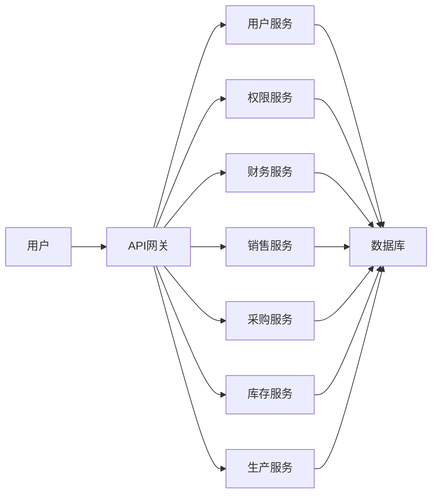

## 1. 背景介绍

### 1.1  企业信息化浪潮与管理系统需求

随着信息技术的飞速发展，企业信息化已经成为不可逆转的趋势。企业信息化是指企业利用信息技术，对企业内外部资源进行整合和优化，以提高企业运营效率、降低成本、增强竞争力。在这个过程中，各种管理系统应运而生，例如ERP、CRM、SCM、OA等，它们帮助企业实现业务流程自动化、数据共享、决策支持等功能。

然而，随着企业规模的扩大、业务的复杂化，传统的管理系统逐渐暴露出一些弊端，例如：

* **系统功能分散，数据孤岛现象严重。** 不同的管理系统之间数据难以互通，导致信息孤岛，难以形成统一的数据视图。
* **系统架构复杂，维护成本高。** 传统的管理系统通常采用单体架构，随着功能的增加，系统变得越来越庞大，维护成本也随之增加。
* **用户体验不佳，难以满足个性化需求。** 传统的管理系统界面设计不够人性化，操作流程复杂，难以满足用户个性化的需求。

为了解决这些问题，企业迫切需要一种全新的综合管理系统，能够整合企业内部各种资源，实现信息共享、流程优化、决策支持等功能，同时具备良好的用户体验和可维护性。

### 1.2  综合管理系统的设计目标

综合管理系统的设计目标是构建一个统一的平台，实现企业内部资源的整合和优化，提高企业运营效率和管理水平。具体来说，系统需要满足以下目标：

* **功能全面，覆盖企业核心业务。** 系统需要涵盖企业的人力资源、财务、销售、采购、库存、生产等核心业务，实现业务流程的自动化和数据共享。
* **架构灵活，易于扩展和维护。** 系统需要采用灵活的架构，例如微服务架构，以便于系统扩展和维护。
* **用户体验友好，操作简单易懂。** 系统需要提供人性化的界面设计，简化操作流程，提高用户体验。
* **数据安全可靠，保障企业信息安全。** 系统需要采取严格的数据安全措施，保障企业信息安全。

### 1.3 本文内容概述

本文将详细介绍公司综合管理系统的详细设计与具体代码实现，包括系统架构设计、功能模块设计、数据库设计、代码实现等方面。

## 2. 核心概念与联系

### 2.1  系统架构设计

#### 2.1.1  微服务架构

综合管理系统采用微服务架构，将系统拆分成多个独立的服务，每个服务负责特定的业务功能。微服务架构具有以下优势：

* **易于扩展和维护。** 每个服务都是独立的，可以独立开发、部署和扩展，降低了系统维护的复杂度。
* **提高系统可用性。** 某个服务的故障不会影响其他服务的正常运行，提高了系统的可用性。
* **提升开发效率。** 不同的团队可以并行开发不同的服务，提升了开发效率。

#### 2.1.2  系统架构图



### 2.2  功能模块设计

综合管理系统涵盖企业的人力资源、财务、销售、采购、库存、生产等核心业务，具体功能模块如下：

* **人力资源模块：** 员工管理、薪酬管理、考勤管理、培训管理等。
* **财务模块：** 会计核算、财务报表、成本管理、预算管理等。
* **销售模块：** 客户管理、销售订单管理、销售预测、销售分析等。
* **采购模块：** 供应商管理、采购订单管理、采购计划、采购分析等。
* **库存模块：** 库存管理、出入库管理、库存盘点、库存预警等。
* **生产模块：** 生产计划、生产调度、物料需求计划、生产成本核算等。

### 2.3  数据库设计

#### 2.3.1  数据库选型

综合管理系统采用关系型数据库，例如MySQL、PostgreSQL等。

#### 2.3.2  数据库表设计

数据库表设计需要根据具体的功能模块进行设计，例如人力资源模块的员工表、部门表、职位表等。

## 3. 核心算法原理具体操作步骤

本节以人力资源模块的薪酬计算为例，介绍核心算法原理和具体操作步骤。

### 3.1  薪酬计算规则

薪酬计算规则由企业自定义，例如：

* **基本工资：** 员工的固定工资。
* **绩效工资：** 根据员工的绩效考核结果计算的工资。
* **加班工资：** 员工加班时间的工资。
* **补贴：** 员工的各种补贴，例如交通补贴、餐补等。

### 3.2  薪酬计算步骤

1. **获取员工的基本工资、绩效工资、加班工资、补贴等信息。**
2. **根据薪酬计算规则计算员工的总工资。**
3. **将计算结果保存到数据库中。**

### 3.3  代码实现

```python
def calculate_salary(employee_id):
    """
    计算员工薪酬

    Args:
        employee_id: 员工ID

    Returns:
        员工薪酬
    """
    # 获取员工的基本工资、绩效工资、加班工资、补贴等信息
    basic_salary = get_basic_salary(employee_id)
    performance_salary = get_performance_salary(employee_id)
    overtime_salary = get_overtime_salary(employee_id)
    subsidies = get_subsidies(employee_id)

    # 根据薪酬计算规则计算员工的总工资
    total_salary = basic_salary + performance_salary + overtime_salary + subsidies

    # 将计算结果保存到数据库中
    save_salary(employee_id, total_salary)

    return total_salary
```

## 4. 数学模型和公式详细讲解举例说明

本节以销售模块的销售预测为例，介绍数学模型和公式的详细讲解和举例说明。

### 4.1  时间序列分析模型

时间序列分析模型是一种常用的销售预测方法，它利用历史销售数据来预测未来的销售趋势。常用的时间序列分析模型包括：

* **移动平均模型：** 使用过去一段时间的平均值来预测未来的值。
* **指数平滑模型：** 对过去的值赋予不同的权重，越近的值权重越大。
* **ARIMA模型：** 自回归移动平均模型，综合考虑了历史值、误差项和季节性因素。

### 4.2  销售预测公式

以移动平均模型为例，销售预测公式如下：

$$
\hat{y}_{t+1} = \frac{y_t + y_{t-1} + ... + y_{t-n+1}}{n}
$$

其中：

* $\hat{y}_{t+1}$ 表示 t+1 期的销售预测值。
* $y_t$ 表示 t 期的实际销售值。
* $n$ 表示移动平均的期数。

### 4.3  举例说明

假设某公司过去 3 个月的销售数据如下：

| 月份 | 销售额 |
|---|---|
| 1 月 | 100 |
| 2 月 | 120 |
| 3 月 | 150 |

使用 3 期移动平均模型预测 4 月份的销售额：

$$
\hat{y}_{4} = \frac{150 + 120 + 100}{3} = 123.33
$$

因此，预计 4 月份的销售额为 123.33 万元。

## 5. 项目实践：代码实例和详细解释说明

本节以财务模块的会计凭证录入功能为例，介绍代码实例和详细解释说明。

### 5.1  代码实例

```python
def create_voucher(voucher_data):
    """
    创建会计凭证

    Args:
        voucher_ 凭证数据，包括凭证日期、凭证编号、摘要、科目、借方金额、贷方金额等

    Returns:
        凭证ID
    """
    # 校验凭证数据
    validate_voucher_data(voucher_data)

    # 生成凭证编号
    voucher_number = generate_voucher_number()

    # 保存凭证数据到数据库
    voucher_id = save_voucher_data(voucher_data, voucher_number)

    return voucher_id
```

### 5.2  详细解释说明

1. **`create_voucher()` 函数：** 接收凭证数据作为参数，创建会计凭证。
2. **`validate_voucher_data()` 函数：** 校验凭证数据的合法性，例如凭证日期、凭证编号、摘要、科目、借方金额、贷方金额等是否符合规范。
3. **`generate_voucher_number()` 函数：** 生成凭证编号，例如根据日期和流水号生成唯一的凭证编号。
4. **`save_voucher_data()` 函数：** 将凭证数据保存到数据库中，包括凭证日期、凭证编号、摘要、科目、借方金额、贷方金额等。
5. **返回值：** 返回创建的凭证ID。

## 6. 实际应用场景

公司综合管理系统可以应用于各种行业和企业，例如：

* **制造业：** 可以用于生产计划、物料需求计划、生产成本核算等。
* **零售业：** 可以用于库存管理、销售预测、客户关系管理等。
* **服务业：** 可以用于人力资源管理、财务管理、项目管理等。

## 7. 总结：未来发展趋势与挑战

### 7.1  未来发展趋势

* **云计算：** 综合管理系统将更多地采用云计算技术，实现系统的弹性扩展和按需使用。
* **大数据：** 综合管理系统将集成大数据分析功能，帮助企业更好地洞察数据，做出更明智的决策。
* **人工智能：** 综合管理系统将引入人工智能技术，例如机器学习、自然语言处理等，实现智能化管理。

### 7.2  挑战

* **数据安全：** 随着数据量的增加和数据类型的多样化，数据安全将面临更大的挑战。
* **系统集成：** 综合管理系统需要与其他系统进行集成，例如ERP、CRM等，系统集成将是一个复杂的任务。
* **用户体验：** 综合管理系统需要提供良好的用户体验，以提高用户满意度和工作效率。

## 8. 附录：常见问题与解答

### 8.1  如何保障系统的数据安全？

* 采用严格的权限控制，限制用户对数据的访问权限。
* 对敏感数据进行加密存储，防止数据泄露。
* 定期备份数据，防止数据丢失。

### 8.2  如何提高系统的用户体验？

* 提供人性化的界面设计，简化操作流程。
* 提供丰富的帮助文档和视频教程，帮助用户快速上手。
* 收集用户反馈，不断改进系统功能和用户体验。