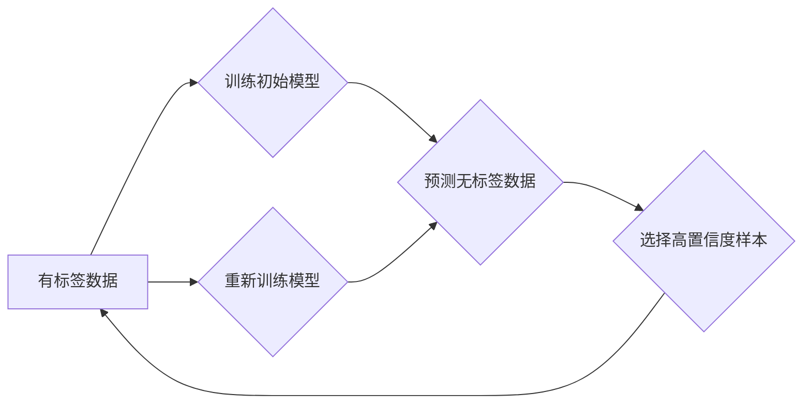
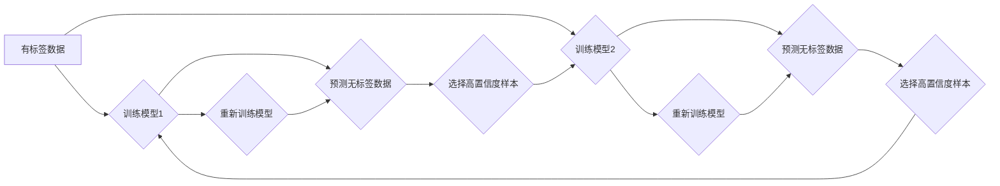

## 1. 背景介绍

### 1.1 机器学习的分类

机器学习根据训练数据的标签情况，可以分为三大类：

*   **监督学习（Supervised Learning）**:  训练数据包含输入和对应的标签，模型学习输入到标签的映射关系。
*   **无监督学习（Unsupervised Learning）**: 训练数据只有输入没有标签，模型学习数据本身的结构和模式。
*   **半监督学习（Semi-Supervised Learning, SSL）**: 训练数据包含少量有标签数据和大量无标签数据，模型利用少量有标签数据的信息来指导对无标签数据的学习，从而提升模型性能。

### 1.2 半监督学习的优势

半监督学习的优势在于：

*   **缓解数据标注压力**: 在现实应用中，获取大量的无标签数据相对容易，而标注数据需要耗费大量的人力物力。半监督学习可以有效利用无标签数据，减少对有标签数据的依赖。
*   **提升模型泛化能力**:  利用无标签数据可以帮助模型更好地理解数据的分布，从而提高模型的泛化能力，在面对未知数据时表现更好。

### 1.3 半监督学习的应用场景

半监督学习在许多领域都有广泛的应用，例如：

*   **图像分类**: 利用少量有标签的图像训练模型，然后对大量无标签的图像进行分类。
*   **文本分类**: 利用少量有标签的文本文档训练模型，然后对大量无标签的文本文档进行分类。
*   **语音识别**: 利用少量有标签的语音数据训练模型，然后对大量无标签的语音数据进行识别。

## 2. 核心概念与联系

### 2.1 判别式模型与生成式模型

半监督学习方法可以分为两大类：

*   **生成式模型（Generative Models）**: 生成式模型假设数据是由某个潜在的概率分布生成的，通过学习数据的生成过程来进行预测。这类模型通常需要对数据的分布进行假设，例如高斯混合模型、隐马尔可夫模型等。
*   **判别式模型（Discriminative Models）**: 判别式模型直接学习输入到输出的映射关系，而不关注数据的生成过程。这类模型通常不需要对数据的分布进行假设，例如支持向量机、逻辑回归等。

### 2.2 判别式半监督学习方法

判别式半监督学习方法主要利用有标签数据和无标签数据来优化模型参数，使得模型在有标签数据和无标签数据上都能取得较好的性能。常见的判别式半监督学习方法包括：

*   **自训练（Self-Training）**: 利用有标签数据训练一个初始模型，然后用该模型对无标签数据进行预测，将预测结果置信度高的样本加入到有标签数据集中，重新训练模型，如此迭代直到模型收敛。
*   **协同训练（Co-Training）**:  利用两个或多个不同的视角（例如不同的特征集）来训练多个模型，每个模型对无标签数据进行预测，将预测结果置信度高的样本加入到其他模型的训练集中，互相促进模型的学习。
*   **转导式支持向量机（Transductive Support Vector Machine, TSVM）**:  将无标签数据也加入到支持向量机的优化目标中，使得模型在有标签数据和无标签数据上都能找到一个最优的分类超平面。
*   **熵正则化（Entropy Regularization）**:  将模型预测结果的熵作为正则项加入到损失函数中，鼓励模型对无标签数据的预测结果具有较低的熵，即更加确定。

## 3. 核心算法原理具体操作步骤

### 3.1 自训练算法

自训练算法的具体操作步骤如下：

1.  **训练初始模型**: 利用有标签数据训练一个初始模型 $f$。
2.  **预测无标签数据**: 利用模型 $f$ 对无标签数据进行预测，得到预测结果 $y'$。
3.  **选择高置信度样本**:  选择预测结果置信度高于阈值 $\tau$ 的样本 $(x', y')$，将其加入到有标签数据集中。
4.  **重新训练模型**: 利用更新后的有标签数据集重新训练模型 $f$。
5.  **重复步骤 2-4**:  重复上述步骤，直到模型收敛或达到最大迭代次数。

**算法流程图：**



### 3.2 协同训练算法

协同训练算法的具体操作步骤如下：

1.  **训练多个模型**: 利用不同的视角（例如不同的特征集）训练多个模型 $f_1, f_2, ..., f_n$。
2.  **预测无标签数据**:  每个模型 $f_i$ 对无标签数据进行预测，得到预测结果 $y_i'$。
3.  **选择高置信度样本**:  每个模型 $f_i$ 选择预测结果置信度高于阈值 $\tau$ 的样本 $(x', y_i')$，将其加入到其他模型的训练集中。
4.  **重新训练模型**:  每个模型 $f_i$ 利用更新后的训练集重新训练模型。
5.  **重复步骤 2-4**:  重复上述步骤，直到模型收敛或达到最大迭代次数。

**算法流程图：**



## 4. 数学模型和公式详细讲解举例说明

### 4.1 熵正则化

熵正则化方法将模型预测结果的熵作为正则项加入到损失函数中，鼓励模型对无标签数据的预测结果具有较低的熵，即更加确定。

**熵的定义：**

对于一个离散随机变量 $X$，其概率分布为 $P(X=x_i) = p_i$，则其熵定义为：

$$
H(X) = -\sum_{i=1}^{n} p_i \log_2 p_i
$$

**熵正则化损失函数：**

假设有 $l$ 个有标签样本 $(x_i, y_i)$，$u$ 个无标签样本 $x_j$，模型 $f$ 的参数为 $\theta$，则熵正则化损失函数可以表示为：

$$
L(\theta) = \sum_{i=1}^{l} L_s(f(x_i; \theta), y_i) + \lambda \sum_{j=1}^{u} H(f(x_j; \theta))
$$

其中：

*   $L_s$ 是监督学习的损失函数，例如交叉熵损失函数。
*   $\lambda$ 是正则化系数，用于控制熵正则项的权重。
*   $H(f(x_j; \theta))$ 是模型 $f$ 对无标签样本 $x_j$ 预测结果的熵。

**举例说明：**

假设我们有一个二分类问题，模型 $f$ 的输出是一个概率向量 $[p, 1-p]$，表示样本属于正类的概率为 $p$，属于负类的概率为 $1-p$。

对于一个无标签样本 $x_j$，模型 $f$ 的预测结果为 $[0.6, 0.4]$，则其熵为：

$$
H(f(x_j; \theta)) = -0.6 \log_2 0.6 - 0.4 \log_2 0.4 \approx 0.97
$$

如果模型 $f$ 的预测结果为 $[0.9, 0.1]$，则其熵为：

$$
H(f(x_j; \theta)) = -0.9 \log_2 0.9 - 0.1 \log_2 0.1 \approx 0.47
$$

可以看出，模型预测结果越确定，其熵越低。

## 5. 项目实践：代码实例和详细解释说明

### 5.1 Python 代码实例

```python
import numpy as np
from sklearn.datasets import make_classification
from sklearn.linear_model import LogisticRegression
from sklearn.metrics import accuracy_score

# 生成模拟数据集
X, y = make_classification(
    n_samples=1000, n_features=2, n_informative=2, n_redundant=0, random_state=42
)

# 将一部分数据作为有标签数据，其余作为无标签数据
n_labeled = 100
X_labeled = X[:n_labeled]
y_labeled = y[:n_labeled]
X_unlabeled = X[n_labeled:]

# 训练初始模型
model = LogisticRegression()
model.fit(X_labeled, y_labeled)

# 自训练算法
for i in range(10):
    # 预测无标签数据
    y_pred = model.predict_proba(X_unlabeled)[:, 1]

    # 选择高置信度样本
    threshold = 0.9
    confident_indices = np.where((y_pred > threshold) | (y_pred < 1 - threshold))[0]
    X_confident = X_unlabeled[confident_indices]
    y_confident = (y_pred[confident_indices] > threshold).astype(int)

    # 将高置信度样本加入到有标签数据集中
    X_labeled = np.concatenate((X_labeled, X_confident))
    y_labeled = np.concatenate((y_labeled, y_confident))

    # 重新训练模型
    model.fit(X_labeled, y_labeled)

# 评估模型性能
y_pred = model.predict(X)
accuracy = accuracy_score(y, y_pred)
print(f"Accuracy: {accuracy:.2f}")
```

### 5.2 代码解释

*   **生成模拟数据集**:  使用 `sklearn.datasets.make_classification` 函数生成一个二分类的模拟数据集。
*   **划分数据集**:  将一部分数据作为有标签数据，其余作为无标签数据。
*   **训练初始模型**:  使用 `sklearn.linear_model.LogisticRegression` 训练一个逻辑回归模型作为初始模型。
*   **自训练算法**:  使用循环实现自训练算法，每次迭代选择高置信度的无标签样本加入到有标签数据集中，重新训练模型。
*   **评估模型性能**:  使用 `sklearn.metrics.accuracy_score` 函数计算模型的准确率。

## 6. 实际应用场景

### 6.1 图像分类

在图像分类任务中，可以使用半监督学习来利用大量无标签的图像数据提升模型性能。例如，可以使用自训练算法或协同训练算法来训练模型，将预测结果置信度高的无标签图像加入到有标签数据集中，重新训练模型。

### 6.2 文本分类

在文本分类任务中，可以使用半监督学习来利用大量无标签的文本文档数据提升模型性能。例如，可以使用自训练算法或熵正则化方法来训练模型，将预测结果置信度高的无标签文本文档加入到有标签数据集中，重新训练模型。

### 6.3 语音识别

在语音识别任务中，可以使用半监督学习来利用大量无标签的语音数据提升模型性能。例如，可以使用自训练算法或协同训练算法来训练模型，将预测结果置信度高的无标签语音数据加入到有标签数据集中，重新训练模型。

## 7. 工具和资源推荐

### 7.1 Scikit-learn

Scikit-learn 是一个常用的 Python 机器学习库，提供了丰富的半监督学习算法实现，例如 `LabelPropagation`、`LabelSpreading`、`SelfTrainingClassifier` 等。

### 7.2 PyTorch

PyTorch 是一个常用的 Python 深度学习库，可以方便地实现各种半监督学习算法，例如自训练、协同训练、熵正则化等。

## 8. 总结：未来发展趋势与挑战

### 8.1 未来发展趋势

*   **深度半监督学习**:  将深度学习技术应用于半监督学习，例如使用深度神经网络作为模型，利用无标签数据进行预训练或正则化。
*   **主动学习**:  主动选择最有价值的无标签样本进行标注，从而最大限度地利用有限的标注资源。
*   **迁移学习**:  将从其他领域或任务学习到的知识迁移到半监督学习任务中，提升模型性能。

### 8.2 挑战

*   **模型选择**:  选择合适的半监督学习算法和模型结构是一个挑战，需要根据具体的应用场景和数据特点进行选择。
*   **超参数调整**:  半监督学习算法通常包含多个超参数，例如正则化系数、置信度阈值等，需要进行仔细的调整才能获得最佳性能。
*   **数据质量**:  无标签数据的质量对半监督学习的效果有很大影响，需要对无标签数据进行清洗和预处理，去除噪声和异常值。

## 9. 附录：常见问题与解答

### 9.1 什么是半监督学习？

半监督学习是一种机器学习方法，利用少量有标签数据和大量无标签数据来训练模型，从而提升模型性能。

### 9.2 半监督学习有哪些优势？

半监督学习的优势在于可以缓解数据标注压力，提升模型泛化能力。

### 9.3 半监督学习有哪些应用场景？

半监督学习在图像分类、文本分类、语音识别等领域都有广泛的应用。

### 9.4 常见的半监督学习算法有哪些？

常见的半监督学习算法包括自训练、协同训练、转导式支持向量机、熵正则化等。
