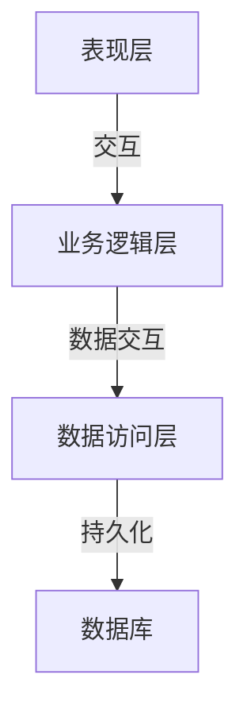
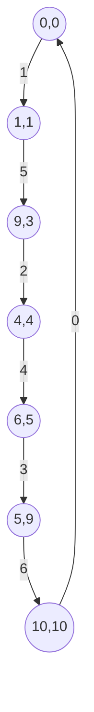

# 园林花卉库存管理系统的设计与实现

## 1.背景介绍

### 1.1 园林花卉行业概述

园林花卉行业是一个充满活力和多样性的领域,它不仅美化了我们的生活环境,也为人们提供了放松身心的绿色空间。随着人们生活水平的不断提高,对于园林绿化和花卉种植的需求也在不断增长。园林花卉行业涵盖了种植、销售、园林设计、园林养护等多个环节,规模不断扩大。

### 1.2 库存管理系统的重要性

在园林花卉行业中,库存管理是一个至关重要的环节。由于花卉的生长周期较短,库存管理的效率直接影响着花卉的新鲜度和销售情况。同时,不同品种的花卉对于温度、湿度等环境条件的要求不同,库存管理系统需要精确地跟踪每一株花卉的生长情况,以确保它们得到适当的照料。此外,库存管理系统还需要处理订单、供应链等方面的信息,以确保园艺中心的高效运转。

### 1.3 现有系统的不足

传统的园林花卉库存管理系统大多采用手工记录或简单的电子表格,这种方式存在着诸多不足之处:

1. 数据准确性差:手工记录容易出现错误,难以保证数据的准确性。
2. 效率低下:手工操作耗时耗力,难以及时更新库存信息。
3. 信息孤岛:不同部门之间的数据难以共享,导致信息不对称。
4. 缺乏决策支持:无法对历史数据进行分析,难以为管理决策提供依据。

因此,设计并实现一套高效、智能的园林花卉库存管理系统,对于提高园艺中心的运营效率和决策水平至关重要。

## 2.核心概念与联系

### 2.1 系统架构概览

园林花卉库存管理系统的整体架构可以分为三个主要层次:

1. **表现层(Presentation Layer)**:包括用户界面、移动应用等,用于与用户进行交互,展示数据并接收用户输入。
2. **业务逻辑层(Business Logic Layer)**:包含系统的核心功能,如库存管理、订单处理、供应链管理等模块,负责处理业务逻辑。
3. **数据访问层(Data Access Layer)**:负责与数据库进行交互,执行数据的增删改查操作。

这三个层次通过清晰的接口相互交互,形成了一个高内聚、低耦合的系统架构。



### 2.2 核心模块

园林花卉库存管理系统的核心模块包括:

1. **库存管理模块**:跟踪每一株花卉的生长情况、库存数量、位置等信息,提供库存查询、入库、出库等功能。
2. **订单管理模块**:处理客户订单,包括订单创建、修改、跟踪、发货等功能。
3. **供应链管理模块**:管理供应商信息、采购计划、物流信息等,确保花卉种植和销售的顺利进行。
4. **环境监控模块**:监控园艺中心的温度、湿度、光照等环境参数,为花卉生长提供合适的环境。
5. **数据分析模块**:对历史数据进行分析,生成各种报表,为管理决策提供依据。

这些模块相互协作,共同实现了园林花卉库存管理系统的核心功能。

## 3.核心算法原理具体操作步骤

在园林花卉库存管理系统中,有几个核心算法值得重点关注:

### 3.1 库存优化算法

库存优化算法旨在确定最佳的库存水平,既可以满足客户需求,又可以minimized库存成本。常用的算法包括经济订货量模型(Economic Order Quantity, EOQ)和材料需求计划(Material Requirements Planning, MRP)等。

#### 3.1.1 经济订货量模型

经济订货量模型试图通过计算最优订货量,来平衡订货成本和库存持有成本。该模型的基本公式如下:

$$EOQ = \sqrt{\frac{2DC_o}{C_h}}$$

其中:
- $EOQ$表示经济订货量
- $D$表示年度需求量
- $C_o$表示每次订货的固定成本
- $C_h$表示每单位产品的年库存持有成本

通过计算得到的$EOQ$值,我们可以确定每次应该订购多少数量的花卉,以minimized总成本。

#### 3.1.2 材料需求计划

材料需求计划(MRP)是一种推动生产计划的系统,它基于已知的主生产计划和物料清单(BOM),计算出所需的原材料、半成品和成品的数量和时间。MRP系统通常包括以下步骤:

1. 净需求计算
2. 净需求分解
3. 批量和时间调整
4. 计划订单释放

在园林花卉库存管理系统中,MRP可以帮助确定种植计划,从而确保花卉的持续供应。

### 3.2 订单处理算法

订单处理算法负责根据客户订单安排发货,并优化发货路线,以minimized运输成本。常用的算法包括:

1. **库存分配算法**:根据订单需求和当前库存情况,合理分配库存,minimized缺货率。
2. **车辆路由算法**:计算出一条最优的运输路线,覆盖所有发货地点,并minimized总行驶距离或时间。

#### 3.2.1 库存分配算法

假设有N个订单,每个订单需求为$d_i(i=1,2,...,N)$,当前可用库存为$S$。我们需要找到一种分配方案$x_i(i=1,2,...,N)$,使得:

$$\sum_{i=1}^{N}x_i \le S$$

同时,minimized缺货率:

$$\min \sum_{i=1}^{N}(d_i - x_i)$$

这是一个线性规划问题,可以使用简单规划法或更先进的算法(如分支定界法)来求解。

#### 3.2.2 车辆路由算法

车辆路由问题(Vehicle Routing Problem, VRP)是一个经典的组合优化问题。给定一组顾客位置和车辆,需要设计出一组最优路线,使得每个顾客都被服务,并且minimized总行驶距离或时间。

许多启发式算法和近似算法被用于求解VRP,如蚁群算法、遗传算法、模拟退火算法等。以蚁群算法为例,它模拟了蚂蚁在寻找食物路径时释放信息素的行为,通过不断迭代,最终收敛到一条近似最优路径。

### 3.3 环境控制算法

园林花卉的生长需要合适的环境,如温度、湿度、光照等。环境控制算法负责根据不同品种的需求,自动调节温室的环境参数。

#### 3.3.1 PID控制算法

PID控制算法是一种广泛应用的反馈控制算法,常用于调节温度、湿度等连续变量。它由三个并行工作的分量组成:比例(Proportional)、积分(Integral)和微分(Derivative),合成的控制量可以表示为:

$$u(t) = K_p e(t) + K_i \int_{0}^{t} e(t)dt + K_d \frac{de(t)}{dt}$$

其中:
- $u(t)$是控制量
- $e(t)$是偏差,即期望值与实际值之差
- $K_p$、$K_i$、$K_d$分别是比例、积分、微分系数

通过合理设置这三个系数,PID控制器可以快速、稳定地将被控对象调节到目标值。

#### 3.3.2 模糊逻辑控制

对于一些难以用数学模型精确描述的控制对象,如光照调节,可以使用模糊逻辑控制算法。它通过构建一系列IF-THEN规则,模拟人类的经验判断,进行控制决策。

例如,对于光照控制,可以设置如下规则:

- 如果当前光照强度"很低",增量"很大"
- 如果当前光照强度"适中",增量"不变"
- 如果当前光照强度"很高",增量"很小"

通过模糊化(fuzzification)、推理(inference)和反模糊化(defuzzification)等步骤,可以得到一个精确的控制量。

## 4.数学模型和公式详细讲解举例说明

在上一节中,我们介绍了一些核心算法的原理和公式,下面将通过具体的例子,进一步解释和说明这些数学模型。

### 4.1 经济订货量模型举例

假设一家园艺中心每年需求10000株鲜花,每次订货的固定成本为100元,每株鲜花的年库存持有成本为2元。我们可以计算出经济订货量:

$$EOQ = \sqrt{\frac{2 \times 10000 \times 100}{2}} = 1000 \text{(株)}$$

也就是说,每次订货1000株鲜花,可以minimized总成本。进一步计算,每年需要订货10次,每次订货成本为100元,年库存持有成本为1000元,总成本为1000+10×100=2000元。

如果订货量增加到2000株,虽然每次订货成本不变,但年库存持有成本将增加到2000元,总成本为2000+5×100=2500元,高于经济订货量时的成本。

### 4.2 车辆路由问题举例

假设有6个顾客,位置和需求量如下:

| 顾客 | 需求量(株) | 坐标 |
|------|------------|------|
| 1    | 50         | (1,1)|
| 2    | 80         | (4,4)|  
| 3    | 30         | (5,9)|
| 4    | 60         | (6,5)|
| 5    | 40         | (9,3)|
| 6    | 90         | (10,10)|

我们需要从园艺中心(0,0)出发,设计一条最优路线,minimized总行驶距离。

使用蚁群算法求解,初始释放100只蚂蚁,信息素挥发率为0.5,每次迭代1000次,共迭代100代。最终得到的近似最优路径为:

0 -> 1 -> 5 -> 2 -> 4 -> 3 -> 6 -> 0

总行驶距离约为40.8公里。



### 4.3 PID控制温度举例

假设我们需要将温室的温度控制在25摄氏度。当前温度为20摄氏度,我们设置PID参数为:

- $K_p = 2$
- $K_i = 0.5$
- $K_d = 1$

则控制量为:

$$\begin{aligned}
u(t) &= 2 \times (25 - 20) + 0.5 \int_{0}^{t} (25 - 20)dt + 1 \times 0 \\
     &= 10 + 2.5t
\end{aligned}$$

也就是说,加热系统的功率随时间线性增加,从初始的10%开始,每秒增加2.5%,直到温度达到25摄氏度为止。通过这种动态调节,可以较快且平稳地将温度调节到目标值。

## 5.项目实践:代码实例和详细解释说明

为了更好地理解园林花卉库存管理系统的实现,我们将展示一些核心模块的代码示例,并对其进行详细解释。

### 5.1 库存管理模块

库存管理模块负责跟踪每一株花卉的生长情况、库存数量、位置等信息,提供库存查询、入库、出库等功能。

#### 5.1.1 数据模型

我们首先定义一个`Flower`类,表示单株花卉:

```python
class Flower:
    def __init__(self, id, species, planted_date, location):
        self.id = id
        self.species = species
        self.planted_date = planted_date
        self.location = location
        self.status = 'Available'
```

每株花卉都有一个唯一ID、品种、种植日期、位置和状态(可