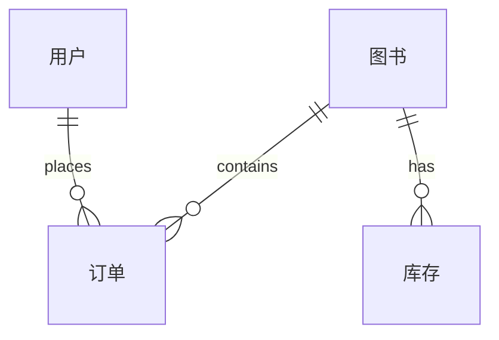

## 1. 背景介绍

### 1.1 图书销售行业的现状与挑战

近年来，随着互联网技术的快速发展和人们阅读习惯的改变，图书销售行业正在经历着一场深刻的变革。传统的线下书店面临着来自线上电商平台的巨大冲击，而线上平台也面临着用户需求多样化、市场竞争激烈等挑战。为了在激烈的市场竞争中立于不败之地，图书销售企业需要不断提升自身的服务水平和运营效率，而信息化建设是实现这一目标的关键。

### 1.2 图书销售系统的意义与价值

图书销售系统是现代图书销售企业不可或缺的管理工具，它能够帮助企业实现以下目标：

* **提高销售效率:**  系统可以自动处理订单、库存、物流等环节，减轻人工操作负担，提高工作效率。
* **降低运营成本:**  系统可以优化库存管理、物流配送等环节，降低企业运营成本。
* **提升客户满意度:**  系统可以提供便捷的购物体验、个性化推荐等服务，提升客户满意度。
* **增强数据分析能力:**  系统可以收集销售数据、用户行为数据等信息，为企业决策提供数据支持。

## 2. 核心概念与联系

### 2.1 系统架构

图书销售系统通常采用多层架构设计，包括以下几个核心模块：

* **展示层:**  负责用户交互，提供商品浏览、下单、支付等功能。
* **业务逻辑层:**  负责处理业务逻辑，例如订单处理、库存管理、用户管理等。
* **数据访问层:**  负责与数据库交互，进行数据读写操作。

### 2.2 核心实体

图书销售系统涉及到的核心实体包括：

* **图书:**  包括图书的基本信息，例如书名、作者、出版社、价格等。
* **用户:**  包括用户的基本信息，例如用户名、密码、地址等。
* **订单:**  包括订单的详细信息，例如订单号、商品信息、用户地址、支付状态等。
* **库存:**  包括图书的库存信息，例如库存数量、入库时间、出库时间等。

### 2.3 实体关系图



## 3. 核心算法原理具体操作步骤

### 3.1 订单处理流程

1. 用户选择商品，加入购物车。
2. 用户确认订单信息，选择支付方式。
3. 系统生成订单，并扣减库存。
4. 用户完成支付。
5. 系统更新订单状态，并通知用户。

### 3.2 库存管理算法

* **安全库存:**  设定一个最低库存量，当库存低于安全库存时，系统自动提醒管理员进行补货。
* **先进先出:**  优先销售先入库的商品，避免商品积压。

### 3.3 用户推荐算法

* **协同过滤:**  根据用户的历史购买记录，推荐与其兴趣相似的商品。
* **基于内容的推荐:**  根据商品的属性信息，推荐与用户已购买商品相似的商品。

## 4. 数学模型和公式详细讲解举例说明

### 4.1 库存周转率

库存周转率是衡量企业库存管理效率的重要指标，其计算公式如下：

$$
库存周转率 = 销售成本 / 平均库存价值
$$

**例:**  某图书销售企业2023年的销售成本为1000万元，平均库存价值为200万元，则该企业的库存周转率为：

$$
库存周转率 = 1000 / 200 = 5
$$

### 4.2 用户生命周期价值

用户生命周期价值是指用户在整个生命周期内为企业带来的总价值，其计算公式如下：

$$
用户生命周期价值 = 平均订单价值 * 平均购买频率 * 平均用户生命周期
$$

**例:**  某图书销售平台用户的平均订单价值为100元，平均购买频率为每月2次，平均用户生命周期为3年，则该平台用户的生命周期价值为：

$$
用户生命周期价值 = 100 * 2 * 12 * 3 = 7200 元
$$

## 5. 项目实践：代码实例和详细解释说明

### 5.1 技术选型

* **开发语言:**  Java
* **数据库:**  MySQL
* **Web框架:**  Spring Boot
* **前端框架:**  React

### 5.2 代码示例

#### 5.2.1 订单实体类

```java
public class Order {

    private Long id;
    private Long userId;
    private List<OrderItem> orderItems;
    private BigDecimal totalPrice;
    private String status;

    // getter and setter methods
}
```

#### 5.2.2 订单服务接口

```java
public interface OrderService {

    Order createOrder(Long userId, List<OrderItem> orderItems);

    Order getOrderById(Long orderId);

    List<Order> getOrdersByUserId(Long userId);

    void updateOrderStatus(Long orderId, String status);
}
```

## 6. 实际应用场景

### 6.1 线上书店

* 京东图书
* 当当网
* 亚马逊

### 6.2 线下书店

* 言几又
* 西西弗书店
* 猫的天空之城概念书店

## 7. 总结：未来发展趋势与挑战

### 7.1 未来发展趋势

* **个性化推荐:**  利用大数据和人工智能技术，为用户提供更加个性化的图书推荐服务。
* **全渠道融合:**  将线上线下销售渠道进行整合，为用户提供更加便捷的购物体验。
* **智能化运营:**  利用人工智能技术，实现库存管理、物流配送等环节的自动化和智能化。

### 7.2 挑战

* **数据安全:**  保护用户隐私和数据安全是图书销售系统面临的重要挑战。
* **技术更新:**  互联网技术不断更新迭代，图书销售系统需要不断进行技术升级，才能保持竞争力。
* **市场竞争:**  图书销售市场竞争激烈，企业需要不断提升服务水平和运营效率，才能在市场中立于不败之地。

## 8. 附录：常见问题与解答

### 8.1 如何保证用户信息安全？

* 采用 HTTPS 协议加密传输数据。
* 对用户密码进行加密存储。
* 定期进行安全漏洞扫描和修复。

### 8.2 如何提高库存管理效率？

* 采用安全库存和先进先出算法。
* 利用 RFID 技术进行库存盘点。
* 与供应商建立紧密的合作关系，实现库存信息共享。

### 8.3 如何提高用户转化率？

* 提供个性化图书推荐服务。
* 优化购物流程，提升用户体验。
* 开展促销活动，吸引用户购买。
