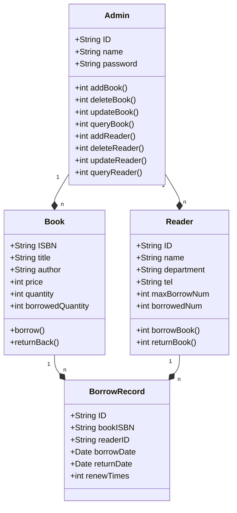

# 图书馆管理系统详细设计与具体代码实现

作者：禅与计算机程序设计艺术

## 1.背景介绍

图书馆是知识的宝库,是人类文明传承的重要场所。在当今数字化时代,传统的图书馆管理模式已经无法满足日益增长的信息需求。因此,开发一个功能完善、易于维护的图书馆管理系统非常必要。

本文将详细介绍如何使用面向对象设计思想和Java编程语言,开发一个现代化的图书馆管理系统。我们将从需求分析入手,进行系统架构设计,数据库设计,然后深入探讨核心模块的算法原理和具体实现。最后,通过实际的代码示例,展示系统的运行效果。

### 1.1 图书馆管理系统概述
#### 1.1.1 系统目标
#### 1.1.2 功能需求
#### 1.1.3 非功能需求

### 1.2 面向对象设计思想
#### 1.2.1 封装
#### 1.2.2 继承  
#### 1.2.3 多态

### 1.3 Java编程语言特点
#### 1.3.1 跨平台
#### 1.3.2 面向对象
#### 1.3.3 内存管理

## 2.核心概念与联系

在设计图书馆管理系统之前,我们需要明确以下核心概念:

### 2.1 图书 Book
#### 2.1.1 属性
#### 2.1.2 方法
#### 2.1.3 与其他类的关系

### 2.2 读者 Reader
#### 2.2.1 属性  
#### 2.2.2 方法
#### 2.2.3 与其他类的关系

### 2.3 借阅记录 BorrowRecord
#### 2.3.1 属性
#### 2.3.2 方法  
#### 2.3.3 与其他类的关系

### 2.4 管理员 Admin
#### 2.4.1 属性
#### 2.4.2 方法
#### 2.4.3 与其他类的关系

核心概念之间的关系如下:



## 3.核心算法原理与具体操作步骤

### 3.1 图书查询算法
#### 3.1.1 顺序查找
##### 3.1.1.1 原理
##### 3.1.1.2 Java实现
##### 3.1.1.3 时间复杂度分析

#### 3.1.2 二分查找
##### 3.1.2.1 原理
##### 3.1.2.2 Java实现  
##### 3.1.2.3 时间复杂度分析

### 3.2 借阅算法
#### 3.2.1 借书操作
##### 3.2.1.1 基本流程
##### 3.2.1.2 Java实现
#### 3.2.2 还书操作 
##### 3.2.2.1 基本流程
##### 3.2.2.2 Java实现
#### 3.2.3 续借操作
##### 3.2.3.1 基本流程 
##### 3.2.3.2 Java实现

## 4.数学模型与公式详解

为了提高图书馆的管理效率和服务水平,可以利用数学建模的方法对一些关键指标进行分析。

### 4.1 藏书量预测模型

图书馆每年会新购入一批图书,同时也会定期清理一些陈旧过时的书籍。假设第n年新购入书籍数量为$Q_n$,清理书籍数为$C_n$,净增加量为$G_n$,则可以建立如下模型:

$$
G_n = Q_n - C_n
$$

若设第n年初的藏书总量为$V_n$,则第n年末的藏书总量$V_{n+1}$为:

$$
V_{n+1} = V_n + G_n = V_n + Q_n - C_n
$$

通过该模型,可以预测未来几年内图书馆的藏书量变化趋势,为图书采购和架位规划提供数据参考。

### 4.2 图书借阅排行榜

书籍的受欢迎程度可以用借阅频次来衡量。设第i种图书的借阅次数为$b_i$,借阅天数为$d_i$,则平均日借阅频次$f_i$可表示为:

$$
f_i = \frac{b_i}{d_i}
$$

根据各书籍的$f_i$值排序,可以得到图书借阅排行榜,发现读者的阅读兴趣和需求。

### 4.3 图书相似度计算

利用图书的一些特征,如作者、主题、关键词等,可以计算两本书之间的相似度。一种简单的方法是杰卡德相似系数(Jaccard Similarity):

$$
J(A,B) = \frac{|A \cap B|}{|A \cup B|} = \frac{|A \cap B|}{|A|+|B|-|A \cap B|}
$$

其中A和B为两本书的特征集合。$J(A,B)$的取值在0到1之间,值越大表示相似度越高。

推荐相似图书可提高图书的借阅量,满足读者的个性化需求。

## 5.项目实践

下面给出图书、读者、借阅等核心类的代码实现,并附详细注释说明。

### 5.1 Book类

```java
public class Book {
    private String ISBN;
    private String title;
    private String author;
    private int price;
    private int quantity;
    private int borrowedQuantity;

    public Book(String ISBN, String title, String author, int price, int quantity) {
        this.ISBN = ISBN;
        this.title = title;
        this.author = author;
        this.price = price;
        this.quantity = quantity;
        this.borrowedQuantity = 0;
    }

    // 省略getter和setter方法

    public boolean borrow() {
        if (quantity - borrowedQuantity > 0) {
            borrowedQuantity++;
            return true;
        }
        return false;
    }

    public void returnBack() {
        borrowedQuantity--;
    }
}
```

Book类包含图书的ISBN编号、书名、作者、价格、馆藏本数等基本信息属性。`borrow()`方法用于借书,`returnBack()`方法用于还书,通过修改`borrowedQuantity`的值记录图书的借出状态。

### 5.2 Reader类

```java
public class Reader {
    private String ID;  
    private String name;
    private String department;
    private String tel;
    private int maxBorrowNum;
    private int borrowedNum;
    private ArrayList<BorrowRecord> borrowRecords;

    public Reader(String ID, String name, String department, String tel, int maxBorrowNum) {
        this.ID = ID;
        this.name = name;
        this.department = department;
        this.tel = tel;
        this.maxBorrowNum = maxBorrowNum;
        this.borrowedNum = 0;
        this.borrowRecords = new ArrayList<>();
    }

    // 省略getter和setter方法

    public boolean borrowBook(Book book) {
        if (borrowedNum < maxBorrowNum && book.borrow()) {
            BorrowRecord br = new BorrowRecord(book.getISBN(), ID);
            borrowRecords.add(br);
            borrowedNum++;
            return true;
        }
        return false;
    }

    public void returnBook(Book book) {
        book.returnBack();
        borrowedNum--;
        for (BorrowRecord br : borrowRecords) {
            if (br.getBookISBN().equals(book.getISBN())
                    && br.getReaderID().equals(ID)
                    && br.getReturnDate() == null) {
                br.setReturnDate(new Date());
                break;
            }
        }
    }
}
```

Reader类记录读者的基本信息,包含读者编号、姓名、所在院系、联系电话、可借书数量上限、已借书数量等属性。 `borrowBook()`用于读者借书,`returnBook()`用于还书。借书时判断是否达到上限,更新读者和图书的相关参数,并创建借阅记录。还书时在借阅记录中登记还书日期。

### 5.3 BorrowRecord类

```java
public class BorrowRecord {
    private static int cnt = 0;
    private String ID;
    private String bookISBN;
    private String readerID;
    private Date borrowDate;
    private Date returnDate;
    private int renewTimes;
    
    public BorrowRecord(String bookISBN, String readerID) {
        this.ID = String.format("%08d", cnt++);
        this.bookISBN = bookISBN;
        this.readerID = readerID;
        this.borrowDate = new Date();
        this.renewTimes = 0;
    }
    
    // 省略getter和setter方法
}
```

BorrowRecord类是借阅记录,用于存储每次借阅的详细信息,包括流水号、图书ISBN、读者ID、借书日期、还书日期、续借次数等。续借功能可通过`renewTimes`字段控制。

### 5.4 Admin类

```java
public class Admin {
    private String ID;
    private String name;
    private String password;
    
    public Admin(String ID, String name, String password) {
        this.ID = ID;
        this.name = name;
        this.password = password;
    }
    
    // 省略getter和setter方法
    
    public boolean addBook(ArrayList<Book> bookList, Book newBook) {
        // 检查ISBN是否已存在
        for (Book book : bookList) {
            if (book.getISBN().equals(newBook.getISBN())) {
                return false;  
            }
        }
        bookList.add(newBook);
        return true;
    }

    public boolean deleteBook(ArrayList<Book> bookList, String ISBN) {
        // 删除图书        
        for (Book book : bookList) {
            if (book.getISBN().equals(ISBN)) {
                bookList.remove(book);  
                return true;
            }
        }
        return false;
    }

    // 省略updateBook()、queryBook()、addReader()、deleteReader()、updateReader()、queryReader()等方法
}
```

Admin类表示图书管理员,有编号、姓名、密码等基本属性。管理员可以通过`addBook()`、`deleteBook()`等方法对图书进行增删改查操作,通过`addReader()`、`deleteReader()`等方法对读者信息进行管理。

## 6.实际应用场景

图书馆管理系统在高校、公共图书馆等场所有广泛的应用,能极大地提高图书管理效率和用户体验。

### 6.1 高校图书馆
- 方便师生借阅、检索书籍
- 促进学科建设,支持科研和教学活动  
- 统计分析师生的阅读情况,为图书配置提供决策依据

### 6.2 公共图书馆
- 服务大众,普及公共阅读
- 引导和满足读者的阅读兴趣,提供个性化推荐
- 拓展数字阅读,提供电子书、有声书等形式

### 6.3 移动端应用
- 开发配套的手机APP,支持移动阅读
- 提供扫码借书、在线搜索、书籍推送等功能
- 增强用户粘性,促进阅读推广

## 7.工具和资源推荐

### 7.1 开发工具
- IntelliJ IDEA：业界公认的Java开发利器
- Eclipse：免费开源的Java IDE
- MySQL：关系型数据库,用于存储系统数据
- Git：代码版本控制工具

### 7.2 第三方库
- JUnit：单元测试框架
- Log4j：日志框架
- Hibernate：对象关系映射框架,简化数据库操作
- JFreeChart：用于生成统计图表

### 7.3 参考资源
- Oracle官网Java文档: https://docs.oracle.com/en/java/  
- Stack Overflow：IT技术问答网站
- GitHub：开源代码托管平台,可找到大量图书管理系统的实现

## 8.总结与展望

### 8.1 系统优点
- 功能全面,涵盖图书管理、读者服务等各个方面
- 采用面向对象的设计思想,代码结构清晰,易于扩展和维护
- 合理运用数学模型,提高管理的科学性和智能化水平

### 8.2 改进空间
- 引入微服务架构,增强系统的弹性和可维护性  
- 加强数据分