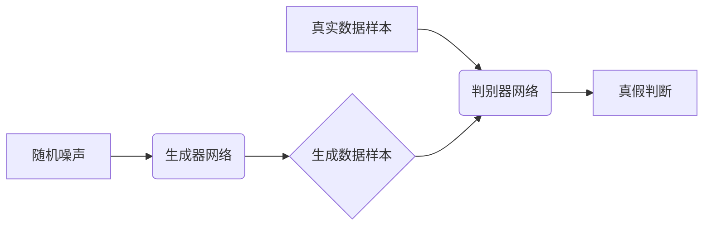
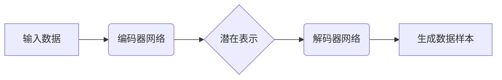

## 1. 背景介绍

### 1.1 图像生成技术的演进

图像生成技术经历了从简单到复杂，从人工到自动化的演进过程。早期，图像生成主要依赖于人工绘制和设计，例如绘画、摄影等。随着计算机技术的快速发展，人们开始尝试使用计算机程序来生成图像，例如基于规则的图像生成、基于几何形状的图像生成等。近年来，随着深度学习技术的兴起，基于深度学习的图像生成技术取得了突破性进展，例如生成对抗网络 (GAN)、变分自编码器 (VAE) 等，可以生成以假乱真的图像，甚至可以根据文本描述生成图像。

### 1.2 图像生成技术的应用

图像生成技术在各个领域都有着广泛的应用，例如：

* **艺术创作:** 艺术家可以使用图像生成工具来创作新的艺术作品，探索不同的艺术风格和表现形式。
* **游戏开发:** 游戏开发者可以使用图像生成技术来创建游戏场景、角色、道具等，提高游戏开发效率和游戏画面质量。
* **工业设计:** 工业设计师可以使用图像生成工具来设计产品原型，快速生成不同设计方案，提高设计效率。
* **医疗影像:** 医生可以使用图像生成技术来生成医学影像，辅助疾病诊断和治疗方案制定。
* **安全监控:** 图像生成技术可以用于生成人脸图像，用于人脸识别和安全监控等领域。

### 1.3 图像生成技术的挑战

尽管图像生成技术取得了显著的进展，但仍然面临着一些挑战：

* **生成图像的质量:** 如何生成更加逼真、高质量的图像仍然是一个挑战。
* **生成图像的多样性:** 如何生成具有多样性的图像，避免生成重复或相似的图像也是一个挑战。
* **生成图像的可控性:** 如何控制生成图像的内容、风格、细节等，使其符合用户的需求也是一个挑战。
* **生成图像的效率:** 如何提高图像生成的速度和效率，使其能够应用于实时场景也是一个挑战。

## 2. 核心概念与联系

### 2.1 生成模型

生成模型是一种机器学习模型，其目标是学习数据的概率分布，并利用学习到的概率分布生成新的数据样本。生成模型可以分为两类：

* **显式生成模型:** 显式生成模型直接定义数据的概率分布，例如高斯混合模型、隐马尔可夫模型等。
* **隐式生成模型:** 隐式生成模型不直接定义数据的概率分布，而是通过学习一个生成器网络，将随机噪声映射到数据空间，例如生成对抗网络 (GAN)、变分自编码器 (VAE) 等。

### 2.2 生成对抗网络 (GAN)

生成对抗网络 (GAN) 是一种深度学习模型，其核心思想是通过两个神经网络之间的对抗训练来生成逼真的数据样本。这两个神经网络分别是：

* **生成器网络 (Generator):** 生成器网络接收随机噪声作为输入，并将其映射到数据空间，生成新的数据样本。
* **判别器网络 (Discriminator):** 判别器网络接收真实数据样本和生成器网络生成的数据样本作为输入，并判断输入样本是来自真实数据分布还是生成器网络生成的分布。

在训练过程中，生成器网络的目标是生成能够欺骗判别器网络的逼真数据样本，而判别器网络的目标是尽可能准确地识别真实数据样本和生成器网络生成的数据样本。通过不断地对抗训练，生成器网络可以生成越来越逼真的数据样本。



### 2.3 变分自编码器 (VAE)

变分自编码器 (VAE) 是一种深度学习模型，其目标是学习数据的潜在表示，并利用学习到的潜在表示生成新的数据样本。VAE 包含两个神经网络：

* **编码器网络 (Encoder):** 编码器网络将输入数据映射到潜在空间，学习数据的潜在表示。
* **解码器网络 (Decoder):** 解码器网络将潜在空间的表示映射回数据空间，生成新的数据样本。

VAE 通过最小化输入数据和生成数据之间的重构误差，以及潜在空间表示的 KL 散度来进行训练。



## 3. 核心算法原理具体操作步骤

### 3.1 生成对抗网络 (GAN) 的训练步骤

1. **初始化生成器网络和判别器网络。**
2. **从真实数据分布中采样一批数据样本。**
3. **从随机噪声分布中采样一批噪声样本。**
4. **将噪声样本输入到生成器网络中，生成一批生成数据样本。**
5. **将真实数据样本和生成数据样本输入到判别器网络中，得到真假判断结果。**
6. **根据判别器网络的真假判断结果，更新生成器网络的参数，使其能够生成更加逼真的数据样本。**
7. **根据判别器网络的真假判断结果，更新判别器网络的参数，使其能够更加准确地识别真实数据样本和生成数据样本。**
8. **重复步骤 2-7，直到生成器网络能够生成以假乱真的数据样本。**

### 3.2 变分自编码器 (VAE) 的训练步骤

1. **初始化编码器网络和解码器网络。**
2. **从数据集中采样一批数据样本。**
3. **将数据样本输入到编码器网络中，得到潜在空间的表示。**
4. **将潜在空间的表示输入到解码器网络中，生成一批生成数据样本。**
5. **计算输入数据样本和生成数据样本之间的重构误差。**
6. **计算潜在空间表示的 KL 散度。**
7. **根据重构误差和 KL 散度，更新编码器网络和解码器网络的参数。**
8. **重复步骤 2-7，直到 VAE 能够生成高质量的数据样本。**

## 4. 数学模型和公式详细讲解举例说明

### 4.1 生成对抗网络 (GAN) 的数学模型

GAN 的目标函数可以表示为：

$$
\min_G \max_D V(D, G) = \mathbb{E}_{x \sim p_{data}(x)} [\log D(x)] + \mathbb{E}_{z \sim p_z(z)} [\log(1 - D(G(z)))]
$$

其中：

* $G$ 表示生成器网络。
* $D$ 表示判别器网络。
* $x$ 表示真实数据样本。
* $z$ 表示随机噪声样本。
* $p_{data}(x)$ 表示真实数据分布。
* $p_z(z)$ 表示随机噪声分布。

GAN 的训练过程可以看作是一个二人零和博弈，生成器网络的目标是最大化判别器网络的误差，而判别器网络的目标是最小化自身的误差。

### 4.2 变分自编码器 (VAE) 的数学模型

VAE 的目标函数可以表示为：

$$
\mathcal{L}(\theta, \phi) = \mathbb{E}_{q(z|x)} [\log p(x|z)] - D_{KL}[q(z|x) || p(z)]
$$

其中：

* $\theta$ 表示解码器网络的参数。
* $\phi$ 表示编码器网络的参数。
* $x$ 表示输入数据样本。
* $z$ 表示潜在空间的表示。
* $p(x|z)$ 表示解码器网络的概率分布。
* $q(z|x)$ 表示编码器网络的概率分布。
* $p(z)$ 表示潜在空间的先验分布。
* $D_{KL}$ 表示 KL 散度。

VAE 的目标函数包含两个部分：

* **重构误差:** $\mathbb{E}_{q(z|x)} [\log p(x|z)]$ 表示输入数据样本和生成数据样本之间的重构误差。
* **KL 散度:** $D_{KL}[q(z|x) || p(z)]$ 表示编码器网络的概率分布和潜在空间的先验分布之间的 KL 散度，用于约束潜在空间的表示。

## 5. 项目实践：代码实例和详细解释说明

### 5.1 使用 TensorFlow 构建一个简单的 GAN 模型

```python
import tensorflow as tf

# 定义生成器网络
def generator(z):
  # 定义网络结构
  # ...
  return output

# 定义判别器网络
def discriminator(x):
  # 定义网络结构
  # ...
  return output

# 定义损失函数
def gan_loss(real_output, fake_output):
  # 定义生成器损失函数
  generator_loss = tf.keras.losses.BinaryCrossentropy(from_logits=True)(tf.ones_like(fake_output), fake_output)
  # 定义判别器损失函数
  discriminator_loss = tf.keras.losses.BinaryCrossentropy(from_logits=True)(tf.ones_like(real_output), real_output) + tf.keras.losses.BinaryCrossentropy(from_logits=True)(tf.zeros_like(fake_output), fake_output)
  return generator_loss, discriminator_loss

# 定义优化器
generator_optimizer = tf.keras.optimizers.Adam(1e-4)
discriminator_optimizer = tf.keras.optimizers.Adam(1e-4)

# 定义训练步骤
@tf.function
def train_step(images):
  # 生成随机噪声
  noise = tf.random.normal([BATCH_SIZE, NOISE_DIM])
  # 生成生成数据样本
  with tf.GradientTape() as gen_tape, tf.GradientTape() as disc_tape:
    generated_images = generator(noise, training=True)
    real_output = discriminator(images, training=True)
    fake_output = discriminator(generated_images, training=True)
    # 计算损失函数
    gen_loss, disc_loss = gan_loss(real_output, fake_output)
  # 计算梯度
  gradients_of_generator = gen_tape.gradient(gen_loss, generator.trainable_variables)
  gradients_of_discriminator = disc_tape.gradient(disc_loss, discriminator.trainable_variables)
  # 更新网络参数
  generator_optimizer.apply_gradients(zip(gradients_of_generator, generator.trainable_variables))
  discriminator_optimizer.apply_gradients(zip(gradients_of_discriminator, discriminator.trainable_variables))

# 训练模型
for epoch in range(EPOCHS):
  for batch in range(BATCHES):
    # 从数据集中采样一批数据样本
    images = ...
    # 训练模型
    train_step(images)
```

### 5.2 使用 PyTorch 构建一个简单的 VAE 模型

```python
import torch
import torch.nn as nn
import torch.nn.functional as F

# 定义编码器网络
class Encoder(nn.Module):
  def __init__(self):
    super(Encoder, self).__init__()
    # 定义网络结构
    # ...

  def forward(self, x):
    # 定义前向传播过程
    # ...
    return mu, logvar

# 定义解码器网络
class Decoder(nn.Module):
  def __init__(self):
    super(Decoder, self).__init__()
    # 定义网络结构
    # ...

  def forward(self, z):
    # 定义前向传播过程
    # ...
    return x_recon

# 定义 VAE 模型
class VAE(nn.Module):
  def __init__(self):
    super(VAE, self).__init__()
    # 初始化编码器网络和解码器网络
    self.encoder = Encoder()
    self.decoder = Decoder()

  def reparameterize(self, mu, logvar):
    # 重参数化技巧
    std = torch.exp(0.5 * logvar)
    eps = torch.randn_like(std)
    return mu + eps * std

  def forward(self, x):
    # 定义前向传播过程
    mu, logvar = self.encoder(x)
    z = self.reparameterize(mu, logvar)
    x_recon = self.decoder(z)
    return x_recon, mu, logvar

# 定义损失函数
def vae_loss(x_recon, x, mu, logvar):
  # 计算重构误差
  recon_loss = F.binary_cross_entropy(x_recon, x, reduction='sum')
  # 计算 KL 散度
  kl_loss = -0.5 * torch.sum(1 + logvar - mu.pow(2) - logvar.exp())
  return recon_loss + kl_loss

# 定义优化器
optimizer = torch.optim.Adam(model.parameters(), lr=1e-3)

# 训练模型
for epoch in range(EPOCHS):
  for batch in range(BATCHES):
    # 从数据集中采样一批数据样本
    images = ...
    # 训练模型
    optimizer.zero_grad()
    x_recon, mu, logvar = model(images)
    loss = vae_loss(x_recon, images, mu, logvar)
    loss.backward()
    optimizer.step()
```

## 6. 实际应用场景

### 6.1 艺术创作

图像生成技术可以用于艺术创作，例如：

* **生成抽象艺术作品:** 使用 GAN 或 VAE 可以生成各种抽象艺术作品，例如抽象绘画、抽象雕塑等。
* **生成逼真的人物肖像:** 使用 GAN 可以生成逼真的人物肖像，例如生成历史人物肖像、生成虚拟人物肖像等。
* **生成具有特定风格的图像:** 使用 GAN 可以生成具有特定风格的图像，例如生成印象派风格的图像、生成巴洛克风格的图像等。

### 6.2 游戏开发

图像生成技术可以用于游戏开发，例如：

* **生成游戏场景:** 使用 GAN 或 VAE 可以生成各种游戏场景，例如森林、沙漠、城市等。
* **生成游戏角色:** 使用 GAN 可以生成各种游戏角色，例如人物、动物、怪物等。
* **生成游戏道具:** 使用 GAN 可以生成各种游戏道具，例如武器、防具、消耗品等。

### 6.3 工业设计

图像生成技术可以用于工业设计，例如：

* **生成产品原型:** 使用 GAN 或 VAE 可以生成各种产品原型，例如汽车、手机、家具等。
* **生成设计方案:** 使用 GAN 可以生成各种设计方案，例如不同颜色、不同材质、不同形状的产品设计方案。

## 7. 工具和资源推荐

### 7.1 TensorFlow

TensorFlow 是一个开源的机器学习平台，提供了丰富的图像生成模型和工具，例如：

* **TFGAN:** TFGAN 是 TensorFlow 中的一个 GAN 库，提供了各种 GAN 模型的实现，例如 DCGAN、WGAN-GP 等。
* **TensorFlow Probability:** TensorFlow Probability 是 TensorFlow 中的一个概率编程库，提供了 VAE 等生成模型的实现。

### 7.2 PyTorch

PyTorch 是一个开源的机器学习平台，提供了丰富的图像生成模型和工具，例如：

* **TorchGAN:** TorchGAN 是 PyTorch 中的一个 GAN 库，提供了各种 GAN 模型的实现，例如 DCGAN、WGAN-GP 等。
* **Pyro:** Pyro 是 PyTorch 中的一个概率编程库，提供了 VAE 等生成模型的实现。

### 7.3 其他资源

* **Papers with Code:** Papers with Code 是一个收集和整理机器学习论文和代码的网站，提供了各种图像生成模型的论文和代码实现。
* **Hugging Face:** Hugging Face 是一个提供预训练模型和数据集的平台，提供了各种图像生成模型的预训练模型和数据集。

## 8. 总结：未来发展趋势与挑战

### 8.1 未来发展趋势

* **更高质量的图像生成:** 随着深度学习技术的不断发展，图像生成模型的质量将会不断提高，生成更加逼真、更高分辨率的图像。
* **更强的可控性:** 研究人员正在探索如何提高图像生成模型的可控性，使其能够生成符合用户需求的图像，例如控制生成图像的内容、风格、细节等。
* **更广泛的应用场景:** 图像生成技术将会应用于更广泛的场景，例如虚拟现实、增强现实、人机交互等。

### 8.2 挑战

* **生成模型的可解释性:** 深度学习模型的可解释性仍然是一个挑战，如何理解生成模型的内部机制，以及如何控制生成过程仍然是一个难题。
* **生成模型的安全性:** 生成模型可能会被用于生成虚假信息或恶意内容，如何确保生成模型的安全性是一个重要的挑战。
* **生成模型的伦理问题:** 生成模型可能会生成具有偏见或歧视性的内容，如何解决生成模型的伦理问题是一个重要的课题。

## 9. 附录：常见问题与解答

### 9.1 什么是过拟合？

过拟合是指模型在训练数据上表现良好，但在测试数据上表现较差的现象。过拟合通常是由于模型过于复杂，学习了训练数据中的噪声导致的。

### 9.2 如何解决过拟合？

解决过拟合的方法包括：

* **简化模型:** 使用更简单的模型，例如减少网络层数、减少神经元数量等。
* **正则化:** 使用正则化技术，例如 L1 正则化、 L2 正则化等，来约束模型的复杂度。
* **数据增强:** 通过数据增强技术，例如图像旋转、图像翻转等，来增加训练数据的数量和多样性。
* **Dropout:** 使用 Dropout 技术，随机丢弃一部分神经元，来防止模型过拟合。

### 9.3 什么是