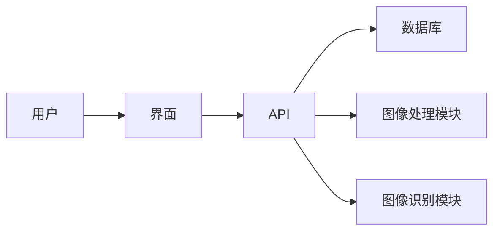

## 1. 背景介绍

### 1.1 数字图像的爆炸式增长与管理难题

随着互联网、移动互联网和物联网的蓬勃发展，数字图像数据正在以惊人的速度增长。无论是个人用户在社交媒体上分享的照片，还是企业在生产、运营中积累的图像资料，都对高效的图像管理提出了迫切需求。然而，海量图像数据的存储、检索、分析和利用面临着诸多挑战，包括：

* **存储空间压力:**  海量图像数据需要巨大的存储空间，这对个人用户和企业来说都是一笔不小的开销。
* **检索效率低下:**  在庞大的图像库中找到目标图像往往耗时费力，传统的基于文件名或关键词的检索方式难以满足需求。
* **数据分析困难:**  从海量图像数据中提取有价值的信息，例如图像内容、拍摄时间、地点等，需要复杂的算法和强大的计算能力。
* **安全性和隐私保护:**  图像数据中可能包含敏感信息，例如个人隐私、商业机密等，需要采取有效的安全措施进行保护。

### 1.2 图像管理系统的意义和价值

为了解决上述问题，图像管理系统应运而生。一个高效的图像管理系统能够：

* **优化存储空间:**  采用先进的压缩算法和存储技术，降低图像数据的存储成本。
* **提升检索效率:**  利用图像识别、内容分析等技术，实现基于图像内容的快速检索。
* **简化数据分析:**  提供图像标注、分类、统计等功能，帮助用户从图像数据中挖掘价值。
* **保障数据安全:**  实施访问控制、加密存储等安全措施，保护图像数据的安全和隐私。

## 2. 核心概念与联系

### 2.1 图像数据

* **像素:**  构成数字图像的基本单元，包含颜色、亮度等信息。
* **分辨率:**  图像的尺寸，通常以像素数量表示，例如 1920x1080。
* **色彩空间:**  描述颜色信息的方式，例如 RGB、CMYK 等。
* **文件格式:**  存储图像数据的格式，例如 JPEG、PNG、GIF 等。

### 2.2 图像数据库

* **关系型数据库:**  将图像数据存储在关系表中，例如 MySQL、PostgreSQL 等。
* **NoSQL 数据库:**  采用非关系型数据模型存储图像数据，例如 MongoDB、Cassandra 等。
* **云存储服务:**  提供云端的图像存储服务，例如 Amazon S3、Google Cloud Storage 等。

### 2.3 图像处理

* **图像缩放:**  改变图像的尺寸，例如放大、缩小。
* **图像裁剪:**  截取图像的一部分区域。
* **图像旋转:**  改变图像的方向。
* **图像增强:**  改善图像的质量，例如提高对比度、锐化等。

### 2.4 图像识别

* **目标检测:**  识别图像中的特定物体，例如人脸、车辆等。
* **图像分类:**  将图像归类到不同的类别，例如风景、人物等。
* **图像分割:**  将图像分割成不同的区域，例如前景、背景等。

### 2.5 图像管理系统架构



## 3. 核心算法原理具体操作步骤

### 3.1 图像压缩算法

* **JPEG:**  采用离散余弦变换 (DCT) 将图像信息转换为频率域，然后进行量化和编码。
* **PNG:**  采用无损压缩算法，保留图像的所有信息。
* **GIF:**  采用 LZW 算法进行压缩，适用于包含少量颜色的图像。

### 3.2 图像特征提取

* **颜色直方图:**  统计图像中不同颜色的像素数量。
* **纹理特征:**  描述图像表面的纹理信息，例如粗糙度、方向性等。
* **形状特征:**  描述图像中物体的形状信息，例如圆度、矩形度等。

### 3.3 图像检索算法

* **基于内容的图像检索 (CBIR):**  根据图像的内容进行检索，例如颜色、纹理、形状等。
* **基于元数据的图像检索:**  根据图像的元数据进行检索，例如文件名、拍摄时间、地点等。
* **混合检索:**  结合内容和元数据进行检索，提高检索精度。

## 4. 数学模型和公式详细讲解举例说明

### 4.1 RGB 色彩空间

RGB 色彩空间使用红 (R)、绿 (G)、蓝 (B) 三种颜色来表示颜色信息，每个颜色通道的值范围为 0 到 255。

```
RGB = (R, G, B)
```

### 4.2 颜色直方图

颜色直方图统计图像中不同颜色的像素数量，可以表示为一个向量：

```
H = (h_1, h_2, ..., h_n)
```

其中，$h_i$ 表示颜色 $i$ 的像素数量，$n$ 表示颜色数量。

### 4.3 余弦相似度

余弦相似度用于衡量两个向量之间的相似程度，计算公式如下：

```
similarity(A, B) = (A * B) / (||A|| * ||B||)
```

其中，$A$ 和 $B$ 表示两个向量，$*$ 表示向量点积，$||A||$ 表示向量 $A$ 的模长。

## 5. 项目实践：代码实例和详细解释说明

### 5.1 Python 图像处理库 Pillow

```python
from PIL import Image

# 打开图像
image = Image.open("image.jpg")

# 缩放图像
resized_image = image.resize((256, 256))

# 保存图像
resized_image.save("resized_image.jpg")
```

### 5.2 Python 图像识别库 OpenCV

```python
import cv2

# 读取图像
image = cv2.imread("image.jpg")

# 转换为灰度图像
gray = cv2.cvtColor(image, cv2.COLOR_BGR2GRAY)

# 人脸检测
face_cascade = cv2.CascadeClassifier("haarcascade_frontalface_default.xml")
faces = face_cascade.detectMultiScale(gray, 1.3, 5)

# 绘制人脸矩形框
for (x, y, w, h) in faces:
    cv2.rectangle(image, (x, y), (x+w, y+h), (0, 255, 0), 2)

# 显示图像
cv2.imshow("Image", image)
cv2.waitKey(0)
```

## 6. 实际应用场景

### 6.1 电子商务

* **商品图像管理:**  存储、检索和分析商品图像，提高商品展示效果和用户购物体验。
* **图像搜索:**  允许用户根据图像内容搜索商品，例如颜色、款式等。
* **图像推荐:**  根据用户的购物历史和图像偏好推荐商品。

### 6.2 医疗保健

* **医学影像管理:**  存储、检索和分析医学影像，例如 X 光片、CT 扫描等。
* **疾病诊断:**  利用图像识别技术辅助医生进行疾病诊断。
* **手术规划:**  利用图像处理技术辅助医生进行手术规划。

### 6.3 安防监控

* **人脸识别:**  识别监控视频中的人脸，用于身份验证、安全防范等。
* **车辆识别:**  识别监控视频中的车辆，用于交通管理、安全监控等。
* **行为分析:**  分析监控视频中的行为，例如异常行为检测、人群聚集预警等。

## 7. 工具和资源推荐

### 7.1 图像数据库

* **MySQL:**  开源的关系型数据库，支持图像数据的存储和检索。
* **MongoDB:**  开源的 NoSQL 数据库，适用于存储非结构化数据，例如图像数据。
* **Amazon S3:**  云端的图像存储服务，提供高可靠性和可扩展性。

### 7.2 图像处理库

* **Pillow:**  Python 图像处理库，提供丰富的图像处理功能。
* **OpenCV:**  开源的计算机视觉库，包含图像处理、图像识别等功能。

### 7.3 图像识别平台

* **Google Cloud Vision API:**  提供图像识别、图像分析等云服务。
* **Amazon Rekognition:**  提供图像识别、人脸识别等云服务。

## 8. 总结：未来发展趋势与挑战

### 8.1 人工智能技术的推动

随着人工智能技术的不断发展，图像管理系统将更加智能化，例如：

* **自动图像标注:**  利用深度学习技术自动识别图像内容并进行标注。
* **智能图像搜索:**  利用自然语言处理技术理解用户搜索意图，提高检索精度。
* **个性化图像推荐:**  根据用户的兴趣和偏好推荐个性化图像内容。

### 8.2 海量数据处理的挑战

随着图像数据量的不断增长，图像管理系统将面临更大的数据处理挑战，例如：

* **存储空间的压力:**  需要采用更先进的压缩算法和存储技术，降低存储成本。
* **计算能力的需求:**  需要更强大的计算能力来处理海量图像数据。
* **数据安全和隐私保护:**  需要更有效的安全措施来保护图像数据。

## 9. 附录：常见问题与解答

### 9.1 如何选择合适的图像数据库？

选择图像数据库需要考虑以下因素：

* **数据规模:**  预计存储的图像数据量。
* **性能要求:**  对检索速度、数据分析能力的要求。
* **成本预算:**  数据库的成本，包括硬件、软件、维护等。

### 9.2 如何提高图像检索的精度？

提高图像检索精度可以采取以下措施：

* **优化图像特征提取:**  选择合适的特征提取算法，例如颜色直方图、纹理特征等。
* **使用多种检索算法:**  结合基于内容的检索、基于元数据的检索等多种算法。
* **优化检索参数:**  调整检索算法的参数，例如相似度阈值等。

### 9.3 如何保护图像数据的安全？

保护图像数据安全可以采取以下措施：

* **访问控制:**  限制对图像数据的访问权限，例如设置用户角色和权限。
* **加密存储:**  对图像数据进行加密存储，防止数据泄露。
* **数据备份:**  定期备份图像数据，防止数据丢失。
