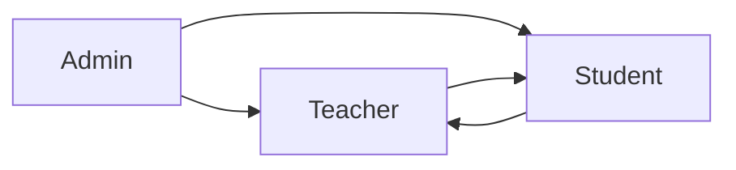
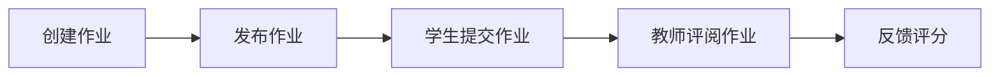
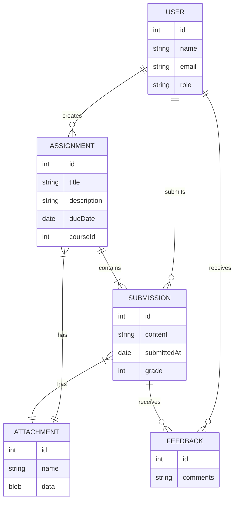
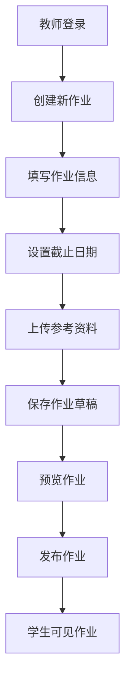
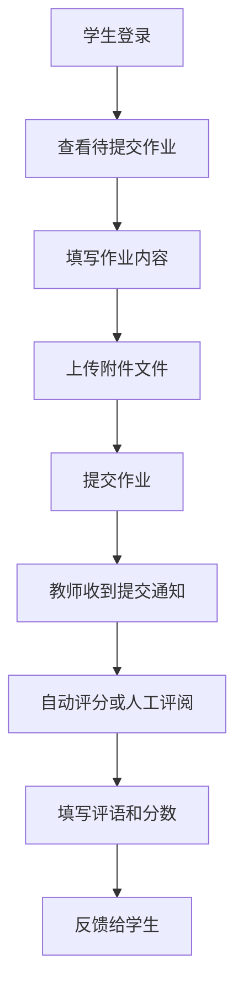
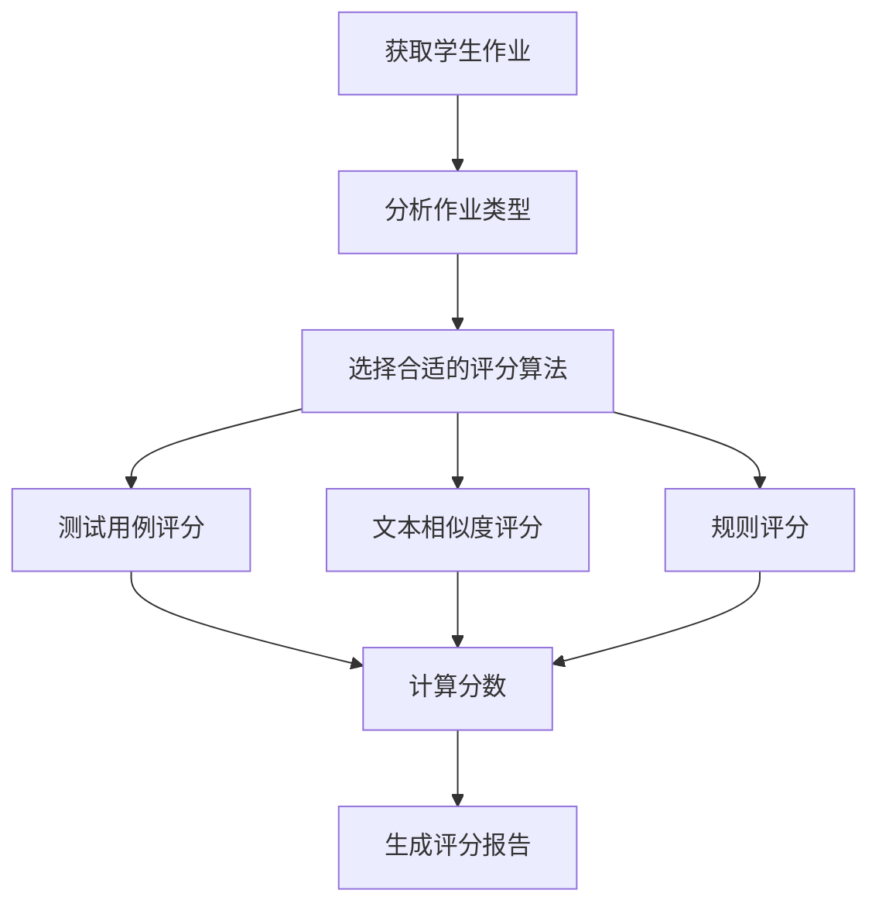
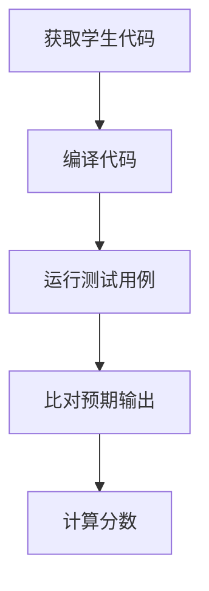
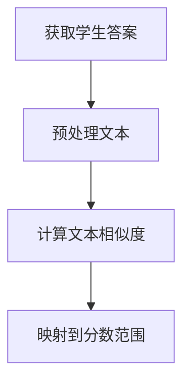
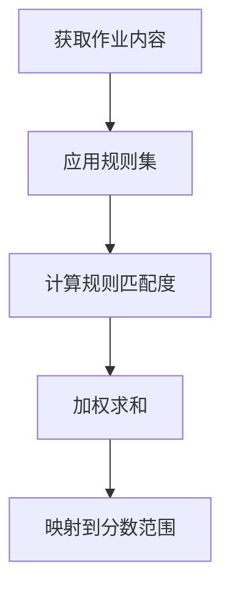

# 在线作业系统详细设计与具体代码实现

## 1. 背景介绍

### 1.1 在线作业系统的重要性

在当今教育领域,在线作业系统已经成为一个不可或缺的工具。随着在线教育和远程学习的兴起,学生和教师都需要一个高效、便捷的平台来分配、提交和评阅作业。传统的纸质作业不仅耗时耗力,而且容易出现作业丢失、评分延迟等问题。

在线作业系统解决了这些痛点,使得作业管理过程变得更加高效和透明。教师可以轻松地创建作业、设置截止日期、上传参考资料,而学生则可以在任何地点通过网络提交作业。此外,自动化评分功能也大大减轻了教师的工作负担。

### 1.2 在线作业系统的挑战

尽管在线作业系统带来了诸多好处,但其设计和实现也面临着一些重大挑战:

1. **系统可扩展性**:随着用户数量和作业数量的增加,系统需要具备良好的可扩展性,以确保高并发访问时的稳定性和响应速度。
2. **数据安全性**:作业内容往往包含学生的个人信息和知识产权,因此系统必须采取有效的加密和访问控制措施,保护数据的隐私和安全。
3. **作业评阅**:自动评分算法需要足够智能和准确,以确保评分结果的公平性和一致性。对于主观性作业,仍需要人工评阅。
4. **反作弊机制**:系统应当具备有效的防止作业抄袭和作弊的机制,保证教学过程的公平性和学习效果。

### 1.3 本文概述

本文将详细介绍一个功能完备、安全可靠的在线作业系统的设计和实现。我们将从系统架构、核心算法、数学模型到具体代码实现,全面阐述该系统的方方面面。此外,还将探讨相关的实际应用场景、工具和资源,以及该领域的发展趋势和挑战。

## 2. 核心概念与联系

在线作业系统涉及多个核心概念,它们之间存在紧密的联系。理解这些概念及其关系,对于系统设计至关重要。

### 2.1 用户角色

在线作业系统主要包括以下三种用户角色:

1. **学生(Student)**: 学生是系统的主要使用者,他们可以查看作业信息、提交作业、查看评分和反馈。
2. **教师(Teacher)**: 教师负责创建和管理作业,设置截止日期、上传参考资料,并对学生作业进行评阅和反馈。
3. **管理员(Admin)**: 管理员负责系统的整体运维,包括用户管理、权限控制、系统配置等。

这三种角色之间的关系如下:

管理员拥有对教师和学生的管理权限;教师可以创建和评阅学生的作业,学生则可以提交作业并获取教师的反馈。

### 2.2 作业生命周期

一个作业在系统中会经历以下几个阶段,形成一个完整的生命周期:

1. **创建作业(Create Assignment)**: 教师在系统中创建一个新的作业,设置作业信息、要求和截止日期。
2. **发布作业(Publish Assignment)**: 教师发布作业后,学生便可以查看和提交该作业。
3. **学生提交作业(Submit Assignment)**: 学生在截止日期前通过系统提交自己的作业。
4. **教师评阅作业(Grade Assignment)**: 教师对学生提交的作业进行评阅,可以使用自动评分或人工评分。
5. **反馈评分(Feedback and Grading)**: 教师完成评分后,将评分结果和反馈意见反馈给学生。

### 2.3 自动评分算法

对于某些作业类型(如编程作业、选择题等),系统可以采用自动评分算法,大幅减轻教师的工作量。常见的自动评分算法包括:

1. **测试用例评分(Test Case Grading)**: 针对编程作业,系统会运行一系列预设的测试用例,根据测试结果给出分数。
2. **文本相似度评分(Text Similarity Grading)**: 针对主观题作业,系统会将学生答案与标准答案进行文本相似度比对,给出分数。
3. **规则评分(Rule-based Grading)**: 根据预设的一系列规则和权重,对作业内容进行评分。

自动评分算法虽然高效,但也存在一定的局限性。对于主观性较强的作业,仍需要教师进行人工评阅。

### 2.4 数据模型

在线作业系统需要存储和管理大量的数据,因此需要一个合理的数据模型。一种典型的数据模型如下:

该数据模型包括以下主要实体:

- **USER**: 存储用户信息,如姓名、电子邮件和角色。
- **ASSIGNMENT**: 存储作业信息,如标题、描述、截止日期和所属课程。
- **SUBMISSION**: 存储学生提交的作业内容、提交时间和评分。
- **ATTACHMENT**: 存储作业相关的附件文件。
- **FEEDBACK**: 存储教师对学生作业的评语和反馈。

这些实体通过一对多和多对多的关系相互关联,形成了一个完整的数据模型。

## 3. 核心算法原理具体操作步骤

在线作业系统的核心算法主要包括以下几个方面:

### 3.1 作业创建和发布

作业创建和发布流程如下:

1. 教师登录系统。
2. 创建一个新的作业。
3. 填写作业标题、描述和要求。
4. 设置作业的截止日期和时间。
5. 上传作业相关的参考资料和附件文件。
6. 保存作业为草稿,以备后续编辑。
7. 预览作业内容,确认无误。
8. 发布作业,使其对学生可见。
9. 学生可以查看并提交该作业。

### 3.2 作业提交和评阅

作业提交和评阅流程如下:

1. 学生登录系统。
2. 查看自己需要提交的作业列表。
3. 填写作业内容,如编程代码、文字答案等。
4. 上传与作业相关的附件文件。
5. 提交作业。
6. 教师收到学生提交作业的通知。
7. 教师对作业进行自动评分或人工评阅。
8. 教师填写评语和给出分数。
9. 将评分结果和反馈意见反馈给学生。

### 3.3 自动评分算法

自动评分算法的工作流程如下:

1. 获取学生提交的作业内容。
2. 分析作业的类型,如编程作业、主观题作业等。
3. 根据作业类型,选择合适的评分算法,如测试用例评分、文本相似度评分或规则评分。
4. 应用选定的评分算法对作业进行评分。
5. 计算得出最终的分数。
6. 生成详细的评分报告,供教师参考。

#### 3.3.1 测试用例评分

对于编程作业,可以使用测试用例评分算法。该算法的工作流程如下:

1. 获取学生提交的代码文件。
2. 使用相应的编译器编译代码。
3. 运行一系列预先设计的测试用例,将测试输入传入学生代码。
4. 将学生代码的输出与预期输出进行比对。
5. 根据测试用例的通过情况,计算得出最终分数。

#### 3.3.2 文本相似度评分

对于主观题作业,可以使用文本相似度评分算法。该算法的工作流程如下:

1. 获取学生提交的文字答案。
2. 对文本进行预处理,如去除停用词、词干提取等。
3. 使用文本相似度算法(如余弦相似度、编辑距离等)计算学生答案与标准答案之间的相似度分数。
4. 将相似度分数映射到预设的分数范围,得出最终的评分结果。

#### 3.3.3 规则评分

规则评分算法根据预设的一系列规则和权重对作业进行评分。其工作流程如下:

1. 获取学生提交的作业内容。
2. 应用预先设计的一系列评分规则,如关键词匹配、语法检查等。
3. 计算作业内容与每条规则的匹配程度。
4. 根据规则的权重,对匹配度进行加权求和。
5. 将加权求和结果映射到预设的分数范围,得出最终的评分结果。

## 4. 数学模型和公式详细讲解举例说明

在自动评分算法中,常常需要使用一些数学模型和公式来量化和计算作业的分数。下面我们将详细介绍其中的几种常见模型和公式。

### 4.1 文本相似度

在文本相似度评分算法中,需要计算学生答案与标准答案之间的相似度分数。一种常用的文本相似度度量方法是**余弦相似度**。

假设将文本表示为一个向量空间模型,其中每个维度对应一个特征(如单词或词干)的权重,那么两个文本向量$\vec{A}$和$\vec{B}$之间的余弦相似度可以用下式计算:

$$\text{sim}_\text{cosine}(\vec{A}, \vec{B}) = \cos(\theta) = \frac{\vec{A} \cdot \vec{B}}{\|\vec{A}\| \|\vec{B}\|} = \frac{\sum_{i=1}^{n} A_i B_i}{\sqrt{\sum_{i=1}^{n} A_i^2} \sqrt{\sum_{i=1}^{n} B_i^2}}$$

其中$\theta$是两个向量之间的夹角,余弦相似度的值域为$[0, 1]$