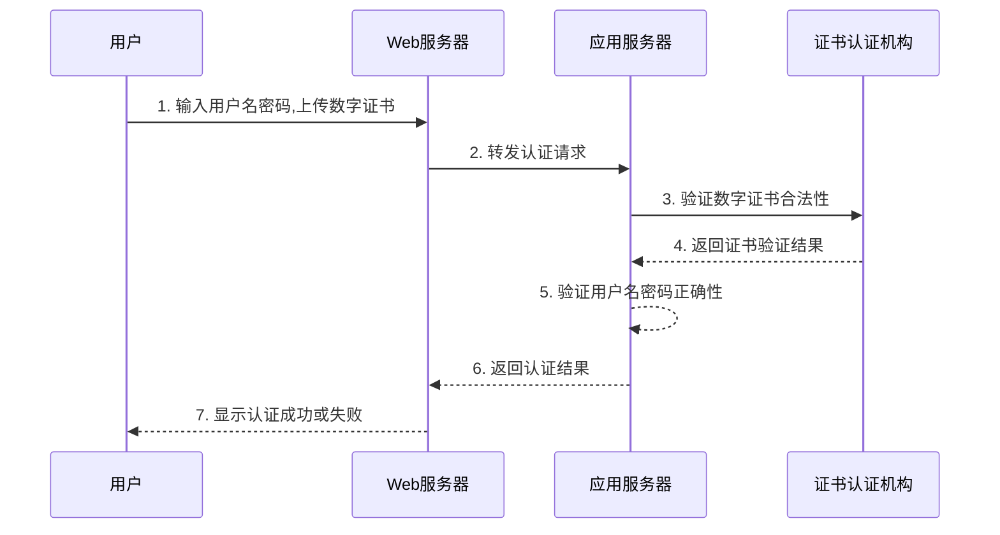
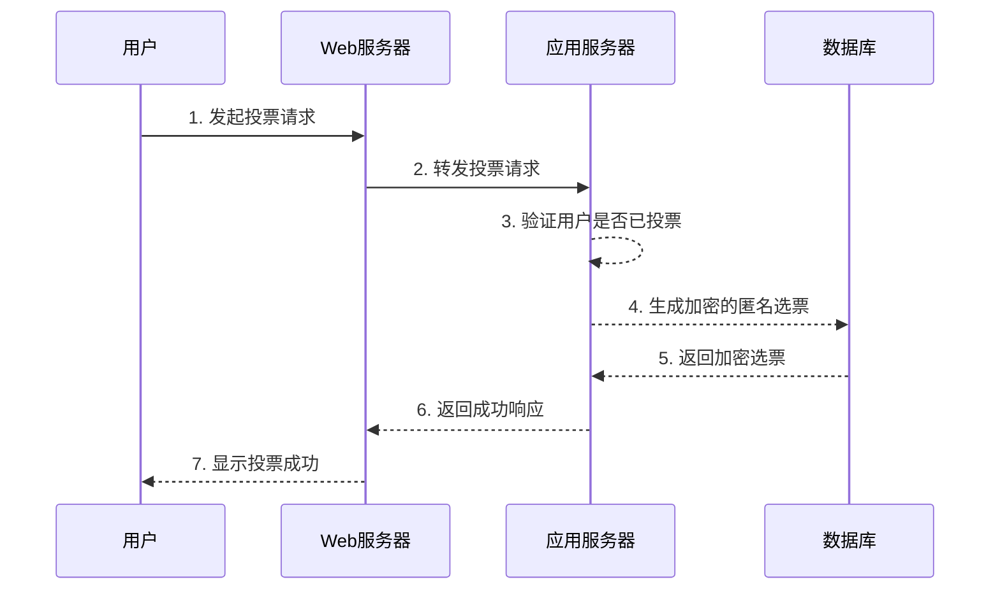
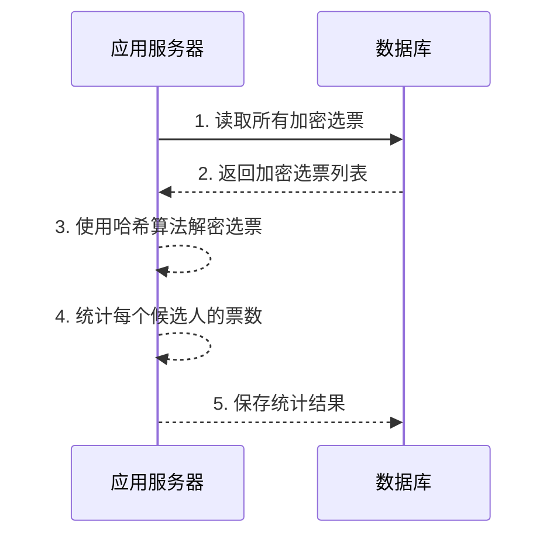

# 在线投票系统详细设计与具体代码实现

## 1. 背景介绍

### 1.1 投票系统的重要性

投票是民主社会中最基本和最重要的权利之一。它让公民能够直接参与决策过程,表达自己的意愿和选择。随着互联网技术的发展,在线投票系统应运而生,为选民提供了更加便捷、高效和透明的投票方式。

### 1.2 在线投票系统的优势

相比传统的纸质投票,在线投票系统具有以下优势:

- **高效便捷**: 选民无需亲临投票站,可以在任何地点通过互联网投票,大大节省时间和成本。
- **数据安全**: 采用加密技术保护选票数据,防止篡改和窃取,确保投票过程公平公正。
- **实时统计**: 系统可以实时统计和展示投票结果,提高透明度。
- **环保节能**: 减少大量纸质资源的消耗和运输成本。

### 1.3 在线投票系统的挑战

尽管在线投票系统有诸多优势,但也面临着一些重大挑战:

- **身份认证**: 如何确保每个选民只能投一次票,防止投票作弊。
- **系统安全**: 如何保护系统免受黑客攻击、数据窃取等安全威胁。
- **可用性**: 如何确保系统在高峰时段依然保持高可用性,满足大量并发请求。
- **透明度**: 如何让选民相信投票过程的公正性和结果的真实性。

## 2. 核心概念与联系

### 2.1 系统架构概览

在线投票系统通常采用 C/S (Client/Server) 或 B/S (Browser/Server) 架构。前者需要在客户端安装专用软件,后者只需使用浏览器即可访问。从安全性、可移植性和易用性等多方面考虑,本文将重点介绍基于 B/S 架构的在线投票系统。

该系统架构主要包括以下几个核心组件:

- **前端(Browser)**: 提供用户界面,供选民进行身份认证、查看候选人信息和投票等操作。
- **Web 服务器**: 负责处理前端请求,渲染和返回界面内容。
- **应用服务器**: 处理业务逻辑,如身份验证、投票统计等。
- **数据库**: 存储选民信息、候选人信息、投票记录等数据。

### 2.2 关键技术

实现一个安全、高效的在线投票系统需要融合多种关键技术:

- **身份认证技术**: 如数字证书、生物识别等,确保每个选民的身份唯一且合法。
- **加密技术**: 对关键数据(如选票)进行加密,防止窃取和篡改。常用的有对称加密、非对称加密和哈希算法。
- **分布式系统技术**: 如负载均衡、缓存、消息队列等,提高系统的可扩展性和高可用性。
- **区块链技术**: 基于区块链的投票系统具有去中心化、不可篡改、可追溯等特点,可以极大提高投票过程的公正性和透明度。

### 2.3 设计原则

在线投票系统的设计应遵循以下原则:

- **简单性**: 界面设计简洁友好,操作流程尽量简化,提高用户体验。
- **安全性**: 数据加密、访问控制、入侵检测等多重安全措施,确保系统绝对安全。
- **可用性**: 通过分布式部署、负载均衡等手段,提供 7*24 小时不间断的高可用性服务。
- **可扩展性**: 模块化设计,方便功能扩展和技术升级。
- **透明性**: 投票过程和最终结果对所有选民公开透明。

## 3. 核心算法原理具体操作步骤 

### 3.1 身份认证算法

为确保每个选民只能投一次票,需要对其进行严格的身份认证。常用的身份认证算法有:

#### 3.1.1 基于知识的认证

最常见的是用户名+密码的方式。用户在注册时设置一个安全的密码,投票时输入用户名和密码进行认证。这种方式简单便捷,但存在密码被窃取或暴力破解的风险。

#### 3.1.2 基于所有物的认证  

利用用户手中的"物品"进行认证,如数字证书、U盾、手机等。这种方式安全性更高,但用户需随身携带认证物品,存在一定的使用不便。

#### 3.1.3 基于生物特征的认证

利用用户的生理或行为特征(如指纹、人脸、虹膜、声纹等)进行认证。这是最安全的认证方式,但需要专门的采集设备,部署和使用成本较高。

为进一步提高安全性,可以采用多因素认证,即结合两种或多种认证方式使用。如用户名+密码+数字证书的组合认证。

下面以基于用户名+密码+数字证书的三因素认证为例,给出具体的认证流程:

### 3.2 投票算法

投票算法的核心是防止选民重复投票,并保证选票数据的完整性和匿名性。以下是一种常用的投票算法流程:

算法步骤说明:

1. 用户向 Web 服务器发起投票请求。
2. Web 服务器将请求转发给应用服务器。
3. 应用服务器验证该用户是否已经投过票,如果已投票直接拒绝。
4. 应用服务器为用户生成一个加密的匿名选票,选票包含用户的投票信息(如候选人编号)但不包含任何身份信息。
5. 将加密选票存储到数据库中。
6. 向 Web 服务器返回投票成功的响应。
7. Web 服务器将成功信息展示给用户。

该算法的优点是:

- 匿名性: 加密选票不包含任何身份信息,无法追查投票者身份。
- 防重复投票: 每个用户只能投一次票。
- 完整性: 加密选票无法被篡改。

### 3.3 结果统计算法

投票结束后,需要对所有选票进行解密和统计,得出最终结果。以下是一种基于哈希算法的结果统计流程:

算法步骤说明:

1. 应用服务器从数据库读取所有加密选票。
2. 数据库返回加密选票列表。
3. 应用服务器使用相同的哈希算法解密所有选票,获取原始投票信息。
4. 统计每个候选人的票数。
5. 将统计结果保存到数据库中。

使用哈希算法的好处是可以在不知道原始密钥的情况下,对加密数据进行验证和解密。由于哈希算法不可逆,无法根据哈希值反推出原始数据,因此算法的安全性较高。

## 4. 数学模型和公式详细讲解举例说明

### 4.1 非对称加密算法

非对称加密算法(也称公钥密码算法)使用两个密钥:公钥和私钥。公钥可以公开,用于加密数据;私钥为保密的密钥,用于解密数据。

非对称加密算法的数学原理是基于"困难问题",即给定一个方程很容易计算,但要反解出原始值是非常困难的。最常用的有 RSA 算法和 ECC(椭圆曲线加密)算法。

以 RSA 算法为例,它的数学原理是基于这样一个事实:将两个大素数相乘很容易,但想要对其乘积进行因式分解却极其困难。

RSA 算法流程如下:

1. 选择两个不同的大素数 $p$ 和 $q$。
2. 计算 $n = p \times q$。
3. 计算 $\varphi(n) = (p-1)(q-1)$。
4. 选择一个小于 $\varphi(n)$ 的整数 $e$,使 $e$ 和 $\varphi(n)$ 互质。
5. 找到一个整数 $d$,使 $d \times e \equiv 1 \pmod{\varphi(n)}$。
6. 公钥是 $(e,n)$,私钥是 $(d,n)$。

加密过程:

$$
c = m^e \bmod n
$$

其中 $m$ 为明文消息, $c$ 为密文。

解密过程:

$$
m = c^d \bmod n
$$

RSA 算法的安全性依赖于对一个大数 $n$ 进行因式分解的难度。目前公认的最有效的方法是数域筛选法,其算法复杂度为 $O(e^{c(\ln n)^{1/3}(\ln \ln n)^{2/3}})$,其中 $c$ 约为 1.923。也就是说,随着 $n$ 的位数增加,算法复杂度呈指数级增长。因此,只要选取足够长的密钥,RSA 算法是非常安全的。

### 4.2 哈希算法

哈希算法是一种单向不可逆的数学函数,可以将任意长度的数据映射为固定长度的哈希值。常用的哈希算法有 MD5、SHA 系列等。

哈希算法具有以下特点:

- 加密过程不需要密钥
- 给定明文,很容易计算出哈希值
- 但已知哈希值,想要反推出明文是非常困难的(这被称为"哈希碰撞")
- 哈希值具有高度的压缩性,极小的改动也会导致哈希值完全不同

哈希算法可以用于数字签名、数据完整性校验、认证协议等场景。在投票系统中,可以使用哈希算法为选票数据生成"指纹",并在统计结果时使用相同算法对选票进行解密。

以 SHA-256 为例,其哈希算法流程为:

1. 将输入消息填充为 512 比特的倍数。
2. 初始化 8 个 32 位链接变量。
3. 遍历每个 512 比特的消息块:
   - 将当前块分为 16 个 32 位子块。
   - 进行 64 轮迭代运算,每轮都会更新链接变量的值。
4. 输出最终的 256 位哈希值。

SHA-256 算法的核心是不断进行异或、移位、加法等位运算,使得输出哈希值对输入消息的每一个bit都极为敏感。即便只改变一个bit,最终哈希值也会完全不同。这种雪崩效应可以有效防止哈希