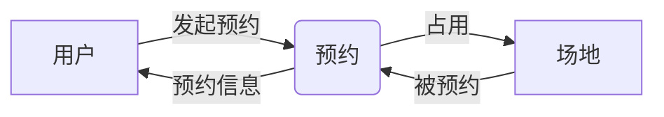
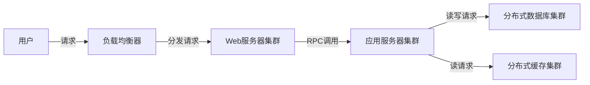

# 场地预约系统的设计与实现

作者：禅与计算机程序设计艺术

## 1. 背景介绍
### 1.1 场地预约系统的重要性
在现代社会中,各类场地资源的使用需求日益增长。无论是会议室、体育馆、教室还是其他公共设施,高效合理地分配和管理场地资源已成为一项重要课题。场地预约系统应运而生,旨在简化预约流程,优化资源配置,为用户提供便捷高效的预约服务。

### 1.2 场地预约系统面临的挑战  
尽管场地预约系统为资源管理带来诸多益处,但在实际设计和实现过程中仍面临一系列挑战:

- 复杂的业务逻辑:不同类型场地可能有不同的预约规则和限制,如何在系统中灵活处理这些差异化需求是一大难点。
- 高并发访问:在某些时段,系统可能面临大量用户同时预约的高并发场景,需要有效的性能优化和负载均衡机制。  
- 数据一致性:在分布式环境下,如何保证预约数据的一致性,避免出现重复预约或遗漏等问题。
- 用户体验:系统需要提供直观友好的界面,简化预约流程,提升用户满意度。

### 1.3 本文的主要内容
本文将重点探讨场地预约系统的设计与实现。内容涵盖系统整体架构、核心功能模块、关键算法、数据库设计、性能优化等多个方面。通过理论与实践相结合的方式,展现一套完整的场地预约系统解决方案。

## 2. 核心概念与关联
要设计一套完善的场地预约系统,首先需要理清其中的核心概念,以及它们之间的关联关系。

### 2.1 用户
用户是系统的核心参与者,可分为普通用户和管理员两类。普通用户主要进行场地预约等操作,管理员负责场地管理、预约审核、系统维护等。

### 2.2 场地
场地是系统管理的核心资源,具有多种属性,如:

- 场地类型:会议室、教室、体育场等
- 容纳人数:不同场地可容纳人数不同
- 地理位置:所在建筑、楼层等
- 可预约时段:场地可供预约的起止时间
- 设施设备:如投影仪、白板、音响等

### 2.3 预约
预约是用户申请使用场地资源的过程,包含以下关键信息:

- 预约人:发起预约的用户
- 预约场地:用户预约的目标场地
- 预约时段:场地使用的起止时间
- 参与人员:使用场地的人员名单
- 预约状态:如待审核、已通过、已拒绝等

### 2.4 核心概念关联图
下图展示了用户、场地、预约三个核心概念之间的关联关系:

从图中可见,用户发起预约,生成预约记录,预约记录关联用户和场地,表示场地被用户在特定时段占用。

## 3. 系统架构设计
了解核心概念后,我们进一步探讨场地预约系统的架构设计。本节主要从逻辑架构和物理架构两个层面展开。

### 3.1 逻辑架构
场地预约系统的逻辑架构可分为三层:表示层、业务层、数据层。

#### 3.1.1 表示层
表示层负责与用户的交互,包括用户界面的展示和用户请求的接收。常见的技术选型有:

- Web网页:使用HTML/CSS/JavaScript实现B/S架构的Web应用
- 移动App:使用iOS/Android等平台开发移动端原生应用
- 小程序:基于微信等平台开发轻量级应用

#### 3.1.2 业务层
业务层是系统的核心,负责处理各类业务逻辑,如用户登录、场地搜索、预约管理等。业务层通常采用分层设计,将功能划分为:

- Controller:接收表示层请求,调用Service完成业务处理
- Service:实现具体的业务逻辑,如预约时段冲突检测、余位计算等
- DAO:数据访问对象,与数据层交互,实现数据的CRUD操作

#### 3.1.3 数据层
数据层负责数据的持久化存储,为业务层提供数据支撑。常见的数据存储方案包括:

- 关系型数据库:如MySQL、Oracle等,适合存储结构化数据
- 非关系型数据库:如Redis、MongoDB等,适合存储高并发访问的热点数据或非结构化数据
- 文件存储:如分布式文件系统HDFS,适合存储静态资源

### 3.2 物理架构
物理架构描述了系统的实际部署方式,需要综合考虑性能、可用性、扩展性等因素。下图展示了一种常见的物理部署架构:

- 负载均衡器:如Nginx,实现请求分发,提高系统并发处理能力
- Web服务器集群:如Tomcat,部署Web应用,处理用户请求
- 应用服务器集群:部署核心业务应用,执行业务逻辑
- 分布式数据库集群:如MySQL集群,实现数据存储和备份
- 分布式缓存集群:如Redis集群,缓存热点数据,提高读取性能

## 4. 关键算法与数据结构
场地预约系统中涉及一些关键算法和数据结构,用于解决特定问题,提升系统性能。

### 4.1 预约时段冲突检测
为避免不同用户预约时段冲突,系统需要在用户提交预约请求时进行检测。一种简单的思路是将场地的可预约时段划分为若干个时间块,每个时间块用一个bit表示是否被占用。检测时,只需判断用户预约时段覆盖的时间块是否已被占用。

例如,将一天划分为24个时间块,每块1小时。用一个24位的二进制数表示一个场地一天的占用情况,1表示已被占用,0表示空闲。当用户预约10:00~12:00时,检测第10、11位是否为0即可。

### 4.2 场地搜索算法
用户搜索场地时,系统需要根据用户指定的条件(如位置、容量、时间等),快速筛选出匹配的场地。考虑到搜索条件的多样性和组合性,可采用倒排索引等技术加速搜索。

具体而言,对场地的各个属性分别建立倒排索引。搜索时,先分别查找满足各条件的场地ID集合,再求这些集合的交集,得到同时满足所有条件的场地。

### 4.3 场地推荐算法
为提升用户体验,系统可根据用户的历史预约记录、偏好等,主动推荐合适的场地。推荐算法可采用协同过滤、基于内容等经典方法。

以协同过滤为例,基本思想是:找到与目标用户预约行为相似的其他用户,推荐这些用户预约过但目标用户尚未预约的场地。相似度可用Jaccard系数等指标衡量。

## 5. 数据库设计
合理的数据库设计是保证系统性能和数据一致性的基础。本节简要介绍场地预约系统的核心数据表设计。

### 5.1 用户表(user)

| 字段名 | 类型 | 说明 |
| --- | --- | --- |
| id | int | 主键,自增ID |
| username | varchar(50) | 用户名,唯一 |
| password | varchar(50) | 密码,加密存储 |
| role | int | 角色,0-普通用户,1-管理员 |
| email | varchar(50) | 邮箱 |
| phone | varchar(20) | 手机号 |
| create_time | datetime | 创建时间 |

### 5.2 场地表(venue)

| 字段名 | 类型 | 说明 |
| --- | --- | --- |
| id | int | 主键,自增ID |  
| name | varchar(50) | 场地名称 |
| type | int | 场地类型,如会议室、教室等 |
| capacity | int | 可容纳人数  |
| location | varchar(100) | 地理位置,如某楼某层 |
| description | varchar(500) | 场地描述 |
| equipment | varchar(500) | 设施设备 |
| create_time | datetime | 创建时间 |

### 5.3 预约表(reservation)

| 字段名 | 类型 | 说明 |
| --- | --- | --- |
| id | int | 主键,自增ID |
| user_id | int | 预约人ID,外键关联user表 |
| venue_id | int | 预约场地ID,外键关联venue表 |  
| start_time | datetime | 开始时间 |
| end_time | datetime | 结束时间 |
| participants | varchar(500) | 参与人员名单 |
| status | int | 预约状态,如0-待审核,1-通过,2-拒绝 |
| create_time | datetime | 创建时间 |

以上三个核心表通过主外键关联,构成了场地预约系统的基本数据模型。在实际应用中,还可能需要一些辅助表,如场地占用表、系统配置表等。

## 6. 系统实现与优化
本节介绍场地预约系统的实现要点和优化措施。

### 6.1 预约业务流程
场地预约的基本业务流程如下:

1. 用户登录系统,进入预约界面
2. 用户设置预约条件(如位置、时间、人数等),搜索空闲场地
3. 用户选定场地,填写预约信息,提交预约请求
4. 系统检测预约时段是否冲突,若不冲突则生成待审核预约记录
5. 管理员登录系统,进入预约审核界面
6. 管理员审核预约请求,选择通过或拒绝
7. 系统更新预约记录状态,并通知用户审核结果

针对这一流程,系统需提供一系列功能接口,如用户注册登录、场地搜索、预约提交、预约审核等。

### 6.2 并发控制
考虑到多用户并发预约的场景,系统需采取必要的并发控制措施,避免出现预约冲突。一种常见的方案是采用悲观锁,即在用户提交预约请求时,对相关数据加锁,避免其他用户同时修改。

具体而言,可在数据库层面使用行级锁,如MySQL的`SELECT ... FOR UPDATE`语句。也可在应用层面使用分布式锁,如基于Redis的`SETNX`命令。

### 6.3 缓存优化
对于一些高频访问的热点数据,如某些热门场地的预约情况,可采用缓存优化策略,减轻数据库压力,提高查询性能。

常见的缓存方案有:

- 内存缓存:如HashMap,适合单机部署
- 分布式缓存:如Redis,适合集群部署
- 多级缓存:如同时使用内存缓存和Redis,实现分层缓存

在缓存的使用过程中,需注意缓存与数据库的一致性问题,可采用"先更新数据库,再更新缓存"的策略,并设置合理的缓存过期时间。

### 6.4 消息队列
对于一些异步或耗时的操作,如发送预约结果通知邮件,可使用消息队列实现解耦和削峰。

常见的消息队列有RabbitMQ、Kafka等。系统可在完成预约审核后,将通知任务发送到消息队列,由专门的消费者程序异步处理。这样可避免耗时任务阻塞主流程,提高系统响应速度。

## 7. 总结与展望
本文全面探讨了场地预约系统的设计与实现,涵盖需求分析、架构设计、关键算法、数据库设计、系统优化等各个方面。场地预约系统作为一种典型的资源管理系统,在设计上需兼顾业务复杂度和系统性能,在实现上需采用合适的技术手段和优化策略。

未