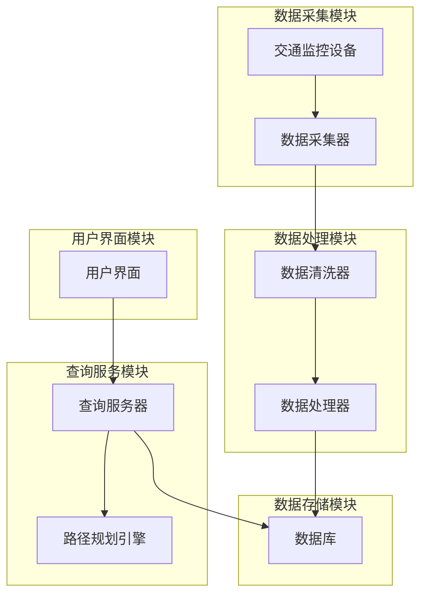

# 城市交通查询系统详细设计与具体代码实现

## 1. 背景介绍

### 1.1 城市交通问题及其重要性

随着城市化进程的加快,交通拥堵、环境污染等问题日益严重,给城市的可持续发展带来了巨大挑战。有效的交通管理对于缓解这些问题至关重要。传统的交通管理方式已经无法满足现代城市的需求,因此需要引入新的技术手段来优化交通流量,提高交通运输效率。

### 1.2 交通信息查询系统的作用

交通信息查询系统作为智能交通系统的重要组成部分,可以实时收集和处理城市交通数据,为政府决策部门、交通运营商和市民提供准确、实时的交通信息服务。通过查询系统,用户可以获取道路状况、交通事故、公交车实时位置等信息,从而合理规划出行路线,避开拥堵路段,节省时间和燃料。

### 1.3 系统设计的挑战

设计一个高效、可靠的城市交通查询系统需要解决以下几个主要挑战:

1. **大规模数据处理**: 随着城市规模的扩大和物联网设备的广泛应用,交通数据的规模呈指数级增长,对系统的数据存储、查询和计算能力提出了很高的要求。

2. **实时性要求**: 交通状况瞬息万变,查询系统必须能够实时采集和处理最新数据,为用户提供准确的实时信息。

3. **复杂路网拓扑结构**: 现代城市路网结构错综复杂,系统需要对路网进行精细化建模,准确计算不同路径的时间和距离。

4. **多源异构数据融合**: 交通数据来源众多,包括路侧感应器、视频监控、移动设备GPS等,需要将这些异构数据进行融合处理。

5. **可扩展性和容错性**: 随着系统规模和访问量的增长,需要保证系统的可扩展性和容错性,提供稳定可靠的服务。

## 2. 核心概念与联系

### 2.1 系统架构概览

城市交通查询系统通常采用分布式架构,由数据采集、数据处理、数据存储、查询服务和用户界面等多个模块组成。下图展示了系统的整体架构:

### 2.2 关键技术概念

1. **数据采集**: 通过各种传感器和探测设备(如视频监控、车辆检测器、移动设备GPS等)实时采集交通数据,包括车流量、车速、路况等。

2. **数据清洗**: 对采集到的原始数据进行预处理,剔除无效和异常数据,提高数据质量。

3. **数据融合**: 将来自不同来源的异构数据(如路测数据、视频数据、气象数据等)进行融合,获得更加全面准确的交通状态描述。

4. **路网建模**: 对城市道路网络进行数字化建模,构建路网拓扑结构,为路径规划和时间距离计算奠定基础。

5. **路径规划算法**: 根据实时交通数据及用户出行需求,计算出最优的出行路径,并考虑交通管制、事故等因素进行动态调整。

6. **大规模并行计算**: 利用分布式计算框架(如Spark、Flink等)对海量交通数据进行实时处理和分析。

7. **数据可视化**: 将交通信息以图形化方式呈现,直观反映交通状况,辅助决策。

### 2.3 系统模块间的联系

各个模块通过高效的数据流水线相互衔接,共同完成交通信息查询服务:

1. **数据采集模块** 负责从各种来源实时采集原始交通数据,并将其传输给数据处理模块。

2. **数据处理模块** 对原始数据进行清洗、融合和处理,得到高质量的交通状态数据,并将其持久化存储到数据存储模块。

3. **数据存储模块** 负责管理和存储处理后的交通数据,为查询服务模块提供数据支持。

4. **查询服务模块** 接收用户的查询请求,从数据存储模块获取所需数据,并利用路径规划算法计算出最优路径,将查询结果返回给用户界面模块。

5. **用户界面模块** 为用户提供友好的图形化交互界面,接收查询请求并显示查询结果。

## 3. 核心算法原理与具体操作步骤

### 3.1 数据采集与清洗

#### 3.1.1 数据采集方式

交通数据的主要采集方式包括:

1. **路侧设备采集**:通过安装在道路两侧的诸如视频监控、感应线圈、雷达等设备,实时检测车辆流量、车速、占有率等数据。

2. **移动设备采集**:利用车载和手持移动设备(如手机)的GPS定位数据,获取车辆实时位置和速度信息。

3. **人工采集**:由人工观察员记录并上报特殊事件(如事故、路面施工等)的信息。

4. **第三方数据采集**:从地图服务商、气象部门等第三方获取路况、天气等相关数据。

#### 3.1.2 数据清洗步骤

1. **异常值检测**:通过统计分析或机器学习模型,检测并剔除明显偏离正常范围的异常数据。

2. **空值填充**:对缺失的数据点利用插值法或时间序列预测模型进行填补。

3. **数据去重**:针对重复采集的数据进行识别和合并。

4. **数据格式规范化**:将不同来源的数据统一转换为标准格式。

5. **数据压缩**:对处理后的数据进行压缩,以节省存储空间。

### 3.2 路网建模与路径规划

#### 3.2.1 路网建模

将现实世界的道路网络抽象为一个加权有向图 $G(V, E)$,其中:

- 节点集合 $V$ 表示路口或重要地点
- 边集合 $E$ 表示道路路段
- 每条边 $e \in E$ 都有对应的权重,如距离、时间等

为提高查询效率,可以对路网进行分层建模,将城市划分为多个区域,每个区域内的路网独立建模,通过区域之间的过渡边相连接。

#### 3.2.2 路径规划算法

常用的路径规划算法有:

1. **Dijkstra算法**: 在无权重的图中寻找最短路径。时间复杂度 $O((|E|+|V|)\log |V|)$。

2. **A*算法**: 基于启发式搜索的最短路径算法,比Dijkstra更高效。时间复杂度 $O(b^{d})$,其中 $b$ 为分支因子, $d$ 为最短路径长度。

3. **Contraction Hierarchies(CH)**: 基于多级路网层次结构的快速路径规划算法。预处理时间 $O(|V|\log |V|)$,查询时间几乎为常数。

4. **时变最短路径算法**: 考虑时间因素的最短路径算法,如时间扩展网络模型。

#### 3.2.3 算法优化策略

1. **多源并行计算**: 利用分布式计算框架在多台机器上并行执行路径规划任务。

2. **路网分层分治**: 将路网划分为多个小区域,分别计算各区域内的最短路径,再合并得到全局最优解。

3. **路径缓存与预取**: 对常见的查询路径进行缓存,对临近路径进行预取,提高查询效率。

4. **动态路网权重调整**: 根据实时交通状况动态调整路网边权重,以获得更加准确的路径规划结果。

5. **多约束路径规划**: 在最短路径的基础上增加其他约束条件,如避开拥堵路段、最小化费用等。

### 3.3 交通状态评估与预测

#### 3.3.1 交通状态评估指标

1. **交通流量**: 通过车流量、车速等指标评估道路的通行状况。

2. **拥堵程度**: 利用路段占有率、行程指数等指标衡量拥堵程度。

3. **旅行时间可靠性**: 评估实际旅行时间与预期时间的差异。

4. **环境影响**: 考虑交通对噪音、排放等环境因素的影响。

#### 3.3.2 交通状态预测模型

1. **时间序列模型**: 基于历史数据的时间序列模型,如ARIMA、指数平滑等。

2. **深度学习模型**: 利用卷积神经网络、递归神经网络等深度学习模型进行交通流量预测。

3. **模式识别模型**: 发现交通数据中的周期性模式和突发事件模式,并预测其发生概率。

4. **融合模型**: 将基于物理的参数模型与数据驱动的机器学习模型相结合,提高预测精度。

#### 3.3.3 预测模型应用

1. **动态路网调整**: 根据交通状态预测,动态调整路网边权重,引导交通流量。

2. **交通信号优化**: 预测交通流量变化,优化信号配时方案,缓解拥堵。

3. **事件预警**: 预测交通事件发生的可能性,提前做出应对准备。

4. **资源调度**: 基于交通需求预测,优化公共交通运力和停车资源的调度。

## 4. 数学模型和公式详细讲解举例说明

### 4.1 路网建模数学表示

我们将城市道路网络抽象为一个加权有向图 $G(V, E)$:

- $V$ 是节点集合,表示路口或重要地点
- $E \subseteq V \times V$ 是边集合,表示道路路段
- 每条边 $e_{ij} \in E$ 具有一个权重 $w_{ij}$,表示从节点 $i$ 到节点 $j$ 的距离或行驶时间

对于无向图,有 $e_{ij} = e_{ji}$,且 $w_{ij} = w_{ji}$。

为了提高路径规划的效率,我们可以对路网进行分层建模。假设将城市划分为 $m$ 个区域,每个区域内的路网用一个子图 $G_i(V_i, E_i)$ 表示,则整个城市路网可以表示为:

$$
G(V, E) = \bigcup_{i=1}^m G_i(V_i, E_i) \cup E_c
$$

其中 $E_c$ 是区域之间的过渡边集合。这种分层建模方式可以将复杂的全局路径规划问题分解为多个小规模的子问题,从而提高计算效率。

### 4.2 交通流量模型

交通流量是衡量道路通行能力的重要指标。我们用 $q$ 表示单位时间内通过某一路段的车辆数量,称为"流量"或"流率"。

#### 4.2.1 宏观流量模型

经典的宏观流量模型是**LWR模型**,由**Lighthill-Whitham**和**Richards**分别独立提出:

$$
\frac{\partial \rho(x,t)}{\partial t} + \frac{\partial q(x,t)}{\partial x} = 0
$$

$$
q(x,t) = \rho(x,t) \cdot v(x,t)
$$

其中:

- $\rho(x,t)$ 表示在时刻 $t$、位置 $x$ 处的交通密度(车辆数/路段长度)
- $q(x,t)$ 表示在时刻 $t$、位置 $x$ 处的交通流量
- $v(x,t)$ 表示在时刻 $t$、位置 $x$ 处的平均车速

该模型假设交通流为不可压缩流体,描述了密度、流量和车速之间的关系。

#### 4.2.2 车辆追随模型

微观