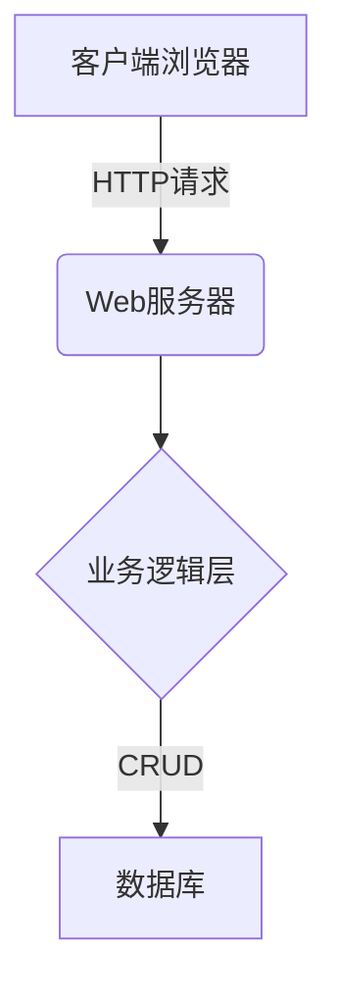
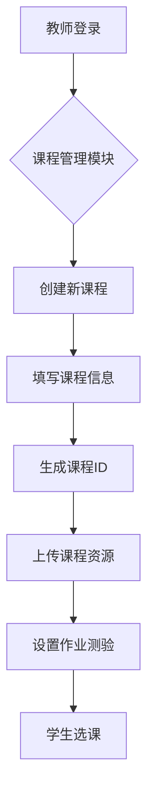
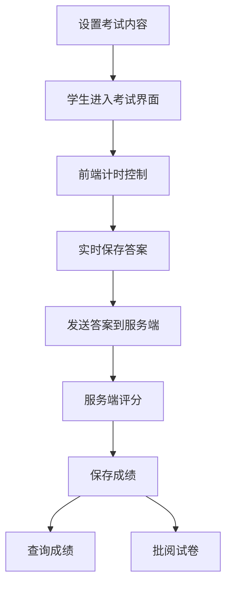
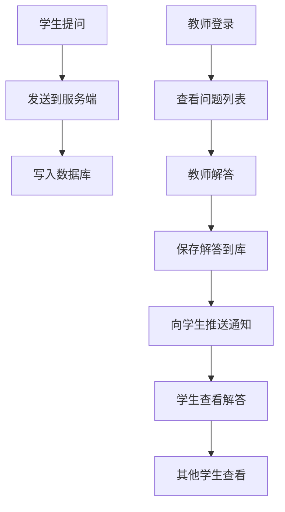

# 基于B/S模式的网络教学系统详细设计与具体代码实现

## 1.背景介绍

### 1.1 网络教学系统的需求

随着互联网技术的快速发展和普及,在线教育已经成为一种重要的教学模式。网络教学系统可以突破时间和空间的限制,为学习者提供更加灵活和便利的学习方式。同时,它也为教师提供了一个新的教学平台,可以更好地组织教学活动,管理学习资源,并及时了解学生的学习情况。

网络教学系统的主要需求包括:

- 提供在线课程资源,如课件、视频、练习等
- 支持教师发布课程公告、作业、测验等
- 提供在线答疑和讨论区,增强师生互动
- 实现学习过程管理,如课程选课、成绩查询等
- 具有良好的用户体验,方便师生使用

### 1.2 B/S模式介绍

B/S(Browser/Server)模式,即浏览器/服务器模式,是一种常见的软件系统架构模式。在这种模式下,客户端只需要一个浏览器,通过网络与服务器进行交互,将大部分的业务逻辑放在服务器端实现。

B/S模式具有以下优点:

- 跨平台性好,只需一个浏览器即可使用
- 客户端简单,无需安装复杂的软件
- 集中式部署和维护,降低了系统维护成本
- 支持海量访问,扩展性好

因此,基于B/S模式开发网络教学系统是一个合理的选择。

## 2.核心概念与联系

### 2.1 系统架构

网络教学系统基于B/S模式,采用经典的三层架构设计,包括表现层(前端)、业务逻辑层(服务端)和数据访问层。



- 表现层:使用HTML、CSS、JavaScript等Web技术构建,负责展示界面和处理用户交互
- 业务逻辑层:使用Java、Python等编程语言开发,实现系统的核心功能
- 数据访问层:通过数据库管理系统(如MySQL)存储和管理系统数据

### 2.2 关键技术

网络教学系统的实现涉及以下关键技术:

- Web开发技术:HTML/CSS/JavaScript、JSP/Servlet、Spring/SpringMVC等
- 数据库技术:MySQL、ORM框架(如Hibernate)
- 安全技术:用户认证、授权、加密等
- 视频技术:在线视频播放、视频存储等
- 消息推送技术:实现系统通知、在线答疑等

## 3.核心算法原理具体操作步骤

### 3.1 教师课程管理

1. 教师登录系统后,可以进入课程管理模块
2. 教师可以创建新课程,填写课程信息(名称、简介等)
3. 系统根据教师信息和课程信息生成唯一课程ID
4. 教师可以为课程上传课件(PPT、PDF等)、录制视频、设置作业和测验
5. 学生可以选择自己感兴趣的课程,并查看课程相关资源和完成作业测验



### 3.2 在线考试算法

1. 教师在课程管理模块设置考试内容(题目、分值、时间等)
2. 考试时间开始时,学生可以进入考试界面,开始作答
3. 前端通过JavaScript计时,控制作答时间
4. 学生作答过程中,答案实时保存到本地
5. 考试结束后,前端将答案发送到服务端
6. 服务端根据评分规则计算分数,保存到数据库
7. 学生可以查询成绩,教师可以批阅试卷



### 3.3 在线答疑算法

1. 学生在学习过程中可以提出问题
2. 问题被发送到服务端,写入答疑数据库表
3. 教师登录后,可以查看尚未解决的问题列表
4. 教师选择问题进行解答,答复内容存入数据库
5. 系统向提问学生推送通知,学生可以查看教师的解答
6. 其他学生也可以查看这个问题和最佳解答,共享知识



## 4.数学模型和公式详细讲解举例说明

在教学系统中,一些数学模型和公式可以用于智能组卷、自动阅卷等功能。

### 4.1 智能组卷算法

智能组卷是根据一定的策略,自动组合出符合要求的试卷。常用的组卷策略包括:

- 知识点覆盖:确保试卷包含所有需要考查的知识点
- 难度分布:控制不同难度题目的比例
- 题型分布:控制不同题型的数量
- 分值分布:控制总分和每个题目的分值

设知识点集合为$K=\{k_1,k_2,...,k_n\}$,难度级别集合为$D=\{d_1,d_2,...,d_m\}$,题型集合为$T=\{t_1,t_2,...,t_l\}$。

令$p_{ij}$表示第i个知识点、第j个难度级别对应的题目数量。令$q_{ik}$表示第i个知识点、第k个题型对应的题目数量。则组卷目标函数可以表示为:

$$
\min \sum_{i=1}^{n}(1-\frac{\sum_{j=1}^{m}p_{ij}}{p_i^*})^2+\sum_{i=1}^{n}(1-\frac{\sum_{k=1}^{l}q_{ik}}{q_i^*})^2
$$

其中$p_i^*$和$q_i^*$分别表示第i个知识点的目标题目数量。

### 4.2 自动阅卷模型

自动阅卷可以减轻教师的阅卷压力,提高阅卷效率。常用的自动阅卷模型包括:

- 客观题自动判分
- 主观题智能评分

以主观题自动评分为例,可以使用机器学习的监督学习算法,将学生答案与标准答案的相似度作为监督信号。

假设学生答案为$A$,标准答案为$B$,可以将$A$和$B$分别表示为特征向量$\vec{a}$和$\vec{b}$,则相似度可以定义为:

$$
\text{sim}(\vec{a},\vec{b})=\frac{\vec{a}\cdot\vec{b}}{||\vec{a}||||\vec{b}||}
$$

对于给定的一个训练集$\{(A_i,B_i,y_i)\}_{i=1}^N$,其中$y_i$是人工评分的分数,可以训练一个回归模型:

$$
f(\vec{a},\vec{b})=\alpha\cdot\text{sim}(\vec{a},\vec{b})+\beta
$$

使得$f(\vec{a_i},\vec{b_i})\approx y_i$,从而实现自动评分。

## 5.项目实践:代码实例和详细解释说明

接下来我们通过具体的代码实例,来详细说明系统的实现过程。

### 5.1 前端实现

前端使用React框架实现,提供用户界面和交互功能。

#### 5.1.1 课程列表页面

```jsx
import React, { useState, useEffect } from 'react';
import axios from 'axios';

const CourseList = () => {
  const [courses, setCourses] = useState([]);

  useEffect(() => {
    axios.get('/api/courses')
      .then(res => setCourses(res.data))
      .catch(err => console.error(err));
  }, []);

  return (
    <div>
      <h2>课程列表</h2>
      <ul>
        {courses.map(course => (
          <li key={course.id}>
            <h3>{course.name}</h3>
            <p>{course.description}</p>
            <button>加入课程</button>
          </li>
        ))}
      </ul>
    </div>
  );
};

export default CourseList;
```

- 使用`useState`和`useEffect`钩子函数实现组件状态管理和生命周期方法
- 在`useEffect`中发送GET请求获取课程列表数据
- 使用`map`方法遍历课程列表,渲染每个课程的信息和"加入课程"按钮

#### 5.1.2 在线考试界面

```jsx
import React, { useState, useEffect } from 'react';
import axios from 'axios';

const ExamPage = () => {
  const [exam, setExam] = useState(null);
  const [answers, setAnswers] = useState({});
  const [timeLeft, setTimeLeft] = useState(0);

  useEffect(() => {
    axios.get('/api/exams/123') // 获取考试ID为123的考试信息
      .then(res => {
        setExam(res.data);
        setTimeLeft(res.data.duration * 60); // 考试时长(分钟)转换为秒
      })
      .catch(err => console.error(err));

    const timer = setInterval(() => {
      setTimeLeft(prevTime => prevTime - 1);
    }, 1000);

    return () => clearInterval(timer);
  }, []);

  useEffect(() => {
    const handleBeforeUnload = () => {
      axios.post('/api/exams/123/answers', answers); // 提交答案
    };

    window.addEventListener('beforeunload', handleBeforeUnload);

    return () => {
      window.removeEventListener('beforeunload', handleBeforeUnload);
    };
  }, [answers]);

  const handleAnswerChange = (questionId, answer) => {
    setAnswers(prevAnswers => ({
      ...prevAnswers,
      [questionId]: answer
    }));
  };

  return exam ? (
    <div>
      <h2>{exam.title}</h2>
      <p>剩余时间: {Math.floor(timeLeft / 60)}:{(timeLeft % 60).toString().padStart(2, '0')}</p>
      {exam.questions.map(question => (
        <div key={question.id}>
          <h3>{question.text}</h3>
          {/* 根据题型渲染不同的答题组件 */}
        </div>
      ))}
    </div>
  ) : (
    <div>加载中...</div>
  );
};

export default ExamPage;
```

- 使用`useState`钩子函数管理考试信息、答案和剩余时间状态
- 在`useEffect`中获取考试信息,并启动计时器
- 使用`window.addEventListener`在组件卸载时提交答案
- 实现`handleAnswerChange`方法,更新答案状态
- 渲染考试标题、剩余时间和题目信息

#### 5.1.3 在线答疑界面

```jsx
import React, { useState, useEffect } from 'react';
import axios from 'axios';

const QAPage = () => {
  const [questions, setQuestions] = useState([]);
  const [newQuestion, setNewQuestion] = useState('');

  useEffect(() => {
    axios.get('/api/questions')
      .then(res => setQuestions(res.data))
      .catch(err => console.error(err));
  }, []);

  const handleQuestionSubmit = e => {
    e.preventDefault();
    axios.post('/api/questions', { text: newQuestion })
      .then(res => {
        setQuestions(prevQuestions => [...prevQuestions, res.data]);
        setNewQuestion('');
      })
      .catch(err => console.error(err));
  };

  return (
    <div>
      <h2>在线答疑</h2>
      <form onSubmit={handleQuestionSubmit}>
        <input
          type="text"
          value={newQuestion}
          onChange={e => setNewQuestion(e.target.value)}
          placeholder="输入你的问题"
        />
        <button type="submit">提交</button>
      </form>
      <ul>
        {questions.map(question => (
          <li key={question.id}>
            <h3>{question.text}</h3>
            {question.answer && <p>回答: {question.answer}</p>}
          </li>