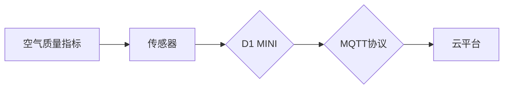

## 基于D1 MINI的空气站节点设计与实现

作者：禅与计算机程序设计艺术

## 1. 背景介绍

### 1.1  空气质量监测的意义

随着工业化和城市化的快速发展，空气污染问题日益严重，对人类健康和生态环境造成巨大威胁。空气质量监测是环境保护工作的重要组成部分，可以实时掌握空气污染状况，为环境管理、污染控制和公众健康提供科学依据。

### 1.2 物联网技术在空气质量监测中的应用

近年来，物联网技术的快速发展为空气质量监测提供了新的解决方案。物联网技术可以实现传感器节点的广泛部署、数据实时采集和传输、云平台数据分析和可视化等功能，为构建智能化、精细化的空气质量监测系统提供了技术支撑。

### 1.3 D1 MINI的特点及优势

D1 MINI是一款基于ESP8266芯片的低成本、低功耗、易于开发的物联网开发板，具有WiFi功能、丰富的GPIO接口、小巧的尺寸等特点，非常适合用于构建物联网节点设备。

## 2. 核心概念与联系

### 2.1 空气质量指标

空气质量指标是衡量空气污染程度的标准，常用的指标包括PM2.5、PM10、SO2、NO2、CO、O3等。

### 2.2 传感器

传感器是用于感知物理量并将信息转换为电信号的器件，空气质量监测中常用的传感器包括PM2.5传感器、温湿度传感器、气体传感器等。

### 2.3 D1 MINI开发板

D1 MINI开发板是基于ESP8266芯片的物联网开发板，具有WiFi功能、丰富的GPIO接口、小巧的尺寸等特点。

### 2.4 MQTT协议

MQTT是一种轻量级的消息发布/订阅协议，适用于物联网设备之间的数据传输。

### 2.5 云平台

云平台是用于数据存储、处理和可视化的平台，可以提供数据分析、远程监控、报警等功能。

### 2.6  核心概念联系图



## 3. 核心算法原理具体操作步骤

### 3.1 硬件连接

1. 将PM2.5传感器、温湿度传感器、气体传感器等连接到D1 MINI开发板的GPIO接口。
2. 将D1 MINI开发板通过USB连接到电脑。

### 3.2 软件开发

1. 使用Arduino IDE编写代码，读取传感器数据并通过MQTT协议将数据上传到云平台。
2. 代码示例：

```c++
#include <ESP8266WiFi.h>
#include <PubSubClient.h>

// WiFi配置
const char* ssid = "your_ssid";
const char* password = "your_password";

// MQTT配置
const char* mqtt_server = "mqtt.yourserver.com";
const int mqtt_port = 1883;
const char* mqtt_user = "your_username";
const char* mqtt_password = "your_password";
const char* mqtt_topic = "air_quality";

// 传感器配置
const int pm25_pin = D1;
const int temp_pin = D2;
const int humidity_pin = D3;

WiFiClient espClient;
PubSubClient client(espClient);

void setup() {
  Serial.begin(115200);
  
  // 连接WiFi
  WiFi.begin(ssid, password);
  while (WiFi.status() != WL_CONNECTED) {
    delay(500);
    Serial.print(".");
  }
  Serial.println("WiFi connected");
  
  // 连接MQTT服务器
  client.setServer(mqtt_server, mqtt_port);
  client.setCallback(callback);
  while (!client.connected()) {
    Serial.print("Connecting to MQTT...");
    if (client.connect("D1_Mini_Client", mqtt_user, mqtt_password)) {
      Serial.println("connected");
    } else {
      Serial.print("failed, rc=");
      Serial.print(client.state());
      Serial.println(" try again in 5 seconds");
      delay(5000);
    }
  }
}

void loop() {
  // 读取传感器数据
  float pm25 = read_pm25(pm25_pin);
  float temperature = read_temperature(temp_pin);
  float humidity = read_humidity(humidity_pin);
  
  // 构建JSON格式数据
  String data = "{\"pm25\":" + String(pm25) + 
                ",\"temperature\":" + String(temperature) + 
                ",\"humidity\":" + String(humidity) + "}";
  
  // 通过MQTT协议发布数据
  client.publish(mqtt_topic, data.c_str());
  
  // 延时
  delay(10000);
}

// MQTT回调函数
void callback(char* topic, byte* payload, unsigned int length) {
  // 处理接收到的消息
}

// 读取PM2.5传感器数据
float read_pm25(int pin) {
  // 传感器读取代码
}

// 读取温度传感器数据
float read_temperature(int pin) {
  // 传感器读取代码
}

// 读取湿度传感器数据
float read_humidity(int pin) {
  // 传感器读取代码
}
```

### 3.3 云平台配置

1. 选择合适的云平台，例如阿里云、腾讯云等。
2. 创建MQTT主题，用于接收D1 MINI上传的数据。
3. 配置数据可视化界面，实时展示空气质量数据。

## 4. 数学模型和公式详细讲解举例说明

### 4.1 PM2.5浓度计算

PM2.5传感器输出的是电压信号，需要将其转换为PM2.5浓度值。

假设传感器输出电压为 $V$，PM2.5浓度为 $C$，则其关系式为：

$$
C = k \cdot V + b
$$

其中，$k$ 和 $b$ 为校准系数，可以通过实验测定。

例如，假设 $k=0.1$，$b=0.5$，传感器输出电压为 $2.5V$，则PM2.5浓度为：

$$
C = 0.1 \times 2.5 + 0.5 = 0.75 mg/m^3
$$

### 4.2 温湿度转换

温湿度传感器输出的是数字信号，需要将其转换为温度和湿度值。

假设温度传感器输出值为 $T$，湿度传感器输出值为 $H$，则其关系式为：

$$
Temperature = a \cdot T + b
$$

$$
Humidity = c \cdot H + d
$$

其中，$a$、$b$、$c$、$d$ 为校准系数，可以通过实验测定。

## 5. 项目实践：代码实例和详细解释说明

### 5.1 项目概述

本项目基于D1 MINI开发板，设计实现了一个空气质量监测节点，可以实时监测PM2.5、温度、湿度等指标，并将数据上传到云平台进行可视化展示。

### 5.2 代码实例

```c++
// 代码同上
```

### 5.3 代码解释

1. `#include <ESP8266WiFi.h>` 和 `#include <PubSubClient.h>` 引入了ESP8266 WiFi库和MQTT客户端库。
2. `ssid` 和 `password` 定义了WiFi网络的名称和密码。
3. `mqtt_server`、`mqtt_port`、`mqtt_user` 和 `mqtt_password` 定义了MQTT服务器的地址、端口、用户名和密码。
4. `mqtt_topic` 定义了MQTT主题，用于发布空气质量数据。
5. `pm25_pin`、`temp_pin` 和 `humidity_pin` 定义了传感器连接的GPIO接口。
6. `setup()` 函数用于初始化WiFi和MQTT连接。
7. `loop()` 函数用于循环读取传感器数据，并通过MQTT协议将数据上传到云平台。
8. `callback()` 函数是MQTT回调函数，用于处理接收到的消息。
9. `read_pm25()`、`read_temperature()` 和 `read_humidity()` 函数用于读取传感器数据。

## 6. 实际应用场景

### 6.1 室内空气质量监测

将空气站节点部署在室内，可以实时监测室内空气质量，为改善室内环境提供数据支持。

### 6.2 室外空气质量监测

将空气站节点部署在室外，可以实时监测室外空气质量，为环境管理和污染控制提供数据支持。

### 6.3 工业园区环境监测

将空气站节点部署在工业园区，可以实时监测园区内空气质量，为企业环保工作提供数据支持。

## 7. 工具和资源推荐

### 7.1 Arduino IDE

Arduino IDE是一款开源的集成开发环境，可以用于编写D1 MINI的代码。

### 7.2 MQTT客户端库

MQTT客户端库可以用于实现MQTT协议的通信。

### 7.3 云平台

阿里云、腾讯云等云平台提供MQTT服务和数据可视化功能。

## 8. 总结：未来发展趋势与挑战

### 8.1 未来发展趋势

1. 传感器技术不断发展，将出现更加精准、灵敏、低功耗的传感器。
2. 物联网技术不断成熟，将实现更加智能化、精细化的空气质量监测。
3. 云计算和大数据技术将为空气质量数据分析和预测提供更加强大的支持。

### 8.2 挑战

1. 传感器成本、功耗、精度等方面仍需进一步优化。
2. 数据安全和隐私保护问题需要得到重视。
3. 需要建立完善的空气质量监测标准和规范。

## 9. 附录：常见问题与解答

### 9.1 如何选择合适的传感器？

选择传感器需要考虑以下因素：

* 测量范围
* 精度
* 灵敏度
* 响应时间
* 工作温度
* 功耗
* 价格

### 9.2 如何提高数据传输的稳定性？

提高数据传输稳定性可以采取以下措施：

* 选择稳定的WiFi网络
* 使用可靠的MQTT服务器
* 优化代码，避免数据丢失
* 定期检查设备运行状态

### 9.3 如何保护数据安全和隐私？

保护数据安全和隐私可以采取以下措施：

* 使用加密算法加密数据
* 设置访问权限，限制数据访问
* 定期备份数据
* 遵守相关法律法规