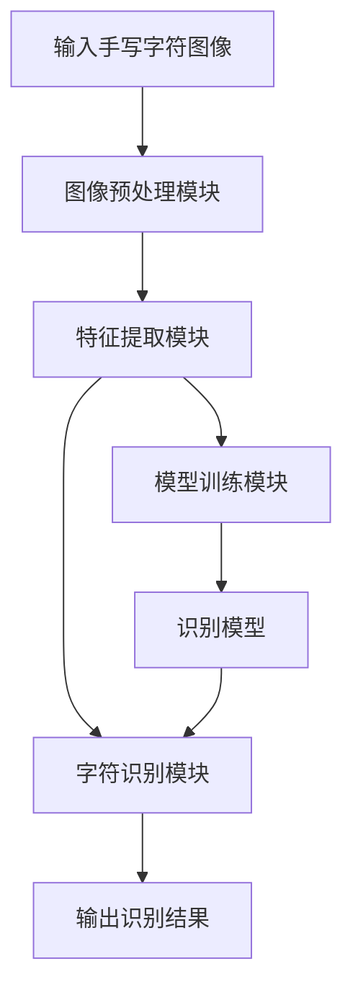

# 基于OpenCV的手写字识别系统详细设计与具体代码实现

## 1.背景介绍

### 1.1 手写字识别系统概述

手写字识别是一种让计算机能够识别手写文字的技术。它的应用范围非常广泛,包括银行支票的自动处理、邮件自动分拣系统、表格自动输入、手写输入法等。随着人工智能和计算机视觉技术的不断发展,手写字识别系统的性能也在不断提高,已经逐渐被应用到更多的领域中。

手写字识别系统通常由以下几个主要模块组成:

- 预处理模块:对输入的手写字符图像进行去噪、二值化、归一化等预处理操作。
- 特征提取模块:从预处理后的图像中提取有效的特征向量,用于后续的字符识别。
- 训练模块:使用大量的手写字符样本训练识别模型,通常采用机器学习或深度学习算法。
- 识别模块:将提取的特征向量输入到训练好的模型中,输出识别结果。

### 1.2 OpenCV简介

OpenCV(Open Source Computer Vision Library)是一个跨平台的计算机视觉库,由Intel公司发起并参与开发。它轻量级而高效,提供了大量用于图像处理和计算机视觉方面的经典算法和函数,可用于开发各种计算机视觉应用程序。

OpenCV具有以下主要特点:

- 开源免费,可在商业和研究领域中自由使用
- 跨平台,可在Windows、Linux、MacOS等多种操作系统上运行
- 支持多种编程语言接口,如C++、Python、Java等
- 高性能优化,提供了多种优化的数据结构和算法
- 丰富的功能库,包括图像处理、视频分析、机器学习等多个模块

本文将介绍如何利用OpenCV及其机器学习模块,开发一个基于SVM(支持向量机)的手写字符识别系统。

## 2.核心概念与联系

### 2.1 手写字符识别的关键步骤

实现一个手写字符识别系统,需要涉及以下几个关键步骤:

1. 图像预处理
2. 特征提取
3. 模型训练
4. 字符识别

其中,预处理和特征提取对最终识别的准确率有着至关重要的影响。

#### 2.1.1 图像预处理

图像预处理的目的是去除图像中的噪声、对比度不足等问题,并将图像规范化,以便于后续的特征提取和模式识别。常用的预处理操作包括:

- 灰度化:将彩色图像转换为灰度图像,减小数据量。
- 二值化:根据阈值将灰度图像转换为二值图像。
- 去噪:消除图像中的噪声点。
- 图像修正:对图像进行旋转、倾斜校正等操作。
- 归一化:将图像缩放到统一的尺寸。

OpenCV提供了丰富的图像处理函数,可以方便地实现上述预处理操作。

#### 2.1.2 特征提取

特征提取是将图像转换为特征向量的过程,这些特征向量可以更好地表示图像的特征信息,并作为后续模型训练和字符识别的输入。常用的特征提取方法包括:

- 投影特征:利用水平和垂直投影提取字符的外形特征。
- 结构特征:提取字符中线条的位置、方向等结构信息。
- 统计特征:提取字符的统计特征,如矩、直方图等。
- 拓扑特征:描述字符中孔洞、交叉点等拓扑结构。

合理选择特征提取方法对识别准确率有重要影响。OpenCV提供了HOG(方向梯度直方图)、LBP(局部二值模式)等经典特征提取算子。

#### 2.1.3 模型训练

模型训练是将提取的特征向量及其对应的字符标签输入机器学习算法,得到识别模型。常用的机器学习算法包括:

- K近邻(KNN)算法
- 支持向量机(SVM)算法 
- 决策树算法
- 神经网络算法

其中,SVM算法被广泛应用于手写字符识别,具有泛化能力强、计算开销小等优点。OpenCV提供了SVM及其他多种机器学习算法的实现。

#### 2.1.4 字符识别

将提取的特征向量输入训练好的模型,即可得到识别结果。如果需要识别完整的文本行或段落,则需要进一步进行字符分割和组合。

### 2.2 主要模块及其联系

手写字符识别系统主要由以下几个模块构成:

1. 图像预处理模块
2. 特征提取模块 
3. 模型训练模块
4. 字符识别模块

其中,图像预处理模块和特征提取模块为后续的模型训练和字符识别提供输入;模型训练模块基于大量手写字符样本生成识别模型;字符识别模块利用该模型对新的手写字符图像进行识别。

各模块之间的联系如下所示:



## 3.核心算法原理具体操作步骤  

### 3.1 图像预处理算法

#### 3.1.1 灰度化

灰度化是将彩色图像转换为灰度图像的过程。灰度图像只有一个颜色通道,可以大幅减小数据量,加快后续处理速度。

对于RGB彩色图像,常用的灰度化公式为:

$$
Gray = 0.299 \times R + 0.587 \times G + 0.114 \times B
$$

其中,R、G、B分别为像素点的红、绿、蓝三个通道值,Gray为计算得到的灰度值。

在OpenCV中,可以使用cv2.cvtColor()函数实现灰度化:

```python
import cv2

# 加载彩色图像
img_bgr = cv2.imread('image.png')

# 灰度化
img_gray = cv2.cvtColor(img_bgr, cv2.COLOR_BGR2GRAY)
```

#### 3.1.2 二值化

二值化是将灰度图像转换为二值图像的过程,通常采用设定一个阈值,大于该阈值的像素点被设为前景(如白色),小于该阈值的像素点被设为背景(如黑色)。

常用的二值化算法包括:

- 简单阈值法:设定一个全局阈值
- 自适应阈值法:根据像素点邻域计算局部阈值
- Otsu二值化法:自动计算出最佳的全局阈值

在OpenCV中,可以使用cv2.threshold()函数实现二值化:

```python
import cv2

# 简单阈值法二值化
ret, img_binary = cv2.threshold(img_gray, 127, 255, cv2.THRESH_BINARY)

# Otsu二值化
ret, img_otsu = cv2.threshold(img_gray, 0, 255, cv2.THRESH_BINARY_INV + cv2.THRESH_OTSU)
```

#### 3.1.3 去噪

去噪是消除图像中的噪声点,以提高图像质量。常用的去噪算法包括:

- 中值滤波:用像素点邻域的中值代替该像素值
- 高斯滤波:使用高斯核对图像进行卷积平滑
- 双边滤波:结合空间邻近度和灰度相似度的滤波方法

在OpenCV中,可以使用cv2.medianBlur()、cv2.GaussianBlur()、cv2.bilateralFilter()等函数实现不同的去噪操作。

#### 3.1.4 其他预处理操作

除了上述基本操作,还可以进行以下预处理:

- 图像修正:使用OpenCV的cv2.getRotationMatrix2D()和cv2.warpAffine()函数进行旋转校正。
- 边缘检测:使用Canny算子等进行边缘检测。
- 轮廓发现:使用cv2.findContours()函数发现图像中的轮廓。
- 投影剪裁:通过水平和垂直投影消除边缘空白区域。

### 3.2 特征提取算法

根据手写字符的特点,常用的特征提取算法包括:

#### 3.2.1 HOG特征

HOG(Histogram of Oriented Gradient)是一种基于图像梯度方向直方图的特征描述子,常用于目标检测和识别。它的思路是:

1. 计算图像的水平和垂直梯度
2. 将图像划分为小的cell单元
3. 对每个cell单元中的像素梯度计算方向直方图
4. 对直方图数据进行归一化和块化处理
5. 将所有cell直方图连接成HOG特征向量

HOG特征能够很好地描述目标的轮廓和形状特征,对光照和噪声具有较好的鲁棒性。

在OpenCV中,可以使用cv2.HOGDescriptor()类实现HOG特征提取:

```python
import cv2

# 创建HOG描述子对象
hog = cv2.HOGDescriptor()

# 计算HOG特征向量
hog_feats = hog.compute(img_binary)
```

#### 3.2.2 LBP特征

LBP(Local Binary Pattern)是一种基于图像局部二值模式的纹理描述算子,常用于文字识别等任务。它的思路是:

1. 对每个像素点,选取其邻域像素点
2. 将邻域像素值与中心像素值进行比较,大于则记为1,否则记为0
3. 将比较结果按顺序连接成一个二进制码
4. 将二进制码映射为一个十进制值,作为该像素点的LBP值
5. 统计图像中不同LBP值的直方图作为特征向量

LBP不仅能有效描述图像的纹理特征,而且具有灰度不变性和旋转不变性,非常适合于文字识别任务。

在OpenCV中,可以使用cv2.calcHist()函数基于LBP值计算直方图特征。

#### 3.2.3 Hu矩特征

Hu矩是由七个不变矩构成的一种形状特征描述子,常用于图像识别和匹配。这七个矩是:

$$
\begin{align*}
M_1 &= \eta_{20} + \eta_{02} \\
M_2 &= (\eta_{20} - \eta_{02})^2 + 4\eta_{11}^2\\
M_3 &= (\eta_{30} - 3\eta_{12})^2 + (3\eta_{21} - \eta_{03})^2\\
M_4 &= (\eta_{30} + \eta_{12})^2 + (\eta_{21} + \eta_{03})^2\\
M_5 &= (\eta_{30} - 3\eta_{12})(\eta_{30} + \eta_{12})[(\eta_{30} + \eta_{12})^2 - 3(\eta_{21} + \eta_{03})^2] + (3\eta_{21} - \eta_{03})(\eta_{21} + \eta_{03})[3(\eta_{30} + \eta_{12})^2 - (\eta_{21} + \eta_{03})^2]\\
M_6 &= (\eta_{20} - \eta_{02})[(\eta_{30} + \eta_{12})^2 - (\eta_{21} + \eta_{03})^2] + 4\eta_{11}(\eta_{30} + \eta_{12})(\eta_{21} + \eta_{03})\\
M_7 &= (3\eta_{21} - \eta_{03})(\eta_{30} + \eta_{12})[(\eta_{30} + \eta_{12})^2 - 3(\eta_{21} + \eta_{03})^2] - (\eta_{30} - 3\eta_{12})(\eta_{21} + \eta_{03})[3(\eta_{30} + \eta_{12})^2 - (\eta_{21} + \eta_{03})^2]
\end{align*}
$$

其中$\eta_{pq}$表示图像的(p+q)阶几何矩。这七个矩具有尺度不变性、平移不变性和旋转不变性,非常适合于手写字符的形状描述。

在OpenCV中,可以使用cv2.HuMoments()函数计算Hu矩值。

### 3.3 模型训练算法

OpenCV支持多种经典的机器学习算法,包括SVM、KNN、决策树、随机森林等。本文以SVM(支持向量机)算法为例,介绍如何基于训练数据训练出一个手写字符识别模型。

#### 3.3.1 SVM原理

SVM是一种有监督的机器学习算法,常用于模式识别和分类问题。它的基本思想是:在高