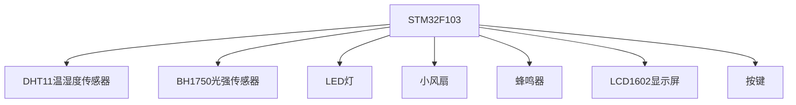
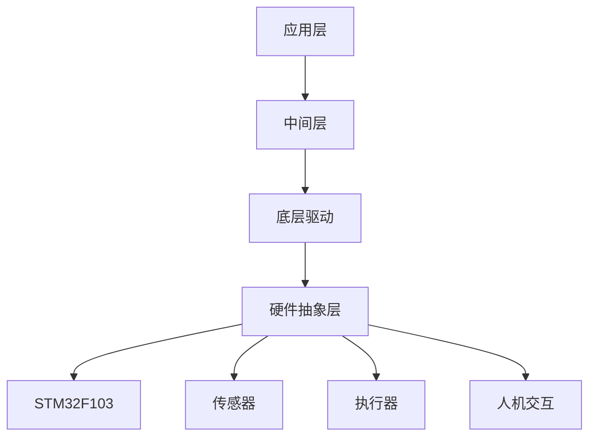

# 基于STM32智能书桌设计与实现

## 1.背景介绍

### 1.1 智能书桌概念

智能书桌是一种集成了多种智能功能的书桌系统,旨在为用户提供一个舒适、高效的工作和学习环境。它通过传感器和执行器与物理环境进行交互,实现自动化控制和智能响应,从而优化照明、温度、音乐等环境因素,提高工作效率和舒适度。

### 1.2 智能书桌的需求和意义

随着科技的发展和生活节奏的加快,人们对工作和学习环境的要求越来越高。传统的书桌已经无法满足现代人的需求,因此智能书桌应运而生。智能书桌可以:

- 自动调节照明,防止眼睛疲劳
- 控制温度和湿度,维持舒适环境
- 播放音乐,缓解压力
- 智能提醒,规划作息时间
- 无线充电,方便设备充电
- 语音控制,实现手free操作
- ...

综上所述,智能书桌具有重要的实用价值和发展前景。

## 2.核心概念与联系

### 2.1 嵌入式系统

嵌入式系统是一种专门为特定应用而设计的计算机系统,通常由微控制器或微处理器、存储器、外围设备等组成。智能书桌正是一种典型的嵌入式系统。

### 2.2 STM32

STM32是意法半导体(ST)公司推出的一款基于ARM Cortex-M内核的32位微控制器系列,具有高性能、低功耗等优点,广泛应用于工业控制、消费电子等领域。

### 2.3 传感器与执行器

传感器用于检测物理环境中的各种参数,如光线、温度、湿度等;执行器则负责对环境进行控制和调节,如控制LED灯、风扇、加热器等。传感器和执行器是智能书桌实现智能化的核心部件。

### 2.4 人机交互

人机交互(HMI)是用户与智能书桌进行信息交换的桥梁,包括按键、显示屏、语音识别等。良好的人机交互设计能够提高用户体验。

上述概念相互关联、环环相扣,构成了智能书桌系统的基础框架。

## 3.核心算法原理具体操作步骤 

智能书桌的核心算法可分为三个模块:环境检测、决策控制和人机交互。

### 3.1 环境检测模块

该模块负责通过各种传感器采集环境数据,主要步骤如下:

1. 初始化ADC、I2C等外设,用于与模拟及数字传感器通信
2. 编写传感器驱动程序,统一读取数据格式
3. 设置数据采样周期,周期性读取各传感器数据
4. 对原始数据进行滤波、去噪等预处理
5. 将预处理后的数据存入环境数据缓冲区

### 3.2 决策控制模块  

该模块根据环境数据分析当前状态,并作出相应的控制决策,算法流程如下:

```python
while True:
    # 读取环境数据缓冲区
    env_data = read_env_data()
    
    # 数据处理与分析
    light, temp, humi = process(env_data)
    
    # 根据数据作出控制决策
    if light < LIGHT_THRESHOLD:
        control_led(increase_brightness)
    elif temp > TEMP_UPPER or temp < TEMP_LOWER:
        control_hvac(adjust_temp)
    elif humi > HUMI_UPPER or humi < HUMI_LOWER:  
        control_humidifier(adjust_humi)
        
    # 其他控制决策...
        
    # 延时等待下一个周期
    delay(CONTROL_PERIOD)
```

该算法每隔一段时间周期性检查环境数据,对光线、温度、湿度等因素进行控制,以维持最佳工作环境。

### 3.3 人机交互模块

该模块实现人机交互界面,用户可通过按键、触摸屏、语音等方式控制书桌,主要流程为:

1. 初始化按键、LCD、语音模块等外设
2. 创建GUI界面,注册各控件事件
3. 循环检测事件,执行相应的控制指令
4. 将控制指令发送至控制模块执行

通过上述三个模块的协同工作,智能书桌系统可自动检测并调节环境状态,也可接受用户手动控制,实现智能化管理。

## 4.数学模型和公式详细讲解举例说明

在智能书桌系统中,需要对采集的环境数据进行数学建模和处理,以提高检测精度和系统稳定性。

### 4.1 数字滤波

由于传感器存在噪声干扰,需要对原始数据进行滤波处理。常用的滤波算法有:

1. **移动平均滤波**

$$y[n] = \frac{1}{N}\sum_{i=0}^{N-1}x[n-i]$$

移动平均滤波通过计算N个相邻样本的平均值来消除随机噪声,但会引入相位延迟。

2. **指数滤波**

$$y[n] = \alpha x[n] + (1-\alpha)y[n-1]$$

指数滤波对新数据赋予更大权重,响应速度快,但对脉冲信号抑制效果差。$\alpha$是滤波系数,通常取0.1~0.3。

3. **卡尔曼滤波**

卡尔曼滤波是一种最优估计算法,可以有效消除高斯噪声,常用于传感器融合。它的核心是预测和校正两个方程:

$$\hat{x}_{k|k-1} = A\hat{x}_{k-1|k-1} + Bu_k\\
\hat{x}_{k|k} = \hat{x}_{k|k-1} + K_k(z_k - H\hat{x}_{k|k-1})$$

其中$\hat{x}$为状态估计值,${k|k-1}$表示在时刻k-1的基础上对时刻k的预测。$A,B,H$为状态转移矩阵,控制矩阵和观测矩阵。$K_k$为卡尔曼增益,决定了观测值的权重。

卡尔曼滤波具有最优性和递推特性,是处理环境数据的有力工具。

### 4.2 PID控制

对于控制执行器(如LED亮度、温控器等),通常采用PID闭环反馈控制算法:

$$u(t) = K_p e(t) + K_i\int_0^t e(t)dt + K_d\frac{de(t)}{dt}$$

其中,
- $u(t)$为控制量(如PWM占空比)
- $e(t)$为偏差,即期望值与实际值的差
- $K_p,K_i,K_d$分别为比例、积分、微分系数

PID控制算法简单有效,通过调节三个系数,可以控制系统快速收敛且无稳态偏差。

### 4.3 示例:温度控制

假设我们需要控制房间温度为25℃,可以建立如下模型:

状态方程:
$$\begin{cases}
T(k+1)=T(k)+\frac{\Delta t}{C}[Q_h(k)-Q_l(k)]\\
Q_h(k)=K_hU_h(k)\\
Q_l(k)=K_l(T(k)-T_o)
\end{cases}$$

观测方程:
$$T_m(k)=T(k)+v(k)$$

其中:
- $T$为房间温度
- $Q_h$为加热器热量
- $Q_l$为散热量
- $U_h$为加热器控制量(功率)
- $K_h,K_l$为传热系数
- $T_o$为室外温度
- $T_m$为测量温度,$v$为测量噪声

我们可以应用卡尔曼滤波估计实际温度$T$,再通过PID控制器计算控制量$U_h$,从而实现温度的精确控制。

通过建立数学模型并选择合适的算法,可以有效提高智能书桌的检测和控制精度。

## 5.项目实践:代码实例和详细解释说明

接下来,我们通过一个基于STM32F103的智能书桌项目实例,来具体说明其实现过程。

### 5.1 硬件设计

智能书桌硬件由STM32F103作为主控芯片,外围电路包括:

- 温湿度传感器:DHT11
- 光强传感器:BH1750
- 执行器:LED灯、小风扇、蜂鸣器
- 人机交互:LCD1602、按键

硬件电路原理图如下:



其中,DHT11和BH1750通过单总线IIC接口连接MCU,LED、FAN和BUZZER分别由3个IO口控制,LCD1602通过4位并行接口连接,按键则直接连至IO口。

### 5.2 软件设计

智能书桌的软件可划分为底层驱动、中间层和应用层三个部分,层次结构如下:



1. **底层驱动(DRV)**

底层驱动基于STM32HAL库,包括I2C、SPI、GPIO等外设驱动,对硬件进行直接操作,为上层提供硬件抽象接口。

2. **中间层(MW)** 

中间层实现了环境检测、决策控制和人机交互三大模块的核心功能,包括:

- 传感器驱动管理
- 数据采集、滤波处理
- 控制算法(PID、模糊控制等)
- 任务调度
- 状态机

3. **应用层(APP)**

应用层为用户提供友好的GUI界面,包括:

- LCD显示界面
- 按键、触摸屏事件处理
- 语音识别与合成
- 云端数据交互

应用层通过调用中间层接口,实现各种智能控制功能。

### 5.3 关键模块代码分析

下面分析智能书桌的几个关键模块的代码实现。

#### 5.3.1 环境检测模块

```c
/* 环境数据结构体 */
typedef struct
{
    uint16_t light;  // 光照强度
    uint8_t temp;    // 温度
    uint8_t humi;    // 湿度
} EnvData_t;

/* 环境数据缓冲区 */
EnvData_t env_data;

/* 采集并更新环境数据 */
void UpdateEnvData(void)
{
    uint16_t temp_val, humi_val;
    
    /* 读取DHT11温湿度 */
    DHT11_ReadData(&temp_val, &humi_val);
    env_data.temp = (uint8_t)temp_val;
    env_data.humi = (uint8_t)humi_val;
    
    /* 读取BH1750光强 */
    env_data.light = BH1750_ReadLight();
    
    /* 对数据滤波处理 */
    env_data.light = ExpFilter(env_data.light, 0.2);
    env_data.temp  = MeanFilter(env_data.temp, 5);
    env_data.humi  = MeanFilter(env_data.humi, 5);
}
```

该模块首先定义了环境数据的结构体,然后实现了从DHT11和BH1750读取原始数据的函数。最后,对光照数据使用指数滤波,温湿度数据使用5点移动平均滤波,消除噪声干扰。

#### 5.3.2 决策控制模块

```c
/* 环境阈值设置 */
#define LIGHT_THRESHOLD  400  // 光照阈值
#define TEMP_LOWER       20   // 温度下限
#define TEMP_UPPER       28   // 温度上限
#define HUMI_LOWER       40   // 湿度下限
#define HUMI_UPPER       60   // 湿度上限

/* PID参数 */
float Kp = 2.0, Ki = 0.5, Kd = 1.0;

/* 控制执行函数 */
void ControlTask(void)
{
    float temp_val, humi_val;
    uint16_t pwm_val;
    