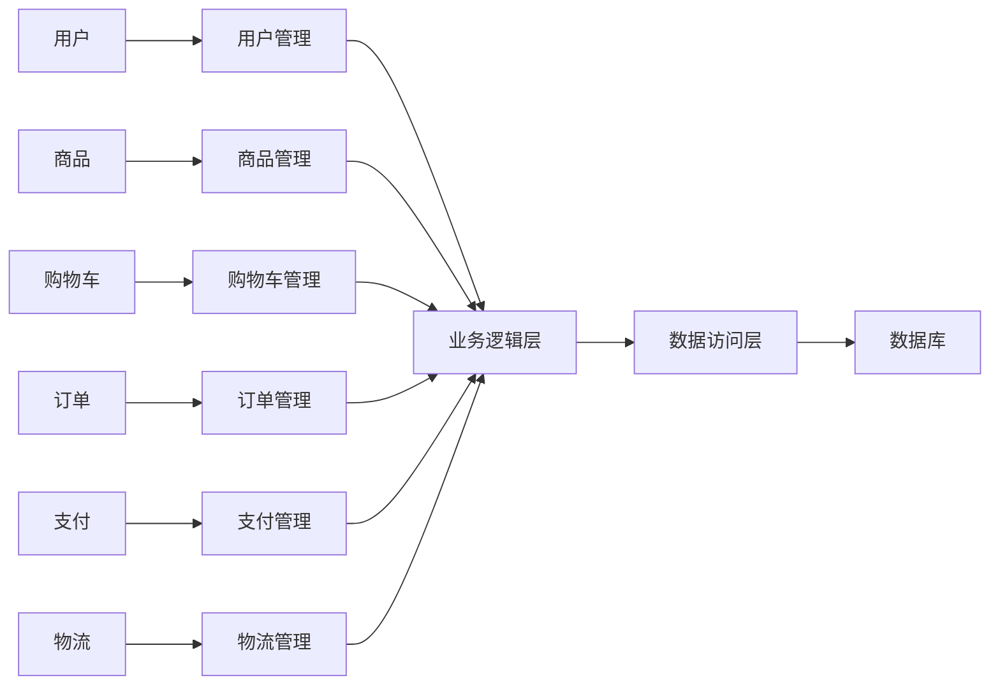

## 1. 背景介绍

### 1.1 电子商务的兴起与发展

随着互联网技术的快速发展，电子商务已经成为一种主流的商业模式。网上购物系统作为电子商务的核心组成部分，为消费者提供了便捷、高效的购物体验，也为商家创造了巨大的商机。

### 1.2 网上购物系统的优势

与传统的线下购物相比，网上购物系统具有以下优势：

* **便捷性:** 消费者可以随时随地通过互联网进行购物，无需受时间和地域的限制。
* **多样性:** 网上购物系统提供了丰富的商品种类，消费者可以轻松找到自己需要的商品。
* **价格优势:** 网上购物系统通常能够提供更具竞争力的价格，因为其运营成本相对较低。
* **个性化服务:** 网上购物系统可以根据消费者的购物习惯和偏好提供个性化的推荐和服务。

### 1.3 本文的目的和意义

本文旨在详细介绍基于WEB的网上购物系统的详细设计与具体代码实现，为开发者提供一个完整的开发指南，帮助他们快速构建功能完善、性能优越的网上购物系统。

## 2. 核心概念与联系

### 2.1 系统架构

基于WEB的网上购物系统通常采用三层架构，即表示层、业务逻辑层和数据访问层。

* **表示层:** 负责用户界面的展示和用户交互，通常采用HTML、CSS、JavaScript等技术实现。
* **业务逻辑层:** 负责处理业务逻辑，例如用户注册、登录、商品浏览、购物车管理、订单处理等。
* **数据访问层:** 负责与数据库交互，进行数据的增删改查操作。

### 2.2 核心功能模块

一个典型的网上购物系统包含以下核心功能模块：

* **用户管理:** 用户注册、登录、用户信息修改、密码找回等。
* **商品管理:** 商品分类、商品信息管理、商品展示、商品搜索等。
* **购物车管理:** 添加商品、删除商品、修改商品数量、清空购物车等。
* **订单管理:** 生成订单、支付订单、查看订单、取消订单等。
* **支付管理:** 支持多种支付方式，例如支付宝、微信支付、银行卡支付等。
* **物流管理:** 与物流公司对接，实现订单的配送和跟踪。

### 2.3 关系图

下面是网上购物系统的核心概念与联系的Mermaid关系图：



## 3. 核心算法原理具体操作步骤

### 3.1 用户注册

用户注册流程如下:

1. 用户填写注册信息，包括用户名、密码、邮箱等。
2. 系统验证用户输入的信息是否合法。
3. 系统将用户信息保存到数据库中。
4. 系统向用户发送激活邮件。
5. 用户点击激活链接激活账号。

### 3.2 商品搜索

商品搜索功能允许用户根据关键字搜索商品。搜索算法可以采用全文检索技术，例如Lucene、Elasticsearch等。

1. 用户输入关键字。
2. 系统根据关键字查询商品数据库。
3. 系统将匹配的商品信息返回给用户。

### 3.3 购物车管理

购物车管理功能允许用户添加、删除、修改商品数量、清空购物车等操作。

1. 用户点击“加入购物车”按钮，将商品添加到购物车中。
2. 系统将购物车信息保存到数据库中。
3. 用户可以修改购物车中商品的数量。
4. 用户可以删除购物车中的商品。
5. 用户可以清空购物车。

### 3.4 订单处理

订单处理流程如下：

1. 用户提交订单。
2. 系统生成订单号。
3. 系统调用支付接口进行支付。
4. 系统更新订单状态。
5. 系统通知用户支付成功。
6. 系统将订单信息传递给物流公司进行配送。

## 4. 数学模型和公式详细讲解举例说明

### 4.1 商品推荐算法

商品推荐算法可以采用协同过滤算法，例如基于用户的协同过滤算法、基于商品的协同过滤算法等。

**基于用户的协同过滤算法:**

该算法的基本原理是：如果两个用户对一些商品的评分相似，那么他们对其他商品的评分也可能相似。

**公式:**

```
similarity(u,v) = (sum(r_ui * r_vi)) / (sqrt(sum(r_ui^2)) * sqrt(sum(r_vi^2)))
```

其中:

* u, v 表示两个用户
* r_ui 表示用户 u 对商品 i 的评分
* similarity(u,v) 表示用户 u 和用户 v 的相似度

**举例说明:**

假设用户 A 对商品 1、2、3 的评分分别为 5、4、3，用户 B 对商品 1、2、4 的评分分别为 4、5、3。

则用户 A 和用户 B 的相似度为:

```
similarity(A,B) = ((5*4) + (4*5) + (3*0)) / (sqrt((5^2)+(4^2)+(3^2)) * sqrt((4^2)+(5^2)+(0^2))) = 0.89
```

**基于商品的协同过滤算法:**

该算法的基本原理是：如果两个商品被很多用户同时购买，那么这两个商品可能是相关的。

**公式:**

```
similarity(i,j) = (sum(r_ui * r_uj)) / (sqrt(sum(r_ui^2)) * sqrt(sum(r_uj^2)))
```

其中:

* i, j 表示两个商品
* r_ui 表示用户 u 对商品 i 的评分
* similarity(i,j) 表示商品 i 和商品 j 的相似度

**举例说明:**

假设商品 1 和商品 2 被用户 A、B、C 同时购买，用户 A 对商品 1 的评分为 5，对商品 2 的评分为 4，用户 B 对商品 1 的评分为 4，对商品 2 的评分为 5，用户 C 对商品 1 的评分为 3，对商品 2 的评分为 4。

则商品 1 和商品 2 的相似度为:

```
similarity(1,2) = ((5*4) + (4*5) + (3*4)) / (sqrt((5^2)+(4^2)+(3^2)) * sqrt((4^2)+(5^2)+(4^2))) = 0.94
```

### 4.2 价格波动模型

商品价格的波动可以用时间序列模型来描述，例如 ARIMA 模型。

**ARIMA 模型:**

ARIMA 模型是一种常用的时间序列模型，它包含三个参数: p、d、q。

* p: 自回归项的阶数
* d: 差分项的阶数
* q: 移动平均项的阶数

**公式:**

```
y_t = c + phi_1 * y_{t-1} + ... + phi_p * y_{t-p} + theta_1 * e_{t-1} + ... + theta_q * e_{t-q} + e_t
```

其中:

* y_t 表示 t 时刻的价格
* c 表示常数项
* phi_1, ..., phi_p 表示自回归系数
* theta_1, ..., theta_q 表示移动平均系数
* e_t 表示 t 时刻的随机误差

**举例说明:**

假设商品 A 的价格数据如下:

```
日期        价格
2023-01-01  100
2023-01-02  105
2023-01-03  110
2023-01-04  115
2023-01-05  120
```

我们可以使用 ARIMA 模型来预测商品 A 的价格走势。

## 5. 项目实践：代码实例和详细解释说明

### 5.1 技术选型

* **后端:** Spring Boot
* **前端:** React
* **数据库:** MySQL
* **缓存:** Redis

### 5.2 代码实例

**用户注册接口:**

```java
@RestController
@RequestMapping("/users")
public class UserController {

    @Autowired
    private UserService userService;

    @PostMapping("/register")
    public ResponseEntity<User> register(@RequestBody User user) {
        User createdUser = userService.createUser(user);
        return ResponseEntity.status(HttpStatus.CREATED).body(createdUser);
    }
}
```

**商品搜索接口:**

```java
@RestController
@RequestMapping("/products")
public class ProductController {

    @Autowired
    private ProductService productService;

    @GetMapping("/search")
    public ResponseEntity<List<Product>> search(@RequestParam String keyword) {
        List<Product> products = productService.searchProducts(keyword);
        return ResponseEntity.ok(products);
    }
}
```

**购物车管理接口:**

```java
@RestController
@RequestMapping("/carts")
public class CartController {

    @Autowired
    private CartService cartService;

    @PostMapping("/{userId}/items")
    public ResponseEntity<CartItem> addItem(@PathVariable Long userId, @RequestBody CartItem cartItem) {
        CartItem createdCartItem = cartService.addItem(userId, cartItem);
        return ResponseEntity.status(HttpStatus.CREATED).body(createdCartItem);
    }

    @DeleteMapping("/{userId}/items/{itemId}")
    public ResponseEntity<Void> deleteItem(@PathVariable Long userId, @PathVariable Long itemId) {
        cartService.deleteItem(userId, itemId);
        return ResponseEntity.noContent().build();
    }
}
```

**订单处理接口:**

```java
@RestController
@RequestMapping("/orders")
public class OrderController {

    @Autowired
    private OrderService orderService;

    @PostMapping
    public ResponseEntity<Order> createOrder(@RequestBody Order order) {
        Order createdOrder = orderService.createOrder(order);
        return ResponseEntity.status(HttpStatus.CREATED).body(createdOrder);
    }
}
```

### 5.3 详细解释说明

* **用户注册接口:** 接收用户注册信息，调用 `UserService` 创建用户，并返回创建的用户对象。
* **商品搜索接口:** 接收用户输入的关键字，调用 `ProductService` 搜索商品，并返回匹配的商品列表。
* **购物车管理接口:** 提供添加商品、删除商品等功能，调用 `CartService` 操作购物车。
* **订单处理接口:** 接收用户提交的订单信息，调用 `OrderService` 创建订单，并返回创建的订单对象。

## 6. 实际应用场景

### 6.1 B2C 电商平台

例如淘宝、京东、亚马逊等，这些平台为消费者提供各种商品，用户可以通过平台进行商品浏览、搜索、购买等操作。

### 6.2 B2B 电商平台

例如阿里巴巴、慧聪网等，这些平台为企业提供在线交易平台，企业可以通过平台发布商品信息、寻找供应商、进行在线交易等。

### 6.3 O2O 电商平台

例如美团、饿了么等，这些平台将线上和线下业务相结合，用户可以通过平台订购外卖、预约服务等。

## 7. 工具和资源推荐

### 7.1 开发工具

* IntelliJ IDEA
* Eclipse
* Visual Studio Code

### 7.2 数据库

* MySQL
* PostgreSQL
* MongoDB

### 7.3 缓存

* Redis
* Memcached

### 7.4 前端框架

* React
* Vue.js
* Angular

### 7.5 后端框架

* Spring Boot
* Django
* Flask

## 8. 总结：未来发展趋势与挑战

### 8.1 未来发展趋势

* **个性化推荐:** 利用大数据和人工智能技术，为用户提供更加精准的商品推荐服务。
* **移动化购物:** 随着移动互联网的普及，移动端购物将成为主流趋势。
* **社交化购物:** 将社交元素融入到购物体验中，例如用户可以分享购物心得、推荐商品等。
* **虚拟现实购物:** 利用虚拟现实技术，为用户提供更加沉浸式的购物体验。

### 8.2 面临的挑战

* **数据安全:** 保护用户隐私和数据安全是电商平台面临的重要挑战。
* **竞争激烈:** 电商行业竞争激烈，平台需要不断创新才能保持竞争优势。
* **物流配送:** 物流配送是电商平台的重要环节，需要提高配送效率和服务质量。

## 9. 附录：常见问题与解答

### 9.1 如何提高网站的访问速度？

* 使用缓存技术，例如 Redis、Memcached 等。
* 优化数据库查询，例如使用索引、优化 SQL 语句等。
* 使用 CDN 加速静态资源的访问。
* 压缩网页代码和图片，减少网页加载时间。

### 9.2 如何防止 SQL 注入攻击？

* 使用参数化查询，避免将用户输入直接拼接 SQL 语句。
* 对用户输入进行过滤，例如过滤特殊字符、限制输入长度等。
* 使用数据库访问框架，例如 Hibernate、MyBatis 等，这些框架能够有效防止 SQL 注入攻击。

### 9.3 如何提高网站的安全性？

* 使用 HTTPS 协议，加密网站流量。
* 使用防火墙，防止恶意攻击。
* 定期更新系统和软件，修复安全漏洞。
* 对用户密码进行加密存储，防止密码泄露。


希望本文能够为开发者提供一个完整的网上购物系统开发指南，帮助他们快速构建功能完善、性能优越的网上购物系统。
