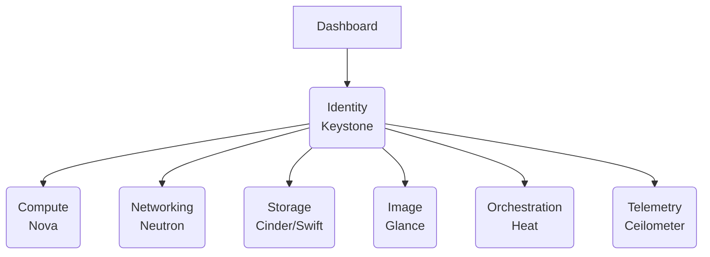
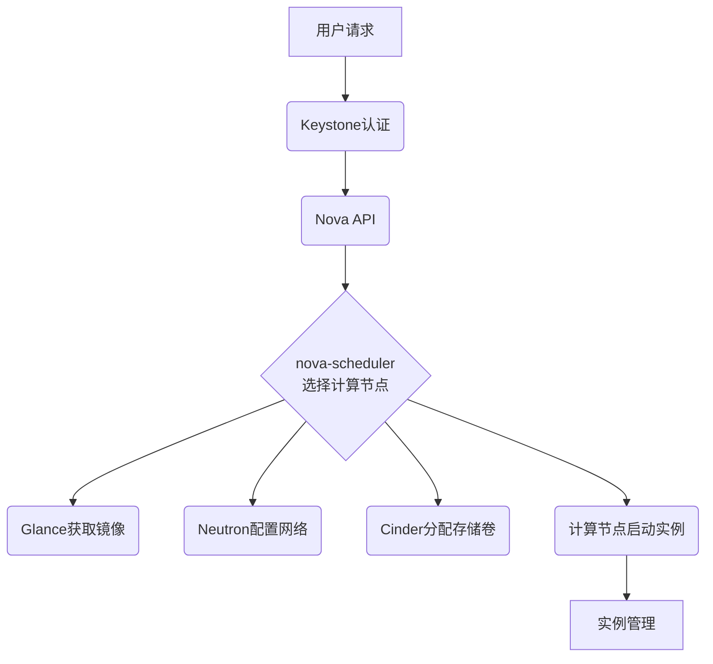
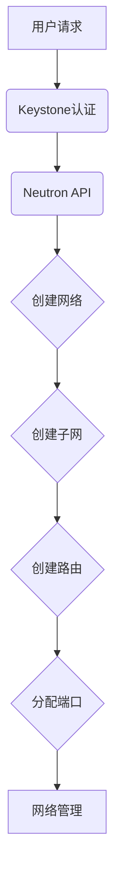

# 基于OpenStack的云服务平台

## 1.背景介绍

### 1.1 云计算的兴起

随着信息技术的快速发展,云计算已经成为当今IT界最热门的话题之一。云计算是一种按使用量付费的模式,它为用户提供了按需获取所需IT资源的能力。传统的IT服务模式需要企业自行采购硬件设备、建立机房、配置服务器等,不仅投资成本高昂,而且维护困难。而云计算则通过互联网将IT资源虚拟化,按需提供计算、存储、网络等资源服务,用户可以根据实际需求灵活获取所需资源,大大降低了IT成本,提高了资源利用率。

### 1.2 OpenStack的崛起

OpenStack是一个开源的云操作系统,旨在为公共及私有云提供大规模的虚拟化服务。它由NASA和Rackspace公司于2010年启动,目前已发展成为最受欢迎的云计算管理平台之一。OpenStack提供了大规模可扩展、高可靠的云操作系统,支持主流的虚拟化技术,并与众多标准化的API集成。它为企业和服务提供商提供了构建公有云、私有云和混合云服务的全套解决方案。

## 2.核心概念与联系

### 2.1 OpenStack架构概览

OpenStack采用模块化设计,由多个核心组件和可选组件组成。主要核心组件包括:

- Nova(计算服务)
- Neutron(网络服务)  
- Cinder(块存储服务)
- Glance(镜像服务)
- Keystone(身份认证服务)

此外还包括一些可选组件如Heat(编排服务)、Ceilometer(计量服务)等。下面是OpenStack的逻辑架构示意图:



### 2.2 OpenStack核心服务简介

1. **Nova(计算服务)**: 负责管理和自动化池化虚拟机的生命周期。
2. **Neutron(网络服务)**: 提供网络虚拟化服务,管理虚拟网络资源如网络、子网、路由等。
3. **Cinder(块存储服务)**: 提供永久性块存储设备,可用于启动实例或扩展现有实例。
4. **Glance(镜像服务)**: 存储和管理服务器镜像的库,提供镜像注册和检索服务。
5. **Keystone(身份认证服务)**: 为OpenStack服务提供身份验证和授权服务。

### 2.3 OpenStack核心概念

- **租户(Tenant)**: 租户是OpenStack中资源使用的基本单位,每个租户都拥有自己独立的资源配额。
- **实例(Instance)**: 即虚拟机,由Nova管理其生命周期。
- **镜像(Image)**: 实例的模板,包含了实例的预设软件配置信息。
- **卷(Volume)**: 由Cinder提供的可连接到实例的块存储设备。
- **网络(Network)**: 由Neutron提供的虚拟网络基础设施。

## 3.核心算法原理具体操作步骤  

### 3.1 Nova计算服务核心流程

Nova计算服务的核心工作流程包括以下几个主要步骤:

1. **认证请求**: 用户请求首先会被Keystone服务进行身份认证和授权。
2. **构建实例**: 用户通过API或Dashboard发起创建实例的请求,Nova的nova-scheduler组件会根据调度策略选择合适的计算节点。
3. **获取镜像**: Nova会从Glance镜像服务中获取实例所需的镜像。
4. **网络配置**: Nova会调用Neutron服务为实例分配虚拟网络资源。
5. **存储资源**: 如果实例需要额外的存储卷,Nova会调用Cinder服务创建所需的块存储卷。
6. **启动实例**: Nova会在选定的计算节点上启动实例的虚拟机。
7. **实例管理**: 用户可以通过API或Dashboard对实例进行各种管理操作。

下面是Nova计算服务的核心流程示意图:



### 3.2 Neutron网络服务核心流程

Neutron网络服务的核心工作流程包括以下几个主要步骤:

1. **认证请求**: 用户请求首先会被Keystone服务进行身份认证和授权。  
2. **创建网络**: 用户通过API或Dashboard发起创建网络的请求,Neutron会创建虚拟网络。
3. **创建子网**: 用户创建子网,并为子网分配IP地址池。
4. **创建路由**: 如果需要Internet访问,需要创建路由并设置网关。
5. **分配端口**: 当实例需要使用网络时,Neutron会为实例分配端口。
6. **网络管理**: 用户可以通过API或Dashboard对网络进行各种管理操作。

下面是Neutron网络服务的核心流程示意图:



## 4.数学模型和公式详细讲解举例说明

在OpenStack云平台中,有一些关键的数学模型和公式用于优化资源调度和管理。下面对其中几个核心模型进行详细讲解。

### 4.1 虚拟机consolidation问题

虚拟机consolidation是一个经典的资源优化问题,旨在通过合理地将虚拟机部署在物理主机上,最大限度地提高资源利用率,并最小化能源消耗。这可以形式化为一个向量bin packing问题:

$$
\begin{aligned}
\text{minimize} \quad & \sum_{j=1}^m \text{Power}_j(u_j) \\
\text{subject to} \quad & \sum_{i=1}^n x_{ij} = 1 \qquad \forall i \in \{1,\ldots,n\} \\
& \sum_{i=1}^n r_i^k x_{ij} \leq c_j^k \qquad \forall j \in \{1,\ldots,m\}, \forall k \in \{1,\ldots,d\} \\
& x_{ij} \in \{0, 1\} \qquad \forall i \in \{1,\ldots,n\}, \forall j \in \{1,\ldots,m\}
\end{aligned}
$$

其中:
- $n$是虚拟机的数量
- $m$是物理主机的数量 
- $d$是资源类型的数量(如CPU、内存等)
- $r_i^k$是第$i$个虚拟机对第$k$种资源的需求
- $c_j^k$是第$j$台物理主机对第$k$种资源的容量
- $u_j$是第$j$台物理主机的资源利用率
- $\text{Power}_j(u_j)$是第$j$台物理主机在利用率$u_j$时的能耗
- 决策变量$x_{ij}$表示虚拟机$i$是否部署在物理主机$j$上

该模型的目标是最小化所有物理主机的总能耗,约束条件是每个虚拟机只能部署在一台物理主机上,且每台物理主机的资源使用量不能超过其容量。这是一个NP-hard组合优化问题,通常采用启发式或近似算法求解。

### 4.2 虚拟机动态consolidation

上述静态consolidation问题假设物理主机和虚拟机的资源需求是固定的。但在实际场景中,虚拟机的资源需求会随时间动态变化,因此需要动态地重新分配虚拟机,以优化资源利用率和能耗。这可以建模为一个动态bin packing问题:

$$
\begin{aligned}
\text{minimize} \quad & \sum_{t=1}^T \sum_{j=1}^m \text{Power}_j(u_j(t)) \\
\text{subject to} \quad & \sum_{j=1}^m x_{ij}(t) = 1 \qquad \forall i \in \{1,\ldots,n\}, \forall t \in \{1,\ldots,T\} \\
& \sum_{i=1}^n r_i^k(t) x_{ij}(t) \leq c_j^k \qquad \forall j \in \{1,\ldots,m\}, \forall k \in \{1,\ldots,d\}, \forall t \in \{1,\ldots,T\} \\
& x_{ij}(t) \in \{0, 1\} \qquad \forall i \in \{1,\ldots,n\}, \forall j \in \{1,\ldots,m\}, \forall t \in \{1,\ldots,T\}
\end{aligned}
$$

其中:
- $T$是时间段的数量
- $r_i^k(t)$是第$i$个虚拟机在时间$t$对第$k$种资源的需求
- $u_j(t)$是第$j$台物理主机在时间$t$的资源利用率
- 决策变量$x_{ij}(t)$表示虚拟机$i$在时间$t$是否部署在物理主机$j$上

该模型的目标是最小化一段时间内所有物理主机的总能耗,约束条件是每个虚拟机在每个时间点只能部署在一台物理主机上,且每台物理主机的资源使用量不能超过其容量。这是一个更加复杂的动态优化问题,通常需要采用更先进的在线算法或机器学习技术来求解。

上述数学模型为OpenStack云平台提供了理论基础,帮助实现资源的高效利用和能源优化。在实际应用中,这些模型还需要结合具体的约束条件和优化目标进行定制和改进。

## 4.项目实践:代码实例和详细解释说明

在本节中,我们将通过一个基于Python的OpenStack客户端示例,演示如何使用OpenStack API来管理云资源。

### 4.1 安装OpenStack客户端

首先,我们需要安装OpenStack Python客户端库openstackclient:

```bash
pip install python-openstackclient
```

### 4.2 身份认证

要与OpenStack云交互,首先需要进行身份认证。下面是一个使用Keystone服务进行认证的示例:

```python
import os
import openstack

# OpenStack云认证信息
auth_args = {
    'auth_url': 'http://openstack_host:5000/v3',
    'project_name': 'myproject',
    'user_domain_name': 'default',
    'username': 'myuser',
    'password': 'mypassword',
}

# 创建OpenStack连接
conn = openstack.connect(**auth_args)
```

### 4.3 管理实例

通过OpenStack客户端,我们可以很方便地管理云主机实例,包括创建、启动、停止、删除等操作。

```python
# 创建实例
image = conn.compute.find_image('cirros')
flavor = conn.compute.find_flavor('m1.tiny')
network = conn.network.find_network('private')
instance = conn.compute.create_server(
    name='test-instance',
    image_id=image.id,
    flavor_id=flavor.id,
    networks=[{'uuid': network.id}]
)

# 获取实例列表
instances = conn.compute.servers()

# 启动实例
conn.compute.start_server(instance)

# 停止实例 
conn.compute.stop_server(instance)

# 删除实例
conn.compute.delete_server(instance)
```

### 4.4 管理网络

OpenStack Neutron服务提供了网络虚拟化功能,我们可以通过客户端创建和管理虚拟网络。

```python
# 创建网络
network = conn.network.create_network(name='mynetwork')

# 创建子网
subnet = conn.network.create_subnet(
    name='mysubnet',
    network_id=network.id,
    cidr='192.168.1.0/24',
    ip_version=4,
    gateway_ip='192.168.1.1'
)

# 创建路由器
router = conn.network.create_router(name='myrouter')

# 添加路由器网关
conn.network.add_router_interface(
    router,
    subnet_id=subnet.id,
    external_gateway_info