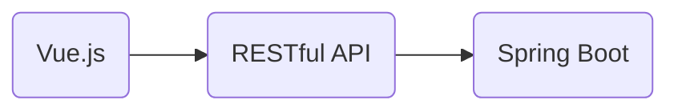

## 1. 背景介绍

### 1.1 企业OA系统的演变与发展

企业OA（Office Automation，办公自动化）系统，是指面向企业内部的管理信息系统，用于实现企业内部办公自动化，提高工作效率。随着信息技术的飞速发展，企业OA系统经历了从单机版到网络版，从C/S架构到B/S架构，从传统软件到SaaS服务的演变过程。近年来，随着云计算、大数据、人工智能等新技术的兴起，企业OA系统正朝着智能化、移动化、平台化方向发展。

### 1.2 Spring Boot 框架的优势与特点

Spring Boot 是 Pivotal 团队提供的全新框架，其设计目的是用来简化新 Spring 应用的初始搭建以及开发过程。该框架使用了特定的方式来进行配置，从而使开发人员不再需要定义样板化的配置。Spring Boot具有以下优点：

* **简化配置：** Spring Boot采用自动配置机制，可以根据项目依赖自动配置Spring应用，大大减少了配置文件的编写。
* **快速开发：** Spring Boot提供了一系列starter依赖，可以快速集成常用的第三方库，加速项目开发进度。
* **独立运行：** Spring Boot应用可以内嵌Tomcat、Jetty等Web服务器，可以直接运行，无需部署到外部容器。
* **易于部署：** Spring Boot应用可以打包成jar文件，方便部署和管理。

### 1.3 本文研究目的和意义

本文旨在基于Spring Boot框架，设计并实现一个企业OA管理系统，以满足现代企业对高效、智能、移动化办公的需求。通过本文的研究，可以深入理解Spring Boot框架的应用，掌握企业OA系统的开发流程，为企业OA系统的建设提供参考和借鉴。

## 2. 核心概念与联系

### 2.1 核心功能模块

企业OA管理系统主要包括以下功能模块：

* **用户管理：** 用户注册、登录、权限管理等。
* **部门管理：** 部门信息维护、组织架构管理等。
* **审批流程：**  定义审批流程、发起审批、审批处理等。
* **通知公告：** 发布通知公告、查看通知公告等。
* **文件管理：** 文件上传、下载、共享等。
* **考勤管理：** 考勤打卡、请假申请、加班申请等。
* **会议管理：** 会议室预定、会议记录等。

### 2.2 模块间关系

各功能模块之间相互关联，构成一个完整的企业OA管理系统。例如，审批流程模块需要依赖用户管理模块获取用户信息，文件管理模块需要依赖部门管理模块获取部门信息等。

### 2.3 核心技术架构

本系统采用前后端分离的架构，前端使用Vue.js框架，后端使用Spring Boot框架。前后端通过RESTful API进行数据交互。



## 3. 核心算法原理具体操作步骤

### 3.1 用户登录认证流程

用户登录认证流程如下：

1. 用户输入用户名和密码，提交登录请求。
2. 系统验证用户名和密码是否正确。
3. 如果验证通过，则生成JWT token，并将token返回给用户。
4. 用户将token保存到本地，并在后续请求中携带token。
5. 系统验证token是否有效，如果有效则允许用户访问受保护资源。

### 3.2 审批流程引擎

本系统采用Activiti工作流引擎实现审批流程。Activiti是一个开源的工作流引擎，支持BPMN2.0规范。

审批流程定义步骤如下：

1. 使用Activiti Modeler设计审批流程图。
2. 将流程图部署到Activiti引擎。
3. 开发审批流程相关代码，例如发起审批、审批处理等。

### 3.3 文件上传下载

文件上传下载采用Spring Boot提供的MultipartFile类实现。

文件上传步骤如下：

1. 用户选择要上传的文件。
2. 系统将文件保存到服务器指定目录。
3. 系统将文件信息保存到数据库。

文件下载步骤如下：

1. 用户选择要下载的文件。
2. 系统从服务器读取文件内容。
3. 系统将文件内容返回给用户。

## 4. 数学模型和公式详细讲解举例说明

本系统不涉及复杂的数学模型和公式。

## 5. 项目实践：代码实例和详细解释说明

### 5.1 用户管理模块

#### 5.1.1 用户实体类

```java
@Entity
@Table(name = "user")
public class User {

    @Id
    @GeneratedValue(strategy = GenerationType.IDENTITY)
    private Long id;

    @Column(nullable = false, unique = true)
    private String username;

    @Column(nullable = false)
    private String password;

    // 其他属性...
}
```

#### 5.1.2 用户服务接口

```java
public interface UserService {

    User findByUsername(String username);

    User save(User user);

    void deleteById(Long id);

    // 其他方法...
}
```

#### 5.1.3 用户服务实现类

```java
@Service
public class UserServiceImpl implements UserService {

    @Autowired
    private UserRepository userRepository;

    @Override
    public User findByUsername(String username) {
        return userRepository.findByUsername(username);
    }

    @Override
    public User save(User user) {
        return userRepository.save(user);
    }

    @Override
    public void deleteById(Long id) {
        userRepository.deleteById(id);
    }

    // 其他方法实现...
}
```

### 5.2 审批流程模块

#### 5.2.1 审批流程定义文件

```xml
<?xml version="1.0" encoding="UTF-8"?>
<definitions xmlns="http://www.omg.org/spec/BPMN/20100524/MODEL" 
    xmlns:xsi="http://www.w3.org/2001/XMLSchema-instance"
    xmlns:activiti="http://activiti.org/bpmn"
    targetNamespace="http://www.activiti.org/test">

    <process id="leaveProcess" name="请假流程">

        <startEvent id="startEvent" />

        <userTask id="deptLeaderApprove" name="部门领导审批" 
            activiti:assignee="${deptLeader}" />

        <exclusiveGateway id="decision" />

        <userTask id="hrApprove" name="人事审批" 
            activiti:assignee="${hr}" />

        <endEvent id="endEvent" />

        <sequenceFlow sourceRef="startEvent" targetRef="deptLeaderApprove" />
        <sequenceFlow sourceRef="deptLeaderApprove" targetRef="decision" />
        <sequenceFlow sourceRef="decision" targetRef="hrApprove" 
            condition="${approved == true}" />
        <sequenceFlow sourceRef="decision" targetRef="endEvent" 
            condition="${approved == false}" />
        <sequenceFlow sourceRef="hrApprove" targetRef="endEvent" />

    </process>

</definitions>
```

#### 5.2.2 发起审批请求

```java
// 获取流程引擎
ProcessEngine processEngine = ProcessEngines.getDefaultProcessEngine();

// 设置流程变量
Map<String, Object> variables = new HashMap<>();
variables.put("deptLeader", "张三");
variables.put("hr", "李四");

// 启动流程实例
ProcessInstance processInstance = processEngine.getRuntimeService()
    .startProcessInstanceByKey("leaveProcess", variables);
```

#### 5.2.3 审批处理

```java
// 获取任务服务
TaskService taskService = processEngine.getTaskService();

// 查询待办任务
List<Task> tasks = taskService.createTaskQuery()
    .taskCandidateUser("李四")
    .list();

// 处理任务
for (Task task : tasks) {
    // 设置流程变量
    Map<String, Object> variables = new HashMap<>();
    variables.put("approved", true);

    // 完成任务
    taskService.complete(task.getId(), variables);
}
```

## 6. 实际应用场景

企业OA管理系统适用于各种类型的企业，例如：

* 大型企业：可以实现跨部门协同办公，提高工作效率。
* 中小企业：可以降低管理成本，提升企业形象。
* 政府机构：可以规范办公流程，提高政府办事效率。

## 7. 工具和资源推荐

* **Spring Boot官网：** https://spring.io/projects/spring-boot
* **Activiti官网：** https://www.activiti.org/
* **Vue.js官网：** https://vuejs.org/
* **MySQL官网：** https://www.mysql.com/

## 8. 总结：未来发展趋势与挑战

未来，企业OA管理系统将朝着以下方向发展：

* **智能化：** 利用人工智能技术，实现智能审批、智能客服等功能。
* **移动化：** 支持移动端访问，方便员工随时随地办公。
* **平台化：**  构建开放平台，方便第三方应用集成。

企业OA管理系统面临的挑战包括：

* **数据安全：**  如何保障企业数据安全。
* **系统集成：**  如何与其他系统进行集成。
* **用户体验：** 如何提升用户体验。

## 9. 附录：常见问题与解答

### 9.1 如何解决Spring Boot跨域问题？

可以使用@CrossOrigin注解解决Spring Boot跨域问题。

```java
@RestController
@CrossOrigin
public class UserController {
    // ...
}
```

### 9.2 如何配置Activiti数据库？

在application.properties文件中配置Activiti数据库连接信息。

```properties
spring.datasource.url=jdbc:mysql://localhost:3306/activiti?useUnicode=true&characterEncoding=utf-8&useSSL=false
spring.datasource.username=root
spring.datasource.password=root
spring.datasource.driver-class-name=com.mysql.jdbc.Driver
```

### 9.3 如何实现文件上传进度条？

可以使用WebUploader等第三方库实现文件上传进度条。