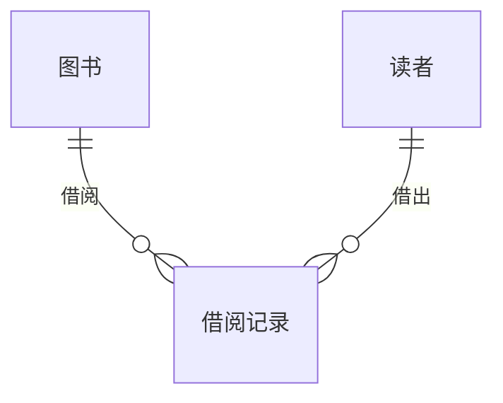

## 1. 背景介绍

### 1.1 图书馆管理系统的现状与挑战

随着信息技术的飞速发展，图书馆管理系统已经成为现代图书馆不可或缺的一部分。传统的图书馆管理系统存在着诸多问题，例如：效率低下、数据冗余、安全性不足等。为了解决这些问题，新一代的图书馆管理系统应运而生，它们基于先进的技术架构，提供更便捷、高效、安全的管理服务。

### 1.2 Spring Boot 框架的优势

Spring Boot 是一个用于创建独立的、生产级别的 Spring 应用程序的框架。它简化了 Spring 应用程序的初始搭建以及开发过程。Spring Boot 的核心特性包括：

- 自动配置：Spring Boot 会根据项目依赖自动配置 Spring 应用程序。
- 起步依赖：Spring Boot 提供了一系列起步依赖，简化了依赖管理。
- 命令行界面：Spring Boot 提供了命令行界面，可以方便地管理 Spring Boot 应用程序。
- Actuator：Spring Boot Actuator 提供了对应用程序的监控和管理功能。

### 1.3 图书借阅管理系统的需求分析

图书馆图书借阅管理系统需要满足以下需求：

- 图书管理：对图书馆的图书信息进行管理，包括图书的添加、删除、修改、查询等操作。
- 借阅管理：管理图书的借阅和归还，包括借阅登记、归还登记、逾期处理等操作。
- 读者管理：管理读者的信息，包括读者注册、读者信息修改、读者借阅记录查询等操作。
- 系统管理：管理系统用户、角色、权限等信息。

## 2. 核心概念与联系

### 2.1 系统架构

本系统采用经典的三层架构设计，分别为：

- 表现层：负责用户界面的展示和用户交互。
- 业务逻辑层：负责处理业务逻辑，例如图书借阅、归还等操作。
- 数据访问层：负责与数据库进行交互，进行数据的增删改查操作。

### 2.2 核心实体

本系统包含以下核心实体：

- 图书：包含图书的 ISBN、书名、作者、出版社、出版日期、价格等信息。
- 读者：包含读者的学号/工号、姓名、性别、联系方式等信息。
- 借阅记录：包含借阅的图书、借阅的读者、借阅日期、应还日期、实际归还日期等信息。

### 2.3 实体关系图



## 3. 核心算法原理具体操作步骤

### 3.1 图书借阅流程

1. 读者在系统中选择要借阅的图书，并提交借阅申请。
2. 系统检查图书的库存数量，如果库存充足，则生成借阅记录，并将图书的状态设置为“已借出”。
3. 系统记录借阅日期和应还日期。
4. 读者在应还日期之前归还图书。
5. 系统更新借阅记录，并将图书的状态设置为“可借阅”。

### 3.2 图书归还流程

1. 读者在系统中选择要归还的图书，并提交归还申请。
2. 系统检查借阅记录，确认图书已借出，并且未逾期。
3. 系统更新借阅记录，并将图书的状态设置为“可借阅”。
4. 系统记录实际归还日期。

## 4. 数学模型和公式详细讲解举例说明

本系统不涉及复杂的数学模型和公式。

## 5. 项目实践：代码实例和详细解释说明

### 5.1 项目结构

```
library-management-system
├── src
│   ├── main
│   │   ├── java
│   │   │   └── com
│   │   │       └── example
│   │   │           └── librarymanagementsystem
│   │   │               ├── LibraryManagementSystemApplication.java
│   │   │               ├── controller
│   │   │               │   ├── BookController.java
│   │   │               │   ├── BorrowController.java
│   │   │               │   ├── ReaderController.java
│   │   │               │   └── SystemController.java
│   │   │               ├── service
│   │   │               │   ├── BookService.java
│   │   │               │   ├── BorrowService.java
│   │   │               │   ├── ReaderService.java
│   │   │               │   └── SystemService.java
│   │   │               ├── repository
│   │   │               │   ├── BookRepository.java
│   │   │               │   ├── BorrowRepository.java
│   │   │               │   └── ReaderRepository.java
│   │   │               └── entity
│   │   │                   ├── Book.java
│   │   │                   ├── Borrow.java
│   │   │                   └── Reader.java
│   │   └── resources
│   │       ├── application.properties
│   │       └── static
│   └── test
│       └── java
│           └── com
│               └── example
│                   └── librarymanagementsystem
│                       └── LibraryManagementSystemApplicationTests.java
└── pom.xml
```

### 5.2 代码实例

#### 5.2.1 BookController.java

```java
package com.example.librarymanagementsystem.controller;

import com.example.librarymanagementsystem.entity.Book;
import com.example.librarymanagementsystem.service.BookService;
import org.springframework.beans.factory.annotation.Autowired;
import org.springframework.web.bind.annotation.*;

import java.util.List;

@RestController
@RequestMapping("/book")
public class BookController {

    @Autowired
    private BookService bookService;

    @GetMapping("/list")
    public List<Book> listBooks() {
        return bookService.listBooks();
    }

    @PostMapping("/add")
    public Book addBook(@RequestBody Book book) {
        return bookService.addBook(book);
    }

    @PutMapping("/update")
    public Book updateBook(@RequestBody Book book) {
        return bookService.updateBook(book);
    }

    @DeleteMapping("/delete/{id}")
    public void deleteBook(@PathVariable Long id) {
        bookService.deleteBook(id);
    }
}
```

#### 5.2.2 BookService.java

```java
package com.example.librarymanagementsystem.service;

import com.example.librarymanagementsystem.entity.Book;
import com.example.librarymanagementsystem.repository.BookRepository;
import org.springframework.beans.factory.annotation.Autowired;
import org.springframework.stereotype.Service;

import java.util.List;

@Service
public class BookService {

    @Autowired
    private BookRepository bookRepository;

    public List<Book> listBooks() {
        return bookRepository.findAll();
    }

    public Book addBook(Book book) {
        return bookRepository.save(book);
    }

    public Book updateBook(Book book) {
        return bookRepository.save(book);
    }

    public void deleteBook(Long id) {
        bookRepository.deleteById(id);
    }
}
```

## 6. 实际应用场景

图书馆图书借阅管理系统可以应用于各种类型的图书馆，例如：

- 公共图书馆
- 学校图书馆
- 企业图书馆

## 7. 工具和资源推荐

### 7.1 开发工具

- IntelliJ IDEA
- Eclipse

### 7.2 数据库

- MySQL
- PostgreSQL

### 7.3 Spring Boot 相关资源

- Spring Boot 官方文档：https://spring.io/projects/spring-boot
- Spring Boot 中文文档：https://www.springcloud.cc/spring-boot.html

## 8. 总结：未来发展趋势与挑战

### 8.1 未来发展趋势

- 云计算：图书馆管理系统将逐步迁移到云平台，利用云计算的优势提升系统的可扩展性和可靠性。
- 大数据：图书馆管理系统将利用大数据技术进行数据分析，为读者提供个性化的服务。
- 人工智能：图书馆管理系统将引入人工智能技术，例如智能推荐、智能客服等，提升用户体验。

### 8.2 面临的挑战

- 数据安全：图书馆管理系统需要保障读者数据的安全。
- 系统性能：图书馆管理系统需要处理大量的并发请求，保证系统的稳定性和响应速度。
- 用户体验：图书馆管理系统需要提供简洁易用的用户界面，提升用户体验。

## 9. 附录：常见问题与解答

### 9.1 如何解决图书借阅超期问题？

可以设置逾期罚款机制，对逾期未归还的图书进行罚款。

### 9.2 如何提高图书借阅效率？

可以通过优化借阅流程、引入自助借还机等方式提高图书借阅效率。

### 9.3 如何保障读者数据安全？

可以采用数据加密、访问控制等措施保障读者数据安全。
