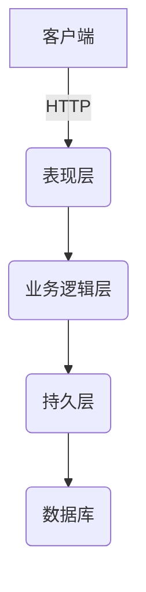
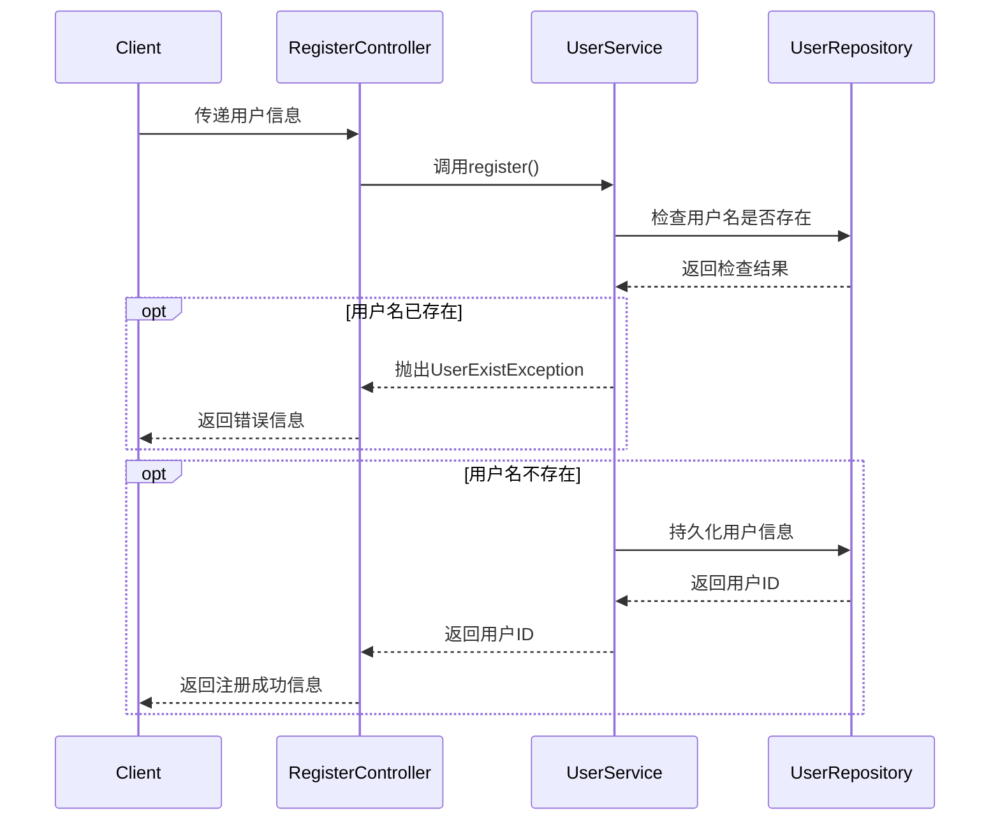
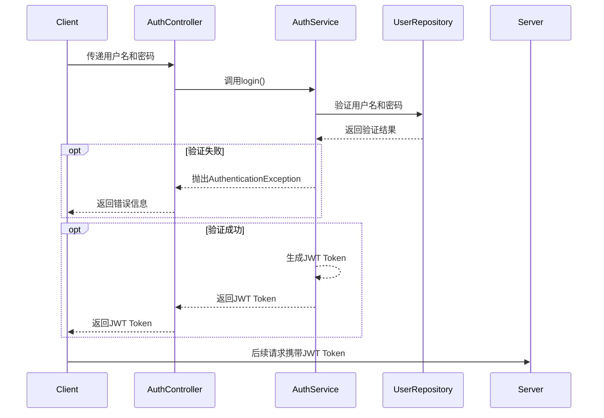
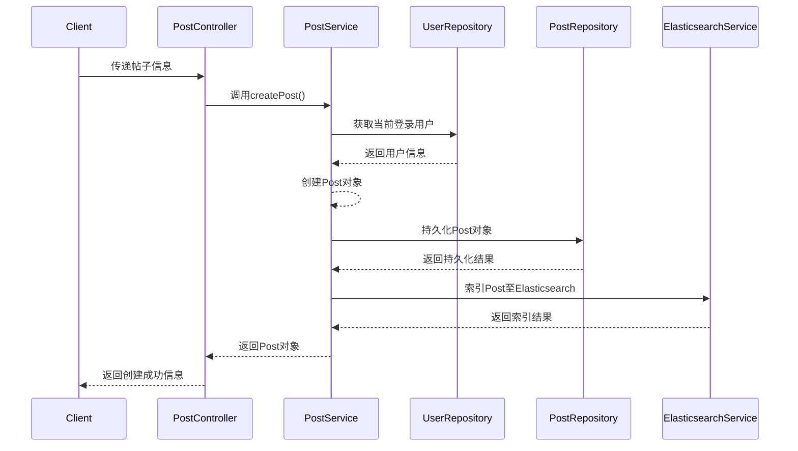
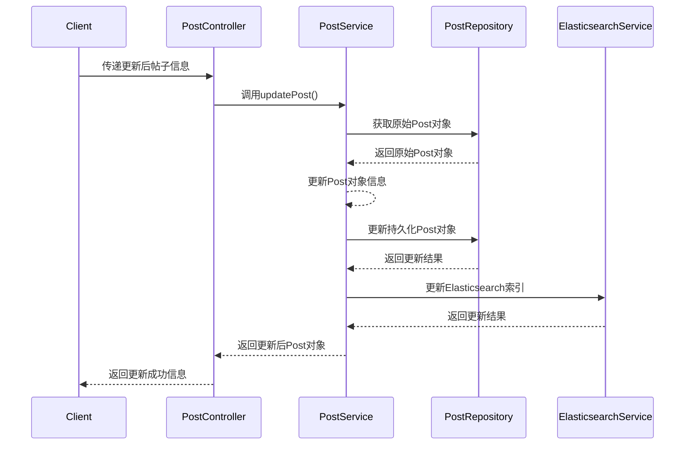
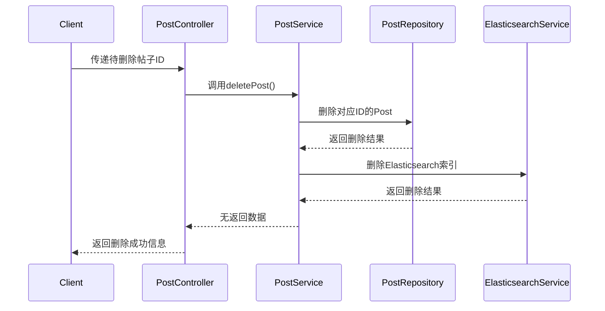
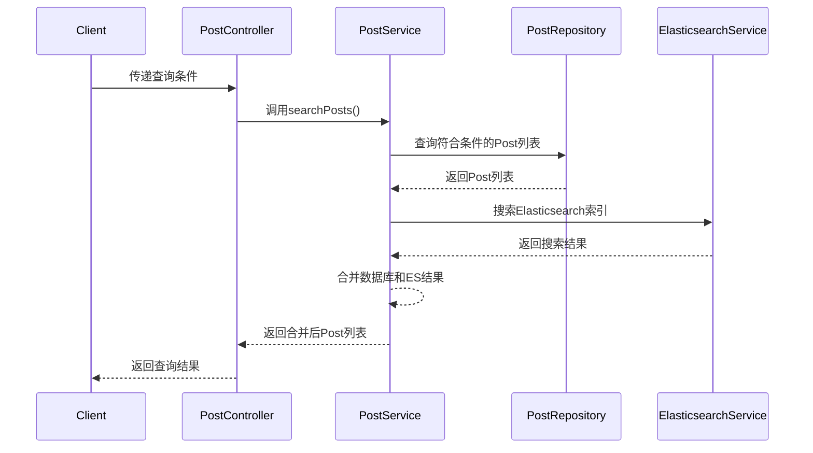
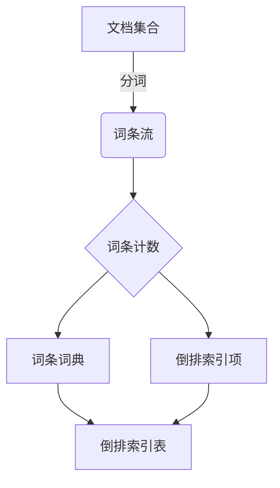
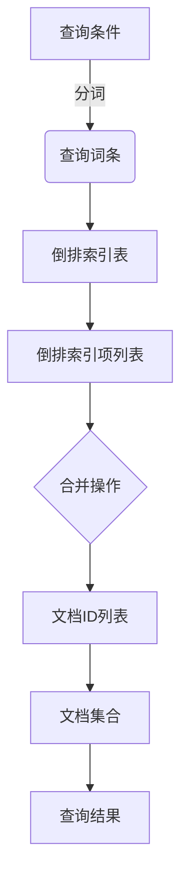

# 基于SpringBoot的宠物论坛系统

## 1. 背景介绍

### 1.1 宠物行业概况

近年来,随着人们生活水平的不断提高,宠物养殖已成为一种新兴的生活方式。据统计,我国宠物市场规模已超过2000亿元,年均复合增长率超过20%。与此同时,宠物主人对于宠物相关信息和服务的需求也在不断增长。

### 1.2 传统论坛系统存在的问题

传统的宠物论坛系统大多基于PHP、JSP等技术,存在如下几个主要问题:

1. **性能低下**:请求响应速度慢,无法满足高并发场景需求。
2. **扩展性差**:代码耦合严重,新功能集成困难。 
3. **开发效率低**:开发周期长,迭代频率低。
4. **移动端支持差**:大多只提供PC端访问,无法满足移动互联时代需求。

### 1.3 SpringBoot的优势

SpringBoot作为新一代JavaEE开发框架,具有如下优势:

1. **高效开发**:提供自动配置、起步依赖等特性,大幅提高开发效率。
2. **嵌入式容器**:内置Tomcat、Jetty等服务器,无需额外安装。
3. **微服务友好**:基于SpringCloud可轻松构建微服务架构。
4. **监控管理**:提供生产指标监控、健康检查等功能。

基于以上优势,使用SpringBoot开发宠物论坛系统可以弥补传统系统的不足。

## 2. 核心概念与联系

### 2.1 系统架构

基于SpringBoot的宠物论坛系统采用经典的三层架构:

1. **表现层**:基于SpringMVC,提供RESTful API与前端交互。
2. **业务逻辑层**:包含各种业务组件,如用户管理、帖子管理等。
3. **持久层**:基于SpringData JPA与数据库交互,实现CRUD操作。



### 2.2 关键技术

1. **SpringBoot**: 提供自动配置、嵌入式容器等特性,提高开发效率。
2. **SpringMVC**: 实现RESTful API,与前端交互。
3. **SpringData JPA**: 简化数据持久层开发,实现CRUD。
4. **MySQL**: 作为系统的关系型数据库。
5. **Redis**: 提供缓存服务,提升系统性能。
6. **RabbitMQ**: 实现异步消息队列,解耦组件间依赖。
7. **Elasticsearch**: 提供高效的全文检索能力。
8. **Docker**: 实现容器化部署,提高系统可移植性。

## 3. 核心算法原理具体操作步骤  

### 3.1 用户认证与授权

#### 3.1.1 用户注册

1. 前端将用户信息传递至RegisterController
2. RegisterController调用UserService的register方法
3. UserService检查用户名是否已存在
    - 若存在,抛出UserExistException异常
    - 若不存在,将用户信息持久化至数据库
4. 注册成功,返回用户ID



#### 3.1.2 用户登录(JWT认证)

1. 前端将用户名和密码传递至AuthController
2. AuthController调用AuthService的login方法
3. AuthService验证用户名和密码
    - 若验证失败,抛出AuthenticationException异常 
    - 若验证成功,生成JWT Token
4. AuthService将JWT Token返回给AuthController
5. AuthController将JWT Token返回给前端
6. 前端在后续请求中将JWT Token放入请求头



#### 3.1.3 权限控制

1. 定义权限注解@PreAuthorize,用于标注需要权限控制的方法
2. 创建自定义PermissionEvaluator,实现hasPermission方法
3. SpringSecurity启动时,将PermissionEvaluator注册为Bean
4. 访问@PreAuthorize标注的方法时,SpringSecurity调用PermissionEvaluator的hasPermission
5. 在hasPermission中,从请求头获取JWT Token,解析获取用户ID和角色
6. 根据用户ID、角色和请求方法,判断是否有权限访问
7. 无权限时抛出AccessDeniedException异常

```java
@Component
public class CustomPermissionEvaluator implements PermissionEvaluator {
    @Override
    public boolean hasPermission(Authentication auth, Object targetDomainObject, Object permission) {
        String token = SecurityUtils.getTokenFromRequest();
        if (StringUtils.isEmpty(token)) {
            return false;
        }
        
        User user = jwtTokenProvider.getUserFromToken(token);
        if (user == null) {
            return false;
        }
        
        String userRole = user.getRole().name();
        String requestMethod = ((MethodInvocationRequest) permission).getMethod().getName();
        
        // 根据角色和请求方法判断权限
        return permissionService.checkPermission(userRole, requestMethod);
    }
}
```

### 3.2 帖子管理

帖子管理包括帖子的创建、更新、删除、查询等操作。

#### 3.2.1 帖子创建

1. 前端传递帖子标题、内容等信息至PostController
2. PostController调用PostService的createPost方法
3. PostService调用UserRepository获取当前登录用户信息
4. PostService创建Post对象,设置标题、内容、作者等信息
5. PostService调用PostRepository持久化Post对象
6. PostService调用ElasticsearchService,将Post索引至Elasticsearch
7. 创建成功,返回Post对象



#### 3.2.2 帖子更新

1. 前端传递更新后的帖子信息至PostController
2. PostController调用PostService的updatePost方法 
3. PostService从PostRepository获取原始Post对象
4. PostService更新Post对象的标题、内容等信息
5. PostService调用PostRepository更新Post对象
6. PostService调用ElasticsearchService,更新Elasticsearch中的索引
7. 更新成功,返回更新后的Post对象



#### 3.2.3 帖子删除

1. 前端传递待删除帖子ID至PostController
2. PostController调用PostService的deletePost方法
3. PostService从PostRepository删除对应ID的Post对象
4. PostService调用ElasticsearchService,从Elasticsearch删除索引
5. 删除成功,无需返回数据



#### 3.2.4 帖子查询

1. 前端传递查询条件(标题关键词等)至PostController
2. PostController调用PostService的searchPosts方法
3. PostService从PostRepository查询符合条件的Post列表
4. PostService调用ElasticsearchService,搜索Elasticsearch索引
5. PostService合并数据库和Elasticsearch查询结果
6. 返回合并后的Post列表



### 3.3 全文检索

全文检索的核心是建立反向索引,常用的数据结构是倒排索引。

#### 3.3.1 创建倒排索引

1. 对文档进行分词,生成词条流
2. 遍历词条流,对每个词条计数
3. 根据词条计数构建词条词典
4. 遍历文档,对每个文档构建倒排索引项
5. 以词条为键,倒排索引项为值,构建倒排索引表



#### 3.3.2 搜索查询

1. 对查询条件进行分词,生成查询词条
2. 在倒排索引表中查找查询词条
3. 获取对应的倒排索引项列表
4. 合并倒排索引项,获取文档ID列表
5. 根据文档ID列表,从文档集合中检索文档



### 3.4 推荐系统

推荐系统的核心是计算用户与物品的相似度,常用的算法有基于内容的推荐、协同过滤推荐等。

#### 3.4.1 基于内容推荐

1. 提取用户浏览历史记录和帖子内容的特征向量
2. 计算用户特征向量和帖子特征向量的余弦相似度
3. 按相似度降序排列,取前N个作为推荐结果

```python
import numpy as np
from sklearn.feature_extraction.text import TfidfVectorizer

# 提取特征向量
vectorizer = TfidfVectorizer()
user_features = vectorizer.fit_transform(user_history)
post_features = vectorizer.transform(post_contents)

# 计算