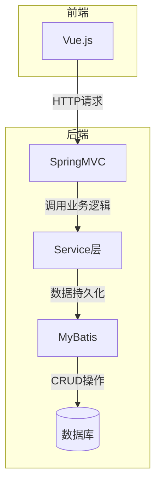

# 基于SSM的前后端分离毕业设计管理系统

## 1.背景介绍

### 1.1 毕业设计的重要性

毕业设计是高等教育中非常重要的一个环节,它是学生在校期间所学知识的综合运用和实践,是对学生综合能力的一种全面考核。一个优秀的毕业设计不仅能够体现学生对所学专业知识的掌握程度,还能锻炼学生的实践能力、创新能力和解决实际问题的能力。

### 1.2 传统毕业设计管理存在的问题

传统的毕业设计管理模式存在一些问题:

- 信息传递效率低下,主要依赖线下沟通
- 管理流程繁琐,大量手工操作
- 数据统计分析能力差
- 教师和学生交流协作不便

这些问题导致了管理效率低下,给师生带来了很多不便。

### 1.3 前后端分离架构的优势

为了解决上述问题,我们可以基于前后端分离的架构,开发一个毕业设计管理系统。前后端分离架构有以下优势:

- 前后端分离,分工明确,提高开发效率
- 前端可以使用现代化框架,提升用户体验 
- 后端只需关注业务逻辑,提高可维护性
- 便于系统扩展和技术迭代升级

基于这种架构,我们可以构建一个高效、现代化的毕业设计管理系统。

## 2.核心概念与联系

### 2.1 前后端分离

前后端分离是当下流行的架构模式。所谓前后端分离,就是视图界面(View)和数据处理(Model)分开。

- 前端:负责视图渲染,处理用户交互行为
- 后端:负责对数据的处理、业务逻辑运算等

两端使用HTTP/Socket等通信协议进行数据交互。这种模式下,前后端可以选用不同的技术栈进行开发。

### 2.2 SSM架构

SSM是JavaWeb三大框架的缩写,分别指:

- Spring: 依赖注入容器框架
- SpringMVC: 表现层框架,实现MVC设计模式
- MyBatis: 持久层框架,操作数据库

SSM整合了这三个框架的优势,构建了一个高效、规范、轻量级的JavaWeb应用开发框架模式。

### 2.3 前后端分离与SSM的结合

在本系统中,前端使用Vue.js框架开发,后端使用SSM框架开发。两者通过RESTful API进行通信。

- 前端发送HTTP请求到后端
- 后端根据请求,运行SSM框架中的代码逻辑
- 从数据库读取/写入数据
- 将结果响应回前端

这种模式使前后端完全分离,互不影响,也便于各自技术栈的替换和升级。

## 3.核心算法原理具体操作步骤 

### 3.1 系统架构

系统采用经典的三层架构模式:



1. 前端Vue.js发送HTTP请求
2. 请求被SpringMVC控制器(Controller)接收和处理
3. 控制器调用Service层执行业务逻辑
4. Service层通过MyBatis框架与数据库交互
5. 最终将结果响应回前端

### 3.2 RESTful API设计

我们采用RESTful风格设计API接口:

```
GET /api/projects               获取所有项目列表
GET /api/projects/{id}          获取指定id项目
POST /api/projects              创建新项目
PUT /api/projects/{id}          更新指定id项目 
DELETE /api/projects/{id}       删除指定id项目
```

符合REST规范的API具有简单明了、可扩展性强等优点。

### 3.3 前端路由与视图

前端使用Vue Router进行路由管理,不同URL对应不同的组件视图:

```js
// router/index.js
import Vue from 'vue'
import Router from 'vue-router'

import ProjectList from '@/views/ProjectList'
import ProjectDetail from '@/views/ProjectDetail'

export default new Router({
  routes: [
    {path: '/projects', component: ProjectList},
    {path: '/projects/:id', component: ProjectDetail}
  ]
})
```

当用户访问 `/projects` 时,ProjectList视图组件会被渲染,展示所有项目列表。

### 3.4 前端发起请求

以获取项目列表为例,前端使用axios库发起GET请求:

```js
// 前端代码
import axios from 'axios'

export default {
  name: 'ProjectList',
  data() {
    return {
      projects: []
    }
  },
  created() {
    this.fetchProjects()
  },
  methods: {
    async fetchProjects() {
      const res = await axios.get('/api/projects')
      this.projects = res.data
    }
  }
}
```

请求发送到后端 `/api/projects` 接口,将返回的数据赋值给projects数据属性,最终在视图中展示出来。

### 3.5 后端接收请求

后端使用SpringMVC的`@RestController`注解创建REST风格的控制器:

```java
// 后端代码
@RestController
@RequestMapping("/api/projects")
public class ProjectController {

    @Autowired
    private ProjectService projectService;

    @GetMapping
    public List<Project> getAllProjects() {
        return projectService.getAllProjects();
    }
    
    // 其他CRUD接口...
}
```

`@GetMapping`注解表示该方法处理GET请求,返回所有项目列表数据。

### 3.6 Service层业务逻辑

Service层负责编写业务逻辑代码,通过MyBatis框架与数据库交互:

```java
@Service
public class ProjectServiceImpl implements ProjectService {
    
    @Autowired
    private ProjectMapper projectMapper;

    @Override
    public List<Project> getAllProjects() {
        return projectMapper.selectAll();
    }
    
    // 其他业务逻辑...
}
```

MyBatis的映射器(Mapper)通过自动映射机制,自动执行SQL语句并返回结果。

## 4.数学模型和公式详细讲解举例说明

在毕业设计管理系统中,我们可以使用一些数学模型和算法来优化系统性能和用户体验。以下是一些可能的应用场景:

### 4.1 推荐系统

推荐系统是一种使用机器学习算法,根据用户的历史数据和偏好,为用户推荐感兴趣的项目或资源的系统。常用的推荐算法有:

1. **协同过滤算法(Collaborative Filtering)**

协同过滤算法基于"物以类聚,人以群分"的原理,通过计算用户之间的相似度或项目之间的相似度,为用户推荐与他们有相似兴趣的其他用户喜欢的项目。

基于用户的协同过滤算法公式:

$$
sim(u,v)=\frac{\sum\limits_{i \in I_{uv}}(r_{ui}-\overline{r_u})(r_{vi}-\overline{r_v})}{\sqrt{\sum\limits_{i \in I_{uv}}(r_{ui}-\overline{r_u})^2}\sqrt{\sum\limits_{i \in I_{uv}}(r_{vi}-\overline{r_v})^2}}
$$

其中:
- $sim(u,v)$ 表示用户u和用户v的相似度
- $I_{uv}$ 表示用户u和v都评分过的项目集合
- $r_{ui}$ 表示用户u对项目i的评分
- $\overline{r_u}$ 表示用户u的平均评分

计算出用户相似度后,就可以为目标用户推荐与他相似的其他用户喜欢的项目。

2. **基于内容的推荐算法(Content-based)**

基于内容的推荐算法会分析项目的内容特征,然后根据用户过去喜欢的项目的特征,推荐具有相似特征的其他项目。

常用的相似度计算方法是余弦相似度:

$$
sim(p,q) = \cos(\theta) = \frac{\vec{p} \cdot \vec{q}}{|\vec{p}||\vec{q}|} = \frac{\sum\limits_{i=1}^{n}p_iq_i}{\sqrt{\sum\limits_{i=1}^{n}p_i^2}\sqrt{\sum\limits_{i=1}^{n}q_i^2}}
$$

其中$\vec{p}$和$\vec{q}$分别表示项目p和q的特征向量。

通过计算项目之间的相似度,就可以为用户推荐与他喜欢的项目特征相似的其他项目。

使用推荐算法可以提高系统的智能化水平,为用户提供个性化的推荐服务,提升用户体验。

### 4.2 项目进度预测

我们可以使用回归分析等机器学习算法,基于历史数据预测学生的项目进度。

假设我们有以下训练数据:

- $X$: 代表每个项目的特征矩阵,包括项目类型、指导老师、学生能力等特征
- $y$: 代表项目完成时间(天数)

我们可以使用线性回归模型:

$$
y = \theta_0 + \theta_1x_1 + \theta_2x_2 + ... + \theta_nx_n
$$

其中$\theta$是待求的模型参数,可以使用最小二乘法等优化算法进行训练:

$$
\min\limits_\theta\sum\limits_{i=1}^{m}(y^{(i)}-h_\theta(x^{(i)}))^2
$$

$h_\theta(x)$是模型的预测函数,目标是最小化预测值和真实值的差距。

训练好的模型就可以对新项目的进度进行预测,从而帮助教师合理安排工作,学生也可以更好地规划时间。

这只是一个简单的示例,实际中我们可以使用更加复杂的非线性模型和特征工程技术,以提高预测的准确性。

## 4.项目实践:代码实例和详细解释说明

### 4.1 项目总体结构

```
graduation-project
├─ .gitignore
├─ pom.xml
├─ README.md
├─ graduation-backend
│  ├─ src
│  │  ├─ main
│  │  │  ├─ java
│  │  │  │  └─ com
│  │  │  │     └─ example
│  │  │  │        ├─ config
│  │  │  │        ├─ controller
│  │  │  │        ├─ entity
│  │  │  │        ├─ mapper
│  │  │  │        ├─ service
│  │  │  │        └─ GraduationApplication.java
│  │  │  └─ resources
│  │  │     ├─ mapper
│  │  │     └─ application.properties
│  │  └─ test
│  └─ pom.xml
└─ graduation-frontend
   ├─ node_modules
   ├─ public
   ├─ src
   │  ├─ assets
   │  ├─ components
   │  ├─ router
   │  ├─ views
   │  ├─ App.vue
   │  └─ main.js
   ├─ .gitignore
   ├─ babel.config.js
   ├─ package.json
   ├─ README.md
   └─ vue.config.js
```

如上所示,整个项目分为两个子模块:

- `graduation-backend`: 使用Spring Boot框架构建的后端应用
- `graduation-frontend`: 使用Vue.js框架构建的前端应用

后端使用Maven进行依赖和构建管理,前端使用npm。

### 4.2 后端代码示例

以项目管理模块为例,我们来看看后端的实现。

**实体类(Entity)**

```java
// graduation-backend/src/main/java/com/example/entity/Project.java
@Data
@NoArgsConstructor
@AllArgsConstructor
public class Project implements Serializable {
    private Long id;
    private String name;
    private String description;
    private Long studentId;
    private Long teacherId;
    private ProjectStatus status;
    // 其他属性...
}
```

Project实体类映射到数据库中的project表,使用Lombok注解简化代码。

**MyBatis映射器(Mapper)**

```xml
<!-- graduation-backend/src/main/resources/mapper/ProjectMapper.xml -->
<mapper namespace="com.example.mapper.ProjectMapper">
    <select id="selectAll" resultType="com.example.entity.Project">
        SELECT * FROM project
    </select>

    <insert id="insert" parameterType="com.example.entity.Project">
        INSERT INTO project (name, description, student_id, teacher_id, status)
        VALUES (#{name}, #{description}, #{studentId}, #{teacherId}, #{status})
    </insert>

    <!-- 其他CRUD映射... -->
</mapper>
```

MyBatis映射器定义了如何执行CRUD操作的SQL语句。

**服务层(Service)**

```java
// graduation