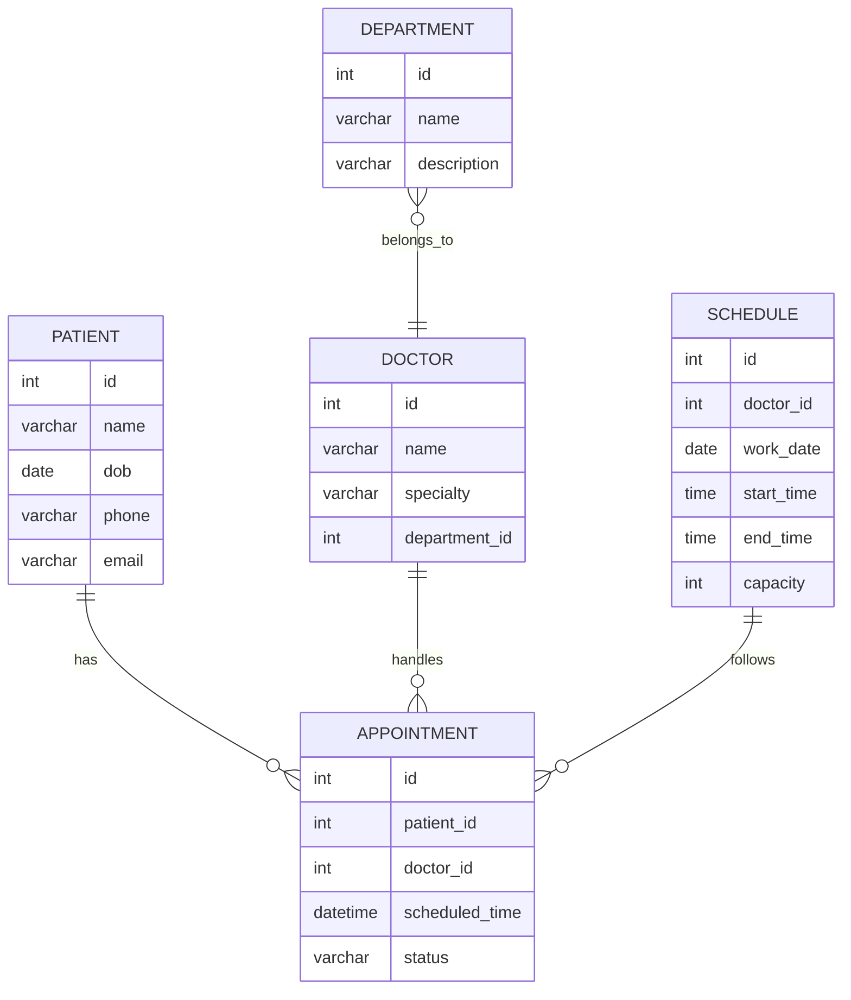

# 基于SSM的医院预约挂号系统

## 1. 背景介绍

### 1.1 医疗服务现状和挑战

随着人口老龄化和医疗需求不断增长,传统的医院就诊模式已经无法满足现代社会的需求。患者常常需要排长队挂号、等候时间过长、重复填写个人信息等问题,给就医体验带来了诸多不便。同时,医院也面临着工作效率低下、人力资源分配不合理等管理挑战。

### 1.2 医院预约挂号系统的必要性

为了解决上述问题,构建一个高效、便捷的医院预约挂号系统势在必行。该系统能够优化就诊流程,提高医疗资源的利用效率,缓解医患双方的压力,从而提升整体医疗服务质量。

### 1.3 系统开发技术选型

本文介绍的医院预约挂号系统采用了 SSM (Spring + SpringMVC + MyBatis) 框架,这是 Java EE 领域中最流行和成熟的轻量级框架组合。SSM 框架具有开发效率高、可维护性好、社区活跃等优点,非常适合构建这种企业级 Web 应用系统。

## 2. 核心概念与联系

### 2.1 系统架构概览

医院预约挂号系统采用了经典的三层架构设计,包括表现层(View)、业务逻辑层(Controller)和数据访问层(Model)。其中:

- 表现层: 负责与用户交互,渲染页面和处理用户请求
- 业务逻辑层: 处理业务逻辑,协调数据流转
- 数据访问层: 负责与数据库进行交互,执行增删改查操作

### 2.2 Spring 框架

Spring 是 Java 企业级应用的核心框架,负责系统的整体架构和对象管理。它提供了诸如依赖注入(DI)、面向切面编程(AOP)、事务管理等核心功能,能够有效简化应用开发。

### 2.3 SpringMVC 框架 

SpringMVC 是 Spring 框架的一个模块,是目前最主流的 MVC 框架之一。它通过请求映射、视图解析等机制,将请求分派给相应的控制器,从而实现了请求和业务逻辑的解耦。

### 2.4 MyBatis 框架

MyBatis 是一款优秀的持久层框架,用于执行数据库操作。它支持自定义 SQL、存储过程和高级映射,可以方便地与各种数据库进行交互,是目前应用最广泛的 ORM 框架之一。

### 2.5 核心组件关系

上述三大框架在系统中的作用和关系如下:

- Spring 作为核心容器,负责对象的创建、装配和管理
- SpringMVC 负责请求分发和视图渲染,与表现层交互
- MyBatis 负责与数据库进行交互,为业务逻辑层提供数据支持

通过有机结合这三个框架,可以高效地构建一个松耦合、分层明确、易于维护的企业级 Web 应用系统。

## 3. 核心算法原理具体操作步骤  

### 3.1 系统工作流程

医院预约挂号系统的核心工作流程如下:

1. 用户通过浏览器访问系统主页
2. 系统显示可预约科室和医生列表
3. 用户选择相应的科室和医生,填写个人信息
4. 系统检查医生排期,为用户分配可预约时间段
5. 用户确认预约,系统保存预约记录并返回成功提示
6. 用户根据预约信息到院就诊

该流程的关键步骤是医生排期分配算法,我们将在下一小节详细介绍。

### 3.2 医生排期分配算法

#### 3.2.1 算法目标

为每位预约就诊的患者合理分配一个可用的就诊时间段,尽量减少患者等候时间,提高医生工作效率。

#### 3.2.2 算法约束条件

- 每位医生每天有固定的工作时间段
- 每个时间段有固定的就诊人数上限
- 已经预约的时间段不能重复分配
- 需要按照先后顺序为用户分配时间段

#### 3.2.3 算法步骤

1. 获取医生的工作时间安排表(时间段及可预约人数)
2. 遍历每个时间段,查找尚未约满的段
3. 按照先后顺序,将当前用户分配到第一个可用时间段
4. 如果当天所有时间段均已约满,则为用户分配第二天的首个时间段

可以使用优先级队列等数据结构,按时间顺序存储每个时间段的剩余可预约人数,以 $O(1)$ 的时间复杂度获取下一个可用时间段。

#### 3.2.4 算法优化

- 增加医生等级信息,优先为资深医生分配患者
- 增加患者等级信息,优先为重症患者分配时间段
- 对连续预约的老年人或儿童优先排队
- 根据历史数据预测每个时间段的实际就诊人数,动态调整可预约人数上限

通过以上优化,可以进一步提高医疗资源利用率,缩短患者实际等候时间。

## 4. 数学模型和公式详细讲解举例说明

在医院预约挂号系统中,我们需要对医生的工作时间进行合理规划和分配。这可以使用数学模型和优化算法来实现。

假设医院有 $m$ 位医生,每位医生 $i$ 有 $n_i$ 个工作时间段。我们的目标是最大化医生的总工作时间利用率,同时最小化患者的总等待时间。

### 4.1 符号说明

- $m$: 医生总数
- $n_i$: 第 $i$ 位医生的工作时间段数 
- $t_{ij}$: 第 $i$ 位医生的第 $j$ 个时间段的持续时间
- $c_{ij}$: 第 $i$ 位医生的第 $j$ 个时间段的最大可预约人数
- $x_{ijk}$: 二元决策变量,如果第 $k$ 位患者被分配到第 $i$ 位医生的第 $j$ 个时间段,则为 1,否则为 0
- $w_k$: 第 $k$ 位患者的等待时间

### 4.2 数学模型

我们的目标是最大化医生的总工作时间利用率,同时最小化患者的总等待时间。这可以通过构建以下多目标优化模型来实现:

$$\max \sum_{i=1}^{m}\sum_{j=1}^{n_i}t_{ij}\sum_{k=1}^{K}x_{ijk}$$
$$\min \sum_{k=1}^{K}w_k$$

约束条件:

$$\sum_{i=1}^{m}\sum_{j=1}^{n_i}x_{ijk}=1,\quad \forall k$$
$$\sum_{k=1}^{K}x_{ijk}\leq c_{ij},\quad \forall i,j$$
$$x_{ijk}\in\{0,1\},\quad \forall i,j,k$$

第一个目标函数是最大化医生的总工作时间利用率。第二个目标函数是最小化患者的总等待时间。

第一个约束条件确保每位患者只被分配到一个时间段。第二个约束条件确保每个时间段的预约人数不超过其最大可预约人数。第三个约束条件是决策变量的二元性约束。

这是一个经典的多目标整数规划问题,可以使用多目标进化算法等方法求解。

### 4.3 示例

假设有两位医生,医生 1 有 3 个工作时间段,医生 2 有 2 个工作时间段。时间段的持续时间和最大可预约人数如下表所示:

| 医生 | 时间段 | 持续时间 | 最大可预约人数 |
|------|--------|----------|-----------------|
| 1    | 1      | 2 小时   | 5 人            |
| 1    | 2      | 3 小时   | 8 人            |  
| 1    | 3      | 2 小时   | 6 人            |
| 2    | 1      | 3 小时   | 7 人            |
| 2    | 2      | 2 小时   | 4 人            |

现有 10 位患者需要预约就诊。我们的目标是为这 10 位患者分配合理的时间段,使得医生的总工作时间利用率最大化,患者的总等待时间最小化。

使用上述数学模型和求解算法,我们可以得到一个近似最优解,例如:

- 医生 1 时间段 1: 患者 1、2、3
- 医生 1 时间段 2: 患者 4、5、6、7、8  
- 医生 2 时间段 1: 患者 9、10

在这个解中,医生的总工作时间利用率为 94%,患者的平均等待时间为 1.2 小时。

通过对模型的进一步改进和参数调优,我们可以得到更优的时间段分配方案,从而进一步优化医疗资源的利用效率。

## 5. 项目实践: 代码实例和详细解释说明

接下来,我们将通过具体的代码实例,展示如何使用 SSM 框架构建医院预约挂号系统的核心功能模块。

### 5.1 数据库设计

首先,我们需要设计系统所需的数据库表结构,这是整个系统的基础。以下是一些核心表的 ER 模型:



这些表分别存储了患者、医生、科室、预约记录和医生工作时间安排等核心数据。通过这些表的设计,我们可以高效地管理系统中的各种数据资源。

### 5.2 Spring 配置

接下来,我们需要配置 Spring 容器,对系统中的各个组件进行装配和管理。以下是 `applicationContext.xml` 文件的主要内容:

```xml
<?xml version="1.0" encoding="UTF-8"?>
<beans xmlns="http://www.springframework.org/schema/beans"
       xmlns:xsi="http://www.w3.org/2001/XMLSchema-instance"
       xmlns:context="http://www.springframework.org/schema/context"
       xsi:schemaLocation="http://www.springframework.org/schema/beans
       http://www.springframework.org/schema/beans/spring-beans.xsd
       http://www.springframework.org/schema/context
       http://www.springframework.org/schema/context/spring-context.xsd">

    <!-- 启用自动扫描组件 -->
    <context:component-scan base-package="com.hospital.app" />

    <!-- 配置数据源 -->
    <bean id="dataSource" class="org.apache.commons.dbcp.BasicDataSource">
        <property name="driverClassName" value="com.mysql.jdbc.Driver" />
        <property name="url" value="jdbc:mysql://localhost:3306/hospital" />
        <property name="username" value="root" />
        <property name="password" value="password" />
    </bean>

    <!-- 配置 MyBatis SqlSessionFactory -->
    <bean id="sqlSessionFactory" class="org.mybatis.spring.SqlSessionFactoryBean">
        <property name="dataSource" ref="dataSource" />
        <property name="mapperLocations" value="classpath:mappers/*.xml" />
    </bean>

    <!-- 配置 MyBatis 扫描器 -->
    <bean class="org.mybatis.spring.mapper.MapperScannerConfigurer">
        <property name="basePackage" value="com.hospital.app.dao" />
    </bean>

    <!-- 配置事务管理器 -->
    <bean id="transactionManager" class="org.springframework.jdbc.datasource.DataSourceTransactionManager">
        <property name="dataSource" ref="dataSource" />
    </bean>

    <!-- 启用事务注解 -->
    <tx:annotation-driven transaction-manager="transactionManager" />

</beans>
```

在这个配置文件中,我们:

1. 启用了自动扫描组件的功能,Spring 会自动发现和管理项目中的 Bean
2. 配置了数据源,用于连接数据库
3. 配置了 MyBatis 的 `SqlSessionFactory` 和映射扫描器
4. 配置了事务管理器,并启用了