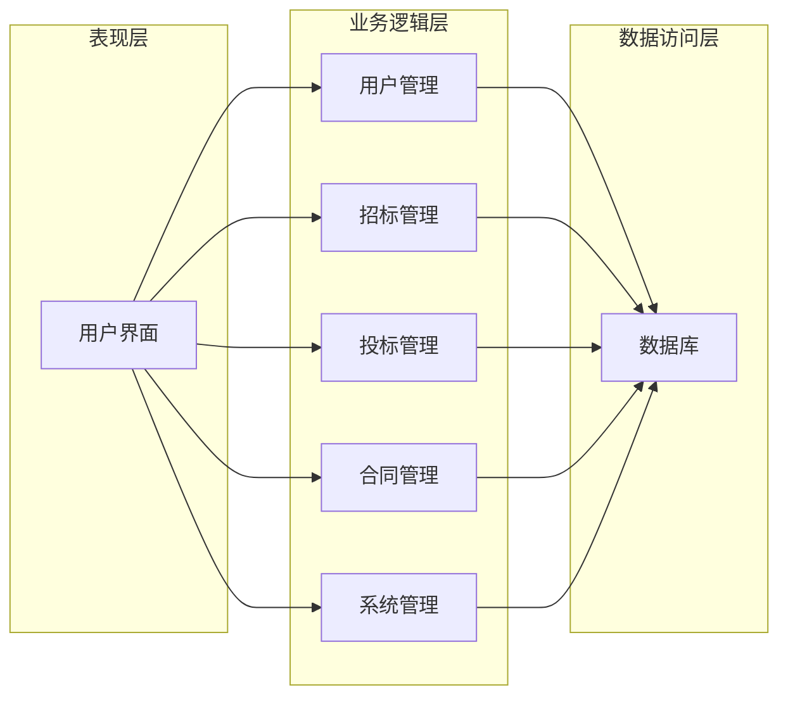

## 基于SSM的在线招投标系统

作者：禅与计算机程序设计艺术

## 1. 背景介绍

### 1.1 招投标的现状与挑战

传统的招投标过程通常依赖于纸质文件和人工操作，存在着效率低下、信息不对称、易滋生腐败等问题。随着互联网技术的快速发展，在线招投标系统应运而生，为解决传统招投标的痛点提供了新的思路。

### 1.2 在线招投标系统的优势

在线招投标系统具有以下优势：

* **提高效率:**  在线平台可以实现招标信息发布、投标文件提交、评标专家评审等环节的自动化，大大缩短招投标周期。
* **增强透明度:**  招标信息公开透明，所有参与方都能及时了解项目进展，有效防止暗箱操作。
* **降低成本:**  在线平台可以减少纸质文件的使用和人工成本，降低招投标成本。
* **扩大参与范围:**  在线平台可以吸引更多潜在投标人参与，提高竞争性。

### 1.3 SSM框架的优势

SSM框架 (Spring + SpringMVC + MyBatis) 是 Java Web 开发的流行框架，具有以下优势：

* **轻量级:**  SSM框架的组件都是轻量级的，易于学习和使用。
* **模块化:**  SSM框架的各个组件都是独立的，可以根据项目需求灵活组合。
* **易于扩展:**  SSM框架具有良好的扩展性，可以方便地集成其他框架和工具。
* **强大的社区支持:**  SSM框架拥有庞大的开发者社区，可以方便地获取帮助和资源。

## 2. 核心概念与联系

### 2.1 系统架构

在线招投标系统采用经典的三层架构：

* **表现层:** 负责用户界面展示和交互。
* **业务逻辑层:** 负责处理业务逻辑和数据校验。
* **数据访问层:** 负责与数据库交互。

### 2.2 核心模块

在线招投标系统包含以下核心模块:

* **用户管理:**  管理用户注册、登录、权限等信息。
* **招标管理:**  发布招标公告、管理招标文件、组织专家评审等。
* **投标管理:**  投标人注册、提交投标文件、查看评标结果等。
* **合同管理:**  生成中标通知书、签订合同等。
* **系统管理:**  管理系统参数、日志等。

### 2.3 模块间联系



## 3. 核心算法原理具体操作步骤

### 3.1 招标公告发布流程

1. 招标人登录系统，进入招标管理模块。
2. 点击“发布招标公告”按钮，填写招标公告信息，包括项目名称、招标内容、招标方式、报名截止时间等。
3. 上传招标文件，包括招标文件、资格预审文件等。
4. 系统自动生成招标公告编号，并发布到招标平台。

### 3.2 投标文件提交流程

1. 投标人登录系统，进入投标管理模块。
2. 搜索感兴趣的招标项目，查看招标公告和招标文件。
3. 点击“我要投标”按钮，填写投标信息，包括投标报价、工期、质量承诺等。
4. 上传投标文件，包括投标函、技术标、商务标等。
5. 系统自动生成投标文件编号，并提交到招标平台。

### 3.3 专家评审流程

1. 招标人邀请专家组成员，专家组成员登录系统，进入评标管理模块。
2. 查看投标文件，根据评标办法进行评审，并给出评审意见和评分。
3. 系统自动汇总评审结果，生成评标报告。

## 4. 数学模型和公式详细讲解举例说明

### 4.1 综合评分法

综合评分法是一种常用的评标方法，通过对投标人的各项指标进行量化打分，最终计算出综合得分，得分最高的投标人中标。

综合评分法的公式如下:

$$
S = \sum_{i=1}^{n} W_i \times S_i
$$

其中:

* $S$ 为综合得分。
* $n$ 为评价指标数量。
* $W_i$ 为第 $i$ 个评价指标的权重。
* $S_i$ 为第 $i$ 个评价指标的得分。

例如，某招标项目的评标指标及权重如下:

| 评价指标 | 权重 |
|---|---|
| 投标报价 | 40% |
| 技术方案 | 30% |
| 业绩 | 20% |
| 服务承诺 | 10% |

假设某投标人的各项指标得分如下:

| 评价指标 | 得分 |
|---|---|
| 投标报价 | 90 |
| 技术方案 | 85 |
| 业绩 | 95 |
| 服务承诺 | 80 |

则该投标人的综合得分:

$$
S = 0.4 \times 90 + 0.3 \times 85 + 0.2 \times 95 + 0.1 \times 80 = 88.5
$$

## 5. 项目实践：代码实例和详细解释说明

### 5.1 技术选型

* **后端:** Spring + SpringMVC + MyBatis
* **前端:** HTML + CSS + JavaScript + jQuery
* **数据库:** MySQL

### 5.2 代码示例

#### 5.2.1 招标公告实体类

```java
public class TenderNotice {

    private Integer id;
    private String projectName;
    private String tenderContent;
    private String tenderMethod;
    private Date registrationDeadline;

    // 省略 getter 和 setter 方法
}
```

#### 5.2.2 招标公告Mapper接口

```java
public interface TenderNoticeMapper {

    int insert(TenderNotice tenderNotice);

    List<TenderNotice> selectAll();

    TenderNotice selectById(Integer id);

    int update(TenderNotice tenderNotice);

    int deleteById(Integer id);
}
```

#### 5.2.3 招标公告Service接口

```java
public interface TenderNoticeService {

    int addTenderNotice(TenderNotice tenderNotice);

    List<TenderNotice> getAllTenderNotices();

    TenderNotice getTenderNoticeById(Integer id);

    int updateTenderNotice(TenderNotice tenderNotice);

    int deleteTenderNoticeById(Integer id);
}
```

#### 5.2.4 招标公告Controller

```java
@Controller
@RequestMapping("/tenderNotice")
public class TenderNoticeController {

    @Autowired
    private TenderNoticeService tenderNoticeService;

    @RequestMapping("/add")
    public String addTenderNotice(TenderNotice tenderNotice) {
        tenderNoticeService.addTenderNotice(tenderNotice);
        return "redirect:/tenderNotice/list";
    }

    @RequestMapping("/list")
    public String getAllTenderNotices(Model model) {
        List<TenderNotice> tenderNotices = tenderNoticeService.getAllTenderNotices();
        model.addAttribute("tenderNotices", tenderNotices);
        return "tenderNotice/list";
    }

    // 省略其他方法
}
```

## 6. 实际应用场景

在线招投标系统可以应用于以下场景:

* **政府采购:**  政府部门可以通过在线招投标平台进行货物、工程和服务采购。
* **企业采购:**  企业可以通过在线招投标平台进行原材料、设备和服务的采购。
* **工程建设:**  建设单位可以通过在线招投标平台进行工程招标。

## 7. 工具和资源推荐

### 7.1 开发工具

* **Eclipse:**  流行的 Java 集成开发环境。
* **IntelliJ IDEA:**  功能强大的 Java 集成开发环境。
* **Maven:**  Java 项目构建工具。

### 7.2 学习资源

* **Spring Framework:**  https://spring.io/
* **SpringMVC:**  https://docs.spring.io/spring-framework/docs/current/reference/html/web.html
* **MyBatis:**  https://mybatis.org/mybatis-3/

## 8. 总结：未来发展趋势与挑战

### 8.1 未来发展趋势

* **移动化:**  随着移动互联网的发展，在线招投标系统将更加注重移动端的用户体验。
* **智能化:**  人工智能技术将被应用于招投标过程，例如自动识别投标文件、智能评标等。
* **区块链:**  区块链技术可以增强招投标过程的安全性和透明度。

### 8.2 面临的挑战

* **安全性:**  在线招投标系统需要保障数据的安全性和用户的隐私。
* **公平性:**  在线招投标系统需要确保招标过程的公平公正。
* **监管:**  政府需要加强对在线招投标平台的监管。

## 9. 附录：常见问题与解答

### 9.1 如何注册成为投标人？

访问在线招投标平台，点击“注册”按钮，填写相关信息即可注册成为投标人。

### 9.2 如何提交投标文件？

登录在线招投标平台，进入投标管理模块，搜索感兴趣的招标项目，点击“我要投标”按钮，填写投标信息，上传投标文件即可。

### 9.3 如何查看评标结果？

登录在线招投标平台，进入投标管理模块，查看已参与的招标项目，即可查看评标结果。
