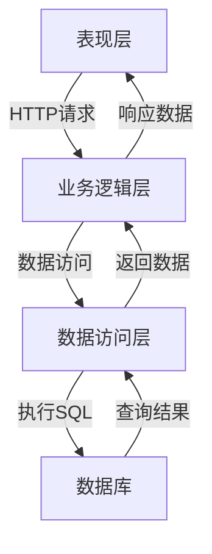

# 基于SSM的学籍管理系统

## 1. 背景介绍

### 1.1 学籍管理系统的重要性

在当今教育领域,学生信息管理系统扮演着至关重要的角色。随着学生人数的不断增加和教育管理的日益复杂化,有效管理学生信息已经成为学校的当务之急。传统的纸质档案管理方式已经无法满足现代化教育管理的需求,容易出现数据丢失、查询低效等问题。因此,构建一个高效、安全、可扩展的学籍管理系统对于确保教育质量和提高管理效率至关重要。

### 1.2 系统开发背景

基于SSM(Spring+SpringMVC+MyBatis)架构的学籍管理系统旨在解决传统管理模式的弊端,提供一个集中、规范、高效的学生信息管理平台。该系统能够实现学生基本信息、成绩、奖惩、就业等多方面的综合管理,为教师、学生、教务人员提供便捷的数据查询、统计和分析功能。同时,系统还具备良好的可扩展性和安全性,可根据实际需求进行功能模块的增减和权限控制。

## 2. 核心概念与联系

### 2.1 SSM架构

SSM架构是目前流行的JavaEE企业级开发架构之一,由Spring、SpringMVC和MyBatis三个开源框架组成。

- Spring: 提供了面向对象的编程理念,用于管理应用程序对象及依赖关系,实现控制反转(IoC)和面向切面编程(AOP)。
- SpringMVC: 基于MVC设计模式的Web层框架,用于处理HTTP请求和响应,实现前端视图与后端逻辑的解耦。
- MyBatis: 一个优秀的持久层框架,用于执行SQL语句,映射结果集到Java对象,简化JDBC编程。

### 2.2 三层架构

学籍管理系统采用经典的三层架构设计,包括表现层(View)、业务逻辑层(Controller)和数据访问层(Model)。

- 表现层(View):负责显示数据和接收用户输入,通常由JSP、HTML等技术实现。
- 业务逻辑层(Controller):处理业务逻辑,接收视图层请求,调用模型层方法,控制程序流程。
- 数据访问层(Model):负责与数据库进行交互,执行数据持久化操作。

### 2.3 核心技术

除了SSM框架外,系统还集成了以下核心技术:

- 数据库: MySQL作为系统的数据存储
- 前端框架: Bootstrap提供响应式界面设计
- 安全框架: Shiro实现用户认证和权限控制
- 日志框架: Log4j记录系统运行日志
- 文件上传: 实现学生证件资料上传功能

## 3. 核心算法原理具体操作步骤 

### 3.1 用户认证流程

用户认证是系统的核心安全机制,确保只有合法用户才能访问相应的功能模块。系统采用Shiro安全框架实现用户认证,其核心原理和步骤如下:

1. 用户提交用户名和密码
2. 获取当前Subject(主体),调用`login(token)`方法,其中token是用户身份
3. Shiro从配置的Realm(域)中查找与token对应的账号信息
4. 如果查找到账号信息,对比输入的密码是否正确
5. 密码正确则认证通过,否则抛出相应异常

认证流程使用了模板方法设计模式,核心代码如下:

```java
public class AuthenticatingLoginStrategy extends AbstractAuthenticationStrategy {
    
    public AuthenticationInfo beforeAttempt(Subject subject, AuthenticationToken token, AuthenticationInfo composite) throws AuthenticationException {
        //...
    }

    public AuthenticationInfo afterAttempt(Subject subject, AuthenticationToken token, AuthenticationInfo composite, AuthenticationInfo info) throws AuthenticationException {
        //...
    }
}
```

### 3.2 基于RBAC的权限控制

系统采用基于角色的访问控制(RBAC)策略来管理用户权限,实现不同角色对应不同功能模块的访问控制。RBAC的核心思想是通过角色和权限之间的多对多关联关系,使得权限与用户之间的管理关系变得简单。

1. 获取当前主体的所有角色
2. 根据角色信息获取对应的权限信息
3. 判断当前请求是否在权限范围内
4. 如果权限验证通过则执行请求,否则抛出相应异常

RBAC的优点是简化了权限管理,如果需要修改某个用户的权限,只需要修改该用户所对应角色的权限即可,无需遍历修改所有用户。

### 3.3 学生信息CRUD操作

学生信息是系统的核心数据,需要实现创建(Create)、查询(Retrieve)、更新(Update)和删除(Delete)等基本操作。以学生信息的创建为例,其核心步骤如下:

1. 在表现层获取用户输入的学生信息
2. 调用Service层的创建方法,传入学生信息对象
3. Service层调用DAO层的创建方法,执行数据库插入操作
4. DAO层通过MyBatis框架拼接SQL语句,并执行插入操作
5. 根据操作结果返回创建状态

CRUD操作的核心代码:

```java
// Service层
public int createStudent(Student student) {
    return studentMapper.insertStudent(student);
}

// DAO层
@Insert("INSERT INTO student (name, age, gender) VALUES (#{name}, #{age}, #{gender})")
int insertStudent(Student student);
```

## 4. 数学模型和公式详细讲解举例说明

在学籍管理系统中,可能需要进行一些统计分析,例如计算某个班级的平均成绩、排名等。这里我们介绍如何使用数学模型和公式来实现这些功能。

### 4.1 计算班级平均成绩

假设有n个学生,每个学生的成绩分别为$x_1, x_2, ..., x_n$,则班级的平均成绩可以用算术平均数公式计算:

$$\overline{x} = \frac{1}{n}\sum_{i=1}^{n}x_i = \frac{x_1 + x_2 + ... + x_n}{n}$$

其中$\overline{x}$表示平均成绩。

在代码中,我们可以遍历所有学生的成绩,计算总分之后除以学生人数,就可以得到平均成绩。

```java
public double calculateAvgScore(List<Student> students) {
    double totalScore = 0;
    for (Student student : students) {
        totalScore += student.getScore();
    }
    return totalScore / students.size();
}
```

### 4.2 计算学生成绩排名

要计算每个学生的成绩排名,我们可以先对成绩进行降序排序,然后遍历排序后的列表,给每个学生赋予相应的排名值。

设有n个学生,令$r_i$表示第i个学生的排名,$x_i$表示第i个学生的成绩,则有:

$$r_i = 1 + \sum_{j=1}^{n}[x_j > x_i]$$

其中$[x_j > x_i]$是示性函数,当$x_j > x_i$时取值为1,否则为0。

在代码中,我们可以先对学生列表按成绩降序排序,然后遍历列表,累加比当前学生成绩高的学生数量,就可以得到当前学生的排名。

```java
public List<Student> rankStudents(List<Student> students) {
    // 按成绩降序排序
    students.sort((s1, s2) -> Double.compare(s2.getScore(), s1.getScore()));
    
    int rank = 1;
    for (int i = 0; i < students.size(); i++) {
        Student student = students.get(i);
        student.setRank(rank);
        
        // 如果下一个学生成绩相同,排名也相同
        if (i < students.size() - 1 && student.getScore() == students.get(i + 1).getScore()) {
            continue;
        }
        rank += 1;
    }
    
    return students;
}
```

## 5. 项目实践: 代码实例和详细解释说明

### 5.1 系统架构设计

学籍管理系统采用经典的三层架构设计,分为表现层、业务逻辑层和数据访问层。各层之间的关系如下图所示:



其中:

- 表现层: 使用JSP、HTML等技术实现,负责显示数据和接收用户输入
- 业务逻辑层: 使用Spring和SpringMVC框架实现,处理业务逻辑,调用数据访问层方法
- 数据访问层: 使用MyBatis框架实现,负责与数据库进行交互,执行数据持久化操作

### 5.2 数据库设计

系统的核心数据存储在MySQL数据库中,数据库中包含了多个表,用于存储学生信息、成绩信息、用户信息等数据。

以学生信息表(student)为例,其结构如下:

```sql
CREATE TABLE `student` (
  `id` int(11) NOT NULL AUTO_INCREMENT COMMENT '学生ID',
  `name` varchar(50) NOT NULL COMMENT '姓名',
  `gender` char(1) NOT NULL COMMENT '性别',
  `age` int(3) NOT NULL COMMENT '年龄',
  `grade` int(2) NOT NULL COMMENT '年级',
  `class` varchar(20) NOT NULL COMMENT '班级',
  `photo` varchar(100) DEFAULT NULL COMMENT '照片',
  PRIMARY KEY (`id`)
) ENGINE=InnoDB DEFAULT CHARSET=utf8mb4 COMMENT='学生信息表';
```

数据库设计遵循了数据库范式理论,减少了数据冗余和插入异常的发生。

### 5.3 持久层实现

持久层使用MyBatis框架实现,主要包括以下几个核心组件:

- `xxxMapper.xml`: SQL映射文件,用于定义SQL语句
- `xxxMapper.java`: Mapper接口,提供对应的方法签名
- `xxxMapperImpl.java`: Mapper接口的实现类

以学生信息管理模块为例,相关代码如下:

`StudentMapper.xml`:

```xml
<mapper namespace="com.example.mapper.StudentMapper">
    <insert id="insertStudent" parameterType="com.example.entity.Student">
        INSERT INTO student (name, gender, age, grade, class) 
        VALUES (#{name}, #{gender}, #{age}, #{grade}, #{class})
    </insert>
    
    <select id="selectAllStudents" resultMap="studentResultMap">
        SELECT id, name, gender, age, grade, class, photo 
        FROM student
    </select>
    
    <!-- 其他SQL语句... -->
</mapper>
```

`StudentMapper.java`:

```java
public interface StudentMapper {
    int insertStudent(Student student);
    List<Student> selectAllStudents();
    // 其他方法...
}
```

在Service层和Controller层中,可以通过注入的Mapper对象调用相应的方法来执行数据库操作。

### 5.4 业务逻辑层实现

业务逻辑层使用Spring框架实现,主要包括以下几个核心组件:

- `xxxService.java`: 服务接口,定义业务逻辑方法
- `xxxServiceImpl.java`: 服务接口实现类,实现具体的业务逻辑
- `xxxController.java`: 控制器类,处理HTTP请求和响应

以学生信息管理模块为例,相关代码如下:

`StudentService.java`:

```java
public interface StudentService {
    boolean createStudent(Student student);
    List<Student> getAllStudents();
    // 其他方法...
}
```

`StudentServiceImpl.java`:

```java
@Service
public class StudentServiceImpl implements StudentService {
    @Autowired
    private StudentMapper studentMapper;

    @Override
    public boolean createStudent(Student student) {
        int result = studentMapper.insertStudent(student);
        return result > 0;
    }

    @Override
    public List<Student> getAllStudents() {
        return studentMapper.selectAllStudents();
    }

    // 其他方法实现...
}
```

`StudentController.java`:

```java
@Controller
@RequestMapping("/student")
public class StudentController {
    @Autowired
    private StudentService studentService;

    @GetMapping("/list")
    public String listStudents(Model model) {
        List<Student> students = studentService.getAllStudents();
        model.addAttribute("students", students);
        return "student/list";
    }

    @GetMapping("/create")
    public String showCreateForm(Model model) {
        model.addAttribute("student", new Student());
        return "student/create";
    }

    @PostMapping("/create")
    public String createStudent(@ModelAttribute("student") Student student) {
        studentService.createStudent(student);
        return "redirect:/student/list";
    }

    // 其他方法...
}
```

在控制器中,我们可以通过注入的服务对象调用相应的业务逻辑方法,并将处理结果返回给视图层进行展示。