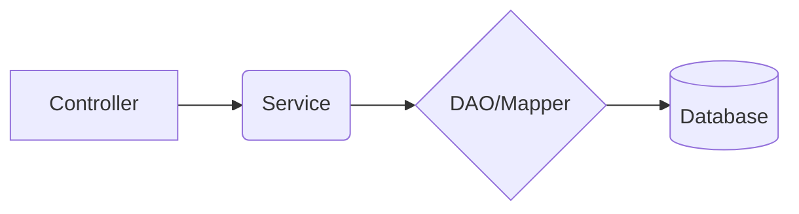

# 基于ssm的小儿推拿预约平台

作者：禅与计算机程序设计艺术

## 1. 背景介绍

### 1.1 小儿推拿的重要性
小儿推拿是中医传统医学的一个重要组成部分,通过手法刺激穴位,可以调节机体功能,增强抵抗力,治疗常见小儿疾病。小儿时期是生长发育的关键阶段,推拿可以促进生长发育,预防疾病。

### 1.2 预约平台的必要性
随着生活节奏加快,很多家长没有足够的时间带孩子去推拿。推拿预约平台可以方便家长在线预约,节省时间和精力。同时也可以帮助推拿机构进行管理,提高服务质量和效率。

### 1.3 ssm框架简介
ssm框架是java web开发的经典框架,由Spring MVC,Spring和MyBatis三个框架组成。Spring MVC负责MVC分层,Spring用于管理对象和事务,MyBatis负责数据库访问。ssm框架易学易用,适合快速开发。

## 2. 核心概念与关系

### 2.1 MVC分层
- Model:数据模型层,包括实体类、数据访问层
- View:视图层,页面展示
- Controller:控制层,接收请求,调用service,返回结果
  
### 2.2 Spring核心概念
- IoC:控制反转,将对象创建交给spring容器
- DI:依赖注入,在创建对象时注入依赖
- AOP:面向切面编程,在不修改源码情况下动态添加功能

### 2.3 MyBatis核心概念  
- SqlSessionFactory:会话工厂,用于创建会话
- SqlSession:代表一次数据库会话
- Mapper:映射器,定义SQL语句和映射规则

### 2.4 三者关系


## 3. 核心算法原理与步骤

### 3.1 登录注册
1. 前端使用ajax发送登录/注册请求
2. Controller接收请求参数,调用service方法
3. Service调用mapper查询/插入用户信息
4. 返回登录/注册结果

### 3.2 预约
1. 用户选择预约日期和时间段,医师等信息
2. ajax提交预约请求给controller
3. controller调用service保存预约记录
4. service调用mapper向数据库插入数据
5. 返回预约结果

### 3.3 后台管理
1. 管理员登录后台
2. 查询医师列表、用户列表、预约记录等 
3. 进行修改、删除等操作
4. 每次操作都是controller->service->mapper->db的流程

## 4. 数学模型与公式

### 4.1 SQL分页公式
显示第n页数据,每页pageSize条记录:
$$ 
Select * from table limit (n-1)*pageSize,pageSize
$$

### 4.2 日期计算公式
计算n天后的日期date:
```java
Calendar c = Calendar.getInstance();
c.setTime(date);        
c.add(Calendar.DATE,n);
date = c.getTime();
```

## 5. 项目实践

### 5.1 框架搭建
1. 创建maven web项目
2. 加入ssm依赖
3. 配置web.xml,spring,springmvc,mybatis
4. 部署tomcat启动测试

### 5.2 数据库设计
用户表(user)

| 字段  | 类型 | 说明 |
|-------|------|------|
| id    | int  | 主键 |
| username | varchar | 用户名 |
| password | varchar | 密码 |

医师表(doctor)  

| 字段  | 类型 | 说明 |
|-------|------|------|
| id    | int  | 主键 |
| name | varchar | 姓名  |
| level | varchar | 级别 |
| desc | varchar | 简介 |

订单表(reservation)

| 字段  | 类型 | 说明 |
|-------|------|------|
| id    | int  | 主键 |
| userId | int | 用户id |  
| doctorId | int | 医师id |
| reserveDate | date | 预约日期 |
| timespan | varchar | 时间段 |

### 5.3 登录注册功能
#### UserController
```java
@Controller
@RequestMapping("/user")
public class UserController {
        
    @Autowired
    private UserService userService;
        
    @RequestMapping("/login")
    @ResponseBody
    public String login(String username,String password){
        User user = userService.login(username,password);
        if(user!=null){
            return "success";
        }else{
            return "fail";
        }
    }
        
    @RequestMapping("/register")
    @ResponseBody
    public String register(User user){
        userService.register(user);
        return "success";        
    }
}
```

#### UserService
```java  
@Service
public class UserServiceImpl implements UserService {

    @Autowired
    private UserMapper userMapper;

    @Override
    public User login(String username, String password) {
        return userMapper.selectByUsernameAndPwd(username,password);
    }

    @Override
    public void register(User user) {
        userMapper.insertUser(user);
    }
}
```

#### UserMapper
```java
public interface UserMapper {
   
    User selectByUsernameAndPwd(String username,String password);
    
    void insertUser(User user);
}
```

#### UserMapper.xml
```xml
<select id="selectByUsernameAndPwd" resultType="com.xxx.pojo.User">
    select * from user 
    where username = #{username} and password = #{password}
</select>

<insert id="insertUser" parameterType="com.xxx.pojo.User">
    insert into user(username,password) 
    values(#{username},#{password})  
</insert>
```

### 5.4 预约功能
流程与登录注册类似,通过controller->service->mapper->db完成预约数据插入。

### 5.5 后台管理
通过controller分发请求到不同的service,调用mapper对各表数据进行CRUD操作。   

## 6. 实际应用场景

- 推拿连锁机构的预约系统 
- 基层医疗机构的预约系统
- 母婴服务平台的预约部分
- 其他需要预约的医疗健康领域

## 7. 工具与资源
- eclipse/idea - java开发工具  
- maven - 项目构建和依赖管理工具
- tomcat - web应用服务器 
- mysql - 关系型数据库
- git - 版本控制工具
- bootstrap - 前端UI框架  
- jquery - javascript工具库
- vscode - 前端开发工具

## 8. 开发规范
- 代码规范:注释完整,命名规范,代码格式化
- 提交规范:提交前先pull,然后再push,日志要写清楚
- 开发流程规范:需求评审,设计评审,代码走读,测试验收 
- 开发环境规范:统一jdk,统一开发工具版本,统一数据库版本
  
## 总结

### 框架优势 
ssm框架是java web开发的利器,各司其职,灵活组合,适合大中小型项目。在推拿预约这类系统中能够快速搭建和迭代。

### 发展趋势
随着微服务的兴起,ssm这样的单体应用会逐渐被拆分。未来java web可能会向着前后端分离,微服务,serverless的方向发展。但ssm框架仍是学习java web的必经之路。

### 面临挑战
前后端技术更新迭代很快,需要不断学习。系统性能优化,海量并发等也是架构师需要考虑的问题。随着人工智能的发展,一些重复工作可能被替代,但程序员的核心竞争力在于不断学习和创新。

## 附录

### 常见问题
1. 表单提交中文乱码?
   - web.xml中加过滤器,设置编码为utf-8

2. ajax跨域问题?     
   - 后端加@CrossOrigin注解 
   - 前端配置代理

3. ssm整合步骤?
   - 先分别搭建测试,然后将spring和springmvc容器整合,最后整合mybatis

4. 如何自定义拦截器?
   - 实现HandlerInterceptor接口
   - springmvc配置文件中注册拦截器

### 参考资料
- ssm框架官方文档
- how2j网站ssm整合教程
- 《spring in action》《java web编程》

希望本文对你学习ssm小儿推拿预约平台有所帮助。技术之路任重道远,需要不断学习和实践。与君共勉!