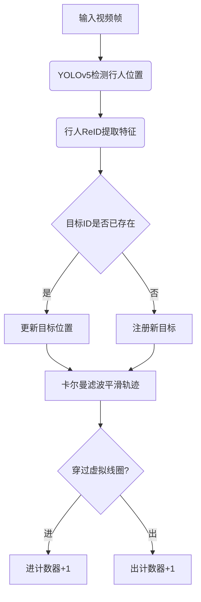

# 基于yolov的行人进出双向计数

作者：禅与计算机程序设计艺术

## 1. 背景介绍
### 1.1 行人计数的重要性
在当今世界,对于商业中心、交通枢纽和公共场所等人流密集区域,准确高效地统计人流量具有重要意义。行人计数不仅能帮助管理者了解场所的客流情况,优化资源配置,还能为安全监控、疏散预案等提供数据支撑。
### 1.2 传统方法的局限性
传统的行人计数方法,如红外传感器、压力地砖等,存在成本高、易受环境干扰、数据粒度粗等问题。近年来,随着计算机视觉和深度学习的发展,利用AI算法实现行人计数成为可能,其中YOLO(You Only Look Once)以其实时性和准确性成为一个热门选择。
### 1.3 本文的目的和结构
本文将详细阐述如何基于YOLOv5实现行人进出双向计数。首先介绍相关概念和原理,然后详解算法实现步骤,给出数学模型和代码示例。此外,文章还会讨论实际应用场景、推荐相关工具资源,并展望未来发展方向。

## 2. 核心概念与联系 
### 2.1 目标检测 Object Detection
目标检测是指在图像或视频中定位和识别感兴趣的目标对象(如人、车等)的任务。它是计算机视觉的核心问题之一,广泛应用于自动驾驶、视频监控等领域。
### 2.2 YOLO (You Only Look Once)
YOLO是一种端到端的实时目标检测算法,通过单次卷积神经网络直接预测bounding box位置和类别概率,以平衡速度和精度。与传统的两阶段方法(如R-CNN)相比,YOLO速度更快,更适合实时场景。
### 2.3 行人再识别 Person ReID
行人再识别是指跨摄像头、跨场景匹配行人身份的任务。它利用行人的视觉特征(如衣着、体态)来区分不同个体,是构建跨摄像头轨迹的关键。
### 2.4 双向计数与轨迹追踪
传统的计数方法只考虑进或出单一方向。而在出入口场景,需要区分进出双向,即一个人是进入还是离开区域。这可通过分析目标的运动轨迹实现,即追踪目标在连续帧中的位置变化。

## 3.核心算法原理具体操作步骤
本部分将详细阐述如何基于YOLOv5和行人再识别实现行人双向计数的完整流程。
### 3.1 数据准备
- 收集进出口监控视频图像数据 
- 标注数据集,标注行人bounding box和ID
- 将数据集按比例划分为训练集、验证集和测试集

### 3.2 模型训练
- 选择YOLOv5作为目标检测模型
- 选择合适的基础网络(如ResNet)和参数配置
- 在训练集上训练行人检测模型,在验证集上评估并调参
- 使用行人ReID预训练模型(如ABD-Net)提取特征

### 3.3 进出计数实现
- 在每帧图像上运行YOLO检测器,获得行人位置和ID
- 使用卡尔曼滤波器平滑轨迹 
- 根据位置变化判断进出方向（穿过虚拟线圈）
- 对每个行人ID的进出计数器加一



### 3.4 后处理和可视化
- 过滤短轨迹和噪声
- 统计每个方向的总人数,计算进出人流比例
- 可视化实时检测框和轨迹,生成人流报表图表

## 4.数学模型和公式详细讲解举例说明
### 4.1 YOLOv3/v5模型
YOLO将图像分为SxS个网格,每个网格预测B个bounding box。对于每个bounding box,模型预测5个值:中心坐标 $(x,y)$,宽高$(w,h)$,置信度$c$。如果网格包含目标中心,则置信度表示预测框与真实框的IOU;否则置信度为0。

每个网格还预测C个条件类别概率$P(Class_i|Object)$。最终的置信度分数为:

$$
\text{Confidence Score}=P(Object)*IOU(pred,truth)
$$

其中$P(Object)$为网格包含目标的概率,$IOU(pred,truth)$为预测框和真实框的交并比。

在NMS(非极大值抑制)阶段,YOLO移除IOU大于阈值(如0.5)的冗余检测框。

YOLOv5相比v3进行了一些改进,如:
- 更好的骨干网(如CSPNet)和neck结构(如PAN)
- Mosaic数据增强和自适应锚框计算
- 使用GIoU loss和CIoU loss
  
### 4.2 行人再识别模型
行人再识别旨在学习一个特征嵌入函数$f(x)$,将行人图像$x$映射到一个紧致的特征空间,使得同一行人的特征距离小,不同行人的距离大。

常见的ReID损失函数包括:
- 三元组损失 Triplet Loss

$$
L_{triplet} = \max(d(f(x^a),f(x^p))-d(f(x^a),f(x^n))+\alpha, 0)
$$

其中$x^a$为anchor, $x^p$为positive(同一人), $x^n$为negative(不同人), $\alpha$为间隔。

- 中心损失 Center Loss

$$
L_{center} = \frac{1}{2} \sum_{i=1}^m \| f(x_i) - c_{y_i} \|_2^2
$$

其中$c_{y_i}$为第$y_i$类的中心特征。中心损失与交叉熵联合使用,缩小类内差异。

在测试时,使用最近邻或逼仄逼近等方法比较特征相似度,得到ReID结果。

### 4.3 卡尔曼滤波器
卡尔曼滤波用于轨迹平滑,融合检测结果与运动先验,递归地估计目标状态。

状态方程和观测方程为:

$$
\mathbf{x}_t=\mathbf{F}_t \mathbf{x}_{t-1}+\mathbf{B}_t \mathbf{u}_t+\mathbf{w}_t \\
\mathbf{z}_t=\mathbf{H}_t \mathbf{x}_t+\mathbf{v}_t
$$

其中$\mathbf{x}$为状态向量(如位置、速度),$\mathbf{z}$为观测向量(检测位置),$\mathbf{F}$为状态转移矩阵,$\mathbf{H}$为观测矩阵,$\mathbf{w}$和$\mathbf{v}$为高斯噪声。

滤波器交替进行预测和更新:
- 预测:
$$
\hat{\mathbf{x}}_{t|t-1}=\mathbf{F}_t \hat{\mathbf{x}}_{t-1} \\
\mathbf{P}_{t|t-1}=\mathbf{F}_t \mathbf{P}_{t-1} \mathbf{F}_t^T+\mathbf{Q}_t
$$
- 更新:
$$
\mathbf{K}_t=\mathbf{P}_{t|t-1} \mathbf{H}_t^T (\mathbf{H}_t \mathbf{P}_{t|t-1} \mathbf{H}_t^T+\mathbf{R}_t)^{-1} \\ 
\hat{\mathbf{x}}_t=\hat{\mathbf{x}}_{t|t-1}+\mathbf{K}_t (\mathbf{z}_t-\mathbf{H}_t \hat{\mathbf{x}}_{t|t-1}) \\
\mathbf{P}_t=(\mathbf{I}-\mathbf{K}_t \mathbf{H}_t)\mathbf{P}_{t|t-1}
$$

其中$\mathbf{K}$为卡尔曼增益, $\mathbf{P}$为状态协方差矩阵, $\mathbf{Q}$和$\mathbf{R}$分别为过程噪声和观测噪声的协方差。

## 5. 项目实践：代码实例和详细解释说明
这里给出基于PyTorch和OpenCV实现YOLOv5行人计数的核心代码。

```python  
import torch
import cv2

# 加载YOLOv5模型
model = torch.hub.load('ultralytics/yolov5', 'yolov5s', pretrained=True)
model.classes = [0] # 只检测人类

# 加载ReID模型
reid_model = ...

# 初始化跟踪器
tracker = Sort(max_age=5, min_hits=3, iou_threshold=0.3)

# 定义虚拟线圈位置
line = [(0, 100), (640, 100)] 

# 初始化计数器
counter_up = 0
counter_down = 0

# 处理视频流
cap = cv2.VideoCapture('video.mp4') 
while True:
    ret, frame = cap.read()    
    if not ret: break        
    
    # YOLOv5检测
    results = model(frame)
    detections = results.xyxy[0].cpu().numpy()
    
    # 更新跟踪器
    track_bbs_ids = tracker.update(detections)
    
    # 绘制检测框和轨迹
    for d in detections:
        x1, y1, x2, y2, conf, cls = d
        cv2.rectangle(frame, (x1,y1), (x2,y2), (0,255,0), 2)
    
    for track in tracker.tracks:
        if not track.is_confirmed() or track.time_since_update > 1:
            continue
        
        bbox = track.to_tlbr()
        center = track.get_center()
        track_id = track.track_id
        
        # 检测是否穿过虚拟线圈
        if track.cross_line(line):
            if track.going_UP(line):
                counter_up += 1
            else:
                counter_down += 1
        
        cv2.rectangle(frame, (int(bbox[0]), int(bbox[1])), (int(bbox[2]), int(bbox[3])), (255,255,255), 2)
        cv2.putText(frame, str(track_id), (int(center[0]), int(center[1])), cv2.FONT_HERSHEY_SIMPLEX, 0.5, (255,0,0), 2)

    # 显示计数结果  
    cv2.putText(frame, f'Up: {counter_up}', (50,50), cv2.FONT_HERSHEY_DUPLEX, 1.0, (0,255,0), 2)
    cv2.putText(frame, f'Down: {counter_down}', (50,80), cv2.FONT_HERSHEY_DUPLEX, 1.0, (0,0,255), 2)
    
    cv2.imshow('Frame', frame)
    if cv2.waitKey(1) == ord('q'):
        break

cap.release()
cv2.destroyAllWindows() 
```

### 代码解释
1. 加载预训练的YOLOv5模型和ReID模型。
2. 初始化SORT跟踪器,设置参数如最大期限、最小击中次数等。 
3. 定义虚拟线圈位置(两点确定一条线)。
4. 创建进出计数器,初始为0。
5. 打开视频流,逐帧处理:
   - 对每一帧运行YOLOv5检测,得到检测框。
   - 将检测结果输入跟踪器,更新跟踪目标。
   - 绘制检测框和跟踪轨迹。
   - 对每个跟踪目标,判断其轨迹是否穿过虚拟线圈。若穿过,则根据方向给对应计数器加一。
   - 绘制实时的进出人数统计。
6. 按'q'键退出程序,释放资源。

以上是一个简化版的实现,实际项目中还需考虑更多细节,如摄像头畸变校正、检测区域设置、闪屏过滤等。此外,可使用更强大的跟踪算法如Deep SORT,获得更稳定的跟踪效果。

## 6.实际应用场景
行人双向计数在多个场景下具有广泛需求,例如:
- 商场、超市等:统计客流量,分析进出比例,为营销策略提供依据