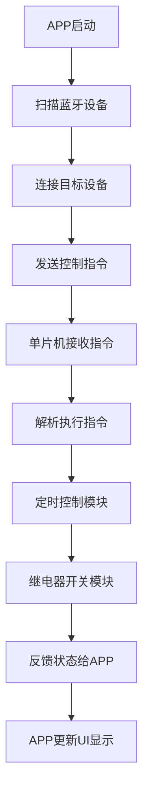

以下是对题目《基于单片机智能蓝牙APP定时开关插座的设计与实现》的详细技术博客内容:

## 1. 背景介绍

### 1.1 智能家居的兴起

随着物联网技术的不断发展,智能家居应用越来越普及。智能家居旨在利用各种传感器、控制器和智能设备,实现对家居环境的自动化控制和远程管理,提高生活质量和能源利用效率。其中,智能插座是智能家居系统的重要组成部分。

### 1.2 传统插座的不足

传统插座存在一些明显的缺陷:

- 缺乏远程控制功能,必须手动开关
- 无法根据用户习惯设置定时开关
- 无法监测能耗数据,浪费能源
- 缺乏联网功能,无法与其他智能设备互联

### 1.3 智能蓝牙插座的优势

基于蓝牙技术的智能插座能够弥补传统插座的不足:

- 通过手机APP远程控制开关状态
- 支持定时开关及场景模式设置  
- 实时监测统计用电数据
- 低功耗蓝牙通信,节省电量
- 硬件成本低廉,适合家庭使用

## 2. 核心概念与联系

### 2.1 蓝牙技术

蓝牙是一种无线技术通信标准,工作在2.4GHz ISM波段。主要特点:

- 近距离通信,典型传输距离10米
- 低功耗、低成本、低复杂度
- 自动对频跳扩频技术,抗干扰能力强
- 支持主从工作模式

### 2.2 单片机系统

单片机是一种高度集成的微型计算机,集成了CPU、RAM、ROM、IO接口等在单个芯片上。具有体积小、功耗低、价格便宜等优点,非常适合应用于智能硬件控制。

常用单片机有:

- 51单片机(传统8位)
- AVR单片机(8位RISC)
- ARM Cortex-M系列(32位)

### 2.3 APP开发

APP(Application)指运行在移动智能终端上的应用程序。智能插座的控制端APP一般采用:

- iOS原生开发(Object-C/Swift)
- Android原生开发(Java/Kotlin)
- 跨平台开发(React Native/Flutter等)

### 2.4 系统架构

智能蓝牙插座的系统架构通常包括:

- 硬件部分:单片机控制系统、蓝牙模块、继电器等
- 软件部分:单片机固件程序、手机APP程序  
- 用户交互:手机APP控制界面

三者紧密配合,实现智能插座的各项功能。

## 3. 核心算法原理具体操作步骤  

### 3.1 蓝牙通信原理

蓝牙通信遵循主从架构,主设备发起连接和数据传输,从设备被动接收数据。

蓝牙协议栈分为几层:

- 射频层(PHY):2.4GHz GFSK调制
- 基带层:设备发现、链路控制
- L2CAP层:逻辑链路和分组管理
- SDP层:服务发现和注册
- RFCOMM/SPP:串行端口模拟

应用层通过SPP进行串口数据通信。

### 3.2 单片机蓝牙控制流程

1. 初始化单片机外设(UART/GPIO/Timer等)
2. 配置并初始化蓝牙模块
3. 建立SPP虚拟串口连接
4. 等待接收APP端控制指令
5. 解析控制指令,执行相应动作
6. 将状态反馈给APP端

### 3.3 APP控制算法

1. 扫描并连接目标蓝牙设备
2. 根据用户交互,生成控制指令
3. 通过SPP虚拟串口发送指令
4. 接收单片机状态反馈
5. 更新UI界面显示

### 3.4 控制指令设计

可采用简单文本指令,如:

- SWITCH_ON: 打开插座继电器
- SWITCH_OFF: 关闭插座继电器  
- TIMING_START 10 22:30: 设置定时开机时间
- TIMING_END 11 06:00: 设置定时关机时间
- QUERY_STATUS: 查询当前状态

### 3.5 定时控制实现

利用单片机的计时器中断,可实现精准定时控制:

1. 初始化计时器,设置中断周期为1秒  
2. 在中断服务程序中,判断当前时间是否匹配定时设置
3. 若匹配,则执行开关继电器操作
4. 将状态通过串口发送给APP端

### 3.6 算法流程图



## 4. 数学模型和公式详细讲解举例说明

在单片机定时控制中,需要对时间进行计算,下面给出相关数学模型:

设当前时间为 $t_c$,目标定时时间为 $t_d$,则两者的时间差为:

$$\Delta t = t_d - t_c$$

我们需要将时间统一为秒计数,假设:

- $t_c$ 的小时为 $h_c$, 分钟为 $m_c$,秒为 $s_c$  
- $t_d$ 的小时为 $h_d$,分钟为 $m_d$, 秒为 $s_d$

则 $t_c$ 和 $t_d$ 的秒计数分别为:

$$t_c = h_c \times 3600 + m_c \times 60 + s_c$$
$$t_d = h_d \times 3600 + m_d \times 60 + s_d$$

代入时间差公式可得:

$$\Delta t = (h_d \times 3600 + m_d \times 60 + s_d) - (h_c \times 3600 + m_c \times 60 + s_c)$$

在单片机的定时中断服务程序中,每经过1秒,就将 $\Delta t$ 减1,当 $\Delta t=0$ 时,就到达目标定时时刻,可执行开关继电器操作。

以一个例子说明:假设当前时间为 $t_c=14:30:15$,目标定时时间为 $t_d=20:45:00$,则:

$$\begin{aligned}
t_c &= 14 \times 3600 + 30 \times 60 + 15 = 52215 \\
t_d &= 20 \times 3600 + 45 \times 60 = 75900 \\
\Delta t &= 75900 - 52215 = 23685 \text{ 秒}
\end{aligned}$$

即在当前时间的 23685 秒之后,也就是 20:45:00 时,执行定时开关操作。

## 4. 项目实践:代码实例和详细解释说明

### 4.1 硬件电路

智能插座硬件包括:

- 单片机控制核心(如STM32F103C8T6)
- 蓝牙模块(如HC-05)
- 继电器(控制插座开关)
- 电源电路(DC 5V)
- 其他辅助电路(如指示灯等)


### 4.2 单片机固件代码

```c
#include "stm32f10x.h"
#include "usart.h"
#include "delay.h"

// 蓝牙模块AT指令
#define CMD_AT      "AT\r\n"
#define CMD_RESET   "AT+RESET\r\n"
#define CMD_ROLE    "AT+ROLE=SLAVE\r\n"
#define CMD_BIND    "AT+BIND=98D3,31,111122\r\n"
#define CMD_MODE    "AT+MODE=3\r\n"

// 定时器配置
#define TIMER_PERIOD 1000   // 1秒中断
#define SWITCH_ON_TIME 20,45,0  // 定时打开时间
#define SWITCH_OFF_TIME 6,30,0  // 定时关闭时间

// 继电器控制GPIO
#define RELAY_GPIO GPIOB
#define RELAY_PIN  GPIO_Pin_5

// 全局变量
uint8_t cmd_data[64];
uint8_t status = 0;  // 0:off  1:on
RTC_TimeTypeDef curr_time;

// 定时器中断服务函数
void TIM3_IRQHandler(void)
{
    if(TIM_GetITStatus(TIM3, TIM_IT_Update) != RESET)
    {
        TIM_ClearITPendingBit(TIM3, TIM_IT_Update);

        // 获取当前时间
        RTC_GetTime(RTC_Format_BIN, &curr_time);

        // 判断是否为定时开关时间
        if(!status && curr_time.RTC_Hours==SWITCH_ON_TIME[0] && curr_time.RTC_Minutes==SWITCH_ON_TIME[1] && curr_time.RTC_Seconds==SWITCH_ON_TIME[2])
        {
            // 打开继电器
            GPIO_SetBits(RELAY_GPIO, RELAY_PIN);
            status = 1;
        }
        else if(status && curr_time.RTC_Hours==SWITCH_OFF_TIME[0] && curr_time.RTC_Minutes==SWITCH_OFF_TIME[1] && curr_time.RTC_Seconds==SWITCH_OFF_TIME[2])
        {
            // 关闭继电器 
            GPIO_ResetBits(RELAY_GPIO, RELAY_PIN);  
            status = 0;
        }

        // 发送状态给APP端
        sprintf(cmd_data, "STATUS:%d\r\n", status);
        USART_SendString(USART1, cmd_data);
    }
}

int main(void)
{
    // 初始化外设
    RCC_Configuration();
    NVIC_Configuration();
    GPIO_Configuration();
    USART_Configuration();
    RTC_Configuration();
    TIM_Configuration();

    // 初始化蓝牙模块
    USART_SendString(USART1, CMD_AT);
    Delay_ms(500);
    USART_SendString(USART1, CMD_RESET); 
    Delay_ms(1000);
    USART_SendString(USART1, CMD_ROLE);
    Delay_ms(500);
    USART_SendString(USART1, CMD_BIND);
    Delay_ms(500);
    USART_SendString(USART1, CMD_MODE);
    Delay_ms(500);

    while(1)
    {
        // 接收APP端指令
        if(USART_ReceiveStr(USART1, cmd_data))
        {
            if(strstr(cmd_data, "SWITCH_ON"))
            {
                GPIO_SetBits(RELAY_GPIO, RELAY_PIN);
                status = 1;
            }
            else if(strstr(cmd_data, "SWITCH_OFF")) 
            {
                GPIO_ResetBits(RELAY_GPIO, RELAY_PIN);
                status = 0;
            }
            else if(strstr(cmd_data, "QUERY_STATUS"))
            {
                sprintf(cmd_data, "STATUS:%d\r\n", status);
                USART_SendString(USART1, cmd_data);
            }
        }
    }
}
```

上面是智能插座单片机固件的核心代码,包括:

- 蓝牙模块初始化及AT指令配置
- 继电器GPIO控制代码
- 定时器中断设置及定时开关逻辑
- 串口通信接收APP端指令及发送状态

### 4.3 APP开发实例

以Flutter跨平台开发为例,智能插座控制APP的部分核心代码:

```dart
// 扫描、连接蓝牙设备
void _connectDevice() async {
  // 扫描附近蓝牙设备
  List<BluetoothDevice> devices = await _bluetooth.getBondedDevices();

  // 连接命名为"SmartPlug"的设备
  for (BluetoothDevice device in devices) {
    if (device.name == "SmartPlug") {
      _device = device;
      break;
    }
  }

  // 连接蓝牙设备
  await _bluetooth.connect(_device);

  // 监听数据接收
  _device.state.listen((val) {
    _bluetooth.isConnected.then((isConnected) {
      if (isConnected) {
        _device.inputStream.listen(_onDataReceived);
      }
    });
  });
}

// 接收单片机状态数据
void _onDataReceived(Uint8List data) {
  String msg = utf8.decode(data);
  if (msg.startsWith("STATUS:")) {
    int status = int.parse(msg.split(":")[1]);
    setState(() {
      _plugStatus = status == 1;
    });
  }
}

// 控制插座开关
void _sendCommand(String cmd) {
  _device.outputStream.write(utf8.encode("$cmd\r\n"));